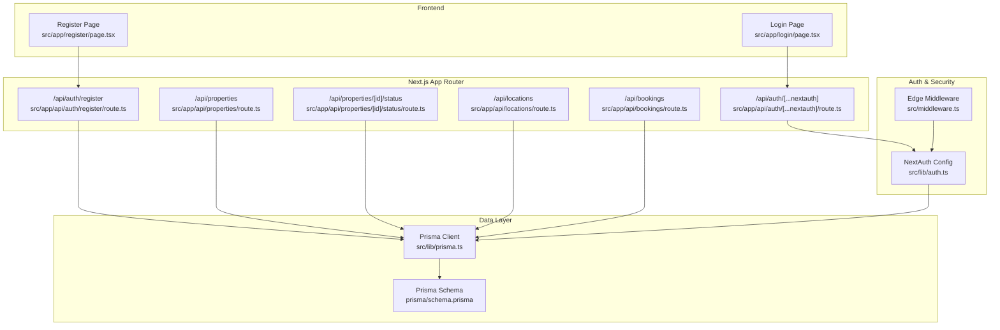
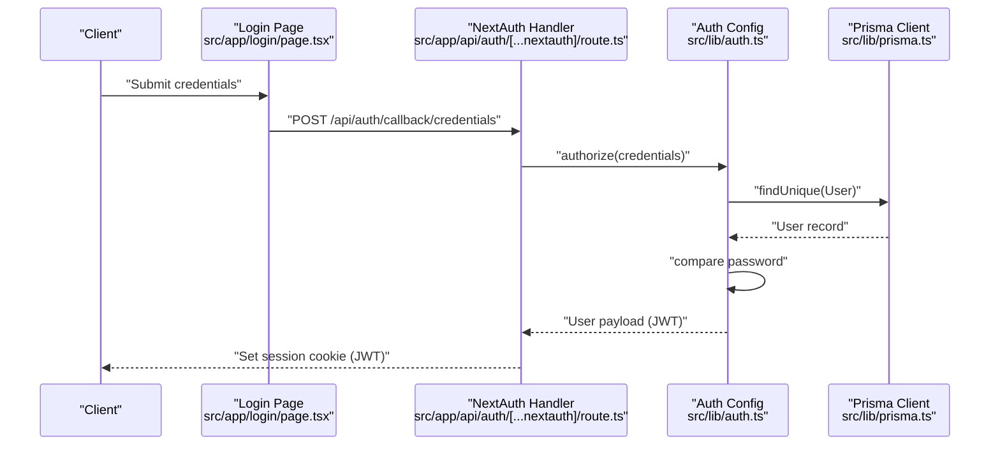
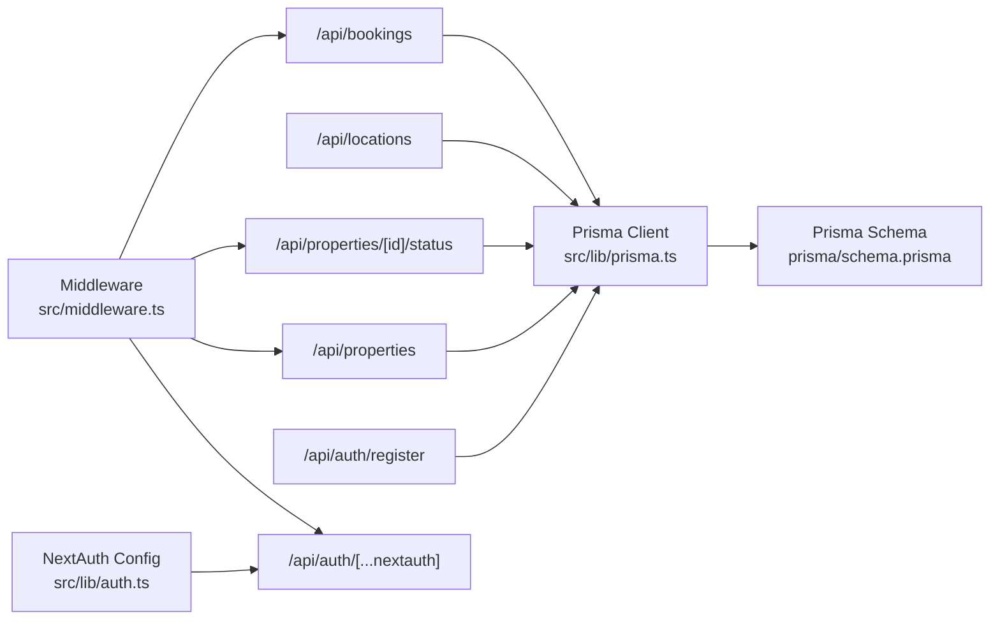
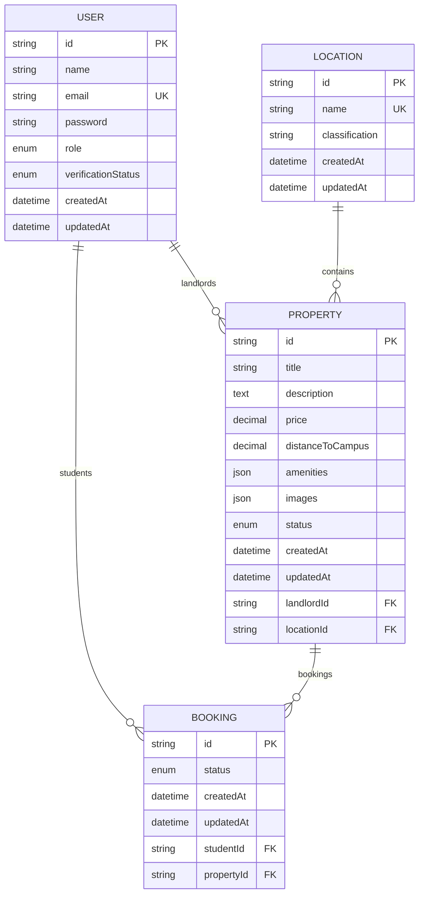

# API Reference

<cite>
**Referenced Files in This Document**
- [src/app/api/auth/[...nextauth]/route.ts](file://src/app/api/auth/[...nextauth]/route.ts)
- [src/app/api/auth/register/route.ts](file://src/app/api/auth/register/route.ts)
- [src/app/api/bookings/route.ts](file://src/app/api/bookings/route.ts)
- [src/app/api/locations/route.ts](file://src/app/api/locations/route.ts)
- [src/app/api/properties/route.ts](file://src/app/api/properties/route.ts)
- [src/app/api/properties/[id]/status/route.ts](file://src/app/api/properties/[id]/status/route.ts)
- [src/lib/auth.ts](file://src/lib/auth.ts)
- [src/middleware.ts](file://src/middleware.ts)
- [src/lib/prisma.ts](file://src/lib/prisma.ts)
- [prisma/schema.prisma](file://prisma/schema.prisma)
- [src/app/login/page.tsx](file://src/app/login/page.tsx)
- [src/app/register/page.tsx](file://src/app/register/page.tsx)
- [package.json](file://package.json)
</cite>

## Table of Contents
1. [Introduction](#introduction)
2. [Project Structure](#project-structure)
3. [Core Components](#core-components)
4. [Architecture Overview](#architecture-overview)
5. [Detailed Component Analysis](#detailed-component-analysis)
6. [Dependency Analysis](#dependency-analysis)
7. [Performance Considerations](#performance-considerations)
8. [Troubleshooting Guide](#troubleshooting-guide)
9. [Conclusion](#conclusion)
10. [Appendices](#appendices)

## Introduction
This document provides a comprehensive API reference for the RentalHub-BOUESTI platform. It covers authentication endpoints (registration, login, logout), property management endpoints (listing, creation, status updates), booking system endpoints (requests, approvals, cancellations), and location services endpoints. For each endpoint, you will find HTTP methods, URL patterns, request/response schemas, authentication requirements, parameter validation, response codes, and practical usage examples. It also documents API versioning, rate limiting considerations, and integration patterns with the frontend.

## Project Structure
RentalHub-BOUESTI is a Next.js application using NextAuth.js for authentication and Prisma for data access. API routes are located under src/app/api and are grouped by feature. Authentication is handled via NextAuth.js with a Credentials provider backed by Prisma and bcrypt. Middleware enforces role-based access to protected routes.

**Diagram sources**
- [src/app/api/auth/[...nextauth]/route.ts](file://src/app/api/auth/[...nextauth]/route.ts#L1-L7)
- [src/app/api/auth/register/route.ts:1-90](file://src/app/api/auth/register/route.ts#L1-L90)
- [src/app/api/properties/route.ts:1-119](file://src/app/api/properties/route.ts#L1-L119)
- [src/app/api/properties/[id]/status/route.ts](file://src/app/api/properties/[id]/status/route.ts#L1-L52)
- [src/app/api/locations/route.ts:1-29](file://src/app/api/locations/route.ts#L1-L29)
- [src/app/api/bookings/route.ts:1-109](file://src/app/api/bookings/route.ts#L1-L109)
- [src/lib/auth.ts:1-117](file://src/lib/auth.ts#L1-L117)
- [src/middleware.ts:1-48](file://src/middleware.ts#L1-L48)
- [src/lib/prisma.ts:1-27](file://src/lib/prisma.ts#L1-L27)
- [prisma/schema.prisma:1-130](file://prisma/schema.prisma#L1-L130)

**Section sources**
- [src/app/api/auth/[...nextauth]/route.ts](file://src/app/api/auth/[...nextauth]/route.ts#L1-L7)
- [src/app/api/auth/register/route.ts:1-90](file://src/app/api/auth/register/route.ts#L1-L90)
- [src/app/api/properties/route.ts:1-119](file://src/app/api/properties/route.ts#L1-L119)
- [src/app/api/properties/[id]/status/route.ts](file://src/app/api/properties/[id]/status/route.ts#L1-L52)
- [src/app/api/locations/route.ts:1-29](file://src/app/api/locations/route.ts#L1-L29)
- [src/app/api/bookings/route.ts:1-109](file://src/app/api/bookings/route.ts#L1-L109)
- [src/lib/auth.ts:1-117](file://src/lib/auth.ts#L1-L117)
- [src/middleware.ts:1-48](file://src/middleware.ts#L1-L48)
- [src/lib/prisma.ts:1-27](file://src/lib/prisma.ts#L1-L27)
- [prisma/schema.prisma:1-130](file://prisma/schema.prisma#L1-L130)

## Core Components
- Authentication service: NextAuth.js with Credentials provider, JWT session strategy, and role-based callbacks.
- Data access: Prisma client singleton with PostgreSQL database.
- Middleware: Edge middleware enforcing role-based access to protected routes.
- API routes: Feature-based Next.js App Router handlers for auth, properties, locations, and bookings.

Key implementation references:
- NextAuth configuration and JWT/session callbacks: [src/lib/auth.ts:14-90](file://src/lib/auth.ts#L14-L90)
- Prisma client singleton: [src/lib/prisma.ts:13-24](file://src/lib/prisma.ts#L13-L24)
- Protected routes middleware: [src/middleware.ts:11-38](file://src/middleware.ts#L11-L38)

**Section sources**
- [src/lib/auth.ts:14-90](file://src/lib/auth.ts#L14-L90)
- [src/lib/prisma.ts:13-24](file://src/lib/prisma.ts#L13-L24)
- [src/middleware.ts:11-38](file://src/middleware.ts#L11-L38)

## Architecture Overview
The API follows a layered architecture:
- Presentation: Next.js App Router API routes.
- Application: Route handlers implement business logic and orchestrate Prisma queries.
- Persistence: Prisma ORM with PostgreSQL.
- Security: NextAuth.js handles authentication and authorization via JWT tokens.

**Diagram sources**
- [src/app/login/page.tsx:51-51](file://src/app/login/page.tsx#L51-L51)
- [src/app/api/auth/[...nextauth]/route.ts](file://src/app/api/auth/[...nextauth]/route.ts#L1-L7)
- [src/lib/auth.ts:22-51](file://src/lib/auth.ts#L22-L51)
- [src/lib/prisma.ts:1-27](file://src/lib/prisma.ts#L1-L27)

**Section sources**
- [src/app/login/page.tsx:51-51](file://src/app/login/page.tsx#L51-L51)
- [src/app/api/auth/[...nextauth]/route.ts](file://src/app/api/auth/[...nextauth]/route.ts#L1-L7)
- [src/lib/auth.ts:22-51](file://src/lib/auth.ts#L22-L51)
- [src/lib/prisma.ts:1-27](file://src/lib/prisma.ts#L1-L27)

## Detailed Component Analysis

### Authentication API

#### Registration
- Method: POST
- URL: /api/auth/register
- Purpose: Register a new user (STUDENT or LANDLORD). Admins are created via seed or direct DB access.
- Authentication: Not required.
- Request body schema:
  - name: string (required)
  - email: string (required)
  - password: string (required, minimum 8 characters)
  - role: enum STUDENT | LANDLORD (optional, defaults to STUDENT)
- Response schema:
  - success: boolean
  - data: user profile (id, name, email, role, verificationStatus, createdAt)
  - message: string
- Status codes:
  - 201 Created: Registration successful.
  - 400 Bad Request: Missing or invalid fields.
  - 409 Conflict: Email already registered.
  - 500 Internal Server Error: Unexpected error.
- Practical example:
  - POST /api/auth/register with JSON body containing name, email, password, and role.
  - Response includes success flag and user data.

Validation highlights:
- Validates presence of name, email, password.
- Enforces role selection from STUDENT or LANDLORD.
- Password length minimum 8 characters.
- Checks uniqueness of email.
- Hashes password before persisting.

**Section sources**
- [src/app/api/auth/register/route.ts:20-89](file://src/app/api/auth/register/route.ts#L20-L89)

#### Login
- Method: POST
- URL: /api/auth/callback/credentials
- Purpose: Authenticate user credentials and establish a session.
- Authentication: Not required.
- Request body schema:
  - email: string (required)
  - password: string (required)
- Response: Redirects to dashboard or login with error on failure.
- Status codes:
  - 302 Found: Successful login redirects to dashboard.
  - 401 Unauthorized: Invalid credentials or suspended account.
- Practical example:
  - Submit form to /api/auth/callback/credentials with email and password.
  - On success, NextAuth sets a session cookie.

Integration note:
- The login page posts directly to the NextAuth callback endpoint.

**Section sources**
- [src/app/login/page.tsx:51-51](file://src/app/login/page.tsx#L51-L51)
- [src/app/api/auth/[...nextauth]/route.ts](file://src/app/api/auth/[...nextauth]/route.ts#L1-L7)
- [src/lib/auth.ts:22-51](file://src/lib/auth.ts#L22-L51)

#### Logout
- Method: POST
- URL: /api/auth/signout
- Purpose: Terminate current session.
- Authentication: Not required.
- Response: Redirects to login page.
- Status codes:
  - 302 Found: Redirect to login.
- Practical example:
  - POST to /api/auth/signout to clear session.

**Section sources**
- [src/app/api/auth/[...nextauth]/route.ts](file://src/app/api/auth/[...nextauth]/route.ts#L1-L7)
- [src/lib/auth.ts:75-79](file://src/lib/auth.ts#L75-L79)

### Property Management API

#### List/Search Properties
- Method: GET
- URL: /api/properties
- Purpose: Retrieve paginated, filtered, and sorted property listings.
- Authentication: Not required (public).
- Query parameters:
  - location: string (optional)
  - status: enum PENDING | APPROVED | REJECTED (optional, defaults to APPROVED)
  - minPrice: number (optional)
  - maxPrice: number (optional)
  - page: number (optional, default 1)
  - pageSize: number (optional, default 12, max 50)
  - sortBy: enum price | createdAt | distanceToCampus (optional, default createdAt)
  - sortOrder: enum asc | desc (optional, default desc)
- Response schema:
  - success: boolean
  - data.items: array of properties
  - data.total: number
  - data.page: number
  - data.pageSize: number
  - data.totalPages: number
- Status codes:
  - 200 OK: Properties fetched successfully.
  - 500 Internal Server Error: Unexpected error.
- Practical example:
  - GET /api/properties?page=1&pageSize=12&status=APPROVED&sortBy=price&sortOrder=asc

**Section sources**
- [src/app/api/properties/route.ts:14-64](file://src/app/api/properties/route.ts#L14-L64)

#### Create Property Listing
- Method: POST
- URL: /api/properties
- Purpose: Landlords submit a property for review.
- Authentication: Required (LANDLORD or ADMIN).
- Request body schema:
  - title: string (required)
  - description: string (required)
  - price: number (required)
  - locationId: string (required)
  - distanceToCampus: number (optional)
  - amenities: string[] (optional, JSON array)
  - images: string[] (optional, JSON array)
- Response schema:
  - success: boolean
  - data: property (with location included)
  - message: string
- Status codes:
  - 201 Created: Property submitted for review.
  - 400 Bad Request: Missing required fields or invalid location.
  - 401 Unauthorized: Authentication required.
  - 403 Forbidden: Only landlords can list properties.
  - 500 Internal Server Error: Unexpected error.
- Practical example:
  - POST /api/properties with JSON body including title, description, price, locationId, and optional amenities/images.

Validation highlights:
- Requires STUDENT/LANDLORD roles for listing.
- Validates presence of required fields.
- Ensures location exists.

**Section sources**
- [src/app/api/properties/route.ts:68-118](file://src/app/api/properties/route.ts#L68-L118)

#### Update Property Status (Admin)
- Method: PATCH
- URL: /api/properties/[id]/status
- Purpose: Approve or reject a property listing.
- Authentication: Required (ADMIN).
- Path parameters:
  - id: string (property identifier)
- Request body schema:
  - status: enum PENDING | APPROVED | REJECTED (required)
- Response schema:
  - success: boolean
  - data: property (with landlord and location included)
  - message: string
- Status codes:
  - 200 OK: Status updated successfully.
  - 400 Bad Request: Invalid status value.
  - 401 Unauthorized: Authentication required.
  - 403 Forbidden: Admin access required.
  - 500 Internal Server Error: Unexpected error.
- Practical example:
  - PATCH /api/properties/<id>/status with JSON body { "status": "APPROVED" }.

**Section sources**
- [src/app/api/properties/[id]/status/route.ts](file://src/app/api/properties/[id]/status/route.ts#L17-L51)

### Booking System API

#### List User's Bookings
- Method: GET
- URL: /api/bookings
- Purpose: Retrieve bookings for the authenticated user; landlords see property bookings; admins see all.
- Authentication: Required.
- Response schema:
  - success: boolean
  - data: array of bookings (with student and property details)
- Status codes:
  - 200 OK: Bookings fetched successfully.
  - 401 Unauthorized: Authentication required.
  - 500 Internal Server Error: Unexpected error.
- Practical example:
  - GET /api/bookings with session cookie.

**Section sources**
- [src/app/api/bookings/route.ts:11-45](file://src/app/api/bookings/route.ts#L11-L45)

#### Create Booking Request
- Method: POST
- URL: /api/bookings
- Purpose: Students submit a booking request for an approved property.
- Authentication: Required (STUDENT).
- Request body schema:
  - propertyId: string (required)
- Response schema:
  - success: boolean
  - data: booking (with property and location details)
  - message: string
- Status codes:
  - 201 Created: Booking request submitted.
  - 400 Bad Request: Missing propertyId or property not approved.
  - 401 Unauthorized: Authentication required.
  - 403 Forbidden: Only students can book.
  - 404 Not Found: Property not found.
  - 409 Conflict: Active booking already exists for the property.
  - 500 Internal Server Error: Unexpected error.
- Practical example:
  - POST /api/bookings with JSON body { "propertyId": "<property-id>" }.

Validation highlights:
- Only STUDENT role can create bookings.
- Property must be APPROVED.
- Prevents duplicate active bookings.

**Section sources**
- [src/app/api/bookings/route.ts:47-108](file://src/app/api/bookings/route.ts#L47-L108)

### Location Services API

#### List Locations
- Method: GET
- URL: /api/locations
- Purpose: Retrieve all locations ordered by classification and name.
- Authentication: Not required.
- Response schema:
  - success: boolean
  - data: array of locations
- Status codes:
  - 200 OK: Locations fetched successfully.
  - 500 Internal Server Error: Unexpected error.
- Practical example:
  - GET /api/locations to populate property listing forms.

**Section sources**
- [src/app/api/locations/route.ts:11-28](file://src/app/api/locations/route.ts#L11-L28)

## Dependency Analysis

**Diagram sources**
- [src/app/api/auth/register/route.ts:10-10](file://src/app/api/auth/register/route.ts#L10-L10)
- [src/app/api/properties/route.ts:7-9](file://src/app/api/properties/route.ts#L7-L9)
- [src/app/api/properties/[id]/status/route.ts](file://src/app/api/properties/[id]/status/route.ts#L7-L10)
- [src/app/api/locations/route.ts:8-9](file://src/app/api/locations/route.ts#L8-L9)
- [src/app/api/bookings/route.ts:6-9](file://src/app/api/bookings/route.ts#L6-L9)
- [src/lib/auth.ts:14-90](file://src/lib/auth.ts#L14-L90)
- [src/middleware.ts:11-38](file://src/middleware.ts#L11-L38)
- [src/lib/prisma.ts:13-24](file://src/lib/prisma.ts#L13-L24)
- [prisma/schema.prisma:1-130](file://prisma/schema.prisma#L1-L130)

**Section sources**
- [src/app/api/auth/register/route.ts:10-10](file://src/app/api/auth/register/route.ts#L10-L10)
- [src/app/api/properties/route.ts:7-9](file://src/app/api/properties/route.ts#L7-L9)
- [src/app/api/properties/[id]/status/route.ts](file://src/app/api/properties/[id]/status/route.ts#L7-L10)
- [src/app/api/locations/route.ts:8-9](file://src/app/api/locations/route.ts#L8-L9)
- [src/app/api/bookings/route.ts:6-9](file://src/app/api/bookings/route.ts#L6-L9)
- [src/lib/auth.ts:14-90](file://src/lib/auth.ts#L14-L90)
- [src/middleware.ts:11-38](file://src/middleware.ts#L11-L38)
- [src/lib/prisma.ts:13-24](file://src/lib/prisma.ts#L13-L24)
- [prisma/schema.prisma:1-130](file://prisma/schema.prisma#L1-L130)

## Performance Considerations
- Pagination and limits:
  - Properties listing enforces a maximum pageSize of 50 and defaults to 12 items per page.
  - Sorting is supported on price, createdAt, and distanceToCampus with configurable order.
- Database indexing:
  - Prisma schema defines indexes on foreign keys and frequently queried fields (e.g., property status, price).
- Session strategy:
  - JWT-based sessions with a 30-day max age and 24-hour update age, reducing database load for auth checks.
- Prisma client:
  - Singleton pattern with development caching avoids excessive connection pool exhaustion.

[No sources needed since this section provides general guidance]

## Troubleshooting Guide
- Authentication errors:
  - 401 Unauthorized: Ensure a valid session cookie is present. Verify credentials during login.
  - 403 Forbidden: Access is restricted by role. Landlords cannot list properties; only admins can update property status.
- Registration issues:
  - 400 Bad Request: Missing required fields or invalid role.
  - 409 Conflict: Email already registered.
- Property listing issues:
  - 400 Bad Request: Missing required fields or invalid locationId.
  - 403 Forbidden: Non-landlords attempting to list properties.
- Booking issues:
  - 400 Bad Request: Missing propertyId or property not approved.
  - 404 Not Found: Property does not exist.
  - 409 Conflict: Active booking already exists for the property.
- Generic errors:
  - 500 Internal Server Error: Unexpected failures during data access or processing. Check server logs for detailed error messages.

**Section sources**
- [src/app/api/auth/register/route.ts:25-56](file://src/app/api/auth/register/route.ts#L25-L56)
- [src/app/api/properties/route.ts:76-93](file://src/app/api/properties/route.ts#L76-L93)
- [src/app/api/properties/[id]/status/route.ts](file://src/app/api/properties/[id]/status/route.ts#L25-L34)
- [src/app/api/bookings/route.ts:55-87](file://src/app/api/bookings/route.ts#L55-L87)
- [src/lib/auth.ts:40-42](file://src/lib/auth.ts#L40-L42)

## Conclusion
RentalHub-BOUESTI’s API provides a clear, role-based set of endpoints for authentication, property management, booking, and location services. Authentication is handled securely via NextAuth.js with JWT sessions, while Prisma ensures robust data access. The API responses consistently use a success/error envelope with appropriate HTTP status codes. Frontend pages integrate seamlessly with the backend by posting directly to NextAuth endpoints and calling the API routes with session cookies.

[No sources needed since this section summarizes without analyzing specific files]

## Appendices

### API Versioning
- No explicit API versioning is implemented in the current codebase. All routes are under /api without a version segment.

**Section sources**
- [src/app/api/auth/register/route.ts:1-6](file://src/app/api/auth/register/route.ts#L1-L6)
- [src/app/api/properties/route.ts:1-4](file://src/app/api/properties/route.ts#L1-L4)
- [src/app/api/properties/[id]/status/route.ts](file://src/app/api/properties/[id]/status/route.ts#L1-L5)
- [src/app/api/locations/route.ts:1-6](file://src/app/api/locations/route.ts#L1-L6)
- [src/app/api/bookings/route.ts:1-4](file://src/app/api/bookings/route.ts#L1-L4)

### Rate Limiting Considerations
- No explicit rate limiting is implemented in the current codebase. Consider integrating a rate-limiting solution (e.g., Redis-based or middleware) for production deployments to protect sensitive endpoints like registration and login.

[No sources needed since this section provides general guidance]

### Integration Patterns with the Frontend
- Login:
  - The login page submits credentials to /api/auth/callback/credentials, which NextAuth handles internally.
- Registration:
  - The registration page posts to /api/auth/register with role selection and user details.
- Protected routes:
  - Middleware enforces role-based access to /dashboard/*, /admin/*, /properties/new, and /bookings/*.
- Session usage:
  - API routes use getServerSession to access the authenticated user and enforce role-based permissions.

**Section sources**
- [src/app/login/page.tsx:51-51](file://src/app/login/page.tsx#L51-L51)
- [src/app/register/page.tsx:50-50](file://src/app/register/page.tsx#L50-L50)
- [src/middleware.ts:11-38](file://src/middleware.ts#L11-L38)
- [src/app/api/bookings/route.ts:13-17](file://src/app/api/bookings/route.ts#L13-L17)
- [src/app/api/properties/route.ts:70-78](file://src/app/api/properties/route.ts#L70-L78)
- [src/app/api/properties/[id]/status/route.ts](file://src/app/api/properties/[id]/status/route.ts#L19-L27)

### Data Model Overview

**Diagram sources**
- [prisma/schema.prisma:44-61](file://prisma/schema.prisma#L44-L61)
- [prisma/schema.prisma:64-77](file://prisma/schema.prisma#L64-L77)
- [prisma/schema.prisma:80-108](file://prisma/schema.prisma#L80-L108)
- [prisma/schema.prisma:111-129](file://prisma/schema.prisma#L111-L129)