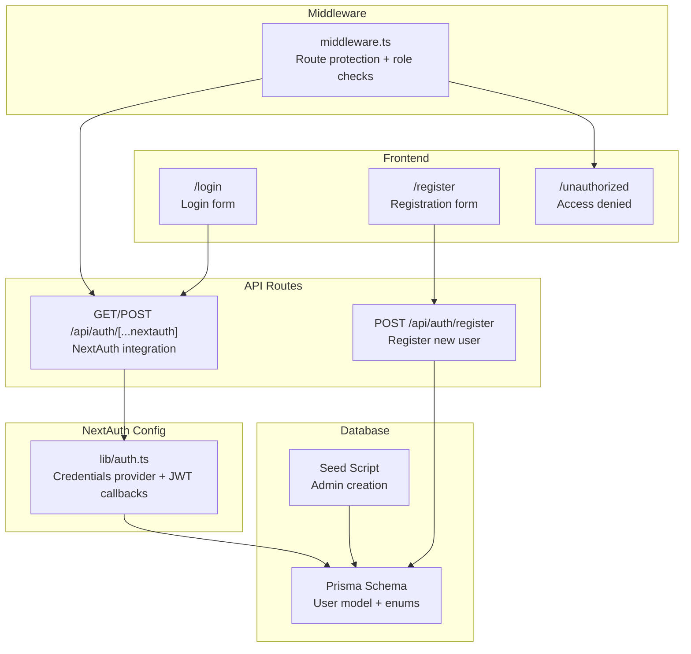
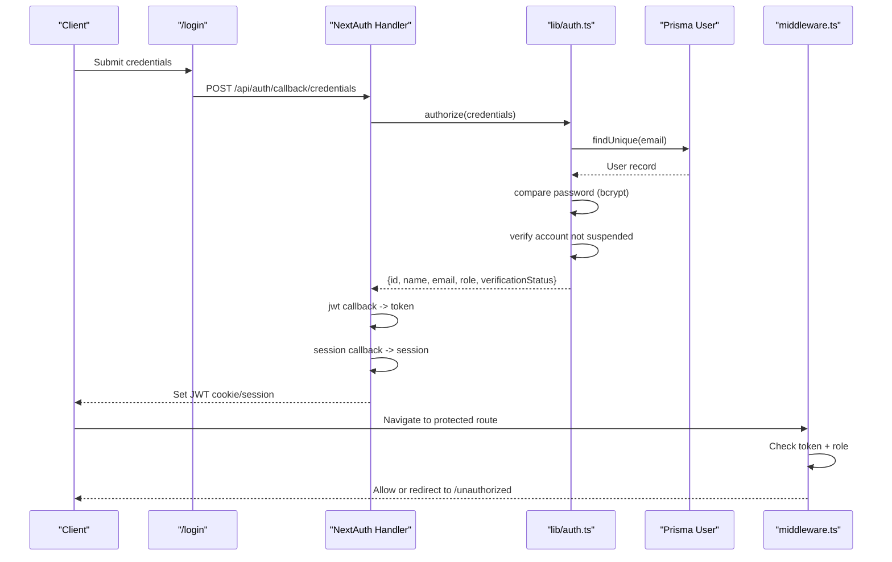
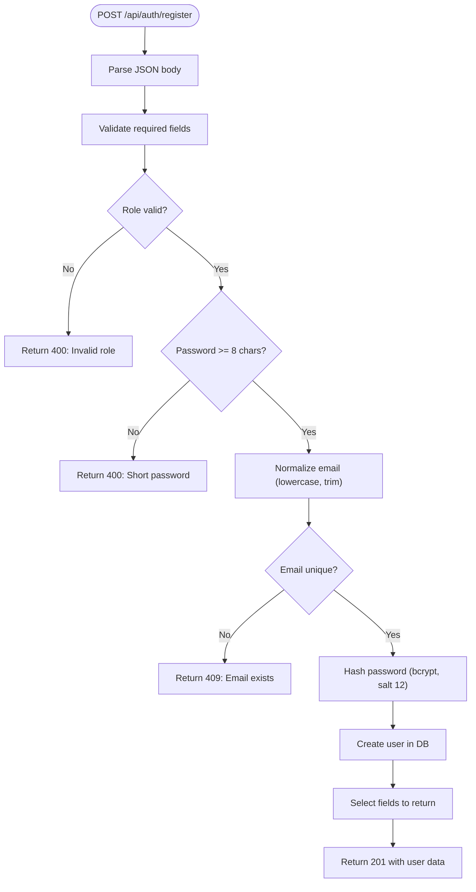
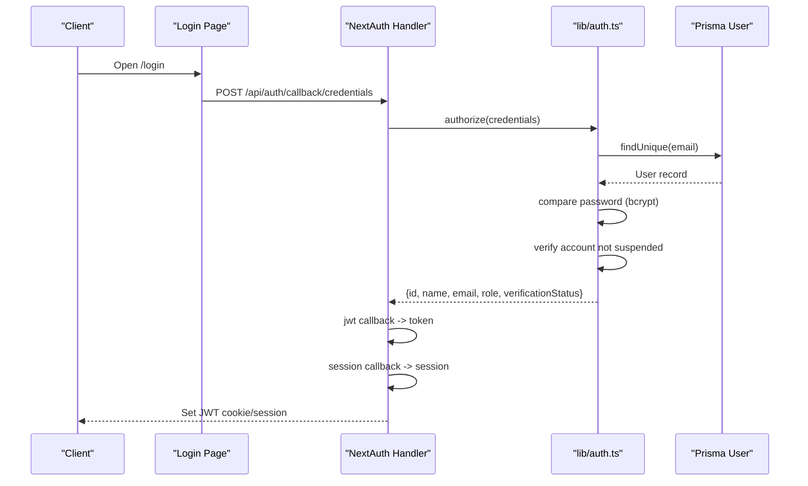
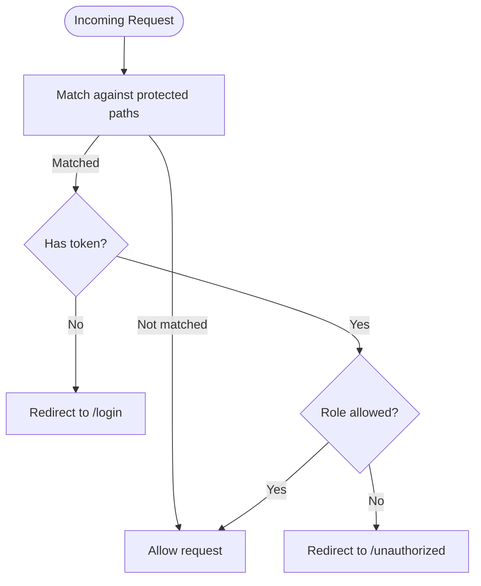
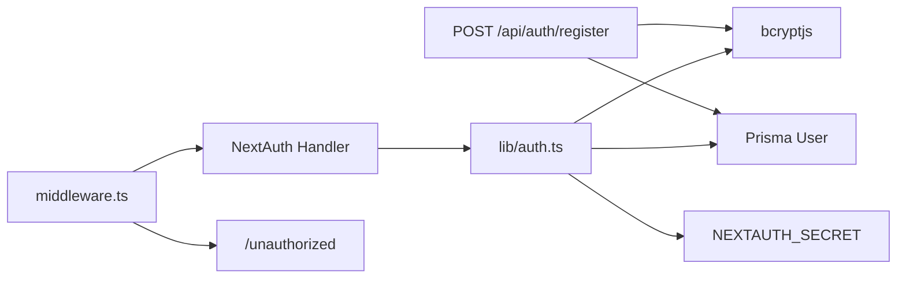

# Authentication API

<cite>
**Referenced Files in This Document**
- [src/app/api/auth/register/route.ts](file://src/app/api/auth/register/route.ts)
- [src/app/api/auth/[...nextauth]/route.ts](file://src/app/api/auth/[...nextauth]/route.ts)
- [src/lib/auth.ts](file://src/lib/auth.ts)
- [src/middleware.ts](file://src/middleware.ts)
- [src/app/login/page.tsx](file://src/app/login/page.tsx)
- [src/app/register/page.tsx](file://src/app/register/page.tsx)
- [src/app/unauthorized/page.tsx](file://src/app/unauthorized/page.tsx)
- [prisma/schema.prisma](file://prisma/schema.prisma)
- [prisma/seed.ts](file://prisma/seed.ts)
- [package.json](file://package.json)
</cite>

## Table of Contents
1. [Introduction](#introduction)
2. [Project Structure](#project-structure)
3. [Core Components](#core-components)
4. [Architecture Overview](#architecture-overview)
5. [Detailed Component Analysis](#detailed-component-analysis)
6. [Dependency Analysis](#dependency-analysis)
7. [Performance Considerations](#performance-considerations)
8. [Troubleshooting Guide](#troubleshooting-guide)
9. [Conclusion](#conclusion)

## Introduction
This document provides comprehensive API documentation for the Authentication endpoints in the RentalHub-BOUESTI application. It covers:
- User registration endpoint with validation, password hashing, and role assignment
- NextAuth.js integration endpoint for session management and JWT handling
- HTTP methods, URL patterns, request/response schemas, error handling, and security considerations
- Authentication middleware requirements and session persistence

## Project Structure
The authentication system spans API routes, NextAuth configuration, middleware, and database schema:
- Registration API: POST /api/auth/register
- NextAuth integration: /api/auth/[...nextauth]
- Frontend login and registration pages
- Middleware for protected routes
- Prisma schema defining roles and verification statuses

**Diagram sources**
- [src/app/api/auth/register/route.ts:1-90](file://src/app/api/auth/register/route.ts#L1-L90)
- [src/app/api/auth/[...nextauth]/route.ts](file://src/app/api/auth/[...nextauth]/route.ts#L1-L7)
- [src/lib/auth.ts:1-117](file://src/lib/auth.ts#L1-L117)
- [src/middleware.ts:1-48](file://src/middleware.ts#L1-L48)
- [src/app/login/page.tsx:1-116](file://src/app/login/page.tsx#L1-L116)
- [src/app/register/page.tsx:1-128](file://src/app/register/page.tsx#L1-L128)
- [src/app/unauthorized/page.tsx:1-35](file://src/app/unauthorized/page.tsx#L1-L35)
- [prisma/schema.prisma:1-130](file://prisma/schema.prisma#L1-L130)
- [prisma/seed.ts:1-143](file://prisma/seed.ts#L1-L143)

**Section sources**
- [src/app/api/auth/register/route.ts:1-90](file://src/app/api/auth/register/route.ts#L1-L90)
- [src/app/api/auth/[...nextauth]/route.ts](file://src/app/api/auth/[...nextauth]/route.ts#L1-L7)
- [src/lib/auth.ts:1-117](file://src/lib/auth.ts#L1-L117)
- [src/middleware.ts:1-48](file://src/middleware.ts#L1-L48)
- [prisma/schema.prisma:1-130](file://prisma/schema.prisma#L1-L130)

## Core Components
- Registration endpoint: Validates input, enforces role constraints, hashes passwords, prevents duplicate emails, and returns user data with verification status.
- NextAuth integration: Provides credentials-based authentication, JWT token storage, session management, and role-aware redirects.
- Middleware: Protects routes by enforcing authentication and role-based access control.
- Database schema: Defines roles (STUDENT, LANDLORD, ADMIN) and verification statuses (UNVERIFIED, VERIFIED, SUSPENDED).

**Section sources**
- [src/app/api/auth/register/route.ts:13-89](file://src/app/api/auth/register/route.ts#L13-L89)
- [src/lib/auth.ts:14-90](file://src/lib/auth.ts#L14-L90)
- [src/middleware.ts:11-47](file://src/middleware.ts#L11-L47)
- [prisma/schema.prisma:17-27](file://prisma/schema.prisma#L17-L27)

## Architecture Overview
The authentication architecture integrates NextAuth.js with a custom credentials provider and Prisma-backed user storage. Registration uses bcrypt for password hashing and creates users with default verification status. NextAuth manages sessions via JWT tokens and enforces role-based access control through middleware.

**Diagram sources**
- [src/app/login/page.tsx:51-103](file://src/app/login/page.tsx#L51-L103)
- [src/app/api/auth/[...nextauth]/route.ts](file://src/app/api/auth/[...nextauth]/route.ts#L1-L7)
- [src/lib/auth.ts:22-52](file://src/lib/auth.ts#L22-L52)
- [prisma/schema.prisma:44-61](file://prisma/schema.prisma#L44-L61)
- [src/middleware.ts:11-38](file://src/middleware.ts#L11-L38)

## Detailed Component Analysis

### Registration Endpoint: POST /api/auth/register
- Purpose: Create a new user account (STUDENT or LANDLORD). Admin accounts are created via seed script or direct DB access.
- Method: POST
- URL: /api/auth/register
- Request Body Schema:
  - name: string (required)
  - email: string (required)
  - password: string (required, minimum 8 characters)
  - role: enum (optional, defaults to STUDENT; allowed values: STUDENT, LANDLORD)
- Response Schema:
  - success: boolean
  - data: user object with id, name, email, role, verificationStatus, createdAt
  - message: string
- Validation Rules:
  - name, email, and password are required
  - role must be STUDENT or LANDLORD
  - password must be at least 8 characters long
  - email must be unique (case-insensitive)
- Password Hashing:
  - Passwords are hashed using bcrypt with a salt factor of 12 before storage.
- Role Assignment:
  - Default role is STUDENT if not provided.
  - ADMIN role is reserved for seed-created accounts.
- Error Responses:
  - 400 Bad Request: Missing required fields, invalid role, or short password
  - 409 Conflict: Email already exists
  - 500 Internal Server Error: Unexpected server error
- Practical Usage Example:
  - Submit a POST request with JSON payload containing name, email, password, and optional role.
  - On success, receive a 201 Created with the created user data.

**Diagram sources**
- [src/app/api/auth/register/route.ts:20-81](file://src/app/api/auth/register/route.ts#L20-L81)

**Section sources**
- [src/app/api/auth/register/route.ts:1-90](file://src/app/api/auth/register/route.ts#L1-L90)
- [prisma/schema.prisma:44-61](file://prisma/schema.prisma#L44-L61)
- [prisma/seed.ts:104-113](file://prisma/seed.ts#L104-L113)

### NextAuth.js Integration: /api/auth/[...nextauth]
- Purpose: Provide NextAuth.js endpoints for authentication flows, session management, and JWT handling.
- Methods: GET and POST
- URL Pattern: /api/auth/[...nextauth]
- Implementation Details:
  - Delegates to NextAuth with configuration from lib/auth.ts.
  - Exposes NextAuth endpoints for sign-in/sign-out and credential verification.
- Session Management:
  - Strategy: JWT
  - Max age: 30 days
  - Update age: 24 hours
- JWT Token Handling:
  - Callbacks populate token with user id, role, and verification status.
  - Session callback enriches session.user with the same fields.
- Authentication Flow:
  - Frontend posts credentials to /api/auth/callback/credentials.
  - NextAuth authorize validates credentials against Prisma user records.
  - On success, JWT is set and session is established.
- Security Considerations:
  - Secret configured via NEXTAUTH_SECRET environment variable.
  - Debug mode enabled in development.
  - Password comparison uses bcrypt.

**Diagram sources**
- [src/app/login/page.tsx:51-103](file://src/app/login/page.tsx#L51-L103)
- [src/app/api/auth/[...nextauth]/route.ts](file://src/app/api/auth/[...nextauth]/route.ts#L1-L7)
- [src/lib/auth.ts:22-72](file://src/lib/auth.ts#L22-L72)
- [prisma/schema.prisma:44-61](file://prisma/schema.prisma#L44-L61)

**Section sources**
- [src/app/api/auth/[...nextauth]/route.ts](file://src/app/api/auth/[...nextauth]/route.ts#L1-L7)
- [src/lib/auth.ts:1-117](file://src/lib/auth.ts#L1-L117)
- [src/app/login/page.tsx:51-103](file://src/app/login/page.tsx#L51-L103)

### Authentication Middleware and Route Protection
- Purpose: Enforce authentication and role-based access control for protected routes.
- Protected Paths:
  - /dashboard/:path*
  - /admin/:path*
  - /properties/new
  - /bookings/:path*
- Role-Based Restrictions:
  - /admin requires ADMIN role
  - /dashboard/landlord requires LANDLORD or ADMIN
  - /dashboard/student requires STUDENT
- Behavior:
  - Unauthenticated requests are redirected to /login
  - Unauthorized role attempts are redirected to /unauthorized
- Token Access:
  - Middleware reads token from req.nextauth.token and applies checks.

**Diagram sources**
- [src/middleware.ts:11-38](file://src/middleware.ts#L11-L38)
- [src/app/unauthorized/page.tsx:9-34](file://src/app/unauthorized/page.tsx#L9-L34)

**Section sources**
- [src/middleware.ts:1-48](file://src/middleware.ts#L1-L48)
- [src/app/unauthorized/page.tsx:1-35](file://src/app/unauthorized/page.tsx#L1-L35)

### Database Model and Seed
- User Model:
  - Fields: id, name, email (unique), password, role (default STUDENT), verificationStatus (default UNVERIFIED), timestamps
  - Relations: properties (landlord), bookings (student)
- Enums:
  - Role: STUDENT, LANDLORD, ADMIN
  - VerificationStatus: UNVERIFIED, VERIFIED, SUSPENDED
- Admin Creation:
  - Seed script creates an ADMIN user with hashed password and verified status.
  - Role cannot be assigned via registration endpoint.

**Section sources**
- [prisma/schema.prisma:44-61](file://prisma/schema.prisma#L44-L61)
- [prisma/schema.prisma:17-27](file://prisma/schema.prisma#L17-L27)
- [prisma/seed.ts:61-122](file://prisma/seed.ts#L61-L122)

## Dependency Analysis
Key dependencies and integrations:
- NextAuth.js: Provides authentication framework and session management
- bcryptjs: Handles password hashing and verification
- Prisma: Database ORM for user storage and queries
- Next.js Edge Middleware: Enforces route protection and role checks
- Environment Variables: NEXTAUTH_SECRET for signing JWTs

**Diagram sources**
- [src/app/api/auth/register/route.ts:8-11](file://src/app/api/auth/register/route.ts#L8-L11)
- [src/lib/auth.ts:8-12](file://src/lib/auth.ts#L8-L12)
- [src/middleware.ts:8-38](file://src/middleware.ts#L8-L38)
- [package.json:19-26](file://package.json#L19-L26)

**Section sources**
- [package.json:19-26](file://package.json#L19-L26)
- [src/lib/auth.ts:87-89](file://src/lib/auth.ts#L87-L89)

## Performance Considerations
- Password hashing cost: bcrypt salt factor of 12 balances security and performance; adjust based on deployment capacity.
- Session strategy: JWT reduces server-side session storage overhead; keep payloads minimal (as implemented).
- Database indexing: Unique email index and role index improve lookup performance.
- Middleware checks: Minimal overhead due to token presence checks and simple role comparisons.

## Troubleshooting Guide
- Registration errors:
  - Missing fields: Ensure name, email, and password are provided.
  - Invalid role: Only STUDENT or LANDLORD are accepted.
  - Short password: Must be at least 8 characters.
  - Duplicate email: Use a unique email address.
- NextAuth errors:
  - Missing credentials: Provide both email and password.
  - Incorrect password: Verify credentials match stored hash.
  - Suspended account: Contact support if blocked.
- Middleware redirections:
  - /login: Authenticate first.
  - /unauthorized: Insufficient privileges for the requested route.
- Environment configuration:
  - NEXTAUTH_SECRET must be set; otherwise, JWT signing will fail.

**Section sources**
- [src/app/api/auth/register/route.ts:25-56](file://src/app/api/auth/register/route.ts#L25-L56)
- [src/lib/auth.ts:22-42](file://src/lib/auth.ts#L22-L42)
- [src/middleware.ts:17-29](file://src/middleware.ts#L17-L29)
- [src/app/unauthorized/page.tsx:9-34](file://src/app/unauthorized/page.tsx#L9-L34)

## Conclusion
The Authentication API provides a secure and extensible foundation for user registration and session management. Registration enforces strong validation and hashing, while NextAuth.js handles credentials-based authentication, JWT token lifecycle, and role-aware routing. Middleware ensures protected routes remain inaccessible to unauthorized users. Together, these components deliver a robust authentication experience aligned with the application’s role model and security requirements.