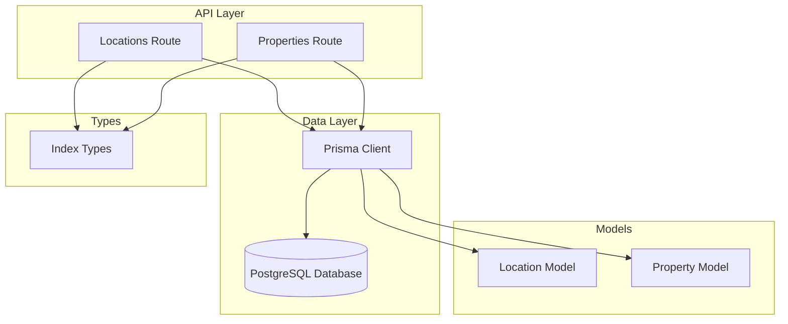
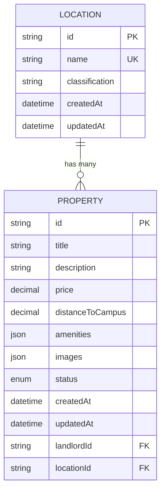
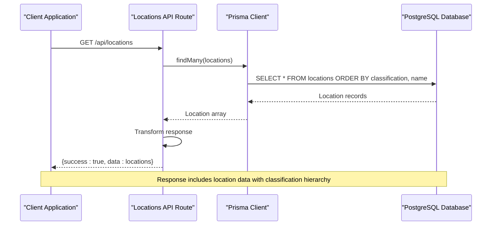
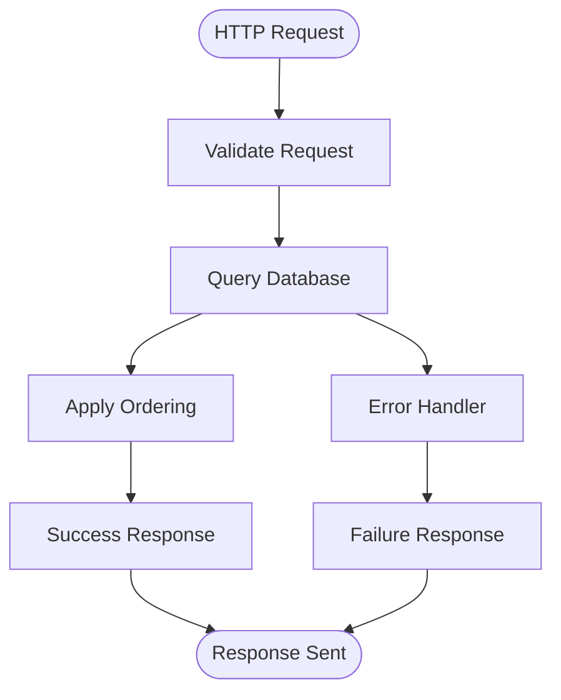
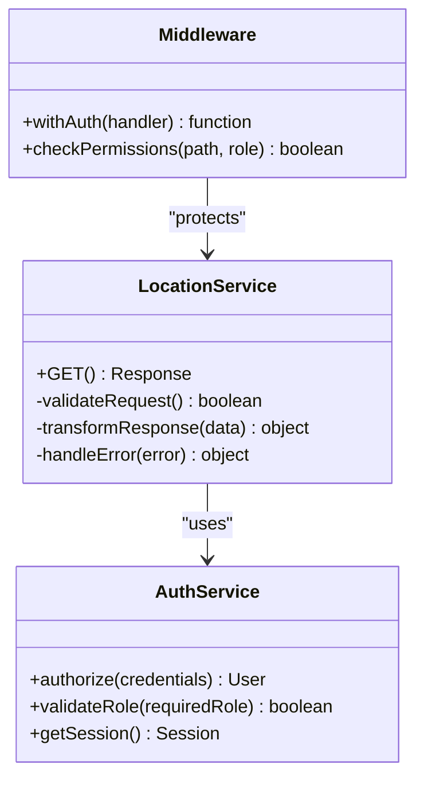
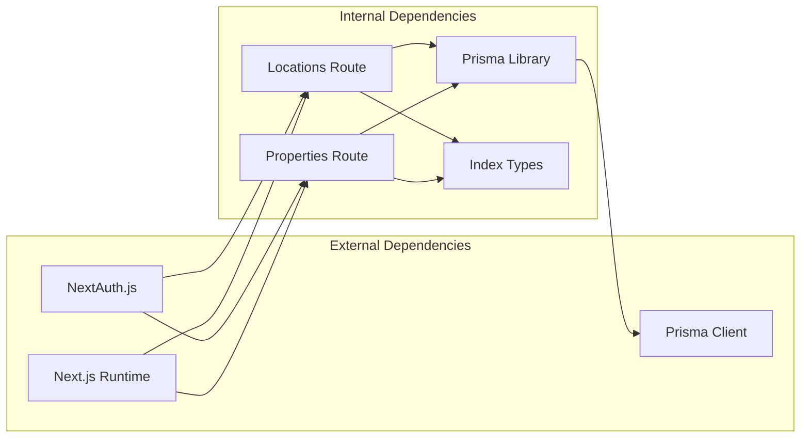

# Location Services API

<cite>
**Referenced Files in This Document**
- [route.ts](file://src/app/api/locations/route.ts)
- [schema.prisma](file://prisma/schema.prisma)
- [prisma.ts](file://src/lib/prisma.ts)
- [index.ts](file://src/types/index.ts)
- [route.ts](file://src/app/api/properties/route.ts)
- [seed.ts](file://prisma/seed.ts)
- [auth.ts](file://src/lib/auth.ts)
- [middleware.ts](file://src/middleware.ts)
</cite>

## Table of Contents
1. [Introduction](#introduction)
2. [Project Structure](#project-structure)
3. [Core Components](#core-components)
4. [Architecture Overview](#architecture-overview)
5. [Detailed Component Analysis](#detailed-component-analysis)
6. [Dependency Analysis](#dependency-analysis)
7. [Performance Considerations](#performance-considerations)
8. [Troubleshooting Guide](#troubleshooting-guide)
9. [Conclusion](#conclusion)

## Introduction
The Location Services API provides geographic location management capabilities for the RentalHub BOUESTI platform. It enables location retrieval, area classification, and geographic filtering for property listings within the Ikere-Ekiti region around BOUESTI campus. The API serves as a foundation for property search functionality and integrates with the broader rental property ecosystem.

The system manages geographical areas with classification categories including Core Quarter, Residential Estate, Neighbourhood, and Ward, providing structured geographic organization for property listings and user navigation.

## Project Structure
The Location Services API is implemented as a Next.js API route with Prisma ORM integration:



**Diagram sources**
- [route.ts:1-29](file://src/app/api/locations/route.ts#L1-L29)
- [schema.prisma:64-77](file://prisma/schema.prisma#L64-L77)
- [prisma.ts:1-27](file://src/lib/prisma.ts#L1-L27)

**Section sources**
- [route.ts:1-29](file://src/app/api/locations/route.ts#L1-L29)
- [schema.prisma:64-77](file://prisma/schema.prisma#L64-L77)

## Core Components

### Location Management Endpoint
The primary endpoint provides comprehensive location data retrieval with classification-based ordering and filtering capabilities.

**Endpoint**: `GET /api/locations`

**Purpose**: Returns all geographical locations ordered by classification and name for dropdown population and property listing forms.

**Response Format**: Standard API response structure with location data array.

**Section sources**
- [route.ts:1-29](file://src/app/api/locations/route.ts#L1-L29)

### Location Data Schema
The Location model defines the core geographic entity structure:



**Diagram sources**
- [schema.prisma:64-108](file://prisma/schema.prisma#L64-L108)

**Key Schema Elements**:
- **Primary Identifier**: Unique location ID using cuid format
- **Area Name**: Unique string identifier for geographic areas
- **Classification**: Area categorization (Core Quarter, Residential Estate, Neighbourhood, Ward)
- **Timestamps**: Creation and modification tracking
- **Relationships**: Bidirectional association with property listings

**Section sources**
- [schema.prisma:64-77](file://prisma/schema.prisma#L64-L77)

### Property Integration
Location data seamlessly integrates with property listings through foreign key relationships:

**Integration Points**:
- Property creation requires valid location ID validation
- Property search filters support location-based queries
- Location classification influences property categorization
- Administrative boundaries define area limits

**Section sources**
- [route.ts:90-93](file://src/app/api/properties/route.ts#L90-L93)
- [schema.prisma:94-100](file://prisma/schema.prisma#L94-L100)

## Architecture Overview



**Diagram sources**
- [route.ts:11-20](file://src/app/api/locations/route.ts#L11-L20)
- [prisma.ts:13-24](file://src/lib/prisma.ts#L13-L24)

The architecture follows a clean separation of concerns with:
- **API Layer**: Handles HTTP requests and response formatting
- **Data Access Layer**: Manages database operations through Prisma
- **Model Layer**: Defines data structures and relationships
- **Type Safety**: Comprehensive TypeScript interfaces for runtime validation

## Detailed Component Analysis

### Location Retrieval Service
The location retrieval service provides ordered geographic data for UI integration:



**Diagram sources**
- [route.ts:11-28](file://src/app/api/locations/route.ts#L11-L28)

**Processing Logic**:
1. **Request Validation**: Validates incoming HTTP request
2. **Database Query**: Executes location retrieval with classification ordering
3. **Response Formatting**: Wraps data in standardized API response structure
4. **Error Handling**: Implements comprehensive error logging and response

**Section sources**
- [route.ts:11-28](file://src/app/api/locations/route.ts#L11-L28)

### Property Location Filtering
The property service integrates location data for advanced property search capabilities:

**Filter Parameters**:
- **Location-based Search**: Case-insensitive substring matching on location names
- **Classification Grouping**: Properties organized by area classification categories
- **Administrative Boundaries**: Geographic limits defined by area boundaries

**Section sources**
- [route.ts:18-33](file://src/app/api/properties/route.ts#L18-L33)
- [index.ts:61-71](file://src/types/index.ts#L61-L71)

### Authentication and Authorization
Location services operate within the broader authentication framework:



**Diagram sources**
- [auth.ts:14-90](file://src/lib/auth.ts#L14-L90)
- [middleware.ts:11-38](file://src/middleware.ts#L11-L38)

**Section sources**
- [auth.ts:14-90](file://src/lib/auth.ts#L14-L90)
- [middleware.ts:11-38](file://src/middleware.ts#L11-L38)

## Dependency Analysis



**Diagram sources**
- [route.ts:8-9](file://src/app/api/locations/route.ts#L8-L9)
- [prisma.ts:9-10](file://src/lib/prisma.ts#L9-L10)

**Key Dependencies**:
- **Next.js**: Server-side routing and API endpoint management
- **Prisma**: Database abstraction and type-safe queries
- **NextAuth.js**: Authentication and authorization framework
- **TypeScript**: Compile-time type safety and validation

**Section sources**
- [route.ts:8-9](file://src/app/api/locations/route.ts#L8-L9)
- [prisma.ts:9-10](file://src/lib/prisma.ts#L9-L10)

## Performance Considerations

### Database Optimization
The location retrieval service implements several performance optimizations:

**Indexing Strategy**:
- Location classification indexed for efficient grouping
- Unique constraint on location names prevents duplicates
- Composite ordering ensures predictable query performance

**Query Optimization**:
- Single database query retrieves all necessary location data
- Minimal field selection reduces network overhead
- Efficient ordering prevents memory-intensive client-side sorting

### Caching Strategy
The Prisma client implements intelligent caching mechanisms:

**Development Environment**:
- Global singleton pattern prevents connection pool exhaustion
- Query logging enabled for development debugging
- Hot reload friendly connection management

**Production Considerations**:
- Connection pooling managed by Prisma client
- Automatic connection cleanup and reuse
- Environment-specific logging configuration

**Section sources**
- [prisma.ts:13-24](file://src/lib/prisma.ts#L13-L24)
- [schema.prisma:75-76](file://prisma/schema.prisma#L75-L76)

## Troubleshooting Guide

### Common Issues and Solutions

**Location Retrieval Failures**:
- **Symptom**: Empty location arrays or database errors
- **Cause**: Database connectivity issues or schema mismatches
- **Solution**: Verify database connection string and run migrations

**Property Location Validation Errors**:
- **Symptom**: "Invalid location" errors during property creation
- **Cause**: Non-existent location IDs or missing location associations
- **Solution**: Ensure location exists before property creation and verify foreign key relationships

**Authentication-Related Issues**:
- **Symptom**: Unauthorized access to protected endpoints
- **Cause**: Missing or invalid authentication tokens
- **Solution**: Implement proper authentication flow and token refresh mechanisms

### Error Response Patterns
The API follows consistent error handling patterns:

**Standard Error Response**:
```json
{
  "success": false,
  "error": "Error message",
  "message": "Additional context"
}
```

**Validation Error Scenarios**:
- Missing required parameters
- Invalid data types or formats
- Business rule violations
- Database constraint violations

**Section sources**
- [route.ts:21-27](file://src/app/api/locations/route.ts#L21-L27)
- [route.ts:83-88](file://src/app/api/properties/route.ts#L83-L88)

## Conclusion

The Location Services API provides a robust foundation for geographic location management within the RentalHub BOUESTI platform. Its design emphasizes:

**Technical Strengths**:
- Clean separation of concerns with dedicated API routes
- Comprehensive type safety through TypeScript interfaces
- Efficient database operations with proper indexing
- Integration with authentication and authorization frameworks
- Scalable architecture supporting future geographic expansion

**Business Value**:
- Structured geographic organization enabling intuitive property search
- Classification-based grouping supporting targeted property discovery
- Integration with property listings creating cohesive user experience
- Extensible design accommodating additional geographic features

The API's modular architecture and comprehensive error handling ensure reliable operation while maintaining flexibility for future enhancements such as proximity calculations, administrative boundary mapping, and advanced geographic filtering capabilities.