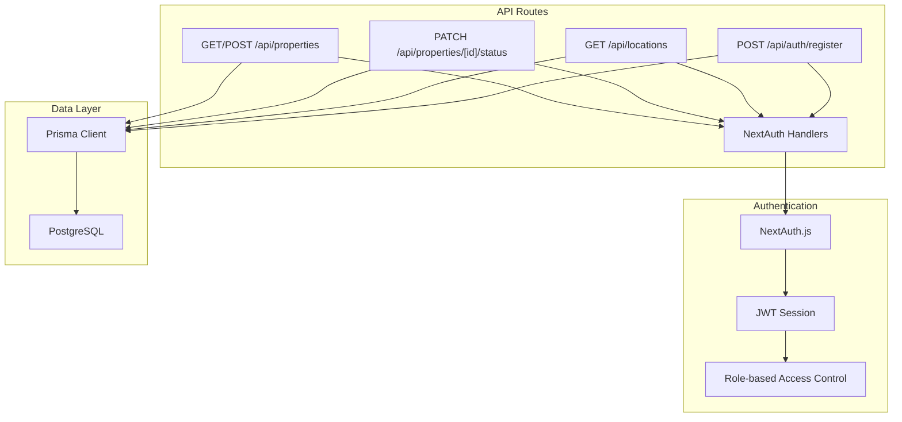
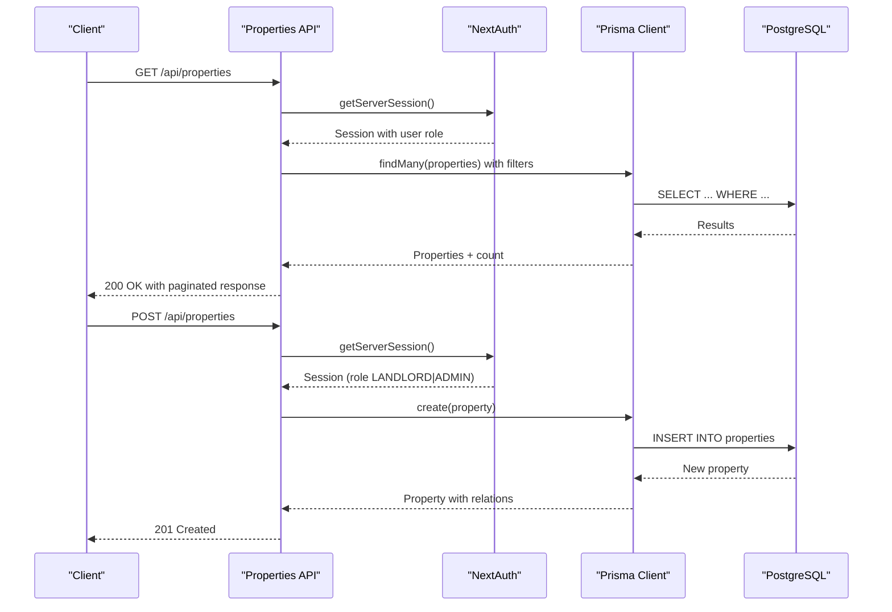
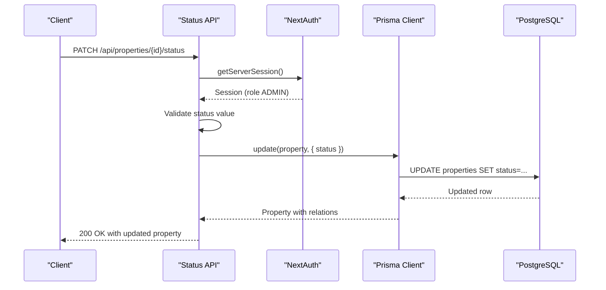
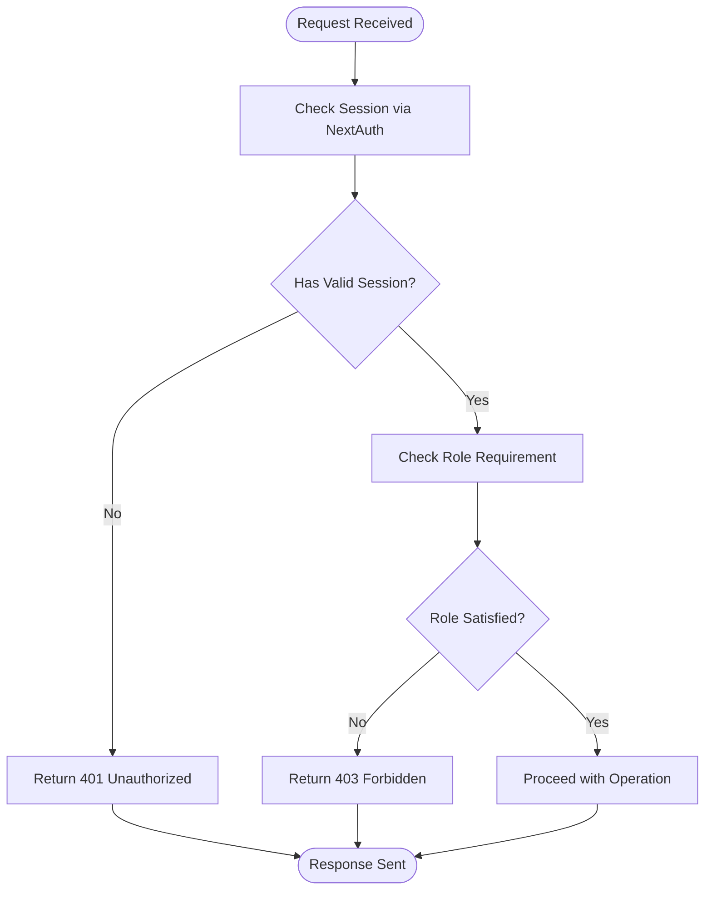
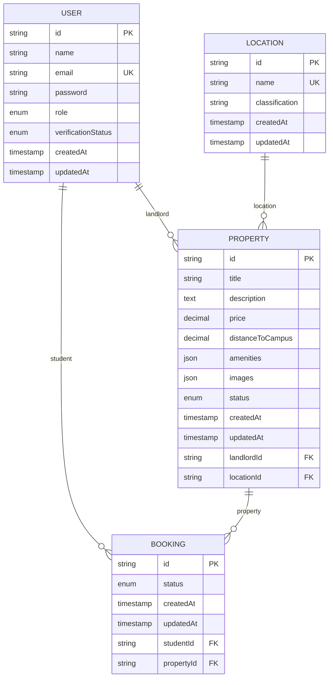
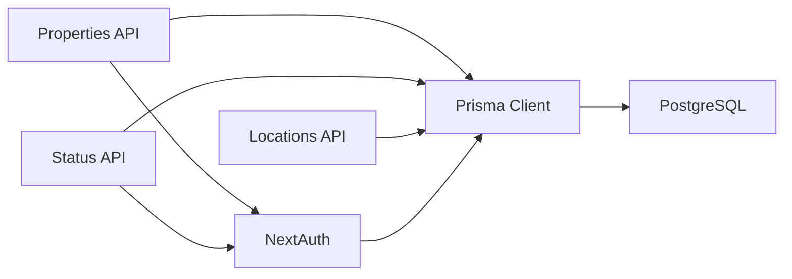

# Property Management API

<cite>
**Referenced Files in This Document**
- [src/app/api/properties/route.ts](file://src/app/api/properties/route.ts)
- [src/app/api/properties/[id]/status/route.ts](file://src/app/api/properties/[id]/status/route.ts)
- [src/lib/auth.ts](file://src/lib/auth.ts)
- [src/types/index.ts](file://src/types/index.ts)
- [prisma/schema.prisma](file://prisma/schema.prisma)
- [src/middleware.ts](file://src/middleware.ts)
- [src/app/api/locations/route.ts](file://src/app/api/locations/route.ts)
- [src/lib/utils.ts](file://src/lib/utils.ts)
- [src/app/api/auth/[...nextauth]/route.ts](file://src/app/api/auth/[...nextauth]/route.ts)
- [src/app/api/auth/register/route.ts](file://src/app/api/auth/register/route.ts)
</cite>

## Table of Contents
1. [Introduction](#introduction)
2. [Project Structure](#project-structure)
3. [Core Components](#core-components)
4. [Architecture Overview](#architecture-overview)
5. [Detailed Component Analysis](#detailed-component-analysis)
6. [Dependency Analysis](#dependency-analysis)
7. [Performance Considerations](#performance-considerations)
8. [Troubleshooting Guide](#troubleshooting-guide)
9. [Conclusion](#conclusion)

## Introduction
This document provides comprehensive API documentation for the Property Management endpoints in the RentalHub BOUESTI platform. It covers property listing and creation, property status management, request/response schemas, validation rules, role-based access controls, property image handling, geographic data requirements, search functionality, pagination, sorting, and integration with location services.

## Project Structure
The Property Management API is implemented as Next.js App Router API routes under `src/app/api/`. Authentication is handled via NextAuth.js with JWT sessions, and data persistence uses Prisma ORM against a PostgreSQL database.

**Diagram sources**
- [src/app/api/properties/route.ts:1-119](file://src/app/api/properties/route.ts#L1-L119)
- [src/app/api/properties/[id]/status/route.ts](file://src/app/api/properties/[id]/status/route.ts#L1-L52)
- [src/app/api/locations/route.ts:1-29](file://src/app/api/locations/route.ts#L1-L29)
- [src/lib/auth.ts:1-117](file://src/lib/auth.ts#L1-L117)
- [prisma/schema.prisma:1-130](file://prisma/schema.prisma#L1-L130)

**Section sources**
- [src/app/api/properties/route.ts:1-119](file://src/app/api/properties/route.ts#L1-L119)
- [src/app/api/properties/[id]/status/route.ts](file://src/app/api/properties/[id]/status/route.ts#L1-L52)
- [src/lib/auth.ts:1-117](file://src/lib/auth.ts#L1-L117)
- [prisma/schema.prisma:1-130](file://prisma/schema.prisma#L1-L130)

## Core Components
- Property Listing and Creation API: Handles property browsing with filters and pagination, and property creation by landlords.
- Property Status Management API: Allows administrators to approve or reject property listings.
- Authentication and Authorization: NextAuth.js-based session management with role-based access control.
- Location Services: Provides location data for property listings and form population.
- Data Model: Prisma schema defines Property, Location, User, and related enums and relations.

**Section sources**
- [src/app/api/properties/route.ts:1-119](file://src/app/api/properties/route.ts#L1-L119)
- [src/app/api/properties/[id]/status/route.ts](file://src/app/api/properties/[id]/status/route.ts#L1-L52)
- [src/lib/auth.ts:1-117](file://src/lib/auth.ts#L1-L117)
- [prisma/schema.prisma:79-108](file://prisma/schema.prisma#L79-L108)

## Architecture Overview
The Property Management API follows a layered architecture:
- Presentation Layer: Next.js App Router API routes handle HTTP requests and responses.
- Application Layer: Business logic for property listing, creation, and status updates.
- Domain Layer: Prisma models and enums define the data structures and constraints.
- Infrastructure Layer: NextAuth.js manages authentication and authorization, while Prisma connects to PostgreSQL.

**Diagram sources**
- [src/app/api/properties/route.ts:14-64](file://src/app/api/properties/route.ts#L14-L64)
- [src/lib/auth.ts:14-90](file://src/lib/auth.ts#L14-L90)
- [prisma/schema.prisma:79-108](file://prisma/schema.prisma#L79-L108)

## Detailed Component Analysis

### Property Listing and Creation Endpoint
- Endpoint: `/api/properties`
- Methods:
  - GET: List and search properties with filtering, pagination, and sorting.
  - POST: Create a new property listing (landlords only).

#### GET /api/properties
- Purpose: Retrieve approved properties with optional filters and pagination.
- Query Parameters:
  - `location`: Text filter for property location name (case-insensitive substring match).
  - `status`: Property status filter (default: APPROVED).
  - `minPrice`: Minimum monthly rent filter.
  - `maxPrice`: Maximum monthly rent filter.
  - `page`: Page number (minimum 1).
  - `pageSize`: Items per page (bounded between 1 and 50).
  - `sortBy`: Sort field (price, createdAt, distanceToCampus).
  - `sortOrder`: Sort direction (asc, desc).
- Response:
  - `success`: Boolean indicating operation outcome.
  - `data.items`: Array of properties with included relations (landlord, location, booking count).
  - `data.total`: Total number of matching properties.
  - `data.page`: Current page.
  - `data.pageSize`: Items per page.
  - `data.totalPages`: Total pages computed from total and pageSize.
- Validation Rules:
  - Filters are sanitized and bounded (e.g., pageSize clamped to 1–50).
  - Default status is APPROVED for public browsing.
- Error Handling:
  - Returns 500 on internal errors with a generic failure message.

#### POST /api/properties
- Purpose: Create a new property listing.
- Authentication:
  - Requires a valid session.
  - Only users with role LANDLORD or ADMIN can create properties.
- Request Body Fields:
  - `title`: Required string (trimmed).
  - `description`: Required string (trimmed).
  - `price`: Required numeric value (monthly rent).
  - `locationId`: Required unique identifier of a Location.
  - `distanceToCampus`: Optional numeric value (kilometres).
  - `amenities`: Optional array of strings (JSON array).
  - `images`: Optional array of image URLs (JSON array).
- Validation Rules:
  - Required fields must be present and non-empty.
  - Location must exist in the database.
  - Price must be a positive number.
  - Distance to campus is optional and stored as nullable decimal.
  - Amenities and images are stored as JSON arrays.
- Behavior:
  - Creates property with status set to PENDING.
  - Returns 201 Created with the created property and a success message.
- Error Handling:
  - Returns 400 for invalid inputs or missing required fields.
  - Returns 401 if not authenticated.
  - Returns 403 if user role is not LANDLORD or ADMIN.
  - Returns 500 on internal errors.

**Section sources**
- [src/app/api/properties/route.ts:14-64](file://src/app/api/properties/route.ts#L14-L64)
- [src/app/api/properties/route.ts:68-118](file://src/app/api/properties/route.ts#L68-L118)
- [prisma/schema.prisma:79-108](file://prisma/schema.prisma#L79-L108)
- [src/types/index.ts:60-71](file://src/types/index.ts#L60-L71)
- [src/types/index.ts:96-104](file://src/types/index.ts#L96-L104)

### Property Status Management Endpoint
- Endpoint: `/api/properties/[id]/status`
- Method: PATCH
- Purpose: Update property status (APPROVED, REJECTED, PENDING).
- Authentication:
  - Requires a valid session.
  - Only users with role ADMIN can update property status.
- Path Parameter:
  - `id`: Unique identifier of the property to update.
- Request Body:
  - `status`: Must be one of APPROVED, REJECTED, or PENDING.
- Behavior:
  - Updates the property status and returns the updated property with included relations (landlord contact and location).
  - Returns 200 OK with success message reflecting the action performed.
- Error Handling:
  - Returns 400 for invalid status values.
  - Returns 401 if not authenticated.
  - Returns 403 if user role is not ADMIN.
  - Returns 500 on internal errors.

**Diagram sources**
- [src/app/api/properties/[id]/status/route.ts](file://src/app/api/properties/[id]/status/route.ts#L17-L51)
- [src/lib/auth.ts:14-90](file://src/lib/auth.ts#L14-L90)
- [prisma/schema.prisma:79-108](file://prisma/schema.prisma#L79-L108)

**Section sources**
- [src/app/api/properties/[id]/status/route.ts](file://src/app/api/properties/[id]/status/route.ts#L17-L51)
- [prisma/schema.prisma:29-33](file://prisma/schema.prisma#L29-L33)

### Authentication and Authorization
- NextAuth.js Configuration:
  - Credentials provider with bcrypt password hashing.
  - JWT-based session strategy with 30-day max age and 24-hour update age.
  - Session augmentation includes user id, role, and verification status.
- Role-Based Access Control:
  - Middleware enforces role-based routing for admin, landlord, and student dashboards.
  - Property APIs enforce role checks for creation and status updates.
- User Registration:
  - Supports registration for STUDENT and LANDLORD roles.
  - Passwords are hashed using bcrypt.
  - Email uniqueness is enforced.

**Diagram sources**
- [src/lib/auth.ts:14-90](file://src/lib/auth.ts#L14-L90)
- [src/middleware.ts:11-38](file://src/middleware.ts#L11-L38)
- [src/app/api/properties/route.ts:72-78](file://src/app/api/properties/route.ts#L72-L78)
- [src/app/api/properties/[id]/status/route.ts](file://src/app/api/properties/[id]/status/route.ts#L21-L27)

**Section sources**
- [src/lib/auth.ts:14-90](file://src/lib/auth.ts#L14-L90)
- [src/middleware.ts:11-38](file://src/middleware.ts#L11-L38)
- [src/app/api/auth/register/route.ts:20-90](file://src/app/api/auth/register/route.ts#L20-L90)

### Location Services Integration
- Endpoint: `/api/locations`
- Purpose: Retrieve all locations ordered by classification and name.
- Usage: Populates dropdowns in the property listing form.
- Response: Array of locations with id, name, and classification.

**Section sources**
- [src/app/api/locations/route.ts:11-28](file://src/app/api/locations/route.ts#L11-L28)
- [prisma/schema.prisma:64-77](file://prisma/schema.prisma#L64-L77)

### Data Models and Schemas
- Property Model:
  - Fields: id, title, description, price, distanceToCampus, amenities (JSON), images (JSON), status, timestamps.
  - Relations: belongs to User (landlord) and Location.
  - Indexes: on landlordId, locationId, status, price.
- Location Model:
  - Fields: id, name (unique), classification, timestamps.
  - Relations: has many Properties.
- Enums:
  - Role: STUDENT, LANDLORD, ADMIN.
  - VerificationStatus: UNVERIFIED, VERIFIED, SUSPENDED.
  - PropertyStatus: PENDING, APPROVED, REJECTED.
  - BookingStatus: PENDING, CONFIRMED, CANCELLED.

**Diagram sources**
- [prisma/schema.prisma:44-108](file://prisma/schema.prisma#L44-L108)

**Section sources**
- [prisma/schema.prisma:44-108](file://prisma/schema.prisma#L44-L108)

## Dependency Analysis
- API Dependencies:
  - Properties API depends on NextAuth for session management and Prisma for data access.
  - Status API depends on NextAuth for admin validation and Prisma for updates.
  - Locations API depends on Prisma for listing locations.
- Authentication Dependencies:
  - NextAuth.js integrates with Prisma for user lookup and bcrypt for password comparison.
  - Middleware enforces role-based routing for protected paths.
- Data Dependencies:
  - Property model references User (landlord) and Location.
  - Property status influences visibility and booking eligibility.

**Diagram sources**
- [src/app/api/properties/route.ts:6-10](file://src/app/api/properties/route.ts#L6-L10)
- [src/app/api/properties/[id]/status/route.ts](file://src/app/api/properties/[id]/status/route.ts#L7-L11)
- [src/app/api/locations/route.ts:8-9](file://src/app/api/locations/route.ts#L8-L9)
- [src/lib/auth.ts:14-53](file://src/lib/auth.ts#L14-L53)
- [prisma/schema.prisma:79-108](file://prisma/schema.prisma#L79-L108)

**Section sources**
- [src/app/api/properties/route.ts:6-10](file://src/app/api/properties/route.ts#L6-L10)
- [src/app/api/properties/[id]/status/route.ts](file://src/app/api/properties/[id]/status/route.ts#L7-L11)
- [src/app/api/locations/route.ts:8-9](file://src/app/api/locations/route.ts#L8-L9)
- [src/lib/auth.ts:14-53](file://src/lib/auth.ts#L14-L53)

## Performance Considerations
- Pagination Limits:
  - pageSize is bounded between 1 and 50 to prevent excessive load.
- Database Indexes:
  - Property indexes on status, price, landlordId, and locationId optimize filtering and sorting.
- Query Efficiency:
  - Combined findMany/count queries ensure efficient pagination.
- Sorting Options:
  - Sorting by price, createdAt, and distanceToCampus is supported with configurable order.
- Image and Amenity Storage:
  - JSON fields for images and amenities enable flexible storage but require parsing on the client side.

[No sources needed since this section provides general guidance]

## Troubleshooting Guide
- Authentication Issues:
  - Ensure a valid JWT session exists; otherwise, endpoints return 401 Unauthorized.
  - Verify user role matches required access level (LANDLORD for property creation, ADMIN for status updates).
- Validation Errors:
  - Missing or invalid fields trigger 400 Bad Request with specific error messages.
  - Invalid locationId or invalid status values are rejected.
- Database Errors:
  - Internal server errors return 500 with a generic failure message.
  - Check Prisma logs and database connectivity for persistent failures.

**Section sources**
- [src/app/api/properties/route.ts:72-78](file://src/app/api/properties/route.ts#L72-L78)
- [src/app/api/properties/route.ts:83-88](file://src/app/api/properties/route.ts#L83-L88)
- [src/app/api/properties/[id]/status/route.ts](file://src/app/api/properties/[id]/status/route.ts#L32-L34)
- [src/lib/auth.ts:22-42](file://src/lib/auth.ts#L22-L42)

## Conclusion
The Property Management API provides robust functionality for property listing, creation, and status management with strong role-based access control and integrated authentication. The API supports advanced search and filtering, pagination, and sorting, while leveraging Prisma for efficient data operations and NextAuth for secure session management. The modular design and clear separation of concerns facilitate maintainability and extensibility.