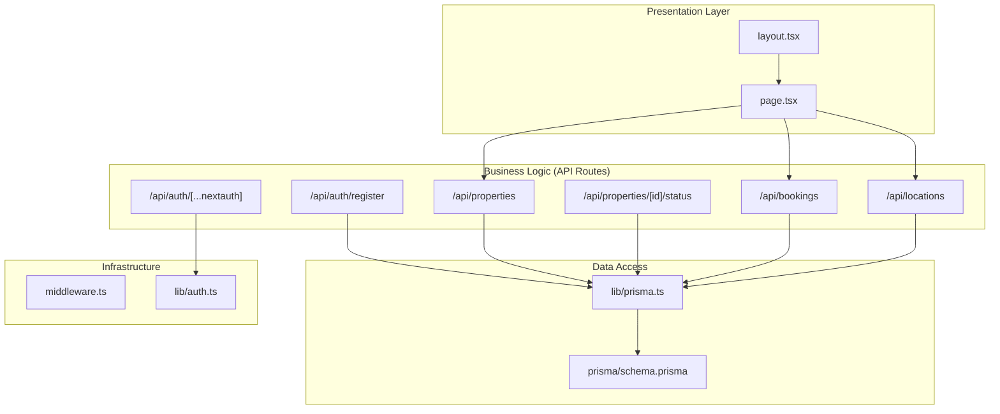
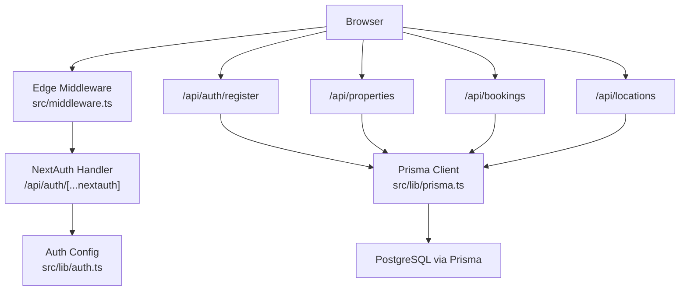
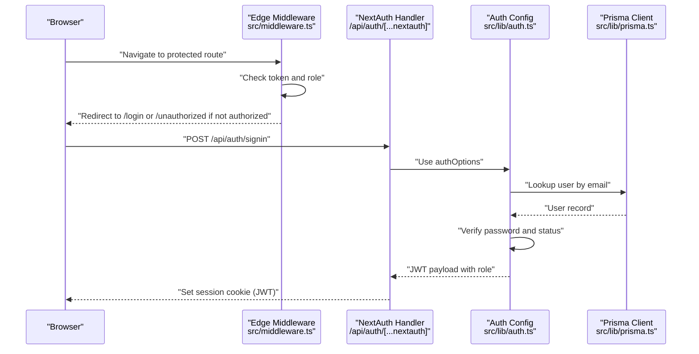
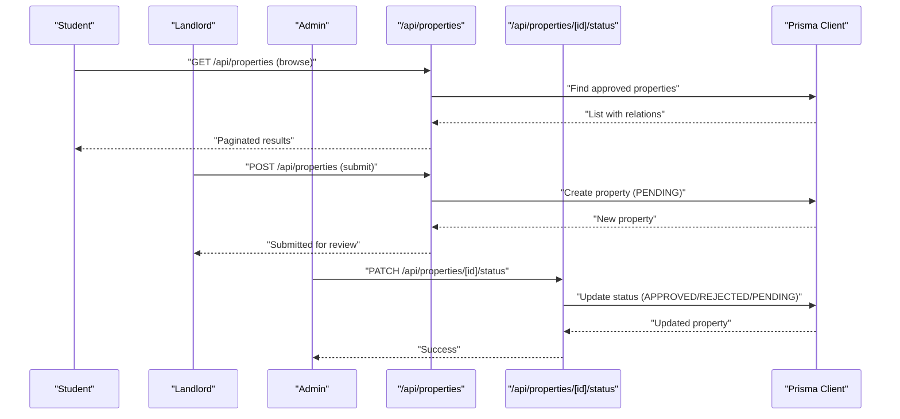
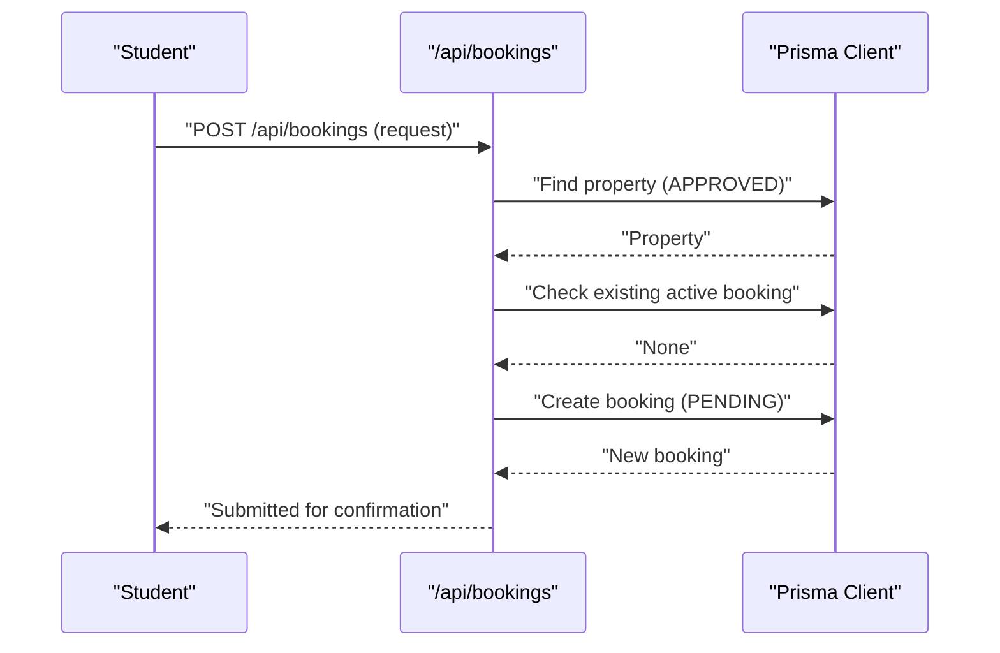
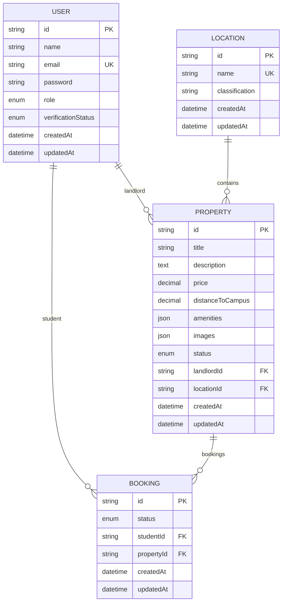
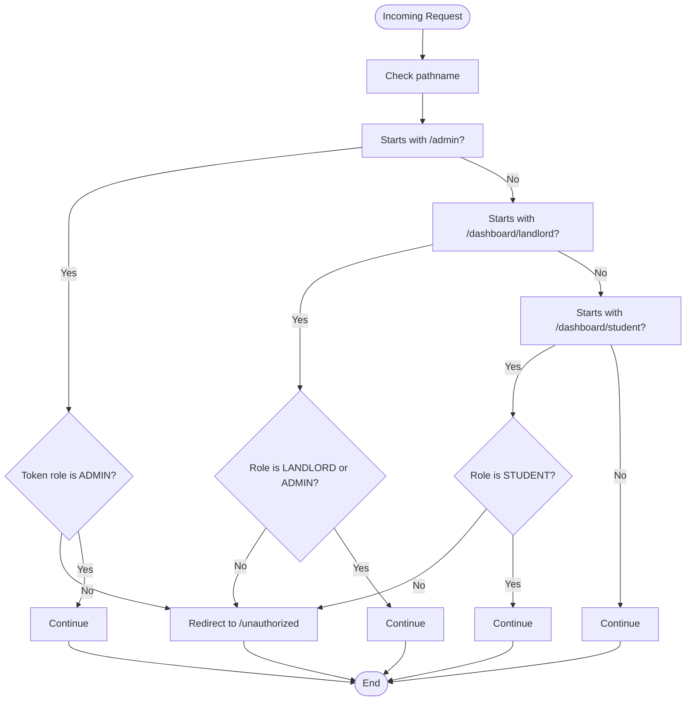
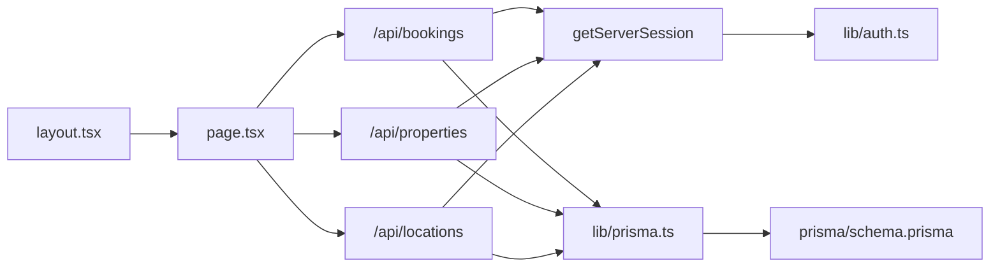

# Architecture Overview

<cite>
**Referenced Files in This Document**
- [package.json](file://package.json)
- [src/middleware.ts](file://src/middleware.ts)
- [src/lib/prisma.ts](file://src/lib/prisma.ts)
- [src/lib/auth.ts](file://src/lib/auth.ts)
- [src/app/api/auth/[...nextauth]/route.ts](file://src/app/api/auth/[...nextauth]/route.ts)
- [src/app/api/auth/register/route.ts](file://src/app/api/auth/register/route.ts)
- [src/app/api/properties/route.ts](file://src/app/api/properties/route.ts)
- [src/app/api/properties/[id]/status/route.ts](file://src/app/api/properties/[id]/status/route.ts)
- [src/app/api/bookings/route.ts](file://src/app/api/bookings/route.ts)
- [src/app/api/locations/route.ts](file://src/app/api/locations/route.ts)
- [src/app/layout.tsx](file://src/app/layout.tsx)
- [src/app/page.tsx](file://src/app/page.tsx)
- [src/types/index.ts](file://src/types/index.ts)
- [prisma/schema.prisma](file://prisma/schema.prisma)
</cite>

## Table of Contents
1. [Introduction](#introduction)
2. [Project Structure](#project-structure)
3. [Core Components](#core-components)
4. [Architecture Overview](#architecture-overview)
5. [Detailed Component Analysis](#detailed-component-analysis)
6. [Dependency Analysis](#dependency-analysis)
7. [Performance Considerations](#performance-considerations)
8. [Troubleshooting Guide](#troubleshooting-guide)
9. [Conclusion](#conclusion)
10. [Appendices](#appendices)

## Introduction
This document describes the architecture of RentalHub-BOUESTI, a Next.js application implementing a layered architecture with presentation, business logic, data access, and infrastructure layers. It explains the Next.js App Router pattern, API route structure, middleware implementation, singleton Prisma client pattern, NextAuth.js integration, and edge runtime middleware. It also documents system boundaries, component interactions, data flows, integration patterns, and security considerations including authentication and authorization.

## Project Structure
The project follows Next.js App Router conventions with a clear separation of concerns:
- Presentation layer: React components under src/app
- Business logic: Route handlers under src/app/api
- Data access: Prisma client under src/lib
- Infrastructure: Middleware, configuration, and database schema

**Diagram sources**
- [src/app/layout.tsx:1-42](file://src/app/layout.tsx#L1-L42)
- [src/app/page.tsx:1-142](file://src/app/page.tsx#L1-L142)
- [src/app/api/auth/[...nextauth]/route.ts:1-7](file://src/app/api/auth/[...nextauth]/route.ts#L1-L7)
- [src/app/api/auth/register/route.ts:1-90](file://src/app/api/auth/register/route.ts#L1-L90)
- [src/app/api/properties/route.ts:1-119](file://src/app/api/properties/route.ts#L1-L119)
- [src/app/api/properties/[id]/status/route.ts:1-52](file://src/app/api/properties/[id]/status/route.ts#L1-L52)
- [src/app/api/bookings/route.ts:1-109](file://src/app/api/bookings/route.ts#L1-L109)
- [src/app/api/locations/route.ts:1-29](file://src/app/api/locations/route.ts#L1-L29)
- [src/lib/prisma.ts:1-27](file://src/lib/prisma.ts#L1-L27)
- [prisma/schema.prisma:1-130](file://prisma/schema.prisma#L1-L130)
- [src/middleware.ts:1-48](file://src/middleware.ts#L1-L48)
- [src/lib/auth.ts:1-117](file://src/lib/auth.ts#L1-L117)

**Section sources**
- [package.json:1-41](file://package.json#L1-L41)
- [src/app/layout.tsx:1-42](file://src/app/layout.tsx#L1-L42)
- [src/app/page.tsx:1-142](file://src/app/page.tsx#L1-L142)
- [src/lib/prisma.ts:1-27](file://src/lib/prisma.ts#L1-L27)
- [prisma/schema.prisma:1-130](file://prisma/schema.prisma#L1-L130)

## Core Components
- Edge Runtime Middleware: Enforces authentication and role-based access control for protected routes.
- NextAuth.js Integration: Provides credentials-based authentication with JWT sessions and custom claims.
- Singleton Prisma Client: Centralized database client with development caching to prevent connection exhaustion.
- API Routes: Implement business logic for authentication, user registration, property listings, bookings, and locations.
- Shared Types: Strongly typed models and response shapes derived from Prisma schema.

Key implementation references:
- Edge middleware and route protection: [src/middleware.ts:1-48](file://src/middleware.ts#L1-L48)
- NextAuth configuration and callbacks: [src/lib/auth.ts:1-117](file://src/lib/auth.ts#L1-L117)
- NextAuth route handler: [src/app/api/auth/[...nextauth]/route.ts:1-7](file://src/app/api/auth/[...nextauth]/route.ts#L1-L7)
- Prisma singleton pattern: [src/lib/prisma.ts:1-27](file://src/lib/prisma.ts#L1-L27)
- Registration endpoint: [src/app/api/auth/register/route.ts:1-90](file://src/app/api/auth/register/route.ts#L1-L90)
- Properties endpoints: [src/app/api/properties/route.ts:1-119](file://src/app/api/properties/route.ts#L1-L119), [src/app/api/properties/[id]/status/route.ts:1-52](file://src/app/api/properties/[id]/status/route.ts#L1-L52)
- Bookings endpoints: [src/app/api/bookings/route.ts:1-109](file://src/app/api/bookings/route.ts#L1-L109)
- Locations endpoint: [src/app/api/locations/route.ts:1-29](file://src/app/api/locations/route.ts#L1-L29)
- Shared types: [src/types/index.ts:1-109](file://src/types/index.ts#L1-L109)

**Section sources**
- [src/middleware.ts:1-48](file://src/middleware.ts#L1-L48)
- [src/lib/auth.ts:1-117](file://src/lib/auth.ts#L1-L117)
- [src/app/api/auth/[...nextauth]/route.ts:1-7](file://src/app/api/auth/[...nextauth]/route.ts#L1-L7)
- [src/lib/prisma.ts:1-27](file://src/lib/prisma.ts#L1-L27)
- [src/app/api/auth/register/route.ts:1-90](file://src/app/api/auth/register/route.ts#L1-L90)
- [src/app/api/properties/route.ts:1-119](file://src/app/api/properties/route.ts#L1-L119)
- [src/app/api/properties/[id]/status/route.ts:1-52](file://src/app/api/properties/[id]/status/route.ts#L1-L52)
- [src/app/api/bookings/route.ts:1-109](file://src/app/api/bookings/route.ts#L1-L109)
- [src/app/api/locations/route.ts:1-29](file://src/app/api/locations/route.ts#L1-L29)
- [src/types/index.ts:1-109](file://src/types/index.ts#L1-L109)

## Architecture Overview
RentalHub-BOUESTI employs a layered architecture:
- Presentation: Next.js App Router pages and components render UI and orchestrate client-side navigation.
- Business Logic: API routes encapsulate domain operations (registration, property lifecycle, booking workflow).
- Data Access: Prisma client abstracts database operations with a singleton pattern.
- Infrastructure: Middleware enforces authentication and authorization; NextAuth.js manages identity.

**Diagram sources**
- [src/middleware.ts:1-48](file://src/middleware.ts#L1-L48)
- [src/app/api/auth/[...nextauth]/route.ts:1-7](file://src/app/api/auth/[...nextauth]/route.ts#L1-L7)
- [src/lib/auth.ts:1-117](file://src/lib/auth.ts#L1-L117)
- [src/app/api/auth/register/route.ts:1-90](file://src/app/api/auth/register/route.ts#L1-L90)
- [src/app/api/properties/route.ts:1-119](file://src/app/api/properties/route.ts#L1-L119)
- [src/app/api/bookings/route.ts:1-109](file://src/app/api/bookings/route.ts#L1-L109)
- [src/app/api/locations/route.ts:1-29](file://src/app/api/locations/route.ts#L1-L29)
- [src/lib/prisma.ts:1-27](file://src/lib/prisma.ts#L1-L27)
- [prisma/schema.prisma:1-130](file://prisma/schema.prisma#L1-L130)

## Detailed Component Analysis

### Authentication and Authorization Flow
The system uses NextAuth.js with a Credentials provider and JWT sessions. Edge middleware enforces route-level access control based on user roles.

**Diagram sources**
- [src/middleware.ts:1-48](file://src/middleware.ts#L1-L48)
- [src/app/api/auth/[...nextauth]/route.ts:1-7](file://src/app/api/auth/[...nextauth]/route.ts#L1-L7)
- [src/lib/auth.ts:1-117](file://src/lib/auth.ts#L1-L117)
- [src/lib/prisma.ts:1-27](file://src/lib/prisma.ts#L1-L27)

**Section sources**
- [src/middleware.ts:1-48](file://src/middleware.ts#L1-L48)
- [src/lib/auth.ts:1-117](file://src/lib/auth.ts#L1-L117)
- [src/app/api/auth/[...nextauth]/route.ts:1-7](file://src/app/api/auth/[...nextauth]/route.ts#L1-L7)

### Property Lifecycle Management
Landlords can submit properties; admins approve or reject listings. The flow ensures role-based permissions and data validation.

**Diagram sources**
- [src/app/api/properties/route.ts:1-119](file://src/app/api/properties/route.ts#L1-L119)
- [src/app/api/properties/[id]/status/route.ts:1-52](file://src/app/api/properties/[id]/status/route.ts#L1-L52)
- [src/lib/prisma.ts:1-27](file://src/lib/prisma.ts#L1-L27)

**Section sources**
- [src/app/api/properties/route.ts:1-119](file://src/app/api/properties/route.ts#L1-L119)
- [src/app/api/properties/[id]/status/route.ts:1-52](file://src/app/api/properties/[id]/status/route.ts#L1-L52)

### Booking Workflow
Students can request bookings for approved properties; landlords/admins can view related bookings.

**Diagram sources**
- [src/app/api/bookings/route.ts:1-109](file://src/app/api/bookings/route.ts#L1-L109)
- [src/lib/prisma.ts:1-27](file://src/lib/prisma.ts#L1-L27)

**Section sources**
- [src/app/api/bookings/route.ts:1-109](file://src/app/api/bookings/route.ts#L1-L109)

### Data Model Overview
The Prisma schema defines core entities and relationships used across the system.

**Diagram sources**
- [prisma/schema.prisma:1-130](file://prisma/schema.prisma#L1-L130)

**Section sources**
- [prisma/schema.prisma:1-130](file://prisma/schema.prisma#L1-L130)

### Middleware Decision Flow
The edge middleware applies role-based redirections and enforces access to protected paths.

**Diagram sources**
- [src/middleware.ts:1-48](file://src/middleware.ts#L1-L48)

**Section sources**
- [src/middleware.ts:1-48](file://src/middleware.ts#L1-L48)

## Dependency Analysis
- Presentation depends on API routes for data and actions.
- API routes depend on NextAuth for session retrieval and Prisma for persistence.
- Prisma depends on the database schema and environment configuration.
- Middleware depends on NextAuth’s token presence and role claims.

**Diagram sources**
- [src/app/layout.tsx:1-42](file://src/app/layout.tsx#L1-L42)
- [src/app/page.tsx:1-142](file://src/app/page.tsx#L1-L142)
- [src/app/api/bookings/route.ts:1-109](file://src/app/api/bookings/route.ts#L1-L109)
- [src/app/api/properties/route.ts:1-119](file://src/app/api/properties/route.ts#L1-L119)
- [src/app/api/locations/route.ts:1-29](file://src/app/api/locations/route.ts#L1-L29)
- [src/lib/auth.ts:1-117](file://src/lib/auth.ts#L1-L117)
- [src/lib/prisma.ts:1-27](file://src/lib/prisma.ts#L1-L27)
- [prisma/schema.prisma:1-130](file://prisma/schema.prisma#L1-L130)

**Section sources**
- [src/app/api/bookings/route.ts:1-109](file://src/app/api/bookings/route.ts#L1-L109)
- [src/app/api/properties/route.ts:1-119](file://src/app/api/properties/route.ts#L1-L119)
- [src/app/api/locations/route.ts:1-29](file://src/app/api/locations/route.ts#L1-L29)
- [src/lib/auth.ts:1-117](file://src/lib/auth.ts#L1-L117)
- [src/lib/prisma.ts:1-27](file://src/lib/prisma.ts#L1-L27)
- [prisma/schema.prisma:1-130](file://prisma/schema.prisma#L1-L130)

## Performance Considerations
- Prisma singleton with development caching prevents connection pool exhaustion during hot reload.
- Pagination and filtering in property listing reduce payload sizes and database load.
- JWT sessions minimize repeated database lookups for authenticated requests.
- Edge middleware runs close to users to enforce access control early.

[No sources needed since this section provides general guidance]

## Troubleshooting Guide
- Authentication failures: Verify NEXTAUTH_SECRET is set and credentials match stored bcrypt hashes.
- Role-based redirects: Confirm middleware matcher and token role claims align with expected routes.
- Registration errors: Check email uniqueness and password length constraints.
- Property creation errors: Ensure locationId exists and user has appropriate role.
- Booking conflicts: Duplicate active bookings are prevented by checking pending/confirmed statuses.

**Section sources**
- [src/lib/auth.ts:1-117](file://src/lib/auth.ts#L1-L117)
- [src/middleware.ts:1-48](file://src/middleware.ts#L1-L48)
- [src/app/api/auth/register/route.ts:1-90](file://src/app/api/auth/register/route.ts#L1-L90)
- [src/app/api/properties/route.ts:1-119](file://src/app/api/properties/route.ts#L1-L119)
- [src/app/api/bookings/route.ts:1-109](file://src/app/api/bookings/route.ts#L1-L109)

## Conclusion
RentalHub-BOUESTI follows a clean layered architecture with clear separation between presentation, business logic, data access, and infrastructure. The combination of Next.js App Router, edge middleware, NextAuth.js, and a singleton Prisma client delivers a secure, maintainable, and scalable foundation. Role-based access control and JWT-based sessions ensure robust security, while API routes encapsulate business logic and enforce authorization.

[No sources needed since this section summarizes without analyzing specific files]

## Appendices

### API Route Summary
- Authentication
  - POST /api/auth/register: Creates a new user account (STUDENT or LANDLORD)
  - GET/POST /api/auth/[...nextauth]: NextAuth handler for sign-in/out
- Properties
  - GET /api/properties: List/search properties with pagination and filters
  - POST /api/properties: Create a property (landlords only)
  - PATCH /api/properties/[id]/status: Update property status (admin only)
- Bookings
  - GET /api/bookings: List user’s bookings (role-aware)
  - POST /api/bookings: Create a booking (students only)
- Locations
  - GET /api/locations: Fetch locations for selection

**Section sources**
- [src/app/api/auth/register/route.ts:1-90](file://src/app/api/auth/register/route.ts#L1-L90)
- [src/app/api/auth/[...nextauth]/route.ts:1-7](file://src/app/api/auth/[...nextauth]/route.ts#L1-L7)
- [src/app/api/properties/route.ts:1-119](file://src/app/api/properties/route.ts#L1-L119)
- [src/app/api/properties/[id]/status/route.ts:1-52](file://src/app/api/properties/[id]/status/route.ts#L1-L52)
- [src/app/api/bookings/route.ts:1-109](file://src/app/api/bookings/route.ts#L1-L109)
- [src/app/api/locations/route.ts:1-29](file://src/app/api/locations/route.ts#L1-L29)