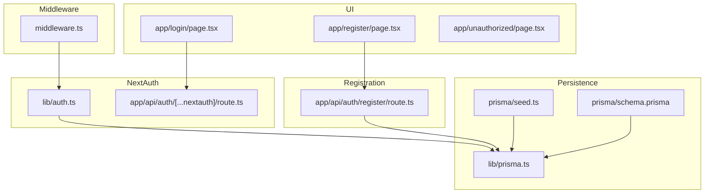
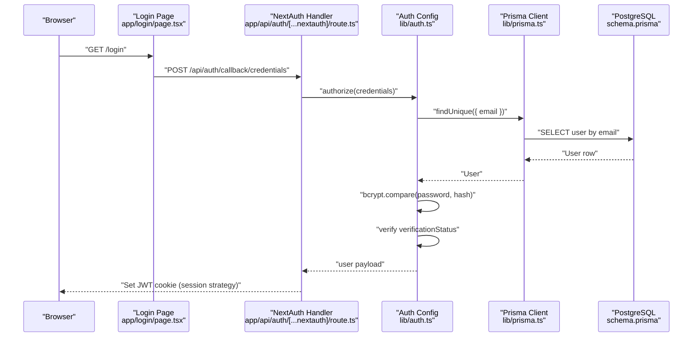
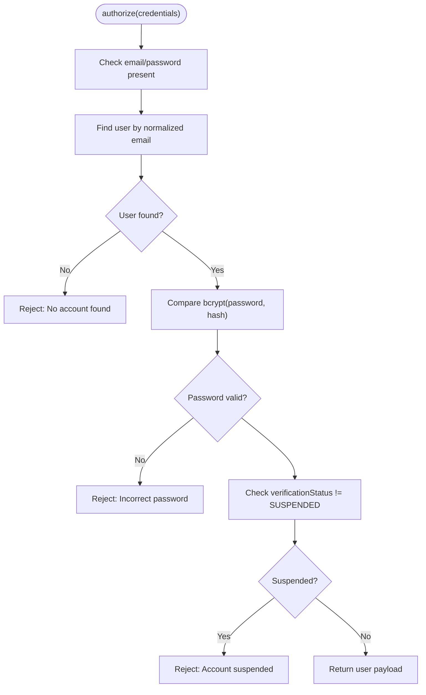
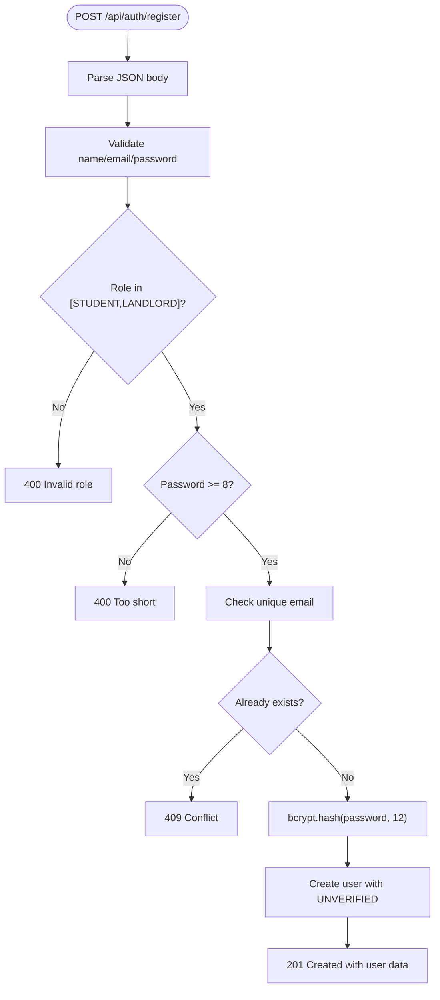
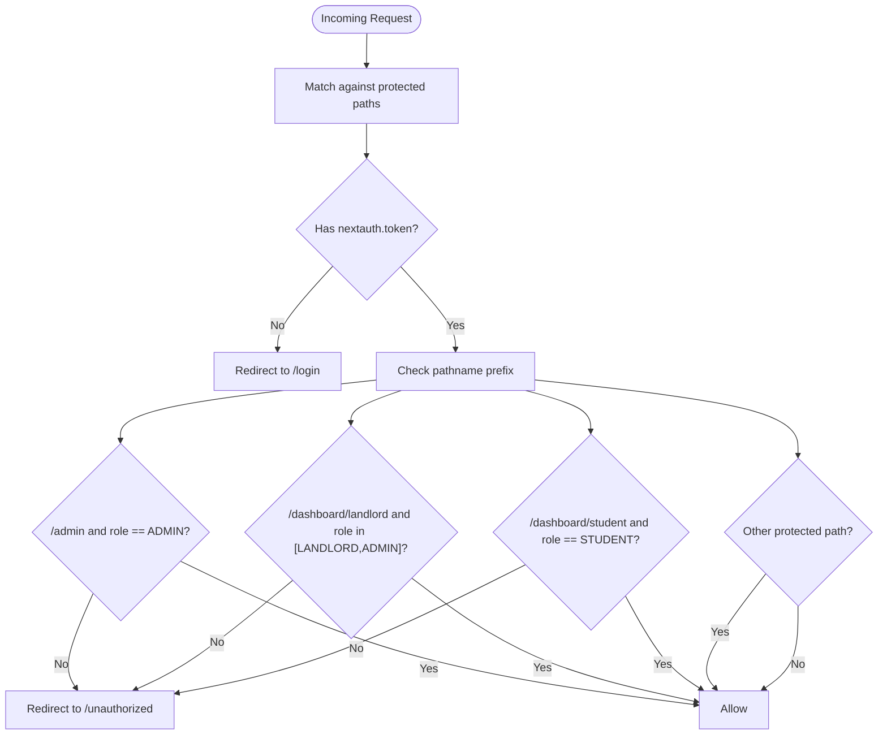
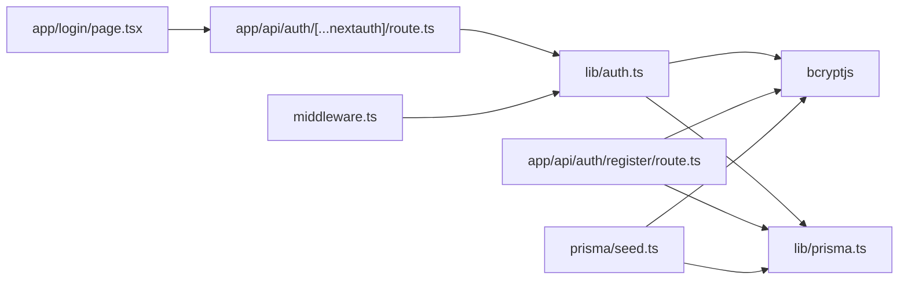

# Authentication & Authorization

<cite>
**Referenced Files in This Document**
- [src/lib/auth.ts](file://src/lib/auth.ts)
- [src/app/api/auth/[...nextauth]/route.ts](file://src/app/api/auth/[...nextauth]/route.ts)
- [src/app/api/auth/register/route.ts](file://src/app/api/auth/register/route.ts)
- [src/middleware.ts](file://src/middleware.ts)
- [src/app/login/page.tsx](file://src/app/login/page.tsx)
- [src/app/register/page.tsx](file://src/app/register/page.tsx)
- [src/app/unauthorized/page.tsx](file://src/app/unauthorized/page.tsx)
- [src/lib/prisma.ts](file://src/lib/prisma.ts)
- [prisma/schema.prisma](file://prisma/schema.prisma)
- [package.json](file://package.json)
- [prisma/seed.ts](file://prisma/seed.ts)
- [src/types/index.ts](file://src/types/index.ts)
</cite>

## Table of Contents
1. [Introduction](#introduction)
2. [Project Structure](#project-structure)
3. [Core Components](#core-components)
4. [Architecture Overview](#architecture-overview)
5. [Detailed Component Analysis](#detailed-component-analysis)
6. [Dependency Analysis](#dependency-analysis)
7. [Performance Considerations](#performance-considerations)
8. [Troubleshooting Guide](#troubleshooting-guide)
9. [Conclusion](#conclusion)

## Introduction
This document explains the authentication and authorization system for RentalHub-BOUESTI. It covers the NextAuth.js configuration with a custom credentials provider, JWT token management, session handling, user registration, login/logout flows, role-based access control (RBAC), middleware route protection, and integration with API routes. It also documents security considerations, token lifecycle, and password hashing with bcryptjs.

## Project Structure
Authentication and authorization are implemented across a small set of focused modules:
- NextAuth configuration and provider logic
- API routes for authentication and registration
- Edge middleware for route protection
- UI pages for login and registration
- Prisma schema and client for user storage
- Seed script for initial admin provisioning

**Diagram sources**
- [src/lib/auth.ts:14-90](file://src/lib/auth.ts#L14-L90)
- [src/app/api/auth/[...nextauth]/route.ts:1-6](file://src/app/api/auth/[...nextauth]/route.ts#L1-L6)
- [src/app/api/auth/register/route.ts:20-89](file://src/app/api/auth/register/route.ts#L20-L89)
- [src/middleware.ts:11-38](file://src/middleware.ts#L11-L38)
- [src/app/login/page.tsx:51](file://src/app/login/page.tsx#L51)
- [src/app/register/page.tsx:50](file://src/app/register/page.tsx#L50)
- [src/app/unauthorized/page.tsx:1-35](file://src/app/unauthorized/page.tsx#L1-L35)
- [src/lib/prisma.ts:13-24](file://src/lib/prisma.ts#L13-L24)
- [prisma/schema.prisma:44-61](file://prisma/schema.prisma#L44-L61)
- [prisma/seed.ts:92-122](file://prisma/seed.ts#L92-L122)

**Section sources**
- [src/lib/auth.ts:14-90](file://src/lib/auth.ts#L14-L90)
- [src/app/api/auth/[...nextauth]/route.ts:1-6](file://src/app/api/auth/[...nextauth]/route.ts#L1-L6)
- [src/app/api/auth/register/route.ts:20-89](file://src/app/api/auth/register/route.ts#L20-L89)
- [src/middleware.ts:11-38](file://src/middleware.ts#L11-L38)
- [src/app/login/page.tsx:51](file://src/app/login/page.tsx#L51)
- [src/app/register/page.tsx:50](file://src/app/register/page.tsx#L50)
- [src/app/unauthorized/page.tsx:1-35](file://src/app/unauthorized/page.tsx#L1-L35)
- [src/lib/prisma.ts:13-24](file://src/lib/prisma.ts#L13-L24)
- [prisma/schema.prisma:44-61](file://prisma/schema.prisma#L44-L61)
- [prisma/seed.ts:92-122](file://prisma/seed.ts#L92-L122)

## Core Components
- NextAuth configuration with a credentials provider, JWT callbacks, and session strategy
- Registration endpoint with validation and bcrypt hashing
- Edge middleware enforcing RBAC per route prefix
- UI forms posting to NextAuth and registration endpoints
- Prisma-backed user model with roles and verification status
- Seed script to provision an initial admin user

Key implementation references:
- NextAuth options and callbacks: [src/lib/auth.ts:14-90](file://src/lib/auth.ts#L14-L90)
- Credentials provider authorize flow: [src/lib/auth.ts:22-51](file://src/lib/auth.ts#L22-L51)
- JWT/session callbacks: [src/lib/auth.ts:55-72](file://src/lib/auth.ts#L55-L72)
- Pages redirections: [src/lib/auth.ts:75-79](file://src/lib/auth.ts#L75-L79)
- Session strategy and expiry: [src/lib/auth.ts:81-85](file://src/lib/auth.ts#L81-L85)
- Registration endpoint: [src/app/api/auth/register/route.ts:20-89](file://src/app/api/auth/register/route.ts#L20-L89)
- Middleware RBAC: [src/middleware.ts:16-29](file://src/middleware.ts#L16-L29)
- Protected route matchers: [src/middleware.ts:40-47](file://src/middleware.ts#L40-L47)
- Prisma user model: [prisma/schema.prisma:44-61](file://prisma/schema.prisma#L44-L61)
- Prisma client singleton: [src/lib/prisma.ts:13-24](file://src/lib/prisma.ts#L13-L24)
- Admin seed: [prisma/seed.ts:92-122](file://prisma/seed.ts#L92-L122)

**Section sources**
- [src/lib/auth.ts:14-90](file://src/lib/auth.ts#L14-L90)
- [src/app/api/auth/register/route.ts:20-89](file://src/app/api/auth/register/route.ts#L20-L89)
- [src/middleware.ts:16-29](file://src/middleware.ts#L16-L29)
- [src/middleware.ts:40-47](file://src/middleware.ts#L40-L47)
- [prisma/schema.prisma:44-61](file://prisma/schema.prisma#L44-L61)
- [src/lib/prisma.ts:13-24](file://src/lib/prisma.ts#L13-L24)
- [prisma/seed.ts:92-122](file://prisma/seed.ts#L92-L122)

## Architecture Overview
The authentication system uses NextAuth.js with a custom credentials provider. Users submit credentials to the NextAuth callback endpoint, which validates against the database using bcrypt. On successful authentication, a signed JWT is issued and stored in the browser cookie. Subsequent requests include the token, which the middleware reads to enforce RBAC and redirect unauthorized users.

**Diagram sources**
- [src/app/login/page.tsx:51](file://src/app/login/page.tsx#L51)
- [src/app/api/auth/[...nextauth]/route.ts:1-6](file://src/app/api/auth/[...nextauth]/route.ts#L1-L6)
- [src/lib/auth.ts:22-51](file://src/lib/auth.ts#L22-L51)
- [src/lib/prisma.ts:13-24](file://src/lib/prisma.ts#L13-L24)
- [prisma/schema.prisma:44-61](file://prisma/schema.prisma#L44-L61)

## Detailed Component Analysis

### NextAuth.js Configuration and JWT Management
- Provider: Credentials provider with email and password fields.
- authorize: Validates presence of credentials, fetches user by normalized email, compares bcrypt hashes, rejects suspended accounts, and returns user fields for token population.
- callbacks.jwt: Populates token with id, role, and verificationStatus when a user logs in.
- callbacks.session: Injects id, role, and verificationStatus into session.user.
- pages.signIn/signOut/error: Redirects to /login for sign-in/out and error handling.
- session.strategy: jwt with maxAge 30 days and updateAge 24 hours.
- secret: NEXTAUTH_SECRET environment variable.
- Module augmentation: Extends NextAuth types for User, Session, and JWT.

**Diagram sources**
- [src/lib/auth.ts:22-51](file://src/lib/auth.ts#L22-L51)

**Section sources**
- [src/lib/auth.ts:14-90](file://src/lib/auth.ts#L14-L90)

### Session Handling and Token Lifecycle
- Strategy: JWT stored in a secure cookie.
- Expiry: maxAge 30 days; updateAge 24 hours refreshes the cookie.
- Pages: signIn, signOut, error mapped to /login.
- Debugging: enabled in development.

Implications:
- Long-lived sessions with periodic renewal.
- No server-side session store; stateless JWTs.
- Token rotation occurs automatically on activity within the updateAge window.

**Section sources**
- [src/lib/auth.ts:81-85](file://src/lib/auth.ts#L81-L85)
- [src/lib/auth.ts:75-79](file://src/lib/auth.ts#L75-L79)

### User Registration Flow
- Endpoint: POST /api/auth/register
- Accepts: name, email, password, optional role (defaults to STUDENT; LANDLORD allowed)
- Validation: Required fields, role whitelist, password length >= 8
- Uniqueness: Checks email uniqueness
- Persistence: Hashes password with bcrypt at cost 12, creates user with UNVERIFIED status
- Response: JSON with success flag, created user data, and message; handles 400/409/500 appropriately

**Diagram sources**
- [src/app/api/auth/register/route.ts:20-89](file://src/app/api/auth/register/route.ts#L20-L89)

**Section sources**
- [src/app/api/auth/register/route.ts:20-89](file://src/app/api/auth/register/route.ts#L20-L89)

### Login and Logout UI Integration
- Login form posts to NextAuth credentials provider callback endpoint.
- Logout redirects to NextAuth signOut page, which redirects to /login.

References:
- Login form action: [src/app/login/page.tsx:51](file://src/app/login/page.tsx#L51)
- NextAuth handler export: [src/app/api/auth/[...nextauth]/route.ts:1-6](file://src/app/api/auth/[...nextauth]/route.ts#L1-L6)
- Pages configuration: [src/lib/auth.ts:75-79](file://src/lib/auth.ts#L75-L79)

**Section sources**
- [src/app/login/page.tsx:51](file://src/app/login/page.tsx#L51)
- [src/app/api/auth/[...nextauth]/route.ts:1-6](file://src/app/api/auth/[...nextauth]/route.ts#L1-L6)
- [src/lib/auth.ts:75-79](file://src/lib/auth.ts#L75-L79)

### Role-Based Access Control (RBAC) with Middleware
- Protected prefixes enforced by Edge middleware:
  - /admin requires ADMIN
  - /dashboard/landlord requires LANDLORD or ADMIN
  - /dashboard/student requires STUDENT
  - Additional protected paths: /properties/new, /bookings/*
- Unauthorized access is redirected to /unauthorized.

**Diagram sources**
- [src/middleware.ts:16-29](file://src/middleware.ts#L16-L29)
- [src/middleware.ts:40-47](file://src/middleware.ts#L40-L47)

**Section sources**
- [src/middleware.ts:11-38](file://src/middleware.ts#L11-L38)
- [src/middleware.ts:40-47](file://src/middleware.ts#L40-L47)

### Unauthorized Access Handling
- Dedicated UI page renders a friendly access denied message and navigation options.

**Section sources**
- [src/app/unauthorized/page.tsx:1-35](file://src/app/unauthorized/page.tsx#L1-L35)

### Password Hashing with bcryptjs
- Registration endpoint hashes passwords with bcrypt at cost 12.
- NextAuth authorize flow compares submitted password against stored hash.
- Seed script demonstrates bcrypt hashing for the admin user.

**Section sources**
- [src/app/api/auth/register/route.ts:58](file://src/app/api/auth/register/route.ts#L58)
- [src/lib/auth.ts:35](file://src/lib/auth.ts#L35)
- [prisma/seed.ts:104](file://prisma/seed.ts#L104)

### Integration with API Routes
- API routes can access the current session via getServerSession with the same authOptions used by NextAuth.
- Example: Properties API route imports getServerSession and authOptions to protect endpoints.

**Section sources**
- [src/app/api/properties/route.ts:7-9](file://src/app/api/properties/route.ts#L7-L9)

### Data Model and Types
- User model includes id, name, email, password (hashed), role, verificationStatus, timestamps.
- Roles: STUDENT, LANDLORD, ADMIN.
- VerificationStatus: UNVERIFIED, VERIFIED, SUSPENDED.
- Type augmentations ensure strongly typed session and JWT.

**Section sources**
- [prisma/schema.prisma:44-61](file://prisma/schema.prisma#L44-L61)
- [prisma/schema.prisma:17-27](file://prisma/schema.prisma#L17-L27)
- [src/lib/auth.ts:92-116](file://src/lib/auth.ts#L92-L116)
- [src/types/index.ts:73-80](file://src/types/index.ts#L73-L80)

## Dependency Analysis
- NextAuth depends on:
  - Credentials provider
  - bcryptjs for password comparison
  - Prisma client for user lookup
- Middleware depends on NextAuth token injection
- Registration endpoint depends on Prisma and bcryptjs
- UI pages depend on NextAuth callback URLs and registration endpoint

**Diagram sources**
- [src/lib/auth.ts:8-12](file://src/lib/auth.ts#L8-L12)
- [src/app/api/auth/[...nextauth]/route.ts:1-2](file://src/app/api/auth/[...nextauth]/route.ts#L1-L2)
- [src/app/api/auth/register/route.ts:8-11](file://src/app/api/auth/register/route.ts#L8-L11)
- [src/middleware.ts:8](file://src/middleware.ts#L8)
- [prisma/seed.ts:12-13](file://prisma/seed.ts#L12-L13)

**Section sources**
- [package.json:19-26](file://package.json#L19-L26)
- [src/lib/auth.ts:8-12](file://src/lib/auth.ts#L8-L12)
- [src/app/api/auth/[...nextauth]/route.ts:1-2](file://src/app/api/auth/[...nextauth]/route.ts#L1-L2)
- [src/app/api/auth/register/route.ts:8-11](file://src/app/api/auth/register/route.ts#L8-L11)
- [src/middleware.ts:8](file://src/middleware.ts#L8)
- [prisma/seed.ts:12-13](file://prisma/seed.ts#L12-L13)

## Performance Considerations
- JWT strategy avoids server-side session storage; however, ensure NEXTAUTH_SECRET is strong and rotate it periodically.
- bcrypt cost 12 is chosen for balanced security and performance during registration; login bcrypt comparison is lightweight.
- Prisma client is cached in development to prevent connection pool exhaustion; keep production connections managed by your hosting provider.
- Middleware runs on Edge runtime; keep checks minimal and rely on token presence for fast rejections.

[No sources needed since this section provides general guidance]

## Troubleshooting Guide
Common issues and resolutions:
- Login fails with “incorrect password” or “no account found”: Verify email normalization and that the user exists with a valid hash.
- Account suspended: Ensure verificationStatus is not SUSPENDED.
- 403/Access Denied: Confirm user role matches the required prefix; check middleware matchers and token presence.
- Registration conflicts: Duplicate email detected; ensure uniqueness before attempting registration.
- Internal errors: Inspect server logs for stack traces; confirm NEXTAUTH_SECRET and database connectivity.

**Section sources**
- [src/lib/auth.ts:31-42](file://src/lib/auth.ts#L31-L42)
- [src/middleware.ts:16-29](file://src/middleware.ts#L16-L29)
- [src/app/api/auth/register/route.ts:49-56](file://src/app/api/auth/register/route.ts#L49-L56)
- [src/app/api/auth/register/route.ts:82-88](file://src/app/api/auth/register/route.ts#L82-L88)

## Conclusion
RentalHub-BOUESTI implements a robust, stateless authentication system using NextAuth.js with a credentials provider, bcrypt hashing, and JWT-based sessions. The middleware enforces role-based access control across protected routes, while the registration endpoint ensures secure user onboarding. Together, these components provide a secure, maintainable foundation for user management and access control.