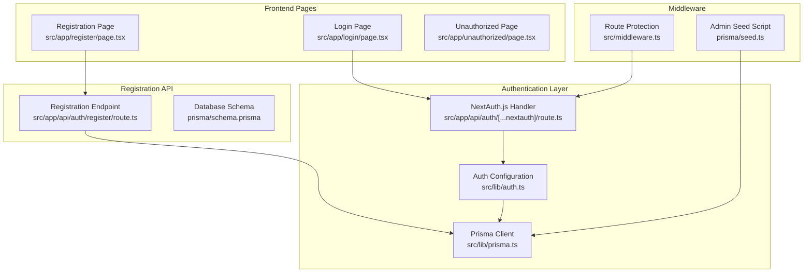
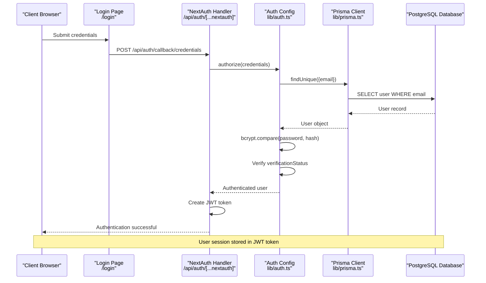
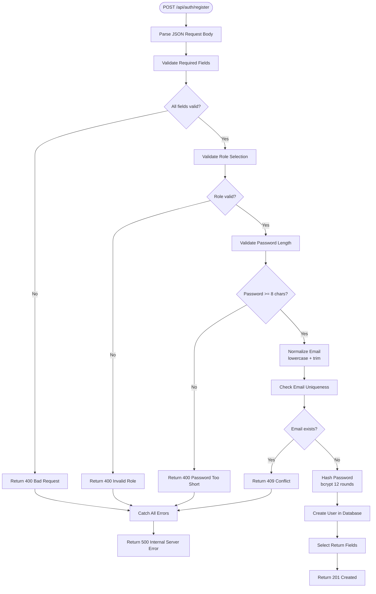
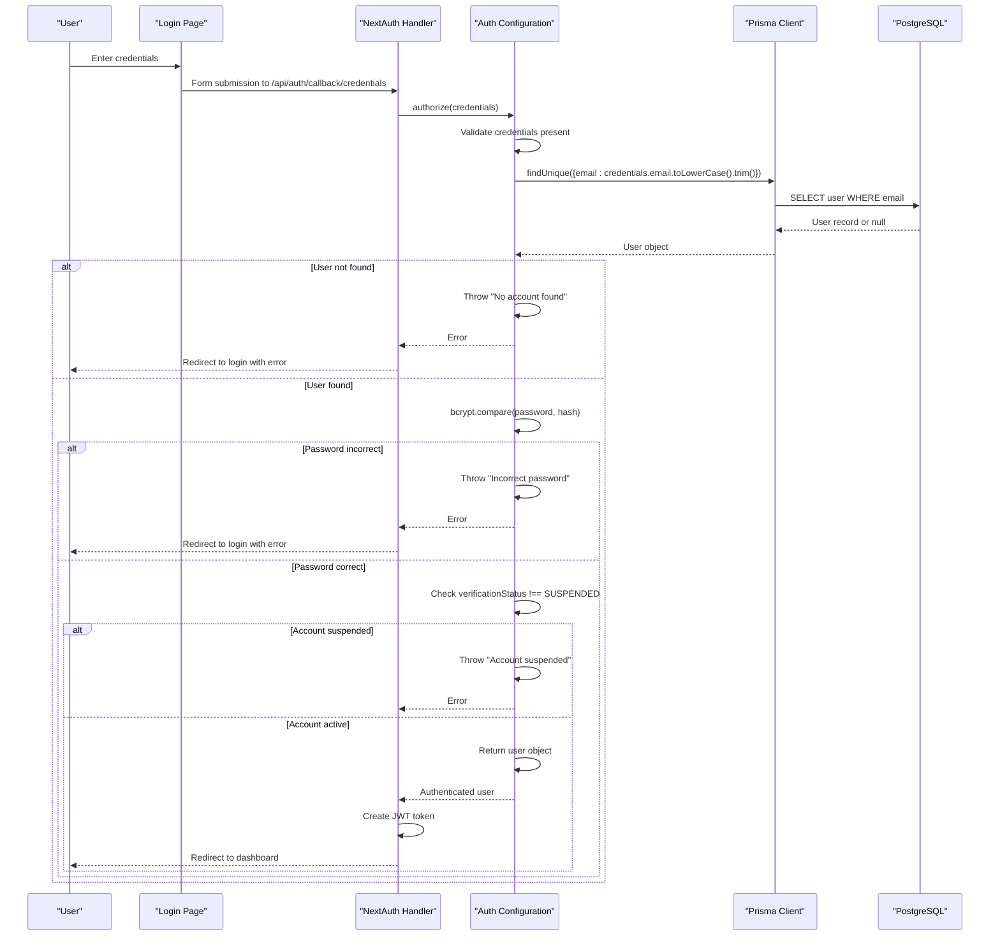
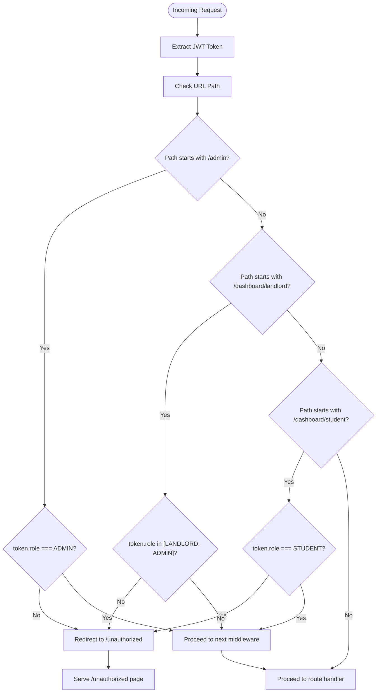
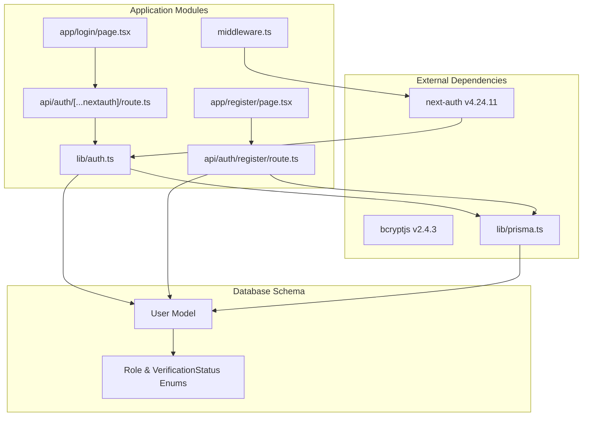

# Authentication Flow & User Registration

<cite>
**Referenced Files in This Document**
- [route.ts](file://src/app/api/auth/[...nextauth]/route.ts)
- [route.ts](file://src/app/api/auth/register/route.ts)
- [auth.ts](file://src/lib/auth.ts)
- [prisma.ts](file://src/lib/prisma.ts)
- [schema.prisma](file://prisma/schema.prisma)
- [page.tsx](file://src/app/login/page.tsx)
- [page.tsx](file://src/app/register/page.tsx)
- [middleware.ts](file://src/middleware.ts)
- [seed.ts](file://prisma/seed.ts)
- [page.tsx](file://src/app/unauthorized/page.tsx)
- [package.json](file://package.json)
</cite>

## Table of Contents
1. [Introduction](#introduction)
2. [Project Structure](#project-structure)
3. [Core Components](#core-components)
4. [Architecture Overview](#architecture-overview)
5. [Detailed Component Analysis](#detailed-component-analysis)
6. [Dependency Analysis](#dependency-analysis)
7. [Performance Considerations](#performance-considerations)
8. [Troubleshooting Guide](#troubleshooting-guide)
9. [Conclusion](#conclusion)

## Introduction
This document provides comprehensive documentation for the authentication flow and user registration process in RentalHub-BOUESTI. It covers the registration API endpoint implementation, login/logout flow through NextAuth.js, credential validation, security measures, input sanitization, and integration with the Prisma database layer. The system implements secure user authentication using bcrypt hashing, role-based access control, and JWT-based sessions.

## Project Structure
The authentication system is organized across several key files and directories:



**Diagram sources**
- [route.ts:1-7](file://src/app/api/auth/[...nextauth]/route.ts#L1-L7)
- [auth.ts:1-117](file://src/lib/auth.ts#L1-L117)
- [prisma.ts:1-27](file://src/lib/prisma.ts#L1-L27)
- [route.ts:1-90](file://src/app/api/auth/register/route.ts#L1-L90)
- [schema.prisma:1-130](file://prisma/schema.prisma#L1-L130)
- [page.tsx:1-116](file://src/app/login/page.tsx#L1-L116)
- [page.tsx:1-128](file://src/app/register/page.tsx#L1-L128)
- [middleware.ts:1-48](file://src/middleware.ts#L1-L48)
- [seed.ts:1-143](file://prisma/seed.ts#L1-L143)

**Section sources**
- [route.ts:1-7](file://src/app/api/auth/[...nextauth]/route.ts#L1-L7)
- [auth.ts:1-117](file://src/lib/auth.ts#L1-L117)
- [prisma.ts:1-27](file://src/lib/prisma.ts#L1-L27)
- [route.ts:1-90](file://src/app/api/auth/register/route.ts#L1-L90)
- [schema.prisma:1-130](file://prisma/schema.prisma#L1-L130)
- [page.tsx:1-116](file://src/app/login/page.tsx#L1-L116)
- [page.tsx:1-128](file://src/app/register/page.tsx#L1-L128)
- [middleware.ts:1-48](file://src/middleware.ts#L1-L48)
- [seed.ts:1-143](file://prisma/seed.ts#L1-L143)

## Core Components
The authentication system consists of four primary components:

### 1. NextAuth.js Configuration
The central authentication configuration defines the Credentials provider, session strategy, and security policies.

### 2. Registration API Endpoint
Handles user registration with input validation, password hashing, and database persistence.

### 3. Login/Logout Flow
Manages user authentication through NextAuth.js endpoints with proper error handling.

### 4. Route Protection Middleware
Enforces role-based access control for protected routes.

**Section sources**
- [auth.ts:14-90](file://src/lib/auth.ts#L14-L90)
- [route.ts:20-90](file://src/app/api/auth/register/route.ts#L20-L90)
- [route.ts:1-7](file://src/app/api/auth/[...nextauth]/route.ts#L1-L7)
- [middleware.ts:11-38](file://src/middleware.ts#L11-L38)

## Architecture Overview
The authentication architecture follows a layered approach with clear separation of concerns:



**Diagram sources**
- [page.tsx:51-52](file://src/app/login/page.tsx#L51-L52)
- [route.ts:1-7](file://src/app/api/auth/[...nextauth]/route.ts#L1-L7)
- [auth.ts:22-51](file://src/lib/auth.ts#L22-L51)
- [prisma.ts:13-27](file://src/lib/prisma.ts#L13-L27)

The system implements a comprehensive authentication flow with the following security measures:

1. **Password Security**: bcrypt hashing with 12 rounds of salt generation
2. **Input Validation**: Comprehensive validation for all user inputs
3. **Email Normalization**: Lowercase and trimming of email addresses
4. **Role-Based Access Control**: Multi-role support (STUDENT, LANDLORD, ADMIN)
5. **Verification Status Checks**: Account verification and suspension handling
6. **JWT Session Management**: 30-day max age with 24-hour refresh cycle

**Section sources**
- [auth.ts:35-42](file://src/lib/auth.ts#L35-L42)
- [auth.ts:81-85](file://src/lib/auth.ts#L81-L85)
- [auth.ts:14-90](file://src/lib/auth.ts#L14-L90)

## Detailed Component Analysis

### Registration API Endpoint Implementation

The registration endpoint handles new user creation with comprehensive validation and security measures:



**Diagram sources**
- [route.ts:20-90](file://src/app/api/auth/register/route.ts#L20-L90)

Key implementation details:

#### Input Validation
- **Required Fields**: Validates presence of name, email, and password
- **Role Validation**: Restricts roles to STUDENT or LANDLORD
- **Password Validation**: Enforces minimum 8-character requirement
- **Email Normalization**: Converts to lowercase and trims whitespace

#### Security Measures
- **Password Hashing**: Uses bcrypt with 12 rounds for secure password storage
- **Database Constraints**: Email uniqueness enforced at database level
- **Input Sanitization**: Automatic trimming and normalization of inputs

#### User Creation Defaults
- **Default Role**: STUDENT if not specified
- **Verification Status**: UNVERIFIED for new accounts
- **Password Storage**: Never stores plain text passwords

**Section sources**
- [route.ts:25-58](file://src/app/api/auth/register/route.ts#L25-L58)
- [route.ts:60-76](file://src/app/api/auth/register/route.ts#L60-L76)
- [schema.prisma:44-61](file://prisma/schema.prisma#L44-L61)

### Login/Logout Flow Through NextAuth.js

The login/logout flow utilizes NextAuth.js credentials provider with comprehensive validation:



**Diagram sources**
- [page.tsx:51-52](file://src/app/login/page.tsx#L51-L52)
- [auth.ts:22-51](file://src/lib/auth.ts#L22-L51)
- [prisma.ts:13-27](file://src/lib/prisma.ts#L13-L27)

#### Credential Validation Process
The authorization function implements a multi-layered validation approach:

1. **Input Presence Check**: Ensures both email and password are provided
2. **Database Lookup**: Performs case-insensitive email lookup
3. **Password Verification**: Compares provided password with stored hash
4. **Account Status Check**: Verifies account is not suspended

#### Error Handling Strategies
- **Specific Error Messages**: Provides clear feedback for different failure scenarios
- **Consistent Response Format**: All errors follow standardized JSON structure
- **Security Through Obscurity**: Generic error messages prevent information leakage

**Section sources**
- [auth.ts:22-51](file://src/lib/auth.ts#L22-L51)
- [auth.ts:75-85](file://src/lib/auth.ts#L75-L85)

### Authorization Function Logic

The authorization function serves as the core validation mechanism:

```mermaid
flowchart TD
Start([authorize(credentials)]) --> CheckInputs["Check email and password present"]
CheckInputs --> InputsValid{"Credentials valid?"}
InputsValid --> |No| ThrowMissing["Throw 'Email and password are required'"]
InputsValid --> |Yes| FindUser["Find user by normalized email"]
FindUser --> UserFound{"User found?"}
UserFound --> |No| ThrowNotFound["Throw 'No account found with this email'"]
UserFound --> |Yes| ComparePassword["Compare password with bcrypt hash"]
ComparePassword --> PasswordValid{"Password valid?"}
PasswordValid --> |No| ThrowInvalid["Throw 'Incorrect password'"]
PasswordValid --> |Yes| CheckStatus["Check verificationStatus !== SUSPENDED"]
CheckStatus --> StatusValid{"Account active?"}
StatusValid --> |No| ThrowSuspended["Throw 'Your account has been suspended'"]
StatusValid --> |Yes| ReturnUser["Return user object with id, name, email, role, verificationStatus"]
ThrowMissing --> End([End])
ThrowNotFound --> End
ThrowInvalid --> End
ThrowSuspended --> End
ReturnUser --> End
```

**Diagram sources**
- [auth.ts:22-51](file://src/lib/auth.ts#L22-L51)

#### Email Lookup Implementation
- **Normalization**: Converts email to lowercase and trims whitespace
- **Database Index**: Leverages email index for efficient lookups
- **Case-Insensitive Matching**: Ensures consistent user experience

#### Password Comparison Process
- **Bcrypt Verification**: Uses bcrypt.compare for secure password validation
- **Timing Attack Resistance**: bcrypt operations are designed to be timing-attack resistant
- **Hash Compatibility**: Supports various bcrypt hash formats

#### Verification Status Checks
- **Suspended Accounts**: Prevents access to suspended accounts
- **Account Lifecycle**: Supports UNVERIFIED, VERIFIED, and SUSPENDED states
- **Role-Based Access**: Integrates with middleware for route protection

**Section sources**
- [auth.ts:27-42](file://src/lib/auth.ts#L27-L42)
- [schema.prisma:23-27](file://prisma/schema.prisma#L23-L27)

### Route Protection Middleware

The middleware enforces role-based access control for protected routes:



**Diagram sources**
- [middleware.ts:11-38](file://src/middleware.ts#L11-L38)

#### Role-Based Access Control
- **Admin Routes**: Only accessible by ADMIN users
- **Landlord Dashboard**: Accessible by LANDLORD and ADMIN users
- **Student Dashboard**: Only accessible by STUDENT users
- **Protected Endpoints**: Covers /dashboard, /admin, /properties/new, /bookings routes

#### Unauthorized Access Handling
- **Clear Error Messaging**: Provides explicit access denial information
- **User-Friendly Redirects**: Guides users to appropriate pages
- **Security Enforcement**: Prevents bypass attempts through URL manipulation

**Section sources**
- [middleware.ts:16-29](file://src/middleware.ts#L16-L29)
- [page.tsx:9-35](file://src/app/unauthorized/page.tsx#L9-L35)

## Dependency Analysis

The authentication system has well-defined dependencies and relationships:



**Diagram sources**
- [package.json:19-26](file://package.json#L19-L26)
- [auth.ts:8-12](file://src/lib/auth.ts#L8-L12)
- [route.ts:8-11](file://src/app/api/auth/register/route.ts#L8-L11)
- [prisma.ts:9-11](file://src/lib/prisma.ts#L9-L11)
- [schema.prisma:17-27](file://prisma/schema.prisma#L17-L27)

### Security Dependencies
- **bcryptjs**: Provides secure password hashing with configurable cost factor
- **next-auth**: Handles session management, token creation, and OAuth integrations
- **Prisma Client**: Offers type-safe database operations with built-in validation

### Internal Dependencies
- **lib/auth.ts**: Central configuration for all authentication logic
- **lib/prisma.ts**: Singleton Prisma client with development optimizations
- **middleware.ts**: Route protection layer enforcing access control

**Section sources**
- [package.json:19-26](file://package.json#L19-L26)
- [auth.ts:1-117](file://src/lib/auth.ts#L1-L117)
- [prisma.ts:1-27](file://src/lib/prisma.ts#L1-L27)

## Performance Considerations

The authentication system implements several performance optimizations:

### Database Optimization
- **Email Index**: Efficient user lookup by email address
- **Connection Pooling**: Prisma client manages database connections efficiently
- **Query Optimization**: Single query lookups for user authentication

### Memory Management
- **Singleton Pattern**: Prisma client instantiated once per process
- **Development Caching**: Global caching prevents connection pool exhaustion during hot reload
- **JWT Size**: Compact token payload minimizes bandwidth usage

### Security vs Performance Trade-offs
- **Bcrypt Cost Factor**: 12 rounds provide strong security while maintaining reasonable performance
- **Session Duration**: 30-day max age balances security with user experience
- **Refresh Strategy**: 24-hour refresh cycle optimizes performance for long-lived sessions

## Troubleshooting Guide

### Common Authentication Issues

#### Registration Failures
- **Email Already Exists**: Check for duplicate email addresses in the database
- **Password Too Short**: Ensure password meets minimum 8-character requirement
- **Invalid Role**: Verify role is either STUDENT or LANDLORD
- **Database Connection**: Confirm Prisma client connection is established

#### Login Problems
- **Account Not Found**: Verify user exists with normalized email
- **Incorrect Password**: Check bcrypt hash compatibility
- **Account Suspended**: Confirm verificationStatus is not SUSPENDED
- **Session Issues**: Validate NEXTAUTH_SECRET environment variable

#### Middleware Access Denied
- **Role Mismatch**: Verify user role matches required access level
- **Token Issues**: Check JWT token validity and expiration
- **Route Configuration**: Ensure middleware matcher patterns match intended routes

### Debugging Strategies
- **Development Logging**: Enable Prisma logging in development mode
- **Error Messages**: Utilize specific error messages for quick diagnosis
- **Database Queries**: Monitor Prisma-generated SQL queries
- **Network Inspection**: Use browser developer tools to inspect authentication requests

**Section sources**
- [auth.ts:89-89](file://src/lib/auth.ts#L89-L89)
- [prisma.ts:16-20](file://src/lib/prisma.ts#L16-L20)
- [middleware.ts:33-37](file://src/middleware.ts#L33-L37)

## Conclusion

RentalHub-BOUESTI implements a robust and secure authentication system that effectively balances security, usability, and maintainability. The system provides:

### Security Strengths
- **Strong Password Protection**: bcrypt hashing with 12 rounds ensures password security
- **Comprehensive Input Validation**: Multi-layered validation prevents common attacks
- **Role-Based Access Control**: Fine-grained permissions protect sensitive resources
- **JWT Session Management**: Secure token-based authentication with proper lifecycle management

### Implementation Excellence
- **Clean Architecture**: Clear separation of concerns across authentication layers
- **Type Safety**: Full TypeScript integration ensures compile-time error detection
- **Database Integration**: Prisma provides type-safe database operations
- **Frontend Integration**: Seamless authentication flow through Next.js pages

### Future Enhancement Opportunities
- **Multi-Factor Authentication**: Consider adding 2FA for enhanced security
- **Rate Limiting**: Implement rate limiting for authentication endpoints
- **Audit Logging**: Add comprehensive logging for security events
- **Password Policies**: Expand password validation rules for stronger security

The authentication system successfully provides a foundation for secure user management while maintaining excellent user experience and developer productivity.