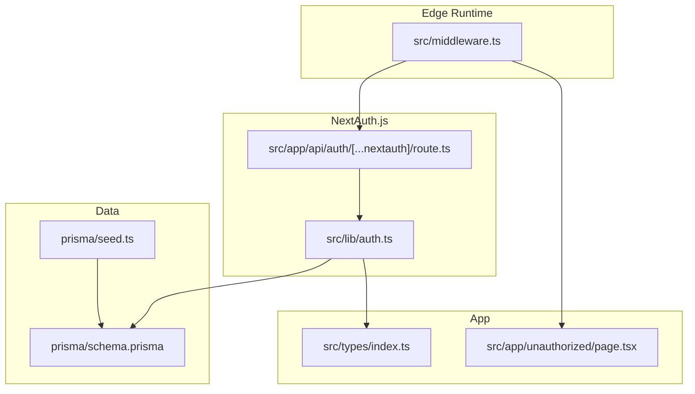
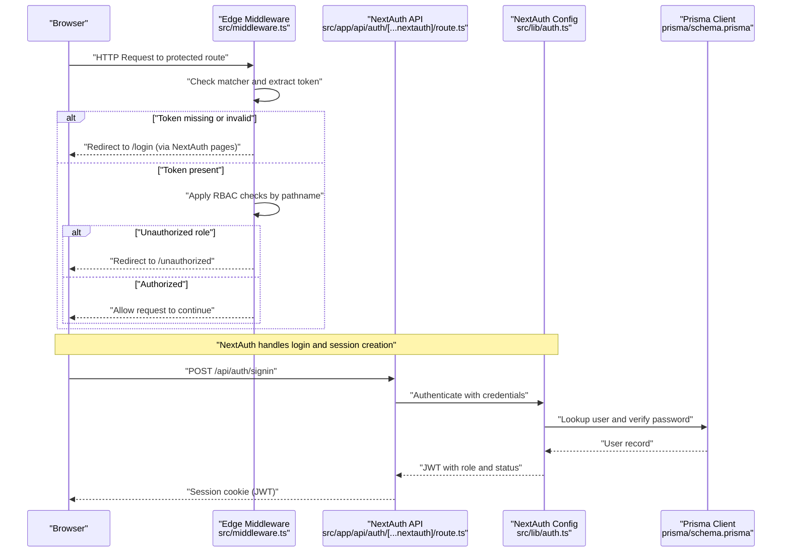
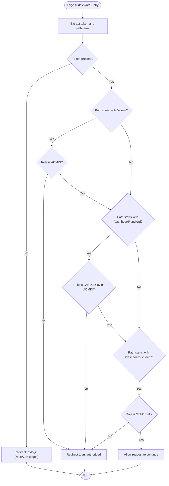
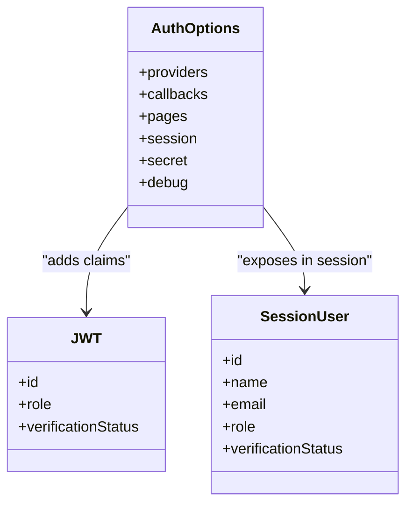
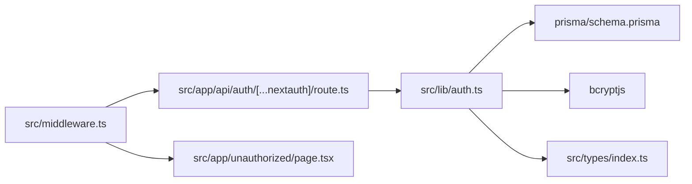

# Middleware & Route Protection

<cite>
**Referenced Files in This Document**
- [src/middleware.ts](file://src/middleware.ts)
- [src/lib/auth.ts](file://src/lib/auth.ts)
- [src/app/api/auth/[...nextauth]/route.ts](file://src/app/api/auth/[...nextauth]/route.ts)
- [src/app/unauthorized/page.tsx](file://src/app/unauthorized/page.tsx)
- [src/types/index.ts](file://src/types/index.ts)
- [prisma/schema.prisma](file://prisma/schema.prisma)
- [prisma/seed.ts](file://prisma/seed.ts)
- [package.json](file://package.json)
- [next.config.mjs](file://next.config.mjs)
</cite>

## Table of Contents
1. [Introduction](#introduction)
2. [Project Structure](#project-structure)
3. [Core Components](#core-components)
4. [Architecture Overview](#architecture-overview)
5. [Detailed Component Analysis](#detailed-component-analysis)
6. [Dependency Analysis](#dependency-analysis)
7. [Performance Considerations](#performance-considerations)
8. [Troubleshooting Guide](#troubleshooting-guide)
9. [Conclusion](#conclusion)

## Introduction
This document explains the middleware and route protection system in RentalHub-BOUESTI. It covers the edge runtime middleware configuration, authentication enforcement via NextAuth.js, role-based access control (RBAC), route matching patterns, and unauthorized access handling. It also details middleware execution order, performance characteristics in the edge runtime, integration with NextAuth.js session management, examples of protected route patterns, custom authorization logic, and debugging techniques.

## Project Structure
The middleware and authentication stack spans a small set of focused files:
- Edge middleware that enforces authentication and RBAC
- NextAuth.js configuration and API endpoint
- Unauthorized page for access-denied scenarios
- Shared types for session and role definitions
- Prisma schema and seed for roles and verification status

**Diagram sources**
- [src/middleware.ts:1-48](file://src/middleware.ts#L1-L48)
- [src/lib/auth.ts:1-90](file://src/lib/auth.ts#L1-L90)
- [src/app/api/auth/[...nextauth]/route.ts:1-7](file://src/app/api/auth/[...nextauth]/route.ts#L1-L7)
- [src/app/unauthorized/page.tsx:1-35](file://src/app/unauthorized/page.tsx#L1-L35)
- [src/types/index.ts:73-80](file://src/types/index.ts#L73-L80)
- [prisma/schema.prisma:17-21](file://prisma/schema.prisma#L17-L21)
- [prisma/seed.ts:61-67](file://prisma/seed.ts#L61-L67)

**Section sources**
- [src/middleware.ts:1-48](file://src/middleware.ts#L1-L48)
- [src/lib/auth.ts:14-90](file://src/lib/auth.ts#L14-L90)
- [src/app/api/auth/[...nextauth]/route.ts:1-7](file://src/app/api/auth/[...nextauth]/route.ts#L1-L7)
- [src/app/unauthorized/page.tsx:1-35](file://src/app/unauthorized/page.tsx#L1-L35)
- [src/types/index.ts:73-80](file://src/types/index.ts#L73-L80)
- [prisma/schema.prisma:17-21](file://prisma/schema.prisma#L17-L21)
- [prisma/seed.ts:61-67](file://prisma/seed.ts#L61-L67)

## Core Components
- Edge middleware with NextAuth.js integration:
  - Enforces authentication via a callback that requires a token
  - Applies role-based checks for admin and dashboard routes
  - Redirects unauthorized users to the dedicated unauthorized page
  - Uses a matcher to limit middleware execution to protected paths
- NextAuth.js configuration:
  - Credentials provider with bcrypt and Prisma
  - JWT-based session strategy with custom claims for role and verification status
  - Pages mapping for sign-in, sign-out, and error handling
- Unauthorized page:
  - Dedicated route for access-denied UX with navigation links
- Shared types:
  - Session and JWT augmentations for role and verification status
- Prisma schema and seed:
  - Role enum and verification status used by middleware and auth
  - Seed creates an initial admin user with ADMIN role

Key implementation references:
- Middleware definition and RBAC logic: [src/middleware.ts:11-38](file://src/middleware.ts#L11-L38)
- Middleware matcher configuration: [src/middleware.ts:40-47](file://src/middleware.ts#L40-L47)
- NextAuth.js options and callbacks: [src/lib/auth.ts:14-90](file://src/lib/auth.ts#L14-L90)
- NextAuth API handler: [src/app/api/auth/[...nextauth]/route.ts:1-7](file://src/app/api/auth/[...nextauth]/route.ts#L1-L7)
- Unauthorized page: [src/app/unauthorized/page.tsx:1-35](file://src/app/unauthorized/page.tsx#L1-L35)
- Session/JWT augmentations: [src/types/index.ts:73-116](file://src/types/index.ts#L73-L116)
- Role and verification status enums: [prisma/schema.prisma:17-27](file://prisma/schema.prisma#L17-L27)
- Admin seed data: [prisma/seed.ts:61-67](file://prisma/seed.ts#L61-L67)

**Section sources**
- [src/middleware.ts:11-47](file://src/middleware.ts#L11-L47)
- [src/lib/auth.ts:14-90](file://src/lib/auth.ts#L14-L90)
- [src/app/api/auth/[...nextauth]/route.ts:1-7](file://src/app/api/auth/[...nextauth]/route.ts#L1-L7)
- [src/app/unauthorized/page.tsx:1-35](file://src/app/unauthorized/page.tsx#L1-L35)
- [src/types/index.ts:73-116](file://src/types/index.ts#L73-L116)
- [prisma/schema.prisma:17-27](file://prisma/schema.prisma#L17-L27)
- [prisma/seed.ts:61-67](file://prisma/seed.ts#L61-L67)

## Architecture Overview
The middleware runs in the Next.js edge runtime and intercepts requests to protected routes. It leverages NextAuth.js to validate sessions and enrich the request with a JWT token containing role and verification status. Based on the pathname and token claims, it enforces role-based access and redirects unauthorized users to the unauthorized page.

**Diagram sources**
- [src/middleware.ts:11-38](file://src/middleware.ts#L11-L38)
- [src/app/api/auth/[...nextauth]/route.ts:1-7](file://src/app/api/auth/[...nextauth]/route.ts#L1-L7)
- [src/lib/auth.ts:14-90](file://src/lib/auth.ts#L14-L90)
- [prisma/schema.prisma:44-61](file://prisma/schema.prisma#L44-L61)

## Detailed Component Analysis

### Edge Middleware: Authentication and RBAC
- Purpose:
  - Enforce authentication for protected routes
  - Apply role-based access control for admin and dashboard routes
  - Redirect unauthorized users to the unauthorized page
- Execution model:
  - Runs in the edge runtime for low latency
  - Uses a matcher to limit invocation to specific paths
- Authorization logic:
  - Authentication enforced via a callback requiring a token
  - Admin-only routes: deny unless role is ADMIN
  - Landlord-only routes: deny unless role is LANDLORD or ADMIN
  - Student-only routes: deny unless role is STUDENT
- Redirect behavior:
  - Unauthorized access triggers a redirect to the unauthorized page
- Matcher configuration:
  - Protects dashboard routes, admin routes, new property creation, and booking routes

**Diagram sources**
- [src/middleware.ts:11-38](file://src/middleware.ts#L11-L38)

**Section sources**
- [src/middleware.ts:11-38](file://src/middleware.ts#L11-L38)
- [src/middleware.ts:40-47](file://src/middleware.ts#L40-L47)

### NextAuth.js Integration: Session Management and Claims
- Provider and authorization:
  - Credentials provider validates email/password against Prisma-managed users
  - Password comparison uses bcrypt
  - Suspended accounts are rejected
- Token and session callbacks:
  - JWT callback attaches role and verification status to the token
  - Session callback propagates token claims to the session object
- Pages mapping:
  - Sign-in, sign-out, and error pages mapped to the login route
- Session strategy:
  - JWT-based sessions with configurable max age and update frequency
- Environment:
  - Secret configured via environment variable

**Diagram sources**
- [src/lib/auth.ts:14-90](file://src/lib/auth.ts#L14-L90)
- [src/types/index.ts:73-116](file://src/types/index.ts#L73-L116)

**Section sources**
- [src/lib/auth.ts:14-90](file://src/lib/auth.ts#L14-L90)
- [src/types/index.ts:73-116](file://src/types/index.ts#L73-L116)

### Protected Route Patterns and Matching
- Matcher targets:
  - Dashboard routes: /dashboard/:path*
  - Admin routes: /admin/:path*
  - New property creation: /properties/new
  - Bookings routes: /bookings/:path*
- Effect:
  - Middleware executes only for these paths, minimizing overhead
- Customization:
  - Add or remove entries in the matcher to adjust coverage

**Section sources**
- [src/middleware.ts:40-47](file://src/middleware.ts#L40-L47)

### Unauthorized Access Handling
- Behavior:
  - Unauthorized users are redirected to the unauthorized page
- UX:
  - The unauthorized page displays a clear message and navigation options
- Integration:
  - Middleware performs the redirect; the page provides user-friendly recovery actions

**Section sources**
- [src/middleware.ts:17-29](file://src/middleware.ts#L17-L29)
- [src/app/unauthorized/page.tsx:1-35](file://src/app/unauthorized/page.tsx#L1-L35)

### Role-Based Access Control (RBAC)
- Roles:
  - STUDENT, LANDLORD, ADMIN
- Enforcement:
  - Admin-only: denies access to non-ADMIN users
  - Landlord-only: denies access to non-LANDLORD and non-ADMIN users
  - Student-only: denies access to non-STUDENT users
- Data model:
  - Role and verification status defined in Prisma schema
  - Seed initializes an ADMIN user

**Section sources**
- [prisma/schema.prisma:17-27](file://prisma/schema.prisma#L17-L27)
- [prisma/seed.ts:61-67](file://prisma/seed.ts#L61-L67)
- [src/middleware.ts:17-29](file://src/middleware.ts#L17-L29)

### Middleware Execution Order and Edge Runtime
- Order:
  - Edge middleware runs before page rendering for matched paths
  - Authentication and RBAC checks occur prior to route handlers
- Edge runtime benefits:
  - Low-latency interception
  - Reduced cold start impact for protected routes
- Matcher-driven invocation:
  - Ensures middleware does not run unnecessarily for public routes

**Section sources**
- [src/middleware.ts:40-47](file://src/middleware.ts#L40-L47)

## Dependency Analysis
The middleware depends on NextAuth.js for session validation and token enrichment. The NextAuth configuration depends on Prisma for user lookup and bcrypt for password verification. The unauthorized page is a consumer of the redirect behavior.

**Diagram sources**
- [src/middleware.ts:8-9](file://src/middleware.ts#L8-L9)
- [src/app/api/auth/[...nextauth]/route.ts:1-7](file://src/app/api/auth/[...nextauth]/route.ts#L1-L7)
- [src/lib/auth.ts:8-11](file://src/lib/auth.ts#L8-L11)
- [prisma/schema.prisma:44-61](file://prisma/schema.prisma#L44-L61)
- [src/app/unauthorized/page.tsx:1-35](file://src/app/unauthorized/page.tsx#L1-L35)
- [src/types/index.ts:73-116](file://src/types/index.ts#L73-L116)

**Section sources**
- [src/middleware.ts:8-9](file://src/middleware.ts#L8-L9)
- [src/app/api/auth/[...nextauth]/route.ts:1-7](file://src/app/api/auth/[...nextauth]/route.ts#L1-L7)
- [src/lib/auth.ts:8-11](file://src/lib/auth.ts#L8-L11)
- [prisma/schema.prisma:44-61](file://prisma/schema.prisma#L44-L61)
- [src/app/unauthorized/page.tsx:1-35](file://src/app/unauthorized/page.tsx#L1-L35)
- [src/types/index.ts:73-116](file://src/types/index.ts#L73-L116)

## Performance Considerations
- Edge runtime:
  - Middleware executes close to the edge for minimal latency
  - Matcher reduces unnecessary invocations
- Session strategy:
  - JWT-based sessions avoid per-request database lookups
  - Max age and update window balance freshness and performance
- Token usage:
  - Role and verification status are available in-memory from the token/session
- Recommendations:
  - Keep matcher narrow to protected paths
  - Avoid heavy synchronous work in middleware
  - Use caching for static assets and leverage Next.js optimizations

[No sources needed since this section provides general guidance]

## Troubleshooting Guide
- Symptoms:
  - Users redirected to login despite being signed in
  - Users redirected to unauthorized despite correct role
  - Unexpected 401 or infinite redirect loops
- Checks:
  - Verify matcher includes the target route
  - Confirm NextAuth secret is set and consistent
  - Ensure user role and verification status are correct in the database
  - Validate that the unauthorized page is reachable
- Debugging steps:
  - Enable NextAuth debug mode in development
  - Inspect browser cookies for the session JWT
  - Log token presence and role in middleware
  - Confirm Prisma user record and bcrypt hash correctness
- Related references:
  - NextAuth debug flag: [src/lib/auth.ts:89](file://src/lib/auth.ts#L89)
  - Matcher configuration: [src/middleware.ts:40-47](file://src/middleware.ts#L40-L47)
  - Unauthorized redirect logic: [src/middleware.ts:17-29](file://src/middleware.ts#L17-L29)
  - Unauthorized page: [src/app/unauthorized/page.tsx:1-35](file://src/app/unauthorized/page.tsx#L1-L35)

**Section sources**
- [src/lib/auth.ts:89](file://src/lib/auth.ts#L89)
- [src/middleware.ts:40-47](file://src/middleware.ts#L40-L47)
- [src/middleware.ts:17-29](file://src/middleware.ts#L17-L29)
- [src/app/unauthorized/page.tsx:1-35](file://src/app/unauthorized/page.tsx#L1-L35)

## Conclusion
RentalHub-BOUESTI’s middleware and authentication system combines Next.js edge runtime middleware with NextAuth.js to enforce authentication and role-based access control. The matcher ensures efficient execution, while the RBAC logic protects admin and dashboard routes. The unauthorized page provides a clear fallback for denied access. Together, these components deliver a robust, performant, and user-friendly protection mechanism.