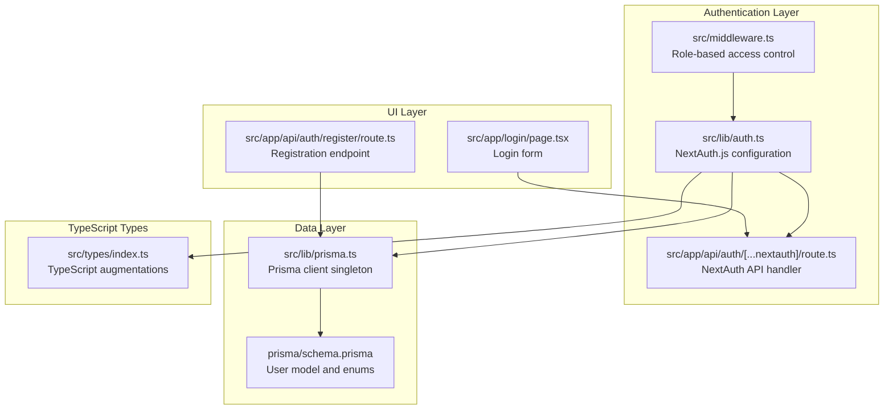
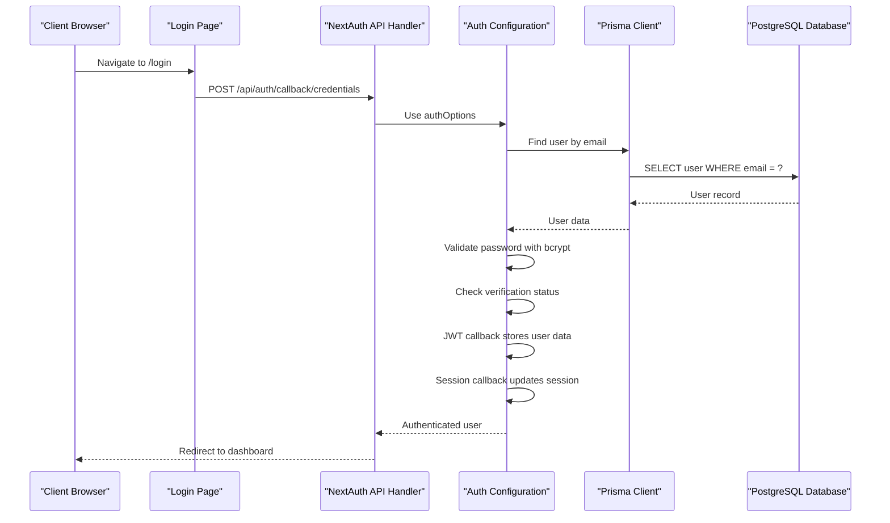
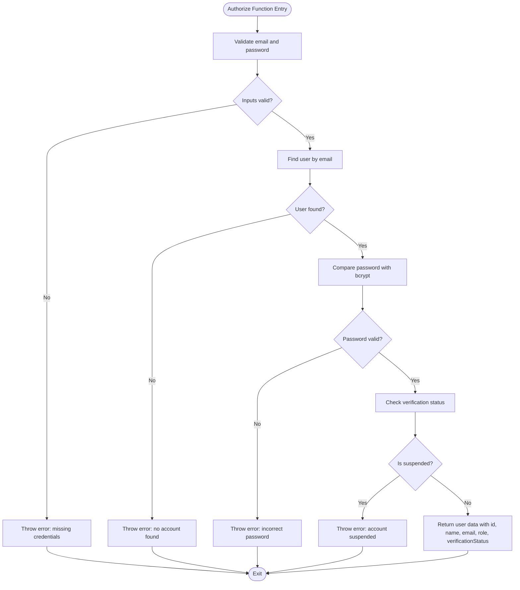
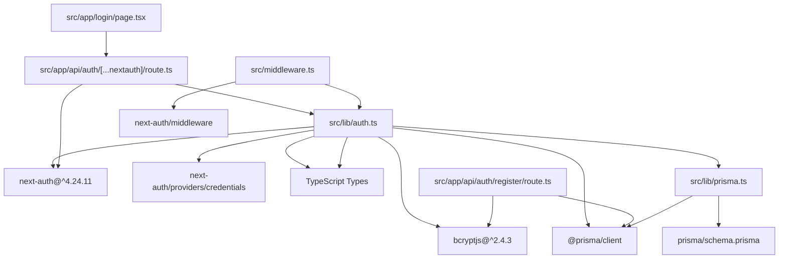

# NextAuth.js Configuration

<cite>
**Referenced Files in This Document**
- [auth.ts](file://src/lib/auth.ts)
- [route.ts](file://src/app/api/auth/[...nextauth]/route.ts)
- [middleware.ts](file://src/middleware.ts)
- [page.tsx](file://src/app/login/page.tsx)
- [route.ts](file://src/app/api/auth/register/route.ts)
- [prisma.ts](file://src/lib/prisma.ts)
- [schema.prisma](file://prisma/schema.prisma)
- [index.ts](file://src/types/index.ts)
- [package.json](file://package.json)
</cite>

## Table of Contents
1. [Introduction](#introduction)
2. [Project Structure](#project-structure)
3. [Core Components](#core-components)
4. [Architecture Overview](#architecture-overview)
5. [Detailed Component Analysis](#detailed-component-analysis)
6. [Dependency Analysis](#dependency-analysis)
7. [Performance Considerations](#performance-considerations)
8. [Troubleshooting Guide](#troubleshooting-guide)
9. [Conclusion](#conclusion)

## Introduction
This document provides comprehensive documentation for the NextAuth.js configuration in RentalHub-BOUESTI. It details the authOptions object setup, including the credentials provider configuration, custom authorize function implementation, and JWT token handling. It also explains the callback functions for JWT and session management, session strategy configuration with 30-day max age and 24-hour update age. The document covers module augmentation for TypeScript integration with User, Session, and JWT interfaces, along with security considerations, debug mode configuration, and environment variable requirements for NEXTAUTH_SECRET.

## Project Structure
The authentication system in RentalHub-BOUESTI is organized around several key files:
- Authentication configuration and providers are defined in a dedicated library file.
- The NextAuth.js API route handler is located under the API routes.
- Middleware enforces role-based access control and redirects unauthenticated users.
- The login page provides the user interface for credential-based authentication.
- Registration is handled via a separate API endpoint.
- Prisma client initialization manages database connections.
- The Prisma schema defines user roles and verification statuses.
- TypeScript types are augmented to integrate with NextAuth.js.



**Diagram sources**
- [auth.ts:14-90](file://src/lib/auth.ts#L14-L90)
- [route.ts:1-7](file://src/app/api/auth/[...nextauth]/route.ts#L1-L7)
- [middleware.ts:11-38](file://src/middleware.ts#L11-L38)
- [page.tsx:51](file://src/app/login/page.tsx#L51)
- [route.ts:20-89](file://src/app/api/auth/register/route.ts#L20-L89)
- [prisma.ts:13-24](file://src/lib/prisma.ts#L13-L24)
- [schema.prisma:44-61](file://prisma/schema.prisma#L44-L61)
- [index.ts:92-116](file://src/types/index.ts#L92-L116)

**Section sources**
- [auth.ts:14-90](file://src/lib/auth.ts#L14-L90)
- [route.ts:1-7](file://src/app/api/auth/[...nextauth]/route.ts#L1-L7)
- [middleware.ts:11-38](file://src/middleware.ts#L11-L38)
- [page.tsx:51](file://src/app/login/page.tsx#L51)
- [route.ts:20-89](file://src/app/api/auth/register/route.ts#L20-L89)
- [prisma.ts:13-24](file://src/lib/prisma.ts#L13-L24)
- [schema.prisma:44-61](file://prisma/schema.prisma#L44-L61)
- [index.ts:92-116](file://src/types/index.ts#L92-L116)

## Core Components
The core authentication components are defined in the NextAuth.js configuration file. This file establishes the credentials provider, implements a custom authorize function, configures JWT callbacks, sets up session strategy, and defines module augmentations for TypeScript.

Key aspects of the configuration:
- Credentials provider with email and password fields
- Custom authorize function performing database lookup, password validation, and account status checks
- JWT callback storing user attributes in the token
- Session callback transferring token data to the session object
- Session strategy set to JWT with 30-day max age and 24-hour update age
- Debug mode enabled in development environments
- Environment variable requirement for NEXTAUTH_SECRET

**Section sources**
- [auth.ts:14-90](file://src/lib/auth.ts#L14-L90)

## Architecture Overview
The authentication architecture integrates NextAuth.js with Prisma for user management and role-based access control through middleware. The system supports credential-based authentication with secure password hashing and comprehensive user data handling.



**Diagram sources**
- [page.tsx:51](file://src/app/login/page.tsx#L51)
- [route.ts:1-7](file://src/app/api/auth/[...nextauth]/route.ts#L1-L7)
- [auth.ts:22-51](file://src/lib/auth.ts#L22-L51)
- [prisma.ts:13-24](file://src/lib/prisma.ts#L13-L24)
- [schema.prisma:44-61](file://prisma/schema.prisma#L44-L61)

## Detailed Component Analysis

### NextAuth.js Configuration Object
The authOptions object defines the complete authentication setup for the application. It includes provider configuration, callback functions, session management, and security settings.

```mermaid
classDiagram
class AuthOptions {
+providers : Provider[]
+callbacks : CallbacksOptions
+pages : PagesOptions
+session : SessionOptions
+secret : string
+debug : boolean
}
class CredentialsProvider {
+name : string
+credentials : CredentialsFields
+authorize(credentials) : Promise<User | null>
}
class CallbacksOptions {
+jwt({token, user}) : Promise<JWT>
+session({session, token}) : Promise<Session>
}
class SessionOptions {
+strategy : "jwt"
+maxAge : number
+updateAge : number
}
AuthOptions --> CredentialsProvider : "uses"
AuthOptions --> CallbacksOptions : "uses"
AuthOptions --> SessionOptions : "uses"
```

**Diagram sources**
- [auth.ts:14-90](file://src/lib/auth.ts#L14-L90)

**Section sources**
- [auth.ts:14-90](file://src/lib/auth.ts#L14-L90)

### Credentials Provider Configuration
The credentials provider is configured with email and password fields. The provider name is set to "credentials" and the authorize function handles the authentication logic.

Key configuration elements:
- Provider name: "credentials"
- Credential fields: email (type: email) and password (type: password)
- Authorization logic validates input, performs database lookup, compares passwords, and checks account status

**Section sources**
- [auth.ts:15-53](file://src/lib/auth.ts#L15-L53)

### Custom Authorize Function Implementation
The authorize function implements comprehensive authentication logic:
- Validates that both email and password are provided
- Performs database lookup for the user account
- Compares provided password with stored hash using bcrypt
- Checks verification status for account suspension
- Returns user data with id, name, email, role, and verification status



**Diagram sources**
- [auth.ts:22-51](file://src/lib/auth.ts#L22-L51)

**Section sources**
- [auth.ts:22-51](file://src/lib/auth.ts#L22-L51)

### JWT Token Handling
The JWT callback function manages token storage and retrieval:
- On initial login, stores user id, role, and verification status in the token
- Returns the token for subsequent requests
- Ensures token contains all necessary user information for session management

**Section sources**
- [auth.ts:55-63](file://src/lib/auth.ts#L55-L63)

### Session Management Callbacks
The session callback function transfers token data to the session object:
- Updates session.user with id, role, and verification status
- Ensures session data is consistent with token data
- Provides type-safe access to user information throughout the application

**Section sources**
- [auth.ts:65-72](file://src/lib/auth.ts#L65-L72)

### Session Strategy Configuration
The session strategy is configured as follows:
- Strategy: "jwt" (JSON Web Token)
- Max age: 30 days (2,592,000 seconds)
- Update age: 24 hours (86,400 seconds)

This configuration balances security with user experience by providing long-term authentication while requiring periodic revalidation.

**Section sources**
- [auth.ts:81-85](file://src/lib/auth.ts#L81-L85)

### TypeScript Module Augmentation
The TypeScript configuration includes module augmentations for type safety:
- User interface augmentation adds id, role, and verificationStatus properties
- Session interface augmentation extends user object with additional properties
- JWT interface augmentation ensures type safety for token data

These augmentations enable IntelliSense support and compile-time type checking throughout the application.

**Section sources**
- [auth.ts:92-116](file://src/lib/auth.ts#L92-L116)

### Middleware Integration
The middleware enforces role-based access control:
- Protects routes under /dashboard, /admin, and specific endpoints
- Redirects unauthenticated users to /login
- Implements role-specific restrictions for admin, landlord, and student dashboards
- Uses token-based authorization for route protection

**Section sources**
- [middleware.ts:11-38](file://src/middleware.ts#L11-L38)

### Login Form Integration
The login page provides the user interface for credential-based authentication:
- Form submits to /api/auth/callback/credentials
- Includes email and password input fields
- Provides navigation to registration page
- Styled with gradient backgrounds and glass-morphism effects

**Section sources**
- [page.tsx:51](file://src/app/login/page.tsx#L51)

### Registration Endpoint
The registration endpoint handles new user creation:
- Supports STUDENT and LANDLORD roles
- Validates input requirements and password length
- Hashes passwords using bcrypt with 12 rounds
- Creates user records with UNVERIFIED status
- Returns success response with user data

**Section sources**
- [route.ts:20-89](file://src/app/api/auth/register/route.ts#L20-L89)

## Dependency Analysis
The authentication system has the following dependencies and relationships:



**Diagram sources**
- [auth.ts:8-12](file://src/lib/auth.ts#L8-L12)
- [route.ts:1-2](file://src/app/api/auth/[...nextauth]/route.ts#L1-L2)
- [middleware.ts:8](file://src/middleware.ts#L8)
- [page.tsx:51](file://src/app/login/page.tsx#L51)
- [route.ts:8-11](file://src/app/api/auth/register/route.ts#L8-L11)
- [prisma.ts:9](file://src/lib/prisma.ts#L9)
- [schema.prisma:10-13](file://prisma/schema.prisma#L10-L13)
- [package.json:19-26](file://package.json#L19-L26)

**Section sources**
- [auth.ts:8-12](file://src/lib/auth.ts#L8-L12)
- [route.ts:1-2](file://src/app/api/auth/[...nextauth]/route.ts#L1-L2)
- [middleware.ts:8](file://src/middleware.ts#L8)
- [page.tsx:51](file://src/app/login/page.tsx#L51)
- [route.ts:8-11](file://src/app/api/auth/register/route.ts#L8-L11)
- [prisma.ts:9](file://src/lib/prisma.ts#L9)
- [schema.prisma:10-13](file://prisma/schema.prisma#L10-L13)
- [package.json:19-26](file://package.json#L19-L26)

## Performance Considerations
The authentication system incorporates several performance optimizations:
- Prisma client singleton pattern prevents connection pool exhaustion during development
- Bcrypt hashing uses 12 rounds for balanced security and performance
- JWT strategy reduces database queries for authenticated requests
- Middleware caching avoids repeated token validation
- Environment-specific logging minimizes overhead in production

## Troubleshooting Guide
Common authentication issues and solutions:

### Authentication Failures
- Verify NEXTAUTH_SECRET environment variable is set in development
- Check database connectivity and user account existence
- Ensure bcrypt is properly installed and configured
- Confirm credentials provider is correctly configured

### Session Issues
- Verify JWT callback is properly transferring user data
- Check session strategy configuration for appropriate maxAge and updateAge values
- Ensure middleware is correctly accessing token data
- Validate TypeScript augmentations are properly defined

### Security Considerations
- Never log sensitive authentication data
- Use HTTPS in production environments
- Regularly rotate NEXTAUTH_SECRET
- Implement rate limiting for authentication attempts
- Monitor failed authentication attempts
- Use strong password policies and hashing

**Section sources**
- [auth.ts:87-89](file://src/lib/auth.ts#L87-L89)
- [auth.ts:92-116](file://src/lib/auth.ts#L92-L116)
- [prisma.ts:13-24](file://src/lib/prisma.ts#L13-L24)

## Conclusion
The NextAuth.js configuration in RentalHub-BOUESTI provides a robust, secure, and scalable authentication system. The implementation leverages JWT tokens for stateless authentication, comprehensive role-based access control through middleware, and TypeScript integration for type safety. The system balances security with user experience through appropriate session management and includes proper error handling and debugging capabilities. The modular architecture allows for easy maintenance and future enhancements while maintaining clean separation of concerns across the authentication pipeline.