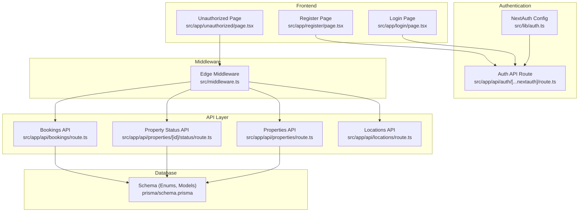
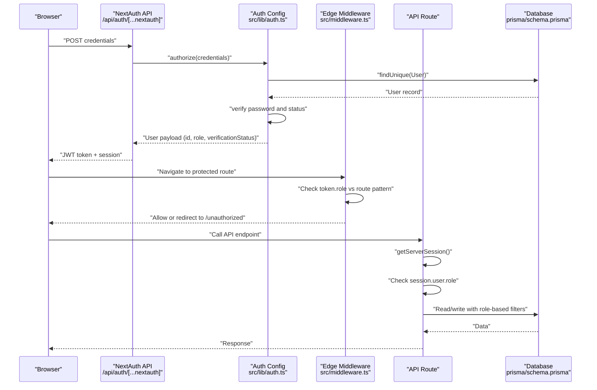
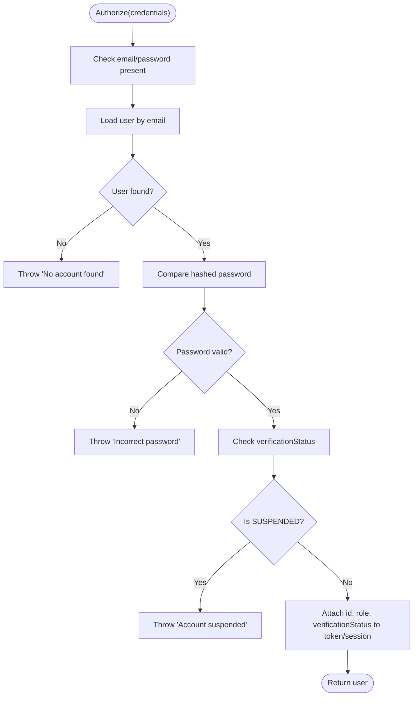
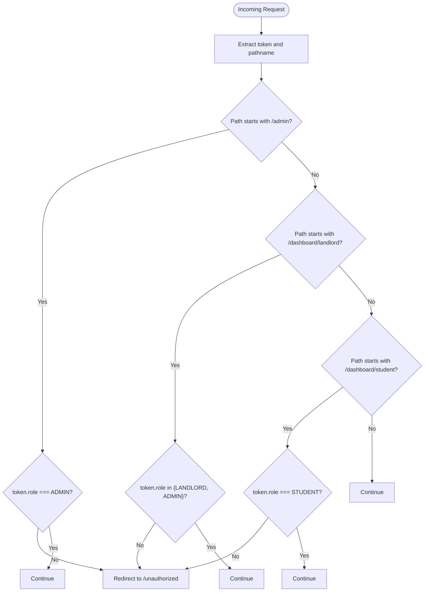
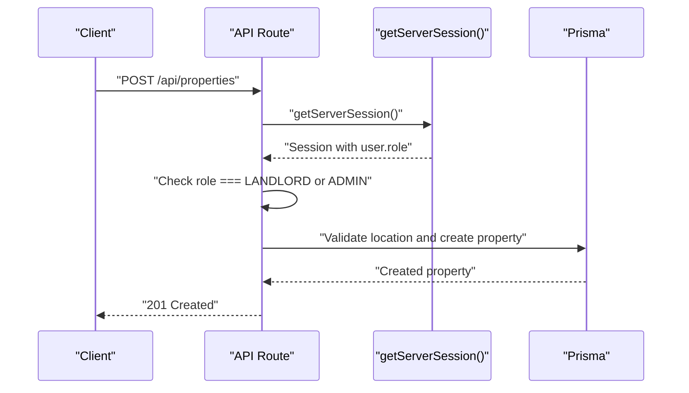
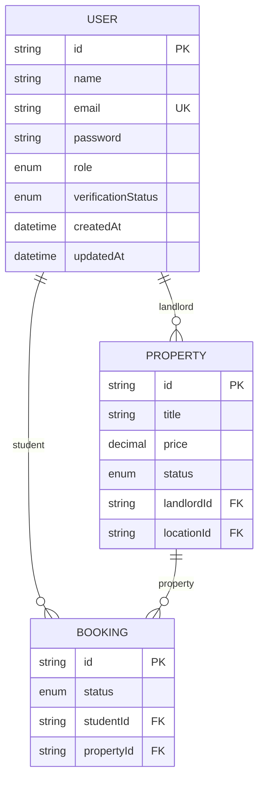
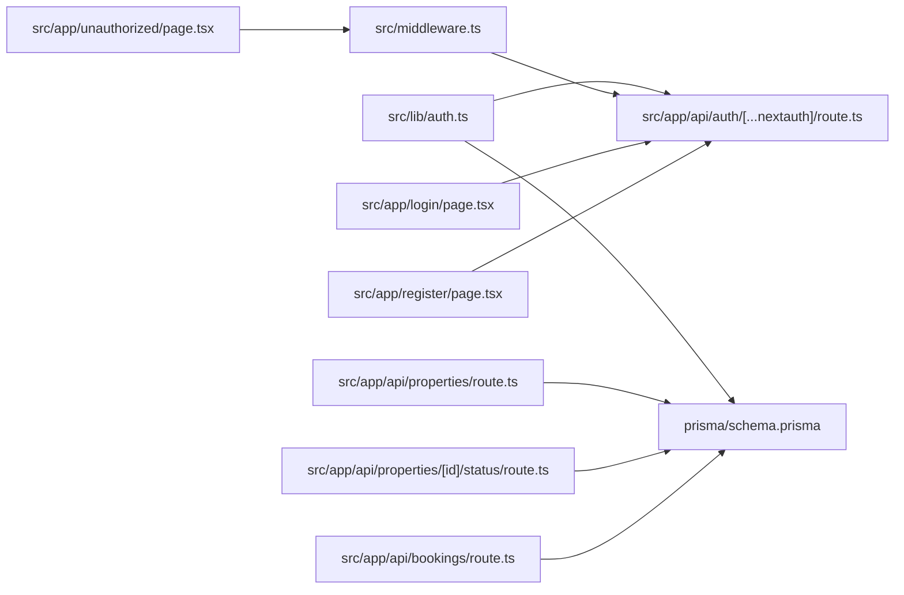

# Role-Based Access Control (RBAC)

<cite>
**Referenced Files in This Document**
- [src/lib/auth.ts](file://src/lib/auth.ts)
- [src/app/api/auth/[...nextauth]/route.ts](file://src/app/api/auth/[...nextauth]/route.ts)
- [src/middleware.ts](file://src/middleware.ts)
- [prisma/schema.prisma](file://prisma/schema.prisma)
- [src/app/api/properties/route.ts](file://src/app/api/properties/route.ts)
- [src/app/api/properties/[id]/status/route.ts](file://src/app/api/properties/[id]/status/route.ts)
- [src/app/api/bookings/route.ts](file://src/app/api/bookings/route.ts)
- [src/app/api/locations/route.ts](file://src/app/api/locations/route.ts)
- [src/app/login/page.tsx](file://src/app/login/page.tsx)
- [src/app/register/page.tsx](file://src/app/register/page.tsx)
- [src/app/unauthorized/page.tsx](file://src/app/unauthorized/page.tsx)
- [src/types/index.ts](file://src/types/index.ts)
- [src/lib/utils.ts](file://src/lib/utils.ts)
- [src/lib/prisma.ts](file://src/lib/prisma.ts)
</cite>

## Table of Contents
1. [Introduction](#introduction)
2. [Project Structure](#project-structure)
3. [Core Components](#core-components)
4. [Architecture Overview](#architecture-overview)
5. [Detailed Component Analysis](#detailed-component-analysis)
6. [Dependency Analysis](#dependency-analysis)
7. [Performance Considerations](#performance-considerations)
8. [Troubleshooting Guide](#troubleshooting-guide)
9. [Conclusion](#conclusion)

## Introduction
This document describes the Role-Based Access Control (RBAC) system in RentalHub-BOUESTI. It explains how three user roles (STUDENT, LANDLORD, ADMIN) are defined in the database, propagated via JWT tokens, and enforced in middleware and API routes. It also documents the verification status system (UNVERIFIED, VERIFIED, SUSPENDED) and its impact on access, along with practical examples of role-based conditional rendering, route protection logic, and permission-checking patterns. Finally, it covers the integration between authentication callbacks, session management, and authorization enforcement across the application.

## Project Structure
The RBAC implementation spans several layers:
- Authentication configuration and session propagation via NextAuth.js
- Edge middleware for route-level protection
- API routes enforcing role-based permissions
- Database schema defining roles and verification statuses
- Frontend pages for login, registration, and unauthorized access

**Diagram sources**
- [src/lib/auth.ts:14-90](file://src/lib/auth.ts#L14-L90)
- [src/app/api/auth/[...nextauth]/route.ts:1-7](file://src/app/api/auth/[...nextauth]/route.ts#L1-L7)
- [src/middleware.ts:11-38](file://src/middleware.ts#L11-L38)
- [src/app/api/properties/route.ts:68-78](file://src/app/api/properties/route.ts#L68-L78)
- [src/app/api/properties/[id]/status/route.ts:25-27](file://src/app/api/properties/[id]/status/route.ts#L25-L27)
- [src/app/api/bookings/route.ts:55-57](file://src/app/api/bookings/route.ts#L55-L57)
- [prisma/schema.prisma:17-27](file://prisma/schema.prisma#L17-L27)
- [src/app/login/page.tsx:51](file://src/app/login/page.tsx#L51)
- [src/app/register/page.tsx:50](file://src/app/register/page.tsx#L50)
- [src/app/unauthorized/page.tsx:1-35](file://src/app/unauthorized/page.tsx#L1-L35)

**Section sources**
- [src/lib/auth.ts:14-90](file://src/lib/auth.ts#L14-L90)
- [src/middleware.ts:11-38](file://src/middleware.ts#L11-L38)
- [prisma/schema.prisma:17-27](file://prisma/schema.prisma#L17-L27)

## Core Components
- Roles and verification status are defined as enums in the Prisma schema and persisted in the User model.
- NextAuth.js handles authentication, stores role and verification status in the JWT token, and exposes them in the session.
- Edge middleware enforces route-level access based on the token’s role.
- API routes enforce role-based permissions and additional business rules (e.g., property status, booking availability).
- Frontend pages integrate with the auth flow and present an unauthorized page when access is denied.

Key implementation references:
- Role and verification status enums: [prisma/schema.prisma:17-27](file://prisma/schema.prisma#L17-L27)
- JWT/session propagation: [src/lib/auth.ts:55-72](file://src/lib/auth.ts#L55-L72)
- Middleware route guards: [src/middleware.ts:16-29](file://src/middleware.ts#L16-L29)
- API route permissions:
  - Properties creation: [src/app/api/properties/route.ts:76-78](file://src/app/api/properties/route.ts#L76-L78)
  - Property status updates: [src/app/api/properties/[id]/status/route.ts:25-27](file://src/app/api/properties/[id]/status/route.ts#L25-L27)
  - Bookings creation: [src/app/api/bookings/route.ts:55-57](file://src/app/api/bookings/route.ts#L55-L57)

**Section sources**
- [prisma/schema.prisma:17-27](file://prisma/schema.prisma#L17-L27)
- [src/lib/auth.ts:55-72](file://src/lib/auth.ts#L55-L72)
- [src/middleware.ts:16-29](file://src/middleware.ts#L16-L29)
- [src/app/api/properties/route.ts:76-78](file://src/app/api/properties/route.ts#L76-L78)
- [src/app/api/properties/[id]/status/route.ts:25-27](file://src/app/api/properties/[id]/status/route.ts#L25-L27)
- [src/app/api/bookings/route.ts:55-57](file://src/app/api/bookings/route.ts#L55-L57)

## Architecture Overview
The RBAC pipeline integrates authentication, session propagation, middleware enforcement, and API-level checks.

**Diagram sources**
- [src/app/api/auth/[...nextauth]/route.ts:1-7](file://src/app/api/auth/[...nextauth]/route.ts#L1-L7)
- [src/lib/auth.ts:22-51](file://src/lib/auth.ts#L22-L51)
- [src/middleware.ts:11-38](file://src/middleware.ts#L11-L38)
- [src/app/api/properties/route.ts:68-78](file://src/app/api/properties/route.ts#L68-L78)
- [prisma/schema.prisma:44-61](file://prisma/schema.prisma#L44-L61)

## Detailed Component Analysis

### Authentication and Session Propagation
- The authentication provider validates credentials, checks verification status, and attaches role and verification status to the JWT token and session.
- The session strategy uses JWT with a max age and update age for refresh behavior.
- The module augments NextAuth types to include role and verification status for type safety.

Key references:
- Authorization callback and JWT/session callbacks: [src/lib/auth.ts:22-72](file://src/lib/auth.ts#L22-L72)
- Session strategy and secret: [src/lib/auth.ts:81-89](file://src/lib/auth.ts#L81-L89)
- Type augmentation for User, Session, and JWT: [src/lib/auth.ts:93-116](file://src/lib/auth.ts#L93-L116)

**Diagram sources**
- [src/lib/auth.ts:22-51](file://src/lib/auth.ts#L22-L51)

**Section sources**
- [src/lib/auth.ts:22-72](file://src/lib/auth.ts#L22-L72)
- [src/lib/auth.ts:81-89](file://src/lib/auth.ts#L81-L89)
- [src/lib/auth.ts:93-116](file://src/lib/auth.ts#L93-L116)

### Middleware Route Protection
- The middleware enforces role-based access for:
  - Admin-only routes under /admin
  - Landlord-only routes under /dashboard/landlord
  - Student-only routes under /dashboard/student
- It redirects unqualified users to the unauthorized page.
- It also matches additional protected endpoints such as property creation and bookings.

Key references:
- Route guards and redirection: [src/middleware.ts:16-29](file://src/middleware.ts#L16-L29)
- Matcher configuration: [src/middleware.ts:40-47](file://src/middleware.ts#L40-L47)

**Diagram sources**
- [src/middleware.ts:16-29](file://src/middleware.ts#L16-L29)

**Section sources**
- [src/middleware.ts:16-29](file://src/middleware.ts#L16-L29)
- [src/middleware.ts:40-47](file://src/middleware.ts#L40-L47)

### API-Level Permissions and Business Rules
- Properties API:
  - Creation requires an authenticated session and either LANDLORD or ADMIN role.
  - Validation ensures required fields and location existence.
- Property status API:
  - Only ADMIN can update status to APPROVED, REJECTED, or PENDING.
- Bookings API:
  - Only STUDENT can create bookings.
  - Property must be APPROVED and no active duplicate booking exists.
- Locations API:
  - Public listing of locations for selection in forms.

Key references:
- Properties creation guard: [src/app/api/properties/route.ts:76-78](file://src/app/api/properties/route.ts#L76-L78)
- Property status guard: [src/app/api/properties/[id]/status/route.ts:25-27](file://src/app/api/properties/[id]/status/route.ts#L25-L27)
- Bookings creation guard: [src/app/api/bookings/route.ts:55-57](file://src/app/api/bookings/route.ts#L55-L57)
- Locations public access: [src/app/api/locations/route.ts:11-28](file://src/app/api/locations/route.ts#L11-L28)

**Diagram sources**
- [src/app/api/properties/route.ts:68-118](file://src/app/api/properties/route.ts#L68-L118)

**Section sources**
- [src/app/api/properties/route.ts:68-118](file://src/app/api/properties/route.ts#L68-L118)
- [src/app/api/properties/[id]/status/route.ts:17-51](file://src/app/api/properties/[id]/status/route.ts#L17-L51)
- [src/app/api/bookings/route.ts:47-108](file://src/app/api/bookings/route.ts#L47-L108)
- [src/app/api/locations/route.ts:11-28](file://src/app/api/locations/route.ts#L11-L28)

### Database Model and Enums
- The User model includes role and verificationStatus fields with defaults.
- Enums define the set of valid roles and verification states.
- Indexes exist on email and role for efficient lookups.

Key references:
- User model and defaults: [prisma/schema.prisma:44-61](file://prisma/schema.prisma#L44-L61)
- Role and verification status enums: [prisma/schema.prisma:17-27](file://prisma/schema.prisma#L17-L27)

**Diagram sources**
- [prisma/schema.prisma:44-61](file://prisma/schema.prisma#L44-L61)
- [prisma/schema.prisma:80-108](file://prisma/schema.prisma#L80-L108)
- [prisma/schema.prisma:111-129](file://prisma/schema.prisma#L111-L129)

**Section sources**
- [prisma/schema.prisma:44-61](file://prisma/schema.prisma#L44-L61)
- [prisma/schema.prisma:17-27](file://prisma/schema.prisma#L17-L27)

### Frontend Integration and Unauthorized Handling
- Login and registration pages submit to NextAuth endpoints and render role options during registration.
- The unauthorized page is shown when middleware denies access.

Key references:
- Login form target: [src/app/login/page.tsx:51](file://src/app/login/page.tsx#L51)
- Registration role selector: [src/app/register/page.tsx:54-75](file://src/app/register/page.tsx#L54-L75)
- Unauthorized page: [src/app/unauthorized/page.tsx:1-35](file://src/app/unauthorized/page.tsx#L1-L35)

**Section sources**
- [src/app/login/page.tsx:51](file://src/app/login/page.tsx#L51)
- [src/app/register/page.tsx:54-75](file://src/app/register/page.tsx#L54-L75)
- [src/app/unauthorized/page.tsx:1-35](file://src/app/unauthorized/page.tsx#L1-L35)

## Dependency Analysis
- Authentication depends on Prisma for user lookup and bcrypt for password comparison.
- Middleware depends on NextAuth token presence and role.
- API routes depend on getServerSession() and Prisma for data access.
- Frontend pages depend on NextAuth endpoints and rely on middleware for protection.

**Diagram sources**
- [src/lib/auth.ts:10-11](file://src/lib/auth.ts#L10-L11)
- [src/app/api/auth/[...nextauth]/route.ts:1-7](file://src/app/api/auth/[...nextauth]/route.ts#L1-L7)
- [src/middleware.ts:11-38](file://src/middleware.ts#L11-L38)
- [src/app/api/properties/route.ts:68-118](file://src/app/api/properties/route.ts#L68-L118)
- [src/app/api/properties/[id]/status/route.ts:17-51](file://src/app/api/properties/[id]/status/route.ts#L17-L51)
- [src/app/api/bookings/route.ts:47-108](file://src/app/api/bookings/route.ts#L47-L108)
- [src/app/login/page.tsx:51](file://src/app/login/page.tsx#L51)
- [src/app/register/page.tsx:50](file://src/app/register/page.tsx#L50)
- [src/app/unauthorized/page.tsx:1-35](file://src/app/unauthorized/page.tsx#L1-L35)

**Section sources**
- [src/lib/auth.ts:10-11](file://src/lib/auth.ts#L10-L11)
- [src/app/api/auth/[...nextauth]/route.ts:1-7](file://src/app/api/auth/[...nextauth]/route.ts#L1-L7)
- [src/middleware.ts:11-38](file://src/middleware.ts#L11-L38)
- [src/app/api/properties/route.ts:68-118](file://src/app/api/properties/route.ts#L68-L118)
- [src/app/api/properties/[id]/status/route.ts:17-51](file://src/app/api/properties/[id]/status/route.ts#L17-L51)
- [src/app/api/bookings/route.ts:47-108](file://src/app/api/bookings/route.ts#L47-L108)
- [src/app/login/page.tsx:51](file://src/app/login/page.tsx#L51)
- [src/app/register/page.tsx:50](file://src/app/register/page.tsx#L50)
- [src/app/unauthorized/page.tsx:1-35](file://src/app/unauthorized/page.tsx#L1-L35)

## Performance Considerations
- JWT strategy avoids frequent database reads for session validation; however, sensitive checks still require server-side session retrieval and database queries.
- Middleware matcher targets only authenticated routes to minimize overhead.
- API routes use targeted Prisma queries with appropriate includes and filters to reduce payload sizes.

[No sources needed since this section provides general guidance]

## Troubleshooting Guide
Common issues and resolutions:
- Authentication fails due to missing or invalid credentials:
  - Ensure email and password are provided and correct.
  - Verify the user exists and the password hash matches.
  - Check that verification status is not SUSPENDED.
  - References: [src/lib/auth.ts:22-51](file://src/lib/auth.ts#L22-L51)
- Access denied errors:
  - Middleware redirects unqualified users to the unauthorized page.
  - Confirm the route belongs to the expected role pattern.
  - References: [src/middleware.ts:16-29](file://src/middleware.ts#L16-L29), [src/app/unauthorized/page.tsx:1-35](file://src/app/unauthorized/page.tsx#L1-L35)
- API permission errors:
  - Properties creation requires LANDLORD or ADMIN role.
  - Property status updates require ADMIN role.
  - Bookings require STUDENT role and approved property.
  - References: [src/app/api/properties/route.ts:76-78](file://src/app/api/properties/route.ts#L76-L78), [src/app/api/properties/[id]/status/route.ts:25-27](file://src/app/api/properties/[id]/status/route.ts#L25-L27), [src/app/api/bookings/route.ts:55-57](file://src/app/api/bookings/route.ts#L55-L57)
- Session type mismatches:
  - Ensure module augmentation is applied for User, Session, and JWT types.
  - References: [src/lib/auth.ts:93-116](file://src/lib/auth.ts#L93-L116)

**Section sources**
- [src/lib/auth.ts:22-51](file://src/lib/auth.ts#L22-L51)
- [src/middleware.ts:16-29](file://src/middleware.ts#L16-L29)
- [src/app/unauthorized/page.tsx:1-35](file://src/app/unauthorized/page.tsx#L1-L35)
- [src/app/api/properties/route.ts:76-78](file://src/app/api/properties/route.ts#L76-L78)
- [src/app/api/properties/[id]/status/route.ts:25-27](file://src/app/api/properties/[id]/status/route.ts#L25-L27)
- [src/app/api/bookings/route.ts:55-57](file://src/app/api/bookings/route.ts#L55-L57)
- [src/lib/auth.ts:93-116](file://src/lib/auth.ts#L93-L116)

## Conclusion
RentalHub-BOUESTI implements a robust RBAC system centered on:
- Role and verification status defined in the Prisma schema
- JWT propagation of role and verification status via NextAuth
- Edge middleware enforcing route-level access
- API routes applying role-based permissions and business rules
- Frontend pages integrating with the auth flow and unauthorized handling

This layered approach ensures secure, predictable access control across the application.