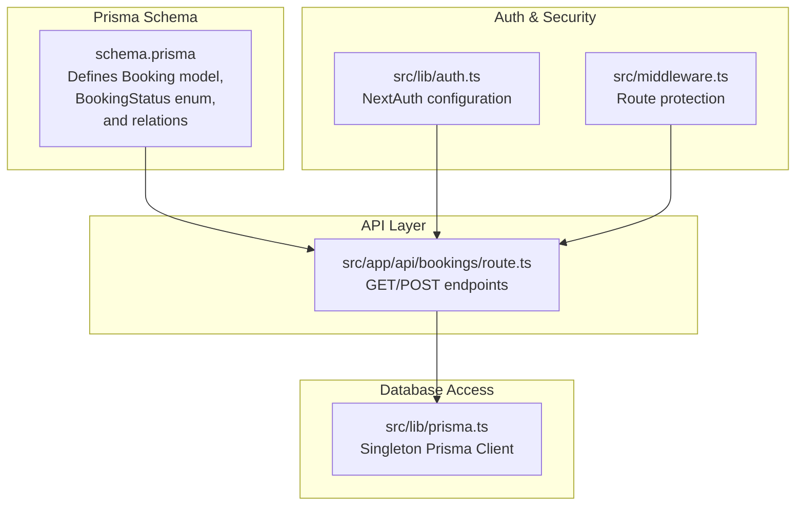
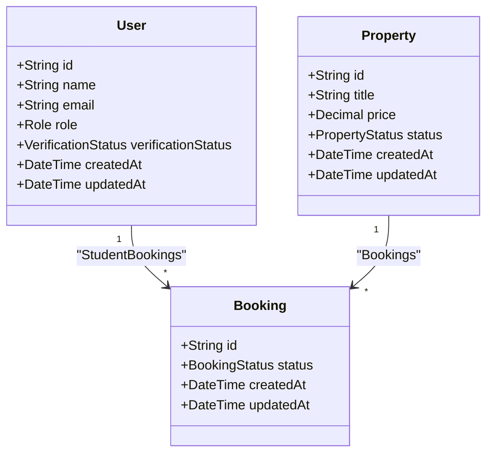
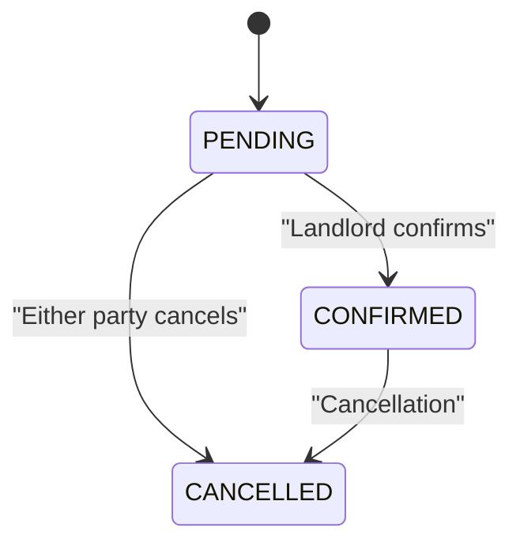
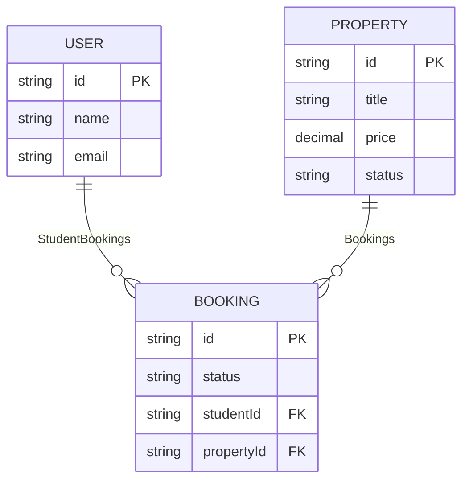
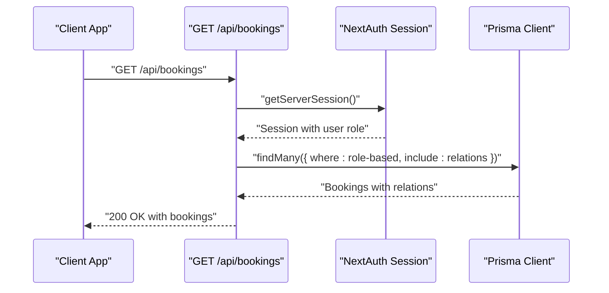
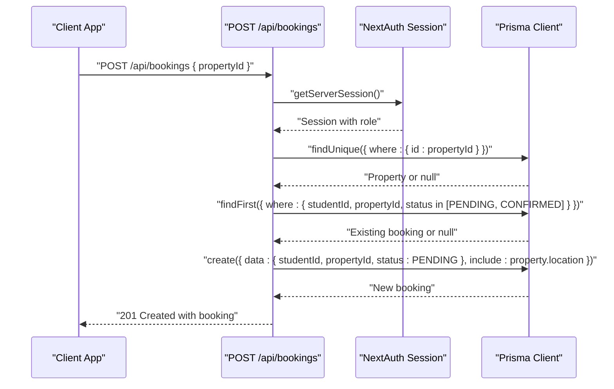
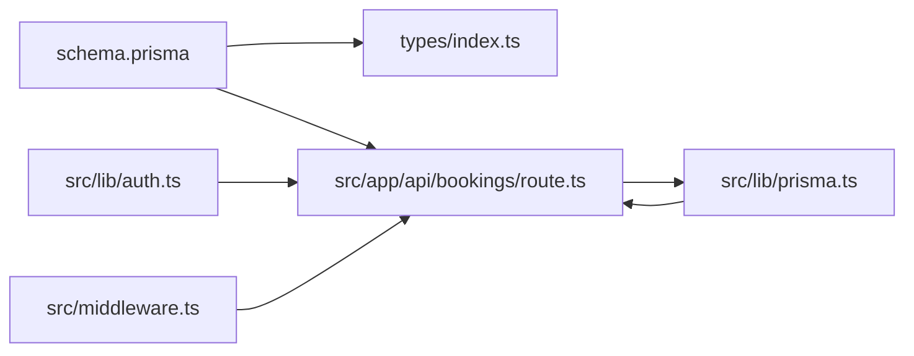

# Booking Entity

<cite>
**Referenced Files in This Document**
- [schema.prisma](file://prisma/schema.prisma)
- [route.ts](file://src/app/api/bookings/route.ts)
- [prisma.ts](file://src/lib/prisma.ts)
- [auth.ts](file://src/lib/auth.ts)
- [middleware.ts](file://src/middleware.ts)
- [index.ts](file://src/types/index.ts)
</cite>

## Table of Contents
1. [Introduction](#introduction)
2. [Project Structure](#project-structure)
3. [Core Components](#core-components)
4. [Architecture Overview](#architecture-overview)
5. [Detailed Component Analysis](#detailed-component-analysis)
6. [Dependency Analysis](#dependency-analysis)
7. [Performance Considerations](#performance-considerations)
8. [Troubleshooting Guide](#troubleshooting-guide)
9. [Conclusion](#conclusion)

## Introduction
This document provides comprehensive documentation for the Booking entity in RentalHub-BOUESTI. It explains the model structure, relationships with User (student) and Property entities, the BookingStatus enum lifecycle, field constraints, indexing strategies, and practical examples of creating bookings and managing relationships.

## Project Structure
The Booking entity is defined in the Prisma schema and exposed via a dedicated API route. Authentication and authorization are handled by NextAuth.js, while the Prisma client is configured as a singleton for efficient database access.

**Diagram sources**
- [schema.prisma:110-129](file://prisma/schema.prisma#L110-L129)
- [route.ts:1-109](file://src/app/api/bookings/route.ts#L1-L109)
- [auth.ts:1-117](file://src/lib/auth.ts#L1-L117)
- [middleware.ts:1-48](file://src/middleware.ts#L1-L48)
- [prisma.ts:1-27](file://src/lib/prisma.ts#L1-L27)

**Section sources**
- [schema.prisma:110-129](file://prisma/schema.prisma#L110-L129)
- [route.ts:1-109](file://src/app/api/bookings/route.ts#L1-L109)
- [prisma.ts:1-27](file://src/lib/prisma.ts#L1-L27)
- [auth.ts:1-117](file://src/lib/auth.ts#L1-L117)
- [middleware.ts:1-48](file://src/middleware.ts#L1-L48)

## Core Components
- Booking model: Represents a student’s request to book a property.
- BookingStatus enum: Defines lifecycle states (PENDING, CONFIRMED, CANCELLED).
- Relationships: Bidirectional relations with User (student) and Property.
- Cascading deletes: On deletion of a student or property, associated bookings are removed.
- Indexes: Optimized queries on studentId, propertyId, and status.

Key attributes and defaults:
- id: String, auto-generated unique identifier.
- status: BookingStatus enum, default PENDING.
- createdAt/updatedAt: Timestamps with defaults.

Constraints and defaults:
- Default status is PENDING.
- createdAt defaults to current timestamp.
- updatedAt updates automatically on change.

**Section sources**
- [schema.prisma:110-129](file://prisma/schema.prisma#L110-L129)

## Architecture Overview
The Booking entity participates in a three-model ecosystem: User, Property, and Booking. The API layer enforces role-based access and validates property availability before creating a booking. Authentication is handled centrally, and the Prisma client is reused across the application.

**Diagram sources**
- [schema.prisma:44-61](file://prisma/schema.prisma#L44-L61)
- [schema.prisma:80-108](file://prisma/schema.prisma#L80-L108)
- [schema.prisma:110-129](file://prisma/schema.prisma#L110-L129)

**Section sources**
- [schema.prisma:44-61](file://prisma/schema.prisma#L44-L61)
- [schema.prisma:80-108](file://prisma/schema.prisma#L80-L108)
- [schema.prisma:110-129](file://prisma/schema.prisma#L110-L129)

## Detailed Component Analysis

### Booking Model Definition
- Fields:
  - id: Unique identifier.
  - status: Enumerated state (PENDING, CONFIRMED, CANCELLED).
  - createdAt/updatedAt: Timestamps.
  - studentId: Foreign key to User.
  - propertyId: Foreign key to Property.
- Defaults:
  - status defaults to PENDING.
  - createdAt defaults to current timestamp.
  - updatedAt updates on record change.
- Relationships:
  - student: Relation to User with onDelete: Cascade.
  - property: Relation to Property with onDelete: Cascade.
- Indexes:
  - Composite indexes on studentId, propertyId, and status for efficient filtering and joins.

**Section sources**
- [schema.prisma:110-129](file://prisma/schema.prisma#L110-L129)

### BookingStatus Enum and Workflow
The enum defines three states:
- PENDING: Initial state when a student requests a booking.
- CONFIRMED: Landlord approves the booking.
- CANCELLED: Either party cancels the booking.

Workflow overview:
- Creation: Students submit a booking request; status starts as PENDING.
- Approval: Landlords can confirm bookings; status transitions to CONFIRMED.
- Cancellation: Either party can cancel; status becomes CANCELLED.

Note: The current API exposes creation and listing endpoints. Approval/cancellation endpoints are not present in the repository; the enum is defined for future extension.

**Diagram sources**
- [schema.prisma:35-39](file://prisma/schema.prisma#L35-L39)

**Section sources**
- [schema.prisma:35-39](file://prisma/schema.prisma#L35-L39)

### Bidirectional Relationships and Cascading Deletes
- Student-to-Booking: One-to-many; deleting a student cascades to remove their bookings.
- Property-to-Booking: One-to-many; deleting a property cascades to remove its bookings.
- The onDelete: Cascade behavior ensures referential integrity and prevents orphaned records.

**Diagram sources**
- [schema.prisma:44-61](file://prisma/schema.prisma#L44-L61)
- [schema.prisma:80-108](file://prisma/schema.prisma#L80-L108)
- [schema.prisma:110-129](file://prisma/schema.prisma#L110-L129)

**Section sources**
- [schema.prisma:44-61](file://prisma/schema.prisma#L44-L61)
- [schema.prisma:80-108](file://prisma/schema.prisma#L80-L108)
- [schema.prisma:110-129](file://prisma/schema.prisma#L110-L129)

### Field Constraints, Data Types, and Defaults
- id: String, @id, @default(cuid()) ensures globally unique identifiers.
- status: BookingStatus enum with @default(PENDING).
- createdAt/updatedAt: DateTime with @default(now()) and @updatedAt.
- Foreign keys: studentId and propertyId are required strings.
- Indexes: studentId, propertyId, and status indexed for performance.

**Section sources**
- [schema.prisma:110-129](file://prisma/schema.prisma#L110-L129)

### Indexing Strategies for Query Performance
- studentId index: Efficiently filters bookings by student.
- propertyId index: Efficiently filters bookings by property.
- status index: Efficiently filters by booking state (e.g., active bookings).
- Combined with relations, these indexes optimize JOINs and WHERE clauses commonly used in listing and filtering.

**Section sources**
- [schema.prisma:110-129](file://prisma/schema.prisma#L110-L129)

### API Endpoints and Business Logic
- GET /api/bookings
  - Purpose: List bookings for the authenticated user.
  - Behavior:
    - Students: Only their own bookings.
    - Landlords: Bookings for properties they own.
    - Admins: All bookings.
  - Includes: Related student and property details with location and landlord info.
- POST /api/bookings
  - Purpose: Create a booking request (students only).
  - Validation:
    - Must be authenticated and have role STUDENT.
    - Property must exist and be APPROVED.
    - Prevents duplicate active bookings (PENDING or CONFIRMED) for the same student and property.
  - Outcome: Creates a booking with status PENDING.

**Diagram sources**
- [route.ts:11-45](file://src/app/api/bookings/route.ts#L11-L45)
- [auth.ts:14-90](file://src/lib/auth.ts#L14-L90)
- [prisma.ts:13-27](file://src/lib/prisma.ts#L13-L27)

**Diagram sources**
- [route.ts:47-108](file://src/app/api/bookings/route.ts#L47-L108)
- [auth.ts:14-90](file://src/lib/auth.ts#L14-L90)
- [prisma.ts:13-27](file://src/lib/prisma.ts#L13-L27)

**Section sources**
- [route.ts:11-45](file://src/app/api/bookings/route.ts#L11-L45)
- [route.ts:47-108](file://src/app/api/bookings/route.ts#L47-L108)
- [auth.ts:14-90](file://src/lib/auth.ts#L14-L90)
- [prisma.ts:13-27](file://src/lib/prisma.ts#L13-L27)

### Relationship Management Between Students and Properties
- Students can request bookings for approved properties.
- Landlords receive notifications via property ownership relationships.
- Admins can view all bookings for oversight.

TypeScript types:
- SafeUser excludes sensitive fields.
- BookingWithRelations augments Booking with related student, property, location, and landlord.

**Section sources**
- [index.ts:23-42](file://src/types/index.ts#L23-L42)

## Dependency Analysis
- Prisma schema defines the Booking model and its relations.
- API route depends on NextAuth for session validation and Prisma for persistence.
- Middleware enforces route protection for protected paths.
- Types define safe user and booking-with-relations shapes.

**Diagram sources**
- [schema.prisma:110-129](file://prisma/schema.prisma#L110-L129)
- [index.ts:9-18](file://src/types/index.ts#L9-L18)
- [route.ts:1-109](file://src/app/api/bookings/route.ts#L1-L109)
- [auth.ts:1-117](file://src/lib/auth.ts#L1-L117)
- [middleware.ts:1-48](file://src/middleware.ts#L1-L48)
- [prisma.ts:1-27](file://src/lib/prisma.ts#L1-L27)

**Section sources**
- [schema.prisma:110-129](file://prisma/schema.prisma#L110-L129)
- [route.ts:1-109](file://src/app/api/bookings/route.ts#L1-L109)
- [auth.ts:1-117](file://src/lib/auth.ts#L1-L117)
- [middleware.ts:1-48](file://src/middleware.ts#L1-L48)
- [prisma.ts:1-27](file://src/lib/prisma.ts#L1-L27)
- [index.ts:9-18](file://src/types/index.ts#L9-L18)

## Performance Considerations
- Indexes on studentId, propertyId, and status enable fast filtering and JOINs.
- Using include with related entities reduces round-trips but increases payload size; consider selective field selection for large datasets.
- The singleton Prisma client minimizes connection overhead in development and production.

[No sources needed since this section provides general guidance]

## Troubleshooting Guide
Common issues and resolutions:
- Authentication required: Ensure a valid session exists; verify NextAuth configuration.
- Only students can create bookings: Confirm the user role is STUDENT.
- Property not found or not approved: Validate property existence and status.
- Duplicate active booking: Cannot create another PENDING or CONFIRMED booking for the same property and student.
- Internal errors: Check Prisma client logs and server-side error responses.

**Section sources**
- [route.ts:15-17](file://src/app/api/bookings/route.ts#L15-L17)
- [route.ts:55-57](file://src/app/api/bookings/route.ts#L55-L57)
- [route.ts:66-72](file://src/app/api/bookings/route.ts#L66-L72)
- [route.ts:82-87](file://src/app/api/bookings/route.ts#L82-L87)
- [prisma.ts:15-20](file://src/lib/prisma.ts#L15-L20)

## Conclusion
The Booking entity in RentalHub-BOUESTI is designed with clear relationships, robust defaults, and performance-oriented indexes. Its lifecycle is centered on the BookingStatus enum, and the API enforces role-based access and data integrity. While approval/cancellation endpoints are not currently implemented, the schema and types are ready for future expansion.