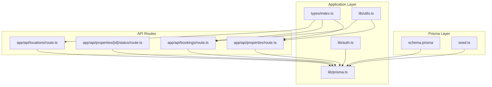
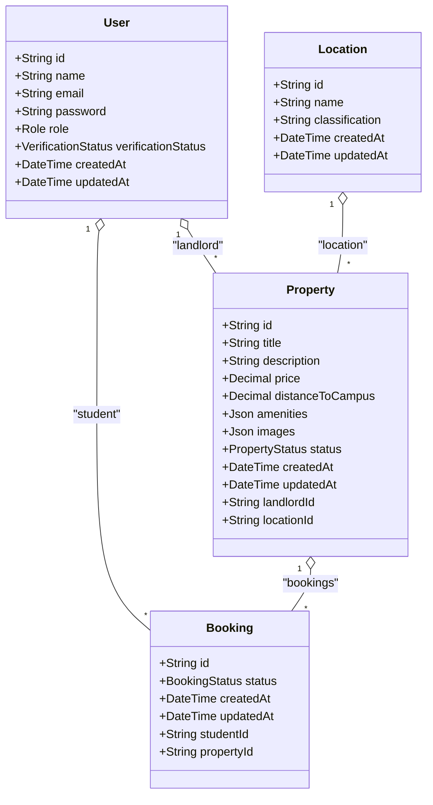
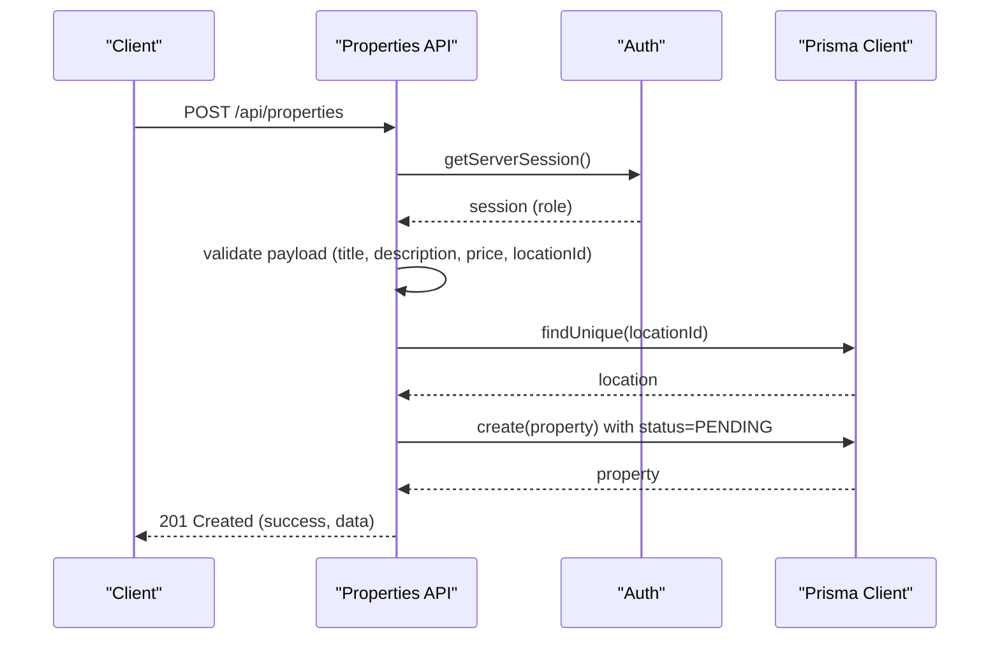
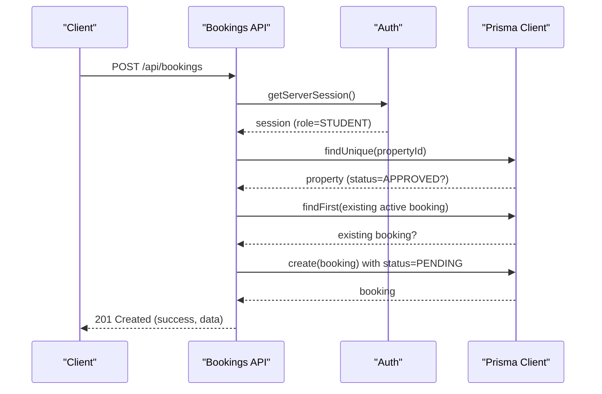
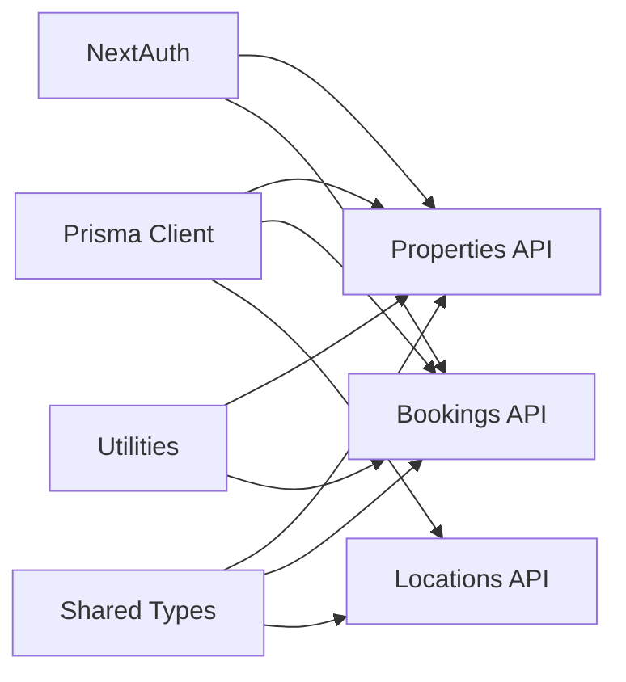
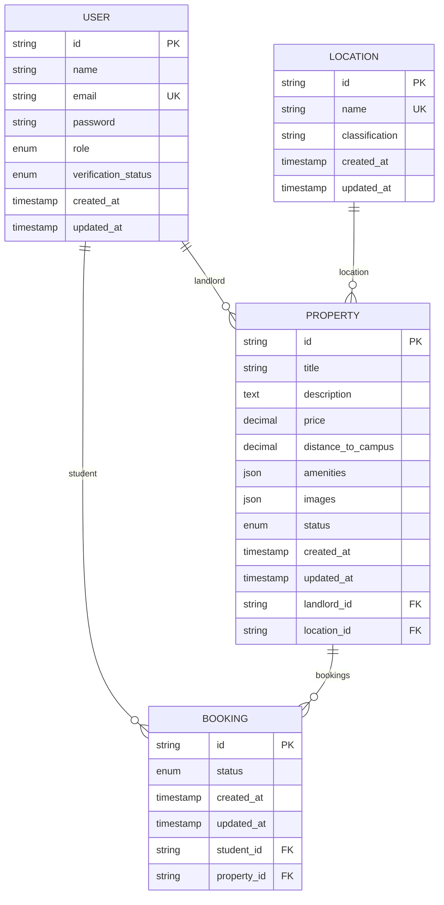

# Database Schema & Data Model

<cite>
**Referenced Files in This Document**
- [schema.prisma](file://prisma/schema.prisma)
- [seed.ts](file://prisma/seed.ts)
- [prisma.ts](file://src/lib/prisma.ts)
- [auth.ts](file://src/lib/auth.ts)
- [types/index.ts](file://src/types/index.ts)
- [properties/route.ts](file://src/app/api/properties/route.ts)
- [properties/[id]/status/route.ts](file://src/app/api/properties/[id]/status/route.ts)
- [bookings/route.ts](file://src/app/api/bookings/route.ts)
- [locations/route.ts](file://src/app/api/locations/route.ts)
- [utils.ts](file://src/lib/utils.ts)
</cite>

## Table of Contents
1. [Introduction](#introduction)
2. [Project Structure](#project-structure)
3. [Core Components](#core-components)
4. [Architecture Overview](#architecture-overview)
5. [Detailed Component Analysis](#detailed-component-analysis)
6. [Dependency Analysis](#dependency-analysis)
7. [Performance Considerations](#performance-considerations)
8. [Troubleshooting Guide](#troubleshooting-guide)
9. [Conclusion](#conclusion)
10. [Appendices](#appendices)

## Introduction
This document describes the RentalHub-BOUESTI database schema and data model. It focuses on four core entities: User, Property, Booking, and Location. It documents field definitions, data types, primary and foreign keys, indexes, constraints, and business rules. It also explains the role-based user system (STUDENT, LANDLORD, ADMIN), property status management (PENDING, APPROVED, REJECTED), booking workflow, and location classification. Entity relationship diagrams, sample data from the seed script, and data validation rules are included. Finally, it covers data lifecycle, cascading operations, and referential integrity constraints.

## Project Structure
The data model is defined in Prisma schema and enforced by the application’s API routes and utilities. The Prisma client is configured as a singleton and used across the application.

**Diagram sources**
- [schema.prisma](file://prisma/schema.prisma)
- [seed.ts](file://prisma/seed.ts)
- [prisma.ts](file://src/lib/prisma.ts)
- [auth.ts](file://src/lib/auth.ts)
- [types/index.ts](file://src/types/index.ts)
- [properties/route.ts](file://src/app/api/properties/route.ts)
- [properties/[id]/status/route.ts](file://src/app/api/properties/[id]/status/route.ts)
- [bookings/route.ts](file://src/app/api/bookings/route.ts)
- [locations/route.ts](file://src/app/api/locations/route.ts)
- [utils.ts](file://src/lib/utils.ts)

**Section sources**
- [schema.prisma](file://prisma/schema.prisma)
- [prisma.ts](file://src/lib/prisma.ts)

## Core Components
This section defines each entity, its fields, data types, constraints, and relationships.

- User
  - Purpose: Platform users with roles and verification status.
  - Fields:
    - id: String, primary key, cuid().
    - name: String.
    - email: String, unique.
    - password: String (bcrypt-hashed).
    - role: Enum Role (STUDENT, LANDLORD, ADMIN), default STUDENT.
    - verificationStatus: Enum VerificationStatus (UNVERIFIED, VERIFIED, SUSPENDED), default UNVERIFIED.
    - createdAt: DateTime, default now().
    - updatedAt: DateTime, default now() and updated on modification.
  - Indexes: email, role.
  - Mapped name: users.

- Location
  - Purpose: Geographical area classification around BOUESTI.
  - Fields:
    - id: String, primary key, cuid().
    - name: String, unique.
    - classification: String, default "Neighbourhood".
    - createdAt: DateTime, default now().
    - updatedAt: DateTime, default now() and updated on modification.
  - Indexes: classification.
  - Mapped name: locations.

- Property
  - Purpose: Rental listing created by a landlord.
  - Fields:
    - id: String, primary key, cuid().
    - title: String.
    - description: Text.
    - price: Decimal (10,2), monthly rent in NGN.
    - distanceToCampus: Decimal (5,2), kilometers to BOUESTI main gate (nullable).
    - amenities: Json, default empty array.
    - images: Json, default empty array.
    - status: Enum PropertyStatus (PENDING, APPROVED, REJECTED), default PENDING.
    - createdAt: DateTime, default now().
    - updatedAt: DateTime, default now() and updated on modification.
    - landlordId: String (foreign key).
    - locationId: String (foreign key).
  - Indexes: landlordId, locationId, status, price.
  - Relationships:
    - belongs to User (landlord) via landlordId.
    - belongs to Location via locationId.
    - has many Booking.
  - Mapped name: properties.

- Booking
  - Purpose: Student request to book a property.
  - Fields:
    - id: String, primary key, cuid().
    - status: Enum BookingStatus (PENDING, CONFIRMED, CANCELLED), default PENDING.
    - createdAt: DateTime, default now().
    - updatedAt: DateTime, default now() and updated on modification.
    - studentId: String (foreign key).
    - propertyId: String (foreign key).
  - Indexes: studentId, propertyId, status.
  - Relationships:
    - belongs to User (student) via studentId.
    - belongs to Property via propertyId.
  - Mapped name: bookings.

Constraints and defaults:
- Unique constraints: email on User, name on Location.
- Default values: role, verificationStatus, status, classification, timestamps.
- Cascading:
  - Property.landlordId references User.id with onDelete: Cascade.
  - Booking.studentId references User.id with onDelete: Cascade.
  - Booking.propertyId references Property.id with onDelete: Cascade.

**Section sources**
- [schema.prisma](file://prisma/schema.prisma)

## Architecture Overview
The application enforces data integrity via Prisma schema and validates business rules in API routes. Authentication integrates with Prisma to load user roles and verification status. Utilities provide display labels and safe parsing helpers.

**Diagram sources**
- [schema.prisma](file://prisma/schema.prisma)

## Detailed Component Analysis

### User Entity
- Role-based access control:
  - STUDENT: can create bookings.
  - LANDLORD: can create properties and view their own listings.
  - ADMIN: can manage property statuses and view all resources.
- Verification status affects login:
  - SUSPENDED prevents login.
- Password storage:
  - Stored as bcrypt hashes; never stored in plain text.

Validation and constraints:
- Unique email.
- Default role STUDENT and verification UNVERIFIED.
- Cascading deletes for related Property and Booking records.

**Section sources**
- [schema.prisma](file://prisma/schema.prisma)
- [auth.ts](file://src/lib/auth.ts)

### Location Entity
- Classification taxonomy:
  - Core Quarter, Ward, Residential Estate, Neighbourhood.
- Purpose:
  - Associate properties with nearby areas for search and filtering.
- Indexing:
  - classification indexed for efficient grouping and filtering.

Sample data from seed script:
- Uro, Odo Oja (Core Quarter)
- Oke 'Kere, Ajebandele (Neighbourhood)
- Afao (Ward)
- Olumilua Area, Ikoyi Estate (Residential Estate)
- Amoye Grammar School Area (Neighbourhood)

**Section sources**
- [schema.prisma](file://prisma/schema.prisma)
- [seed.ts](file://prisma/seed.ts)
- [locations/route.ts](file://src/app/api/locations/route.ts)

### Property Entity
- Lifecycle:
  - Creation sets status to PENDING.
  - Admin can set APPROVED or REJECTED.
  - Approved properties appear in browse/search results.
- Validation:
  - Requires title, description, price, and locationId.
  - Validates location existence before creation.
- Search and filtering:
  - Filters by status (default APPROVED), location name, price range.
  - Supports pagination, sorting by price, createdAt, or distanceToCampus.

**Diagram sources**
- [properties/route.ts](file://src/app/api/properties/route.ts)
- [auth.ts](file://src/lib/auth.ts)
- [prisma.ts](file://src/lib/prisma.ts)

**Section sources**
- [properties/route.ts](file://src/app/api/properties/route.ts)
- [properties/[id]/status/route.ts](file://src/app/api/properties/[id]/status/route.ts)
- [schema.prisma](file://prisma/schema.prisma)

### Booking Entity
- Workflow:
  - Students submit PENDING requests for APPROVED properties.
  - Duplicate active bookings prevented (PENDING or CONFIRMED).
- Access control:
  - GET returns user’s bookings; ADMIN sees all.
  - POST restricted to STUDENT role.

**Diagram sources**
- [bookings/route.ts](file://src/app/api/bookings/route.ts)
- [auth.ts](file://src/lib/auth.ts)
- [prisma.ts](file://src/lib/prisma.ts)

**Section sources**
- [bookings/route.ts](file://src/app/api/bookings/route.ts)
- [schema.prisma](file://prisma/schema.prisma)

### Data Validation Rules
- Properties:
  - Required: title, description, price, locationId.
  - Defaults: status=PENDING, amenities=[], images=[].
  - Numeric conversions: distanceToCampus cast to number; null if absent.
- Bookings:
  - Required: propertyId.
  - Business rule: property.status must be APPROVED.
  - Business rule: no duplicate active bookings (PENDING or CONFIRMED).
- Users:
  - Authentication requires verified accounts; SUSPENDED accounts blocked.
  - Passwords are hashed before storage.

**Section sources**
- [properties/route.ts](file://src/app/api/properties/route.ts)
- [bookings/route.ts](file://src/app/api/bookings/route.ts)
- [auth.ts](file://src/lib/auth.ts)
- [seed.ts](file://prisma/seed.ts)

### Sample Data from Seed Script
- Locations:
  - Uro (Core Quarter)
  - Odo Oja (Core Quarter)
  - Oke 'Kere (Neighbourhood)
  - Afao (Ward)
  - Olumilua Area (Residential Estate)
  - Ajebandele (Neighbourhood)
  - Ikoyi Estate (Residential Estate)
  - Amoye Grammar School Area (Neighbourhood)
- Admin user:
  - Name: BOUESTI Admin
  - Email: admin@bouesti.edu.ng
  - Role: ADMIN
  - Verification status: VERIFIED

**Section sources**
- [seed.ts](file://prisma/seed.ts)

## Dependency Analysis
- Prisma client is a singleton and reused across the app.
- API routes depend on Prisma for reads/writes and on NextAuth for session-based authorization.
- Types are shared across server and client to ensure consistency.

**Diagram sources**
- [prisma.ts](file://src/lib/prisma.ts)
- [auth.ts](file://src/lib/auth.ts)
- [types/index.ts](file://src/types/index.ts)
- [properties/route.ts](file://src/app/api/properties/route.ts)
- [bookings/route.ts](file://src/app/api/bookings/route.ts)
- [locations/route.ts](file://src/app/api/locations/route.ts)
- [utils.ts](file://src/lib/utils.ts)

**Section sources**
- [prisma.ts](file://src/lib/prisma.ts)
- [types/index.ts](file://src/types/index.ts)

## Performance Considerations
- Indexes:
  - User: email, role.
  - Location: classification.
  - Property: landlordId, locationId, status, price.
  - Booking: studentId, propertyId, status.
- Pagination and sorting:
  - Properties API supports pagination and sorting to limit result sizes.
- Efficient queries:
  - Use includes selectively (e.g., include landlord, location, counts) to reduce round-trips.
- Logging:
  - Prisma client logs queries in development to aid performance tuning.

[No sources needed since this section provides general guidance]

## Troubleshooting Guide
- Authentication failures:
  - Ensure user verification status is not SUSPENDED.
  - Confirm bcrypt-compare succeeds against stored hash.
- Authorization errors:
  - Landlords can only create properties; students can only book.
  - Admin-only endpoints require ADMIN role.
- Data integrity:
  - Unique violations: email on User, name on Location.
  - Cascading deletes: deleting a User or Property removes related records.
- Validation errors:
  - Missing required fields for property creation.
  - Invalid propertyId or non-approved property for booking.
  - Duplicate active booking detected.

**Section sources**
- [auth.ts](file://src/lib/auth.ts)
- [properties/route.ts](file://src/app/api/properties/route.ts)
- [bookings/route.ts](file://src/app/api/bookings/route.ts)
- [schema.prisma](file://prisma/schema.prisma)

## Conclusion
RentalHub-BOUESTI’s data model centers on four entities with clear roles, statuses, and relationships. Prisma enforces uniqueness, defaults, and cascading behavior, while API routes implement business rules such as role-based access, property approval workflows, and booking constraints. The seed script initializes locations and a default admin, enabling immediate operation. Proper indexing and pagination support efficient browsing and search.

[No sources needed since this section summarizes without analyzing specific files]

## Appendices

### Entity Relationship Diagram

**Diagram sources**
- [schema.prisma](file://prisma/schema.prisma)

### Data Lifecycle and Referential Integrity
- Creation:
  - User: verified by admin; default STUDENT and UNVERIFIED.
  - Property: created by LANDLORD with PENDING status.
  - Booking: created by STUDENT for APPROVED property.
- Updates:
  - Property status managed by ADMIN (PENDING → APPROVED/REJECTED).
  - Booking status remains PENDING until processed.
- Deletion:
  - CASCADE on User and Property deletes related records.
- Consistency:
  - Unique indexes prevent duplicate emails and location names.
  - Foreign keys enforce referential integrity.

**Section sources**
- [schema.prisma](file://prisma/schema.prisma)
- [properties/[id]/status/route.ts](file://src/app/api/properties/[id]/status/route.ts)
- [bookings/route.ts](file://src/app/api/bookings/route.ts)

### Display Labels and Amenities
- Role labels: STUDENT, LANDLORD, ADMIN.
- Property status labels: Pending Review, Approved, Rejected.
- Booking status labels: Pending, Confirmed, Cancelled.
- Amenities list includes common facilities for property listings.

**Section sources**
- [utils.ts](file://src/lib/utils.ts)