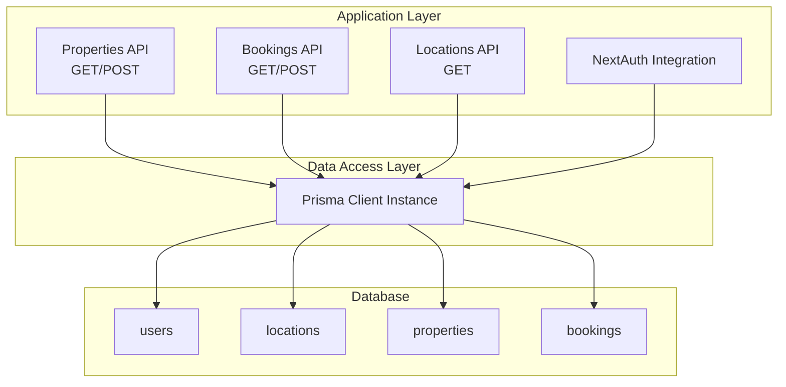
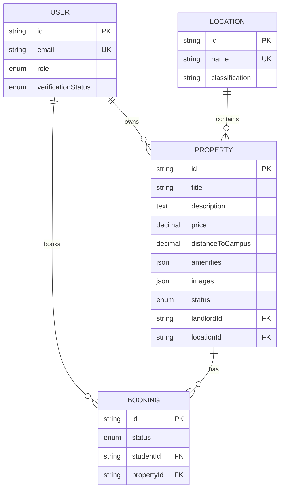
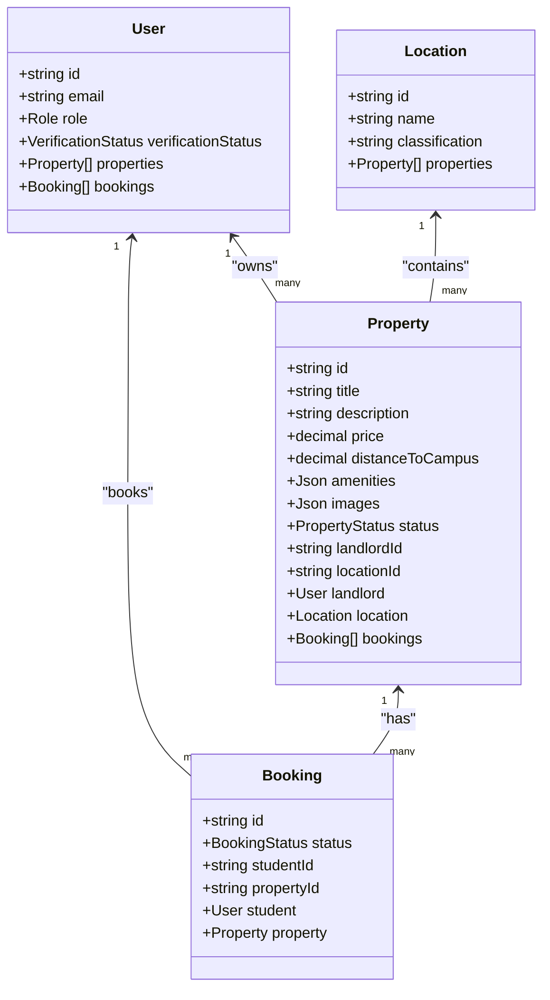
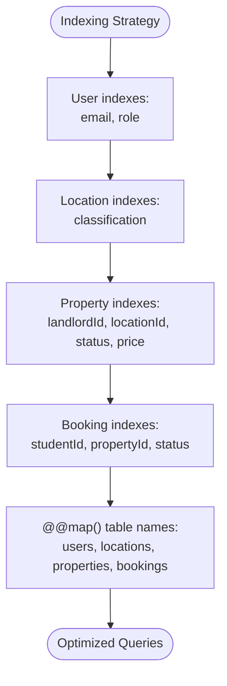
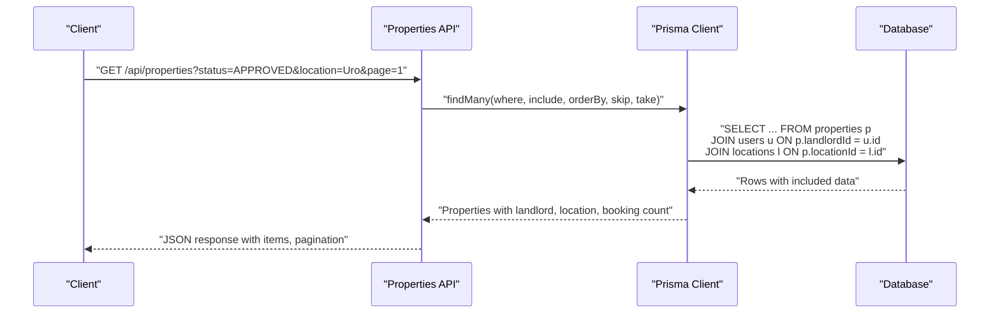
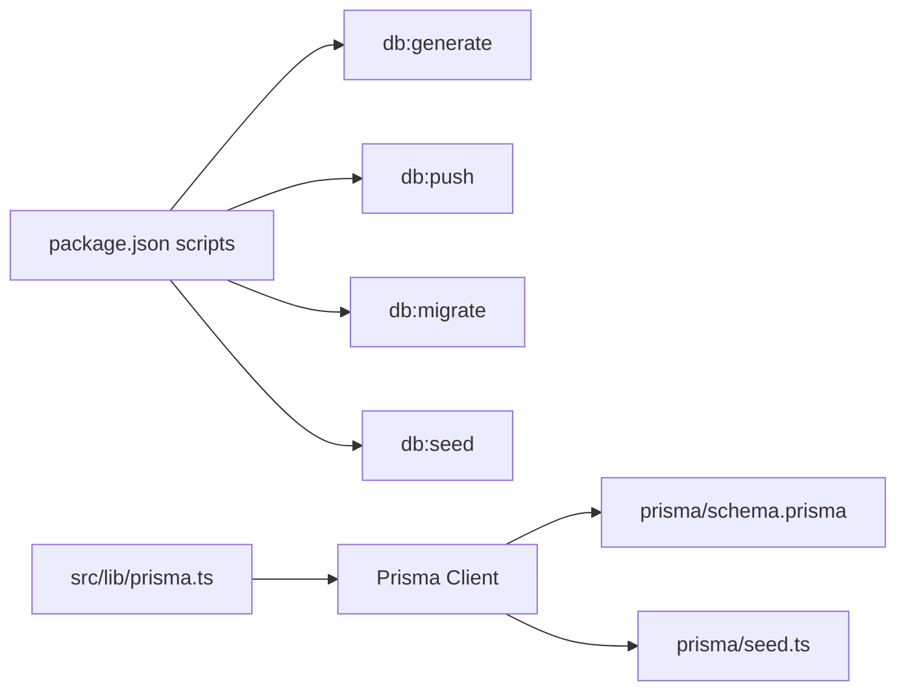

# Entity Relationships & Indexing

<cite>
**Referenced Files in This Document**
- [schema.prisma](file://prisma/schema.prisma)
- [seed.ts](file://prisma/seed.ts)
- [prisma.ts](file://src/lib/prisma.ts)
- [auth.ts](file://src/lib/auth.ts)
- [properties.route.ts](file://src/app/api/properties/route.ts)
- [bookings.route.ts](file://src/app/api/bookings/route.ts)
- [locations.route.ts](file://src/app/api/locations/route.ts)
- [package.json](file://package.json)
</cite>

## Table of Contents
1. [Introduction](#introduction)
2. [Project Structure](#project-structure)
3. [Core Components](#core-components)
4. [Architecture Overview](#architecture-overview)
5. [Detailed Component Analysis](#detailed-component-analysis)
6. [Dependency Analysis](#dependency-analysis)
7. [Performance Considerations](#performance-considerations)
8. [Troubleshooting Guide](#troubleshooting-guide)
9. [Conclusion](#conclusion)

## Introduction
This document provides a comprehensive analysis of entity relationships and database indexing strategy for RentalHub-BOUESTI. It focuses on the Prisma schema definitions, foreign key relationships, cascade operations, referential integrity constraints, and the indexing strategy implemented for optimal query performance. It also documents the @@map() configurations for table naming and @@index() directives for query optimization, along with practical examples of relationship queries and join patterns used in the application.

## Project Structure
The database model and relationships are defined in the Prisma schema file. The application uses a singleton Prisma client instance shared across the Next.js application. Authentication integrates with Prisma to enforce role-based access and user verification checks.

**Diagram sources**
- [prisma.ts:13-26](file://src/lib/prisma.ts#L13-L26)
- [schema.prisma:44-129](file://prisma/schema.prisma#L44-L129)

**Section sources**
- [prisma.ts:1-27](file://src/lib/prisma.ts#L1-L27)
- [schema.prisma:1-130](file://prisma/schema.prisma#L1-L130)

## Core Components
This section outlines the core entities and their relationships as defined in the Prisma schema, including foreign keys, cascade operations, and referential integrity constraints.

- User
  - Primary key: id
  - Unique constraints: email
  - Enum fields: role, verificationStatus
  - Relationships:
    - One-to-many with Property via relation "LandlordProperties"
    - One-to-many with Booking via relation "StudentBookings"
  - Indexes: email, role
  - Table mapping: @@map("users")

- Location
  - Primary key: id
  - Unique constraint: name
  - Additional field: classification
  - Relationship: One-to-many with Property
  - Indexes: classification
  - Table mapping: @@map("locations")

- Property
  - Primary key: id
  - Decimal fields: price, distanceToCampus
  - JSON fields: amenities, images
  - Enum fields: status
  - Foreign keys: landlordId, locationId
  - Relationships:
    - Many-to-one with User (landlord)
    - Many-to-one with Location
    - One-to-many with Booking
  - Cascade operations:
    - onDelete: Cascade for User relation (landlord)
  - Indexes: landlordId, locationId, status, price
  - Table mapping: @@map("properties")

- Booking
  - Primary key: id
  - Enum field: status
  - Foreign keys: studentId, propertyId
  - Relationships:
    - Many-to-one with User (student)
    - Many-to-one with Property
  - Cascade operations:
    - onDelete: Cascade for User relation (student)
    - onDelete: Cascade for Property relation
  - Indexes: studentId, propertyId, status
  - Table mapping: @@map("bookings")

**Section sources**
- [schema.prisma:44-129](file://prisma/schema.prisma#L44-L129)

## Architecture Overview
The application enforces referential integrity through Prisma relations and foreign keys. Cascade delete is configured for child entities when parent records are removed, ensuring data consistency. The indexing strategy targets frequently queried fields to optimize search, filtering, and sorting operations.

**Diagram sources**
- [schema.prisma:44-129](file://prisma/schema.prisma#L44-L129)

## Detailed Component Analysis

### Entity Relationships and Referential Integrity
- User-Property (one-to-many)
  - Defined via relation "LandlordProperties" on User and Property.
  - Foreign key: Property.landlordId references User.id.
  - Cascade delete: onDelete: Cascade for User relation on Property ensures removal of properties when a user is deleted.
  - Referential integrity: Enforced by Prisma relations and foreign key constraints.

- User-Booking (one-to-many)
  - Defined via relation "StudentBookings" on User and Booking.
  - Foreign key: Booking.studentId references User.id.
  - Cascade delete: onDelete: Cascade for User relation on Booking ensures removal of bookings when a user is deleted.

- Property-Location (many-to-one)
  - Property.locationId references Location.id.
  - No cascade delete configured for Location; deletion of a location requires handling dependent properties.

- Property-Booking (one-to-one)
  - Clarification: The relationship is actually one-to-many from Property to Booking (one property can have multiple bookings).
  - Foreign key: Booking.propertyId references Property.id.
  - Cascade delete: onDelete: Cascade for Property relation on Booking ensures removal of bookings when a property is deleted.

**Diagram sources**
- [schema.prisma:44-129](file://prisma/schema.prisma#L44-L129)

**Section sources**
- [schema.prisma:44-129](file://prisma/schema.prisma#L44-L129)

### Cascade Operations and Referential Integrity Constraints
- Cascade delete for User
  - Property onDelete: Cascade ensures properties owned by a deleted user are removed.
  - Booking onDelete: Cascade ensures bookings created by a deleted user are removed.
- Cascade delete for Property
  - Booking onDelete: Cascade ensures all bookings associated with a deleted property are removed.
- No cascade delete for Location
  - Deleting a location does not automatically remove properties; application logic must handle this scenario.

**Section sources**
- [schema.prisma:99-123](file://prisma/schema.prisma#L99-L123)

### Indexing Strategy and @@map() Configurations
- @@map() table naming
  - Users table mapped to "users"
  - Locations table mapped to "locations"
  - Properties table mapped to "properties"
  - Bookings table mapped to "bookings"
- @@index() directives
  - User: indexes on [email], [role]
  - Location: indexes on [classification]
  - Property: indexes on [landlordId], [locationId], [status], [price]
  - Booking: indexes on [studentId], [propertyId], [status]
- Composite indexes
  - Not explicitly defined in the schema; however, the individual column indexes target frequently filtered/sorted fields.
- Unique constraints
  - User.email is unique
  - Location.name is unique

**Diagram sources**
- [schema.prisma:58-128](file://prisma/schema.prisma#L58-L128)

**Section sources**
- [schema.prisma:58-128](file://prisma/schema.prisma#L58-L128)

### Practical Relationship Queries and Join Patterns
- Listing properties with related data
  - Query pattern: findMany with include for landlord, location, and _count.bookings.
  - Filtering by status and optional location name substring match.
  - Sorting by price, createdAt, or distanceToCampus.
  - Pagination via skip/take.
  - Reference: [properties.route.ts:35-48](file://src/app/api/properties/route.ts#L35-L48)
- Fetching user's bookings with nested includes
  - Query pattern: findMany with include for student, property, and nested include for property.location and property.landlord.
  - Conditional where clause based on user role (STUDENT vs LANDLORD vs ADMIN).
  - Reference: [bookings.route.ts:26-38](file://src/app/api/bookings/route.ts#L26-L38)
- Listing locations with ordering
  - Query pattern: findMany with orderBy on classification and name.
  - Reference: [locations.route.ts:13-18](file://src/app/api/locations/route.ts#L13-L18)
- Authentication-based user lookup
  - Query pattern: findUnique on User by email for login authorization.
  - Reference: [auth.ts:27-29](file://src/lib/auth.ts#L27-L29)

**Diagram sources**
- [properties.route.ts:35-48](file://src/app/api/properties/route.ts#L35-L48)
- [schema.prisma:99-101](file://prisma/schema.prisma#L99-L101)

**Section sources**
- [properties.route.ts:14-64](file://src/app/api/properties/route.ts#L14-L64)
- [bookings.route.ts:11-45](file://src/app/api/bookings/route.ts#L11-L45)
- [locations.route.ts:11-28](file://src/app/api/locations/route.ts#L11-L28)
- [auth.ts:22-51](file://src/lib/auth.ts#L22-L51)

### Seed Data and Initialization
- Default admin user creation with hashed password and verified status.
- Upsert of predefined locations with classifications.
- References:
  - [seed.ts:92-122](file://prisma/seed.ts#L92-L122)
  - [seed.ts:71-90](file://prisma/seed.ts#L71-L90)

**Section sources**
- [seed.ts:1-143](file://prisma/seed.ts#L1-L143)

## Dependency Analysis
The application depends on Prisma for data modeling and access. The Prisma client is initialized as a singleton to avoid connection pool exhaustion during development. Scripts for database operations are defined in package.json.

**Diagram sources**
- [package.json:5-18](file://package.json#L5-L18)
- [prisma.ts:13-26](file://src/lib/prisma.ts#L13-L26)
- [schema.prisma:1-130](file://prisma/schema.prisma#L1-L130)
- [seed.ts:1-143](file://prisma/seed.ts#L1-L143)

**Section sources**
- [package.json:1-41](file://package.json#L1-L41)
- [prisma.ts:1-27](file://src/lib/prisma.ts#L1-L27)

## Performance Considerations
- Index coverage
  - User: email and role indexes support fast authentication and role-based filtering.
  - Location: classification index supports efficient grouping and filtering by area type.
  - Property: indexes on landlordId, locationId, status, and price enable:
    - Fast property ownership queries
    - Efficient location-based filtering
    - Quick status filtering (e.g., APPROVED)
    - Optimized price-range queries
  - Booking: indexes on studentId, propertyId, and status enable:
    - Fast user booking history retrieval
    - Efficient property booking counts
    - Quick status filtering (e.g., PENDING, CONFIRMED)
- Query patterns
  - Use include statements judiciously to avoid N+1 queries; the existing patterns demonstrate appropriate includes for landlord, location, and nested includes.
  - Pagination via skip/take reduces memory overhead for large result sets.
- Composite indexes
  - Consider adding composite indexes for frequently combined filters (e.g., Property.status + Property.price, Booking.studentId + Booking.status) to further optimize query plans.
- Unique constraints
  - Unique indexes on email and location name prevent duplicates and improve lookup performance.
- Cascade operations
  - Cascade deletes simplify cleanup but can impact performance if large datasets are affected; monitor and consider batch operations if needed.

[No sources needed since this section provides general guidance]

## Troubleshooting Guide
- Authentication failures
  - Ensure email uniqueness and correct password hashing before login attempts.
  - Verify user verification status is not SUSPENDED.
  - Reference: [auth.ts:27-42](file://src/lib/auth.ts#L27-L42)
- Property creation errors
  - Validate location existence before creating a property.
  - Reference: [properties.route.ts:90-93](file://src/app/api/properties/route.ts#L90-L93)
- Booking conflicts
  - Prevent duplicate active bookings for the same property by student.
  - Reference: [bookings.route.ts:74-87](file://src/app/api/bookings/route.ts#L74-L87)
- Database seeding
  - Use the seed script to initialize locations and admin user.
  - Reference: [seed.ts:126-132](file://prisma/seed.ts#L126-L132)

**Section sources**
- [auth.ts:22-51](file://src/lib/auth.ts#L22-L51)
- [properties.route.ts:68-118](file://src/app/api/properties/route.ts#L68-L118)
- [bookings.route.ts:47-108](file://src/app/api/bookings/route.ts#L47-L108)
- [seed.ts:126-143](file://prisma/seed.ts#L126-L143)

## Conclusion
RentalHub-BOUESTI employs a well-defined relational model with clear foreign key relationships and cascade operations to maintain referential integrity. The indexing strategy targets frequently accessed fields to optimize search, filtering, and sorting. The @@map() directives standardize table naming for clarity. The API routes demonstrate effective use of includes and pagination to deliver efficient, user-friendly responses while maintaining data consistency.