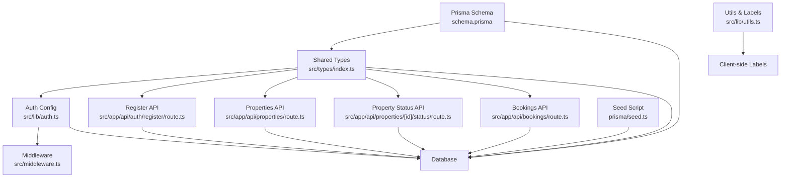
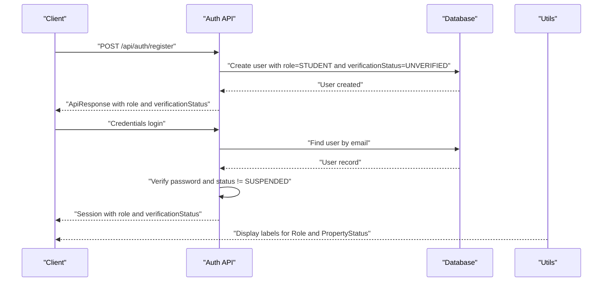
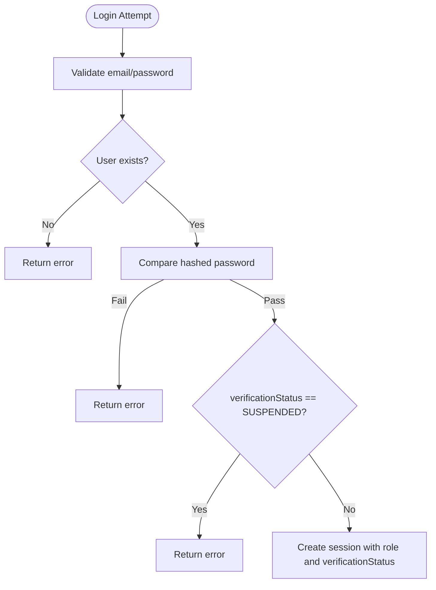
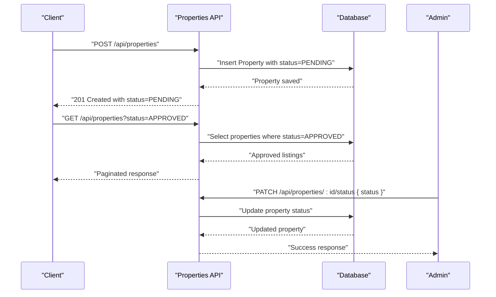
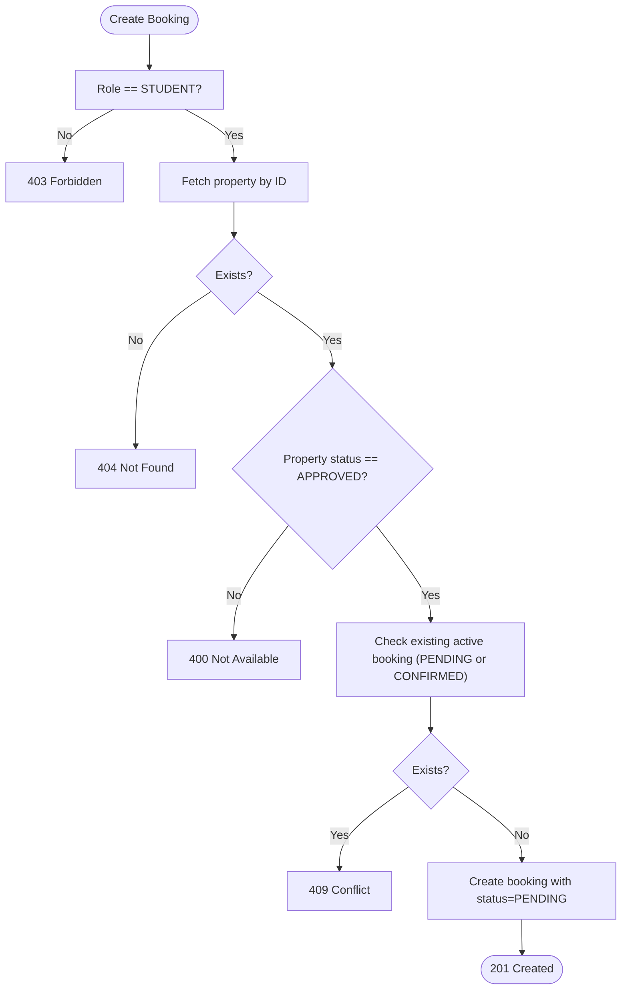
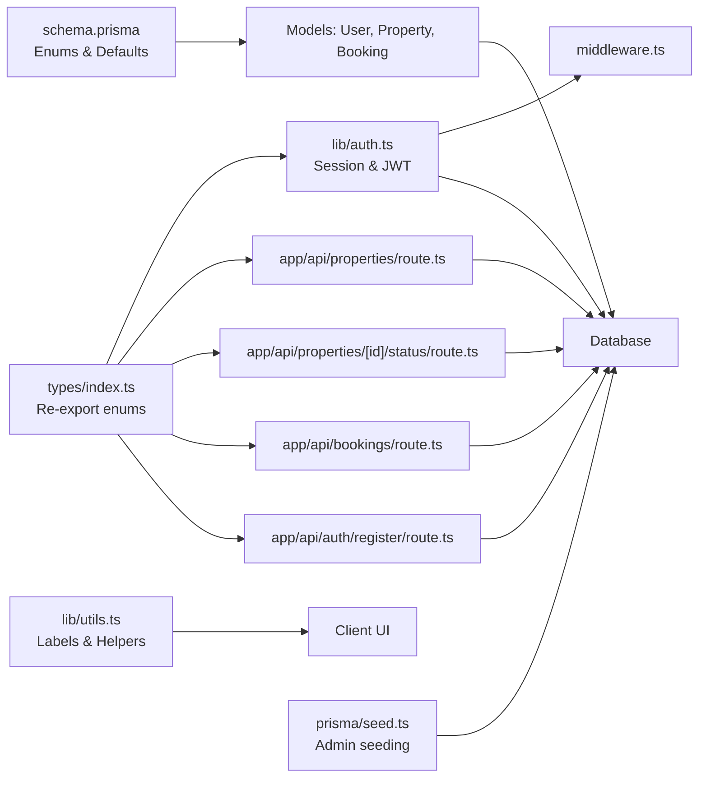

# Enums & Business Constraints

<cite>
**Referenced Files in This Document**
- [schema.prisma](file://prisma/schema.prisma)
- [types/index.ts](file://src/types/index.ts)
- [auth.ts](file://src/lib/auth.ts)
- [register/route.ts](file://src/app/api/auth/register/route.ts)
- [properties/route.ts](file://src/app/api/properties/route.ts)
- [properties/[id]/status/route.ts](file://src/app/api/properties/[id]/status/route.ts)
- [bookings/route.ts](file://src/app/api/bookings/route.ts)
- [middleware.ts](file://src/middleware.ts)
- [utils.ts](file://src/lib/utils.ts)
- [seed.ts](file://prisma/seed.ts)
</cite>

## Table of Contents
1. [Introduction](#introduction)
2. [Project Structure](#project-structure)
3. [Core Components](#core-components)
4. [Architecture Overview](#architecture-overview)
5. [Detailed Component Analysis](#detailed-component-analysis)
6. [Dependency Analysis](#dependency-analysis)
7. [Performance Considerations](#performance-considerations)
8. [Troubleshooting Guide](#troubleshooting-guide)
9. [Conclusion](#conclusion)

## Introduction
This document details the enumerations and business constraints that govern access control and operational workflows in RentalHub-BOUESTI. It focuses on four core enums defined in the Prisma schema and enforced across API endpoints and middleware:
- Role: STUDENT, LANDLORD, ADMIN
- VerificationStatus: UNVERIFIED, VERIFIED, SUSPENDED
- PropertyStatus: PENDING, APPROVED, REJECTED
- BookingStatus: PENDING, CONFIRMED, CANCELLED

These enums define who can access what, under what conditions, and how business processes evolve. The document explains constraints, validation rules, and enforcement points, and provides examples of enum usage in API responses, database queries, and business rule implementations.

## Project Structure
The enum definitions originate from the Prisma schema and are surfaced to the application via shared TypeScript types. Business logic enforcing these enums resides in API routes, middleware, authentication callbacks, and utility helpers.



**Diagram sources**
- [schema.prisma:17-39](file://prisma/schema.prisma#L17-L39)
- [types/index.ts:9-21](file://src/types/index.ts#L9-L21)
- [auth.ts:12](file://src/lib/auth.ts#L12)
- [register/route.ts:11](file://src/app/api/auth/register/route.ts#L11)
- [properties/route.ts:10](file://src/app/api/properties/route.ts#L10)
- [properties/[id]/status/route.ts:11](file://src/app/api/properties/[id]/status/route.ts#L11)
- [bookings/route.ts:9](file://src/app/api/bookings/route.ts#L9)
- [middleware.ts:8](file://src/middleware.ts#L8)
- [utils.ts:98-117](file://src/lib/utils.ts#L98-L117)
- [seed.ts:12](file://prisma/seed.ts#L12)

**Section sources**
- [schema.prisma:17-39](file://prisma/schema.prisma#L17-L39)
- [types/index.ts:9-21](file://src/types/index.ts#L9-L21)

## Core Components
This section defines each enum and its business constraints.

- Role (STUDENT, LANDLORD, ADMIN)
  - Purpose: Defines user roles and access tiers.
  - Defaults: Users are created with STUDENT by default; ADMIN is reserved for seeding and administrative access.
  - Enforcement: Middleware and API routes restrict access to dashboards and actions based on role.
  - Impact: Controls which endpoints a user can reach and what operations they can perform.

- VerificationStatus (UNVERIFIED, VERIFIED, SUSPENDED)
  - Purpose: Governs account lifecycle and eligibility to log in.
  - Defaults: Newly registered users are UNVERIFIED; seeded Admin is VERIFIED.
  - Enforcement: Authentication rejects SUSPENDED accounts; registration sets UNVERIFIED by default.
  - Impact: Blocks login for suspended users; prevents administrative actions until verified.

- PropertyStatus (PENDING, APPROVED, REJECTED)
  - Purpose: Manages property listing lifecycle and visibility.
  - Defaults: New listings start as PENDING.
  - Enforcement: Properties must be APPROVED to be visible to students; Admin controls transitions; API enforces valid status updates.
  - Impact: Ensures only vetted properties appear in search results; prevents misuse of rejected listings.

- BookingStatus (PENDING, CONFIRMED, CANCELLED)
  - Purpose: Tracks booking lifecycle and availability implications.
  - Defaults: New bookings start as PENDING.
  - Enforcement: Students can only book APPROVED properties; duplicate active bookings are prevented; Admins manage confirmations.
  - Impact: Maintains accurate availability and prevents double-booking.

**Section sources**
- [schema.prisma:44-61](file://prisma/schema.prisma#L44-L61)
- [schema.prisma:80-108](file://prisma/schema.prisma#L80-L108)
- [schema.prisma:111-129](file://prisma/schema.prisma#L111-L129)
- [auth.ts:40-42](file://src/lib/auth.ts#L40-L42)
- [register/route.ts:66](file://src/app/api/auth/register/route.ts#L66)
- [properties/route.ts:105](file://src/app/api/properties/route.ts#L105)
- [properties/[id]/status/route.ts:32-34](file://src/app/api/properties/[id]/status/route.ts#L32-L34)
- [bookings/route.ts:70](file://src/app/api/bookings/route.ts#L70)
- [bookings/route.ts:79](file://src/app/api/bookings/route.ts#L79)

## Architecture Overview
The system enforces enums at three layers:
- Data model layer: Prisma schema defines enums and defaults.
- API/business layer: Routes validate inputs, enforce role-based access, and apply business rules.
- Presentation layer: Utilities provide human-readable labels and safe parsing helpers.



**Diagram sources**
- [register/route.ts:60-76](file://src/app/api/auth/register/route.ts#L60-L76)
- [auth.ts:27-50](file://src/lib/auth.ts#L27-L50)
- [utils.ts:98-117](file://src/lib/utils.ts#L98-L117)

## Detailed Component Analysis

### Role Enum and Access Control
Role determines dashboard and endpoint access:
- ADMIN-only routes: protected by middleware; only users with role ADMIN are permitted.
- LANDLORD-only routes: accessible to LANDLORD and ADMIN.
- STUDENT-only routes: accessible to STUDENT only.
- API endpoints reflect role-based restrictions:
  - Property creation requires LANDLORD or ADMIN.
  - Booking requests require STUDENT.
  - Property status updates require ADMIN.

```mermaid
flowchart TD
Start(["Route Access"]) --> CheckAuth["Check session presence"]
CheckAuth --> |No| Deny["401 Unauthorized"]
CheckAuth --> |Yes| CheckRole["Check role"]
CheckRole --> AdminPath{"Path starts with /admin?"}
AdminPath --> |Yes & role!=ADMIN| Unauthorized["Redirect to /unauthorized"]
AdminPath --> |No| LandlordPath{"Path starts with /dashboard/landlord?"}
LandlordPath --> |Yes & role not in {LANDLORD,ADMIN}| Unauthorized
LandlordPath --> |No| StudentPath{"Path starts with /dashboard/student?"}
StudentPath --> |Yes & role!=STUDENT| Unauthorized
StudentPath --> |No| Allow["Proceed to handler"]
```

**Diagram sources**
- [middleware.ts:16-29](file://src/middleware.ts#L16-L29)

**Section sources**
- [middleware.ts:16-29](file://src/middleware.ts#L16-L29)
- [properties/route.ts:76-78](file://src/app/api/properties/route.ts#L76-L78)
- [bookings/route.ts:55](file://src/app/api/bookings/route.ts#L55)
- [properties/[id]/status/route.ts:25](file://src/app/api/properties/[id]/status/route.ts#L25)

### VerificationStatus Lifecycle and Login Enforcement
VerificationStatus governs account eligibility:
- Registration creates users with UNVERIFIED by default.
- Login validates credentials and blocks SUSPENDED accounts.
- Seeded Admin is VERIFIED.



**Diagram sources**
- [auth.ts:22-50](file://src/lib/auth.ts#L22-L50)
- [register/route.ts:60-76](file://src/app/api/auth/register/route.ts#L60-L76)
- [seed.ts:106-121](file://prisma/seed.ts#L106-L121)

**Section sources**
- [auth.ts:40-42](file://src/lib/auth.ts#L40-L42)
- [register/route.ts:66](file://src/app/api/auth/register/route.ts#L66)
- [seed.ts:65-67](file://prisma/seed.ts#L65-L67)

### PropertyStatus Workflow and Visibility
PropertyStatus controls listing visibility and approval:
- Defaults: New properties are PENDING.
- Search defaults: Only APPROVED properties are returned.
- Approval flow: Admin updates status to APPROVED or REJECTED.
- Validation: Only APPROVED properties can be booked.



**Diagram sources**
- [properties/route.ts:95-108](file://src/app/api/properties/route.ts#L95-L108)
- [properties/route.ts:19](file://src/app/api/properties/route.ts#L19)
- [properties/[id]/status/route.ts:32-40](file://src/app/api/properties/[id]/status/route.ts#L32-L40)

**Section sources**
- [properties/route.ts:105](file://src/app/api/properties/route.ts#L105)
- [properties/route.ts:19](file://src/app/api/properties/route.ts#L19)
- [properties/[id]/status/route.ts:32-34](file://src/app/api/properties/[id]/status/route.ts#L32-L34)
- [bookings/route.ts:70](file://src/app/api/bookings/route.ts#L70)

### BookingStatus and Availability Management
BookingStatus manages booking lifecycle:
- Defaults: New bookings are PENDING.
- Availability: Students can only book APPROVED properties.
- Duplicate protection: Prevents multiple active bookings (PENDING or CONFIRMED) for the same property.
- Enforcement: API validates property status and existing bookings.



**Diagram sources**
- [bookings/route.ts:55-98](file://src/app/api/bookings/route.ts#L55-L98)

**Section sources**
- [bookings/route.ts:70](file://src/app/api/bookings/route.ts#L70)
- [bookings/route.ts:79](file://src/app/api/bookings/route.ts#L79)
- [bookings/route.ts:93](file://src/app/api/bookings/route.ts#L93)

## Dependency Analysis
The following diagram maps how enums and related logic depend on each other across modules.



**Diagram sources**
- [schema.prisma:17-39](file://prisma/schema.prisma#L17-L39)
- [types/index.ts:9-21](file://src/types/index.ts#L9-L21)
- [auth.ts:12](file://src/lib/auth.ts#L12)
- [properties/route.ts:10](file://src/app/api/properties/route.ts#L10)
- [properties/[id]/status/route.ts:11](file://src/app/api/properties/[id]/status/route.ts#L11)
- [bookings/route.ts:9](file://src/app/api/bookings/route.ts#L9)
- [register/route.ts:11](file://src/app/api/auth/register/route.ts#L11)
- [middleware.ts:8](file://src/middleware.ts#L8)
- [utils.ts:98-117](file://src/lib/utils.ts#L98-L117)
- [seed.ts:12](file://prisma/seed.ts#L12)

**Section sources**
- [schema.prisma:17-39](file://prisma/schema.prisma#L17-L39)
- [types/index.ts:9-21](file://src/types/index.ts#L9-L21)
- [auth.ts:12](file://src/lib/auth.ts#L12)
- [properties/route.ts:10](file://src/app/api/properties/route.ts#L10)
- [properties/[id]/status/route.ts:11](file://src/app/api/properties/[id]/status/route.ts#L11)
- [bookings/route.ts:9](file://src/app/api/bookings/route.ts#L9)
- [register/route.ts:11](file://src/app/api/auth/register/route.ts#L11)
- [middleware.ts:8](file://src/middleware.ts#L8)
- [utils.ts:98-117](file://src/lib/utils.ts#L98-L117)
- [seed.ts:12](file://prisma/seed.ts#L12)

## Performance Considerations
- Indexes on enum fields: Prisma schema indexes on role, verificationStatus, property status, and booking status improve query performance for filtering and sorting.
- Pagination: Property listing API enforces page size limits and calculates total counts efficiently.
- Minimal round-trips: API handlers combine reads/writes using Prisma transactions where appropriate to reduce latency.

[No sources needed since this section provides general guidance]

## Troubleshooting Guide
Common issues and resolutions:
- Authentication errors for SUSPENDED accounts: Login attempts are rejected with a specific error indicating suspension.
  - Reference: [auth.ts:40-42](file://src/lib/auth.ts#L40-L42)
- Registration conflicts: Attempting to register with an existing email returns a conflict error.
  - Reference: [register/route.ts:50-56](file://src/app/api/auth/register/route.ts#L50-L56)
- Role-based access denials:
  - Non-admin accessing admin routes: redirected to unauthorized.
    - Reference: [middleware.ts:17-19](file://src/middleware.ts#L17-L19)
  - Non-landlord creating properties: forbidden.
    - Reference: [properties/route.ts:76-78](file://src/app/api/properties/route.ts#L76-L78)
  - Non-student creating bookings: forbidden.
    - Reference: [bookings/route.ts:55](file://src/app/api/bookings/route.ts#L55)
- Property status errors:
  - Updating status with invalid value: validation error.
    - Reference: [properties/[id]/status/route.ts:32-34](file://src/app/api/properties/[id]/status/route.ts#L32-L34)
  - Booking unavailable property: property must be APPROVED.
    - Reference: [bookings/route.ts:70](file://src/app/api/bookings/route.ts#L70)
- Duplicate active bookings: attempting to book the same property while having an active booking returns a conflict.
  - Reference: [bookings/route.ts:79](file://src/app/api/bookings/route.ts#L79)

**Section sources**
- [auth.ts:40-42](file://src/lib/auth.ts#L40-L42)
- [register/route.ts:50-56](file://src/app/api/auth/register/route.ts#L50-L56)
- [middleware.ts:17-19](file://src/middleware.ts#L17-L19)
- [properties/route.ts:76-78](file://src/app/api/properties/route.ts#L76-L78)
- [bookings/route.ts:55](file://src/app/api/bookings/route.ts#L55)
- [properties/[id]/status/route.ts:32-34](file://src/app/api/properties/[id]/status/route.ts#L32-L34)
- [bookings/route.ts:70](file://src/app/api/bookings/route.ts#L70)
- [bookings/route.ts:79](file://src/app/api/bookings/route.ts#L79)

## Conclusion
RentalHub-BOUESTI’s business logic is anchored in four core enums that define roles, verification states, property listing states, and booking states. These enums are consistently enforced across the Prisma schema, API routes, authentication callbacks, and middleware. Together, they ensure secure access control, predictable workflows, and clear visibility of system state. Developers should continue to rely on these enums when adding new features to maintain consistency and prevent regressions.