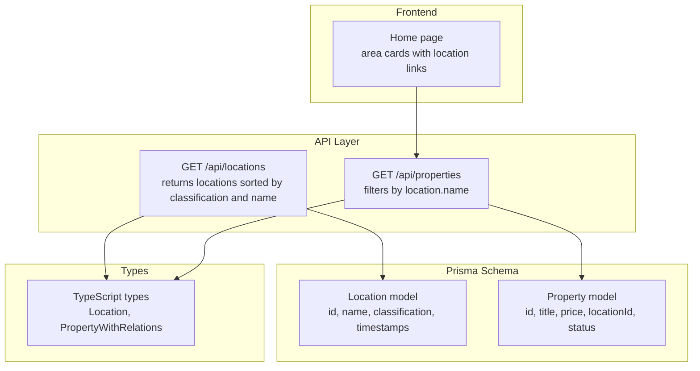
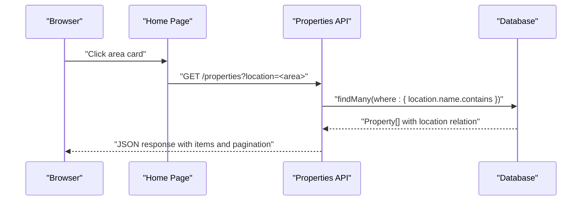
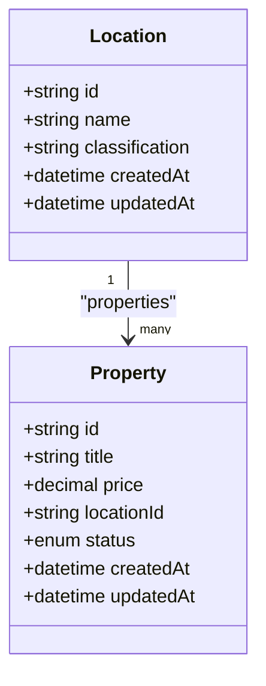
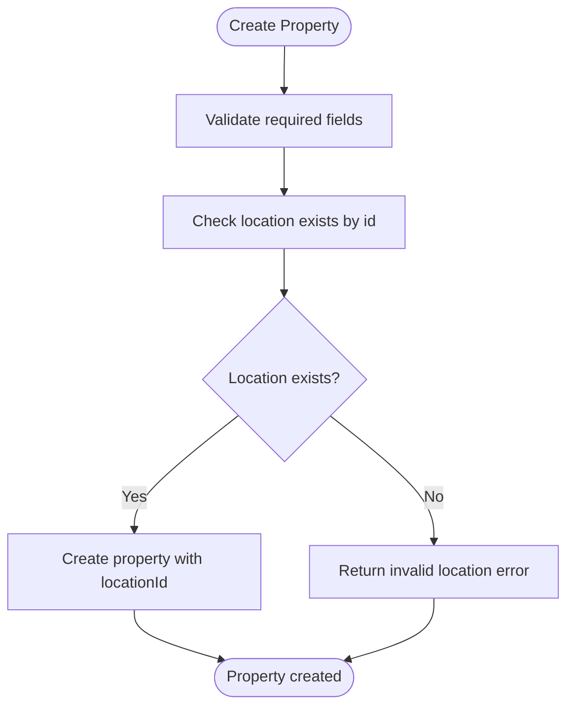
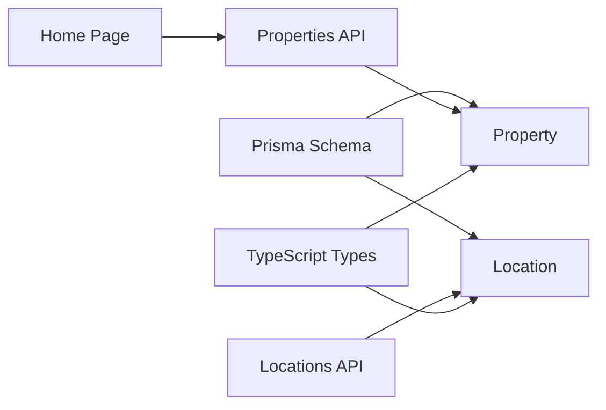

# Location Entity

<cite>
**Referenced Files in This Document**
- [schema.prisma](file://prisma/schema.prisma)
- [seed.ts](file://prisma/seed.ts)
- [route.ts](file://src/app/api/locations/route.ts)
- [route.ts](file://src/app/api/properties/route.ts)
- [index.ts](file://src/types/index.ts)
- [page.tsx](file://src/app/page.tsx)
</cite>

## Table of Contents
1. [Introduction](#introduction)
2. [Project Structure](#project-structure)
3. [Core Components](#core-components)
4. [Architecture Overview](#architecture-overview)
5. [Detailed Component Analysis](#detailed-component-analysis)
6. [Dependency Analysis](#dependency-analysis)
7. [Performance Considerations](#performance-considerations)
8. [Troubleshooting Guide](#troubleshooting-guide)
9. [Conclusion](#conclusion)

## Introduction
This document provides comprehensive documentation for the Location entity in RentalHub-BOUESTI. It explains the Location model structure, classification system, and its relationship with Property entities. It also covers field constraints, uniqueness requirements, indexing strategies, and practical usage patterns for property filtering and search functionality.

## Project Structure
The Location entity is defined in the Prisma schema and integrated with API routes and TypeScript types. The seed script initializes predefined locations with classifications. The frontend surfaces locations for quick property browsing.

**Diagram sources**
- [schema.prisma:63-77](file://prisma/schema.prisma#L63-L77)
- [schema.prisma:79-108](file://prisma/schema.prisma#L79-L108)
- [route.ts:11-28](file://src/app/api/locations/route.ts#L11-L28)
- [route.ts:14-64](file://src/app/api/properties/route.ts#L14-L64)
- [index.ts:10-42](file://src/types/index.ts#L10-L42)
- [page.tsx:96-122](file://src/app/page.tsx#L96-L122)

**Section sources**
- [schema.prisma:63-77](file://prisma/schema.prisma#L63-L77)
- [route.ts:11-28](file://src/app/api/locations/route.ts#L11-L28)
- [route.ts:14-64](file://src/app/api/properties/route.ts#L14-L64)
- [index.ts:10-42](file://src/types/index.ts#L10-L42)
- [page.tsx:96-122](file://src/app/page.tsx#L96-L122)

## Core Components
- Location model fields:
  - id: Unique identifier
  - name: Unique string representing the area name
  - classification: String with default value "Neighbourhood"
  - createdAt/updatedAt: Timestamps managed by Prisma
- Relationship with Property:
  - Location has many Properties via properties relation
  - Property belongs to a Location via locationId foreign key
- Indexes:
  - Location: classification indexed
  - Property: locationId indexed
- Classification system:
  - Core Quarter: Central, high-density areas near campus
  - Residential Estate: Planned residential developments
  - Neighbourhood: General residential areas
  - Ward: Administrative boundaries (as seen in seeds)
- Uniqueness:
  - name is unique at the database level
  - classification has a default value to ensure consistency

**Section sources**
- [schema.prisma:63-77](file://prisma/schema.prisma#L63-L77)
- [schema.prisma:79-108](file://prisma/schema.prisma#L79-L108)
- [seed.ts:24-57](file://prisma/seed.ts#L24-L57)

## Architecture Overview
The Location entity underpins area-based property discovery. Users browse areas on the home page, which filters properties by location.name. The API exposes endpoints to list locations and properties, while TypeScript types ensure safe client-server contracts.

**Diagram sources**
- [page.tsx:109](file://src/app/page.tsx#L109)
- [route.ts:18](file://src/app/api/properties/route.ts#L18)
- [route.ts:29](file://src/app/api/properties/route.ts#L29)
- [route.ts:36-48](file://src/app/api/properties/route.ts#L36-L48)

## Detailed Component Analysis

### Location Model Definition
- Fields and constraints:
  - id: cuid() primary key
  - name: String with @unique
  - classification: String with default "Neighbourhood"
  - createdAt/updatedAt: managed automatically
- Indices:
  - classification indexed for efficient grouping and filtering
- Relations:
  - properties: one-to-many with Property

**Diagram sources**
- [schema.prisma:63-77](file://prisma/schema.prisma#L63-L77)
- [schema.prisma:79-108](file://prisma/schema.prisma#L79-L108)

**Section sources**
- [schema.prisma:63-77](file://prisma/schema.prisma#L63-L77)
- [schema.prisma:79-108](file://prisma/schema.prisma#L79-L108)

### Classification System
- Purpose: Group areas for intuitive browsing and filtering
- Example classifications present in the seed data:
  - Core Quarter: Uro, Odo Oja
  - Residential Estate: Olumilua Area, Ikoyi Estate
  - Neighbourhood: Oke 'Kere, Ajebandele, Amoye Grammar School Area
  - Ward: Afao (administrative boundary)
- Default classification ensures consistency when creating locations without explicit classification

**Section sources**
- [seed.ts:24-57](file://prisma/seed.ts#L24-L57)
- [schema.prisma:68](file://prisma/schema.prisma#L68)

### Relationship with Property Entities
- Foreign key: Property.locationId references Location.id
- Filtering: Properties can be filtered by location.name via case-insensitive partial match
- Include: Property queries include location relation for display and filtering
- Validation: Creating a property requires a valid locationId

**Diagram sources**
- [route.ts:80-93](file://src/app/api/properties/route.ts#L80-L93)
- [schema.prisma:94-100](file://prisma/schema.prisma#L94-L100)

**Section sources**
- [route.ts:29](file://src/app/api/properties/route.ts#L29)
- [route.ts:36-48](file://src/app/api/properties/route.ts#L36-L48)
- [route.ts:90-93](file://src/app/api/properties/route.ts#L90-L93)
- [schema.prisma:94-100](file://prisma/schema.prisma#L94-L100)

### Field Constraints, Uniqueness, and Indexing
- Uniqueness:
  - name is unique to prevent duplicates
- Defaults:
  - classification defaults to "Neighbourhood"
- Indices:
  - Location.classification indexed for efficient grouping
  - Property.locationId indexed for fast joins and filtering
- Additional indices:
  - Property.status and Property.price indexed for broader filtering and sorting

**Section sources**
- [schema.prisma:66](file://prisma/schema.prisma#L66)
- [schema.prisma:68](file://prisma/schema.prisma#L68)
- [schema.prisma:75](file://prisma/schema.prisma#L75)
- [schema.prisma:104](file://prisma/schema.prisma#L104)
- [schema.prisma:105](file://prisma/schema.prisma#L105)

### API Usage Patterns

#### Listing Locations
- Endpoint: GET /api/locations
- Behavior: Returns all locations ordered by classification ascending, then name ascending
- Use case: Populate dropdowns in property listing forms

**Section sources**
- [route.ts:11-28](file://src/app/api/locations/route.ts#L11-L28)

#### Area-Based Property Search
- Endpoint: GET /api/properties
- Query parameter: location (case-insensitive substring match on location.name)
- Response: Paginated properties with included location relation
- Frontend integration: Home page cards link to property listings filtered by location

**Section sources**
- [route.ts:18](file://src/app/api/properties/route.ts#L18)
- [route.ts:29](file://src/app/api/properties/route.ts#L29)
- [route.ts:36-48](file://src/app/api/properties/route.ts#L36-L48)
- [page.tsx:109](file://src/app/page.tsx#L109)

#### Property Creation with Location Matching
- Validation: Requires a valid locationId
- Creation: Creates property with status PENDING and includes location relation in response

**Section sources**
- [route.ts:80-93](file://src/app/api/properties/route.ts#L80-L93)
- [route.ts:107-108](file://src/app/api/properties/route.ts#L107-L108)

### Examples

#### Example: Location Creation
- Create a new location with a unique name and classification
- The classification defaults to "Neighbourhood" if not provided
- Use the Locations API to verify availability and ordering

**Section sources**
- [schema.prisma:66](file://prisma/schema.prisma#L66)
- [schema.prisma:68](file://prisma/schema.prisma#L68)
- [route.ts:11-28](file://src/app/api/locations/route.ts#L11-L28)

#### Example: Classification Usage
- Use Core Quarter for central, convenient areas
- Use Residential Estate for planned developments
- Use Neighbourhood for general residential areas
- Use Ward for administrative boundaries

**Section sources**
- [seed.ts:24-57](file://prisma/seed.ts#L24-L57)

#### Example: Property-Location Matching
- Filter properties by location.name using case-insensitive substring matching
- Include location relation to display area classification alongside property details
- Navigate from home page area cards to filtered property lists

**Section sources**
- [route.ts:29](file://src/app/api/properties/route.ts#L29)
- [route.ts:36-48](file://src/app/api/properties/route.ts#L36-L48)
- [page.tsx:109](file://src/app/page.tsx#L109)

## Dependency Analysis
- Internal dependencies:
  - Location depends on Prisma schema for field definitions and relations
  - Property depends on Location via foreign key and relation
  - API routes depend on Prisma client for database operations
  - TypeScript types re-export Prisma-generated types for safe usage
- External dependencies:
  - Next.js server-side routing and Prisma client
- Coupling:
  - Property.Location relation couples Property to Location
  - API routes couple to Prisma models and TypeScript types

**Diagram sources**
- [schema.prisma:63-77](file://prisma/schema.prisma#L63-L77)
- [schema.prisma:79-108](file://prisma/schema.prisma#L79-L108)
- [route.ts:11-28](file://src/app/api/locations/route.ts#L11-L28)
- [route.ts:14-64](file://src/app/api/properties/route.ts#L14-L64)
- [index.ts:10-42](file://src/types/index.ts#L10-L42)
- [page.tsx:96-122](file://src/app/page.tsx#L96-L122)

**Section sources**
- [schema.prisma:63-77](file://prisma/schema.prisma#L63-L77)
- [schema.prisma:79-108](file://prisma/schema.prisma#L79-L108)
- [route.ts:11-28](file://src/app/api/locations/route.ts#L11-L28)
- [route.ts:14-64](file://src/app/api/properties/route.ts#L14-L64)
- [index.ts:10-42](file://src/types/index.ts#L10-L42)
- [page.tsx:96-122](file://src/app/page.tsx#L96-L122)

## Performance Considerations
- Indexing strategy:
  - Location.classification indexed for grouping and filtering
  - Property.locationId indexed for efficient joins and location-based queries
  - Property.status and Property.price indexed for broader filtering and sorting
- Query patterns:
  - Case-insensitive substring matching on location.name is supported by the underlying index on Property.locationId
  - Ordering by classification and name in the Locations API leverages Location.classification index
- Recommendations:
  - Maintain classification consistency to maximize index effectiveness
  - Use pagination parameters to limit result sets for large datasets

[No sources needed since this section provides general guidance]

## Troubleshooting Guide
- Duplicate location name:
  - Symptom: Attempt to create/update a location with an existing name fails
  - Cause: name is unique
  - Resolution: Choose a unique name or update the existing record
- Invalid location during property creation:
  - Symptom: Property creation returns invalid location error
  - Cause: Provided locationId does not correspond to an existing Location
  - Resolution: Verify locationId or create the location first
- Missing classification:
  - Symptom: Location created without explicit classification
  - Cause: classification defaults to "Neighbourhood"
  - Resolution: Explicitly set classification if different grouping is intended

**Section sources**
- [schema.prisma:66](file://prisma/schema.prisma#L66)
- [route.ts:90-93](file://src/app/api/properties/route.ts#L90-L93)
- [schema.prisma:68](file://prisma/schema.prisma#L68)

## Conclusion
The Location entity in RentalHub-BOUESTI provides a structured foundation for area-based property discovery. Its classification system enables intuitive grouping, while its relationships with Property entities support robust filtering and search capabilities. The defined constraints, defaults, and indices ensure data integrity and query performance, and the API endpoints facilitate seamless integration across the application stack.