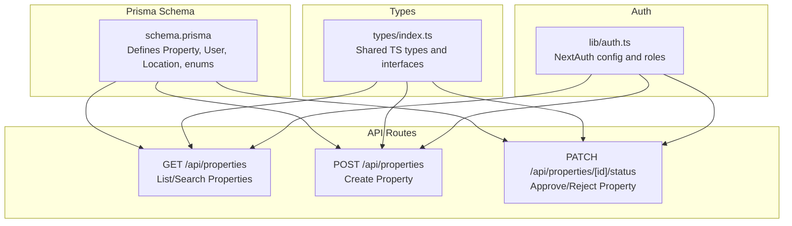
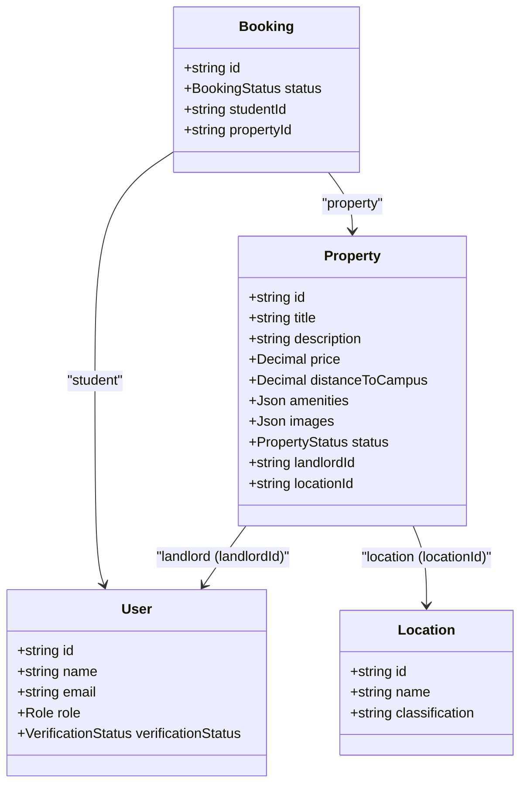
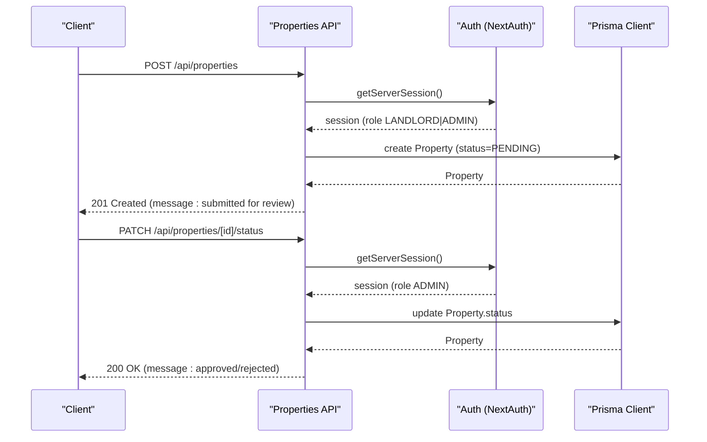
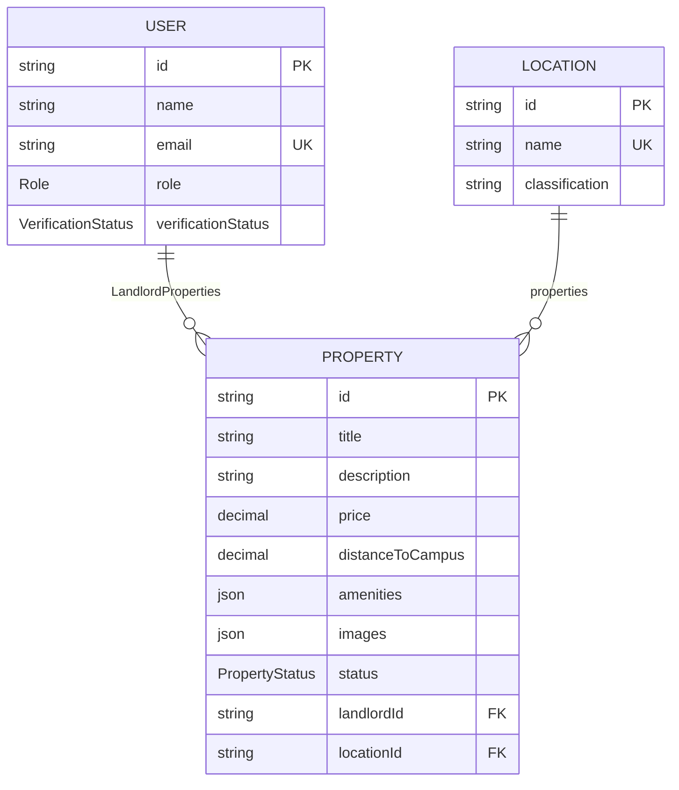
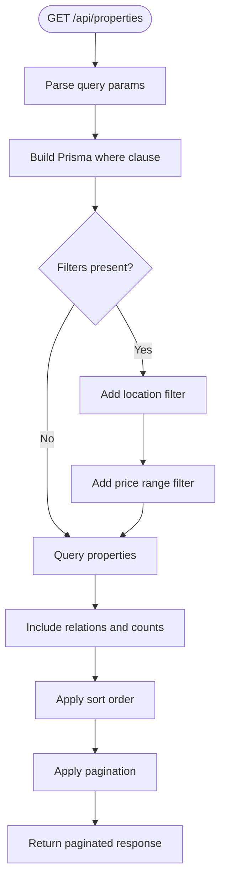
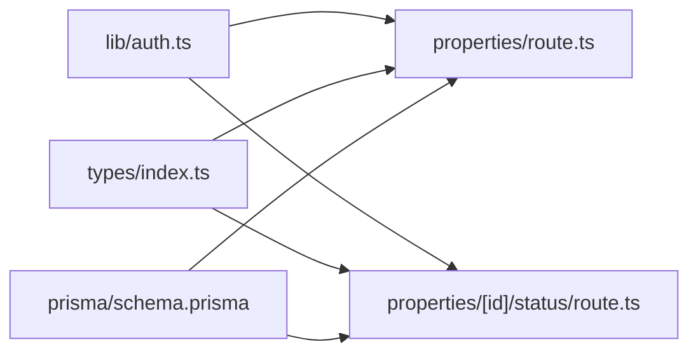

# Property Entity

<cite>
**Referenced Files in This Document**
- [schema.prisma](file://prisma/schema.prisma)
- [route.ts](file://src/app/api/properties/route.ts)
- [route.ts](file://src/app/api/properties/[id]/status/route.ts)
- [index.ts](file://src/types/index.ts)
- [auth.ts](file://src/lib/auth.ts)
- [seed.ts](file://prisma/seed.ts)
</cite>

## Table of Contents
1. [Introduction](#introduction)
2. [Project Structure](#project-structure)
3. [Core Components](#core-components)
4. [Architecture Overview](#architecture-overview)
5. [Detailed Component Analysis](#detailed-component-analysis)
6. [Dependency Analysis](#dependency-analysis)
7. [Performance Considerations](#performance-considerations)
8. [Troubleshooting Guide](#troubleshooting-guide)
9. [Conclusion](#conclusion)

## Introduction
This document provides comprehensive documentation for the Property entity in RentalHub-BOUESTI. It covers the Property model definition, the PropertyStatus enum and its approval workflow, foreign key relationships with User (landlord) and Location, field constraints and data types, JSON field structures for amenities and images, indexing strategies for performance, and practical examples for creation, approval, and search filtering.

## Project Structure
The Property entity is defined in the Prisma schema and exposed via Next.js API routes. Type definitions and shared interfaces are centralized in a dedicated types module. Authentication and role-based access control are configured in the auth module.

**Diagram sources**
- [schema.prisma:79-108](file://prisma/schema.prisma#L79-L108)
- [route.ts:14-64](file://src/app/api/properties/route.ts#L14-L64)
- [route.ts:68-118](file://src/app/api/properties/route.ts#L68-L118)
- [route.ts:17-51](file://src/app/api/properties/[id]/status/route.ts#L17-L51)
- [index.ts:26-42](file://src/types/index.ts#L26-L42)
- [auth.ts:14-90](file://src/lib/auth.ts#L14-L90)

**Section sources**
- [schema.prisma:79-108](file://prisma/schema.prisma#L79-L108)
- [route.ts:14-64](file://src/app/api/properties/route.ts#L14-L64)
- [route.ts:68-118](file://src/app/api/properties/route.ts#L68-L118)
- [route.ts:17-51](file://src/app/api/properties/[id]/status/route.ts#L17-L51)
- [index.ts:26-42](file://src/types/index.ts#L26-L42)
- [auth.ts:14-90](file://src/lib/auth.ts#L14-L90)

## Core Components
- Property model: Core entity representing rental listings with metadata, pricing, location, and status.
- PropertyStatus enum: Lifecycle states for property listings (PENDING, APPROVED, REJECTED).
- Foreign keys: landlordId (User), locationId (Location).
- JSON fields: amenities (JSON array of strings), images (JSON array of URLs).
- Indexes: Optimized for landlord queries, location queries, status filtering, and price-based sorting.

**Section sources**
- [schema.prisma:79-108](file://prisma/schema.prisma#L79-L108)
- [schema.prisma:29-33](file://prisma/schema.prisma#L29-L33)

## Architecture Overview
The Property entity integrates with User and Location through foreign keys. API routes enforce role-based access control and implement listing, creation, and approval workflows. Types define safe user exposure and response shapes.

**Diagram sources**
- [schema.prisma:44-61](file://prisma/schema.prisma#L44-L61)
- [schema.prisma:64-77](file://prisma/schema.prisma#L64-L77)
- [schema.prisma:79-108](file://prisma/schema.prisma#L79-L108)
- [schema.prisma:111-129](file://prisma/schema.prisma#L111-L129)

## Detailed Component Analysis

### Property Model Definition
- Identity and metadata
  - id: String, auto-generated unique identifier.
  - title: String, required.
  - description: String (Text), required.
  - createdAt/updatedAt: Timestamps managed automatically.
- Pricing and proximity
  - price: Decimal (precision 10, scale 2), required monthly rent in NGN.
  - distanceToCampus: Decimal (precision 5, scale 2), optional distance in km to campus.
- Content and media
  - amenities: Json, default empty array of strings (e.g., ["WiFi", "Water"]).
  - images: Json, default empty array of URLs.
- Status and lifecycle
  - status: PropertyStatus enum, default PENDING.
- Foreign keys
  - landlordId: String, required (User).
  - locationId: String, required (Location).
- Relations
  - landlord: User (relation "LandlordProperties").
  - location: Location.
  - bookings: Booking[].
- Indexes
  - @@index([landlordId])
  - @@index([locationId])
  - @@index([status])
  - @@index([price])

**Section sources**
- [schema.prisma:79-108](file://prisma/schema.prisma#L79-L108)

### PropertyStatus Enum and Approval Workflow
- Enum values: PENDING, APPROVED, REJECTED.
- Default status: PENDING upon creation.
- Approval workflow
  - Creation: POST /api/properties sets status to PENDING.
  - Review: PATCH /api/properties/[id]/status updates status to APPROVED or REJECTED.
  - Access control: Only ADMIN can modify status.
  - Response includes landlord contact and location for notifications.

**Diagram sources**
- [route.ts:68-118](file://src/app/api/properties/route.ts#L68-L118)
- [route.ts:17-51](file://src/app/api/properties/[id]/status/route.ts#L17-L51)
- [auth.ts:14-90](file://src/lib/auth.ts#L14-L90)

**Section sources**
- [schema.prisma:29-33](file://prisma/schema.prisma#L29-L33)
- [route.ts:68-118](file://src/app/api/properties/route.ts#L68-L118)
- [route.ts:17-51](file://src/app/api/properties/[id]/status/route.ts#L17-L51)
- [auth.ts:14-90](file://src/lib/auth.ts#L14-L90)

### Foreign Key Relationships
- Landlord (User)
  - Property.landlordId references User.id.
  - onDelete: Cascade ensures cleanup when a user is removed.
- Location
  - Property.locationId references Location.id.
- Reverse relations
  - User.properties (LandlordProperties).
  - Location.properties.

**Diagram sources**
- [schema.prisma:44-61](file://prisma/schema.prisma#L44-L61)
- [schema.prisma:64-77](file://prisma/schema.prisma#L64-L77)
- [schema.prisma:79-108](file://prisma/schema.prisma#L79-L108)

**Section sources**
- [schema.prisma:94-101](file://prisma/schema.prisma#L94-L101)

### Field Constraints, Data Types, Defaults, and JSON Structures
- Data types and defaults
  - title: String, required.
  - description: String (Text), required.
  - price: Decimal(10,2), required.
  - distanceToCampus: Decimal(5,2), nullable.
  - amenities: Json, default "[]".
  - images: Json, default "[]".
  - status: PropertyStatus enum, default PENDING.
  - createdAt/updatedAt: DateTime defaults.
- JSON structures
  - amenities: Array of strings (e.g., ["WiFi", "Water"]).
  - images: Array of URLs (e.g., ["https://.../img1.jpg", "https://.../img2.png"]).
- Validation and sanitization
  - Creation endpoint trims title and description.
  - Requires locationId and validates existence.
  - Enforces numeric conversion for distanceToCampus.

**Section sources**
- [schema.prisma:82-89](file://prisma/schema.prisma#L82-L89)
- [route.ts:80-108](file://src/app/api/properties/route.ts#L80-L108)

### API Endpoints and Filtering
- GET /api/properties
  - Filters: location (substring), minPrice, maxPrice, status (default APPROVED).
  - Pagination: page, pageSize (bounded).
  - Sorting: price, createdAt, distanceToCampus (asc/desc).
  - Includes: landlord (safe profile), location, booking count.
- POST /api/properties
  - Requires authenticated LANDLORD or ADMIN.
  - Creates with status=PENDING.
- PATCH /api/properties/[id]/status
  - Requires ADMIN.
  - Updates status to APPROVED or REJECTED.

**Diagram sources**
- [route.ts:14-64](file://src/app/api/properties/route.ts#L14-L64)

**Section sources**
- [route.ts:14-64](file://src/app/api/properties/route.ts#L14-L64)
- [route.ts:68-118](file://src/app/api/properties/route.ts#L68-L118)
- [route.ts:17-51](file://src/app/api/properties/[id]/status/route.ts#L17-L51)

### Types and Interfaces
- SafeUser excludes sensitive fields (e.g., password).
- PropertyWithRelations augments Property with landlord, location, and booking count.
- ApiResponse and PaginatedResponse standardize API responses.
- PropertySearchParams defines query parameters for listing.
- PropertyFormData defines request payload for creation.

**Section sources**
- [index.ts:24-58](file://src/types/index.ts#L24-L58)
- [index.ts:96-104](file://src/types/index.ts#L96-L104)

### Authentication and Authorization
- NextAuth configuration supports role-based access control.
- Property creation requires LANDLORD or ADMIN.
- Status updates require ADMIN.
- Session includes role and verification status for runtime checks.

**Section sources**
- [auth.ts:14-90](file://src/lib/auth.ts#L14-L90)
- [route.ts:68-78](file://src/app/api/properties/route.ts#L68-L78)
- [route.ts:25-27](file://src/app/api/properties/[id]/status/route.ts#L25-L27)

## Dependency Analysis
- Internal dependencies
  - API routes depend on Prisma client and NextAuth session.
  - Types module centralizes shared types used across routes.
- External dependencies
  - Prisma client for database operations.
  - NextAuth for authentication and role enforcement.
- Coupling and cohesion
  - Property API routes encapsulate creation, listing, and approval logic.
  - Types module reduces duplication and improves type safety.

**Diagram sources**
- [auth.ts:14-90](file://src/lib/auth.ts#L14-L90)
- [route.ts:14-64](file://src/app/api/properties/route.ts#L14-L64)
- [route.ts:17-51](file://src/app/api/properties/[id]/status/route.ts#L17-L51)
- [index.ts:26-42](file://src/types/index.ts#L26-L42)
- [schema.prisma:79-108](file://prisma/schema.prisma#L79-L108)

**Section sources**
- [auth.ts:14-90](file://src/lib/auth.ts#L14-L90)
- [route.ts:14-64](file://src/app/api/properties/route.ts#L14-L64)
- [route.ts:17-51](file://src/app/api/properties/[id]/status/route.ts#L17-L51)
- [index.ts:26-42](file://src/types/index.ts#L26-L42)
- [schema.prisma:79-108](file://prisma/schema.prisma#L79-L108)

## Performance Considerations
- Indexes
  - @@index([landlordId]): Efficiently fetch a landlord’s properties.
  - @@index([locationId]): Efficiently filter by location.
  - @@index([status]): Efficiently filter approved listings for browsing.
  - @@index([price]): Supports price-based sorting and range queries.
- Query patterns
  - Listing endpoint applies filters and pagination to limit result set.
  - Includes relations selectively to avoid N+1 issues.
- JSON fields
  - Amenities and images are stored as JSON arrays; consider normalization if frequent structured queries are needed.
- Recommendations
  - Add composite indexes for frequently combined filters (e.g., status + locationId).
  - Consider adding indexes on JSON fields if querying JSON content becomes common.

**Section sources**
- [schema.prisma:103-107](file://prisma/schema.prisma#L103-L107)
- [route.ts:27-48](file://src/app/api/properties/route.ts#L27-L48)

## Troubleshooting Guide
- Authentication errors
  - 401 Unauthorized: Ensure a valid session exists.
  - 403 Forbidden: Verify user role is LANDLORD or ADMIN for creation; ADMIN for status updates.
- Validation errors
  - 400 Bad Request: Missing required fields (title, description, price, locationId) or invalid locationId.
  - Invalid status value: Only PENDING, APPROVED, REJECTED are accepted for status updates.
- Database errors
  - Location not found: Confirm locationId exists in the database.
  - Prisma errors: Check logs for detailed messages and adjust queries accordingly.
- Response shape
  - Use ApiResponse and PaginatedResponse interfaces to parse standardized responses.

**Section sources**
- [route.ts:72-78](file://src/app/api/properties/route.ts#L72-L78)
- [route.ts:90-93](file://src/app/api/properties/route.ts#L90-L93)
- [route.ts:32-34](file://src/app/api/properties/[id]/status/route.ts#L32-L34)
- [index.ts:45-58](file://src/types/index.ts#L45-L58)

## Conclusion
The Property entity in RentalHub-BOUESTI is designed with clear constraints, robust relationships, and efficient indexing for common queries. The approval workflow ensures controlled listing publication, while role-based access control protects administrative functions. The API routes provide a consistent interface for creation, listing, and approval, backed by shared types and authentication configuration.