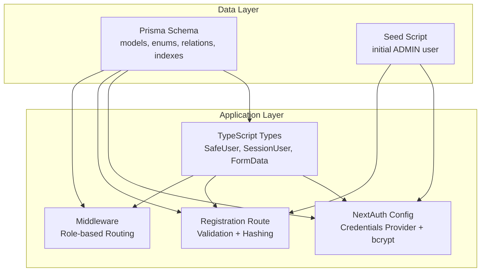
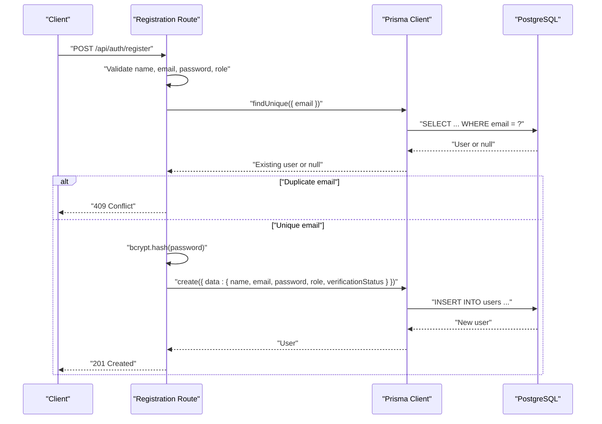
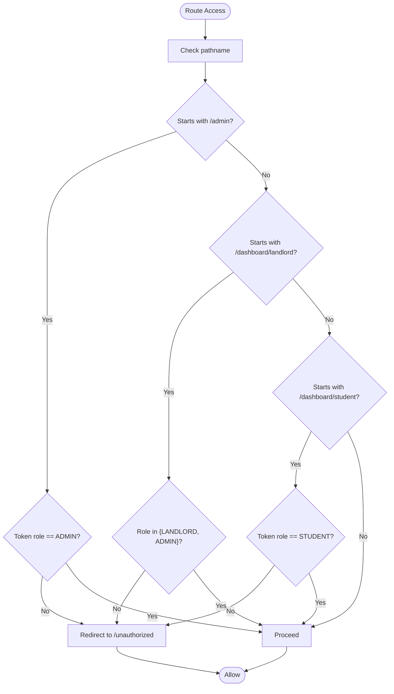
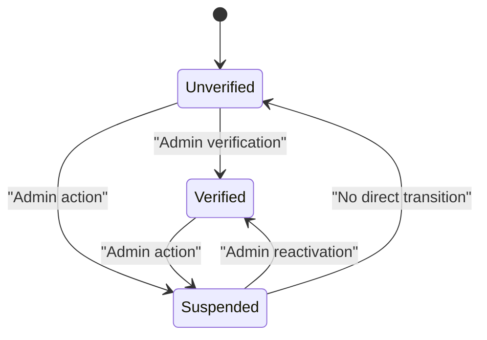
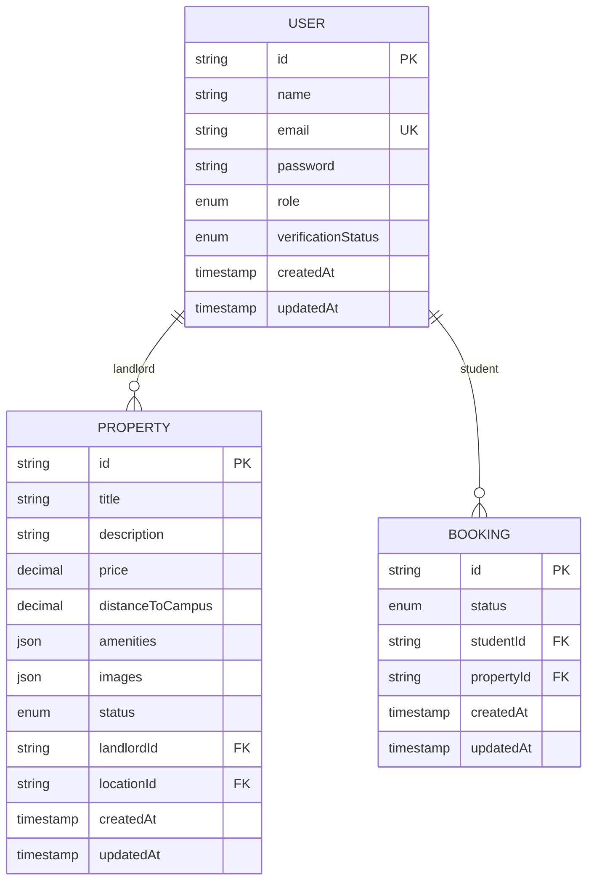
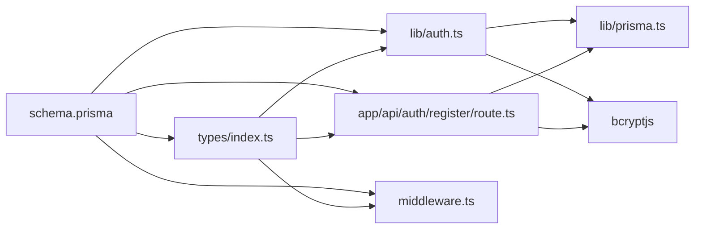

# User Entity

<cite>
**Referenced Files in This Document**
- [schema.prisma](file://prisma/schema.prisma)
- [seed.ts](file://prisma/seed.ts)
- [index.ts](file://src/types/index.ts)
- [prisma.ts](file://src/lib/prisma.ts)
- [auth.ts](file://src/lib/auth.ts)
- [register.route.ts](file://src/app/api/auth/register/route.ts)
- [middleware.ts](file://src/middleware.ts)
</cite>

## Table of Contents
1. [Introduction](#introduction)
2. [Project Structure](#project-structure)
3. [Core Components](#core-components)
4. [Architecture Overview](#architecture-overview)
5. [Detailed Component Analysis](#detailed-component-analysis)
6. [Dependency Analysis](#dependency-analysis)
7. [Performance Considerations](#performance-considerations)
8. [Troubleshooting Guide](#troubleshooting-guide)
9. [Conclusion](#conclusion)

## Introduction
This document provides comprehensive documentation for the User entity in RentalHub-BOUESTI. It covers the User model structure, role-based access control (RBAC), verification status lifecycle, field constraints, data types, defaults, validation rules, relationships with Property and Booking, indexing strategies, security considerations for password storage, and cascading operations. It also includes practical examples for user creation, role assignment, and verification workflows.

## Project Structure
The User entity is defined in the Prisma schema and is used across the application for authentication, authorization, and data modeling. Supporting files include:
- Prisma schema defining models, enums, relations, and indexes
- Seed script for creating an initial ADMIN user
- Type definitions for safe user exposure and API shapes
- Authentication configuration using NextAuth.js with bcrypt
- Registration endpoint enforcing validation and password hashing
- Middleware enforcing role-based routing restrictions

**Diagram sources**
- [schema.prisma:44-61](file://prisma/schema.prisma#L44-L61)
- [seed.ts:61-122](file://prisma/seed.ts#L61-L122)
- [index.ts:23-80](file://src/types/index.ts#L23-L80)
- [auth.ts:14-90](file://src/lib/auth.ts#L14-L90)
- [register.route.ts:20-89](file://src/app/api/auth/register/route.ts#L20-L89)
- [middleware.ts:11-38](file://src/middleware.ts#L11-L38)

**Section sources**
- [schema.prisma:1-130](file://prisma/schema.prisma#L1-L130)
- [seed.ts:1-143](file://prisma/seed.ts#L1-L143)
- [index.ts:1-109](file://src/types/index.ts#L1-L109)
- [prisma.ts:1-27](file://src/lib/prisma.ts#L1-L27)
- [auth.ts:1-117](file://src/lib/auth.ts#L1-L117)
- [register.route.ts:1-90](file://src/app/api/auth/register/route.ts#L1-L90)
- [middleware.ts:1-48](file://src/middleware.ts#L1-L48)

## Core Components
- User model fields and defaults:
  - id: String, unique identifier
  - name: String
  - email: String, unique
  - password: String (bcrypt-hashed)
  - role: Role enum with default STUDENT
  - verificationStatus: VerificationStatus enum with default UNVERIFIED
  - createdAt: DateTime, default now
  - updatedAt: DateTime, auto-updated
- Enums:
  - Role: STUDENT, LANDLORD, ADMIN
  - VerificationStatus: UNVERIFIED, VERIFIED, SUSPENDED
- Relationships:
  - User has many Property (as landlord)
  - User has many Booking (as student)
- Indexes:
  - email
  - role
- Security:
  - Passwords are hashed with bcrypt before storage
  - NextAuth.js handles session tokens and JWT claims
- Cascading:
  - Property.landlordId references User.id with onDelete: Cascade
  - Booking.studentId references User.id with onDelete: Cascade

**Section sources**
- [schema.prisma:44-61](file://prisma/schema.prisma#L44-L61)
- [schema.prisma:17-27](file://prisma/schema.prisma#L17-L27)
- [schema.prisma:99-101](file://prisma/schema.prisma#L99-L101)
- [schema.prisma:122-123](file://prisma/schema.prisma#L122-L123)

## Architecture Overview
The User entity participates in a layered architecture:
- Data layer: Prisma schema defines the User model and its relations
- Application layer: NextAuth.js authenticates users and manages sessions
- API layer: Registration endpoint validates inputs, checks uniqueness, hashes passwords, and persists the User
- Access control: Middleware enforces role-based routing restrictions

**Diagram sources**
- [register.route.ts:20-89](file://src/app/api/auth/register/route.ts#L20-L89)
- [prisma.ts:13-24](file://src/lib/prisma.ts#L13-L24)
- [schema.prisma:44-61](file://prisma/schema.prisma#L44-L61)

## Detailed Component Analysis

### User Model Definition and Constraints
- Fields and types:
  - id: String, @id, @default(cuid())
  - name: String
  - email: String, @unique
  - password: String (bcrypt-hashed)
  - role: Role, @default(STUDENT)
  - verificationStatus: VerificationStatus, @default(UNVERIFIED)
  - createdAt: DateTime, @default(now())
  - updatedAt: DateTime, @updatedAt
- Defaults:
  - role defaults to STUDENT
  - verificationStatus defaults to UNVERIFIED
- Constraints:
  - email uniqueness enforced by @unique
  - password must be stored hashed (never plain text)
- Validation rules:
  - Registration endpoint requires name, email, password, and a valid role
  - Password length minimum is 8 characters
  - Email is normalized to lowercase and trimmed

**Section sources**
- [schema.prisma:44-61](file://prisma/schema.prisma#L44-L61)
- [register.route.ts:25-45](file://src/app/api/auth/register/route.ts#L25-L45)

### Role-Based Access Control (RBAC)
- Roles:
  - STUDENT: can access student dashboard routes
  - LANDLORD: can access landlord dashboard routes
  - ADMIN: can access admin routes and has elevated privileges
- Middleware enforcement:
  - Routes under /admin require ADMIN
  - Routes under /dashboard/landlord require LANDLORD or ADMIN
  - Routes under /dashboard/student require STUDENT
- Session and JWT:
  - NextAuth stores role and verificationStatus in JWT claims
  - Session user object includes role and verificationStatus

**Diagram sources**
- [middleware.ts:11-38](file://src/middleware.ts#L11-L38)
- [auth.ts:55-72](file://src/lib/auth.ts#L55-L72)

**Section sources**
- [middleware.ts:16-29](file://src/middleware.ts#L16-L29)
- [auth.ts:55-72](file://src/lib/auth.ts#L55-L72)

### Verification Status Lifecycle
- Enum values:
  - UNVERIFIED: default upon registration
  - VERIFIED: verified user (e.g., ADMIN created via seed)
  - SUSPENDED: account temporarily blocked
- Impact on permissions:
  - Authentication rejects SUSPENDED users
  - Middleware does not restrict by verificationStatus; RBAC is role-based
- Typical workflow:
  - New registrations default to UNVERIFIED
  - ADMIN can verify accounts (not shown in provided files)
  - If verification is required for certain actions, implement additional checks

**Diagram sources**
- [schema.prisma:23-27](file://prisma/schema.prisma#L23-L27)
- [auth.ts:40-42](file://src/lib/auth.ts#L40-L42)
- [seed.ts:61-67](file://prisma/seed.ts#L61-L67)

**Section sources**
- [schema.prisma:23-27](file://prisma/schema.prisma#L23-L27)
- [auth.ts:40-42](file://src/lib/auth.ts#L40-L42)
- [seed.ts:61-67](file://prisma/seed.ts#L61-L67)

### Relationships with Property and Booking
- User -> Property (landlord):
  - Relation name: "LandlordProperties"
  - Foreign key: Property.landlordId
  - onDelete: Cascade
- User -> Booking (student):
  - Relation name: "StudentBookings"
  - Foreign key: Booking.studentId
  - onDelete: Cascade
- Implications:
  - Deleting a User cascades to associated Properties and Bookings
  - Queries can fetch related entities via relations

**Diagram sources**
- [schema.prisma:44-61](file://prisma/schema.prisma#L44-L61)
- [schema.prisma:80-108](file://prisma/schema.prisma#L80-L108)
- [schema.prisma:111-129](file://prisma/schema.prisma#L111-L129)

**Section sources**
- [schema.prisma:54-56](file://prisma/schema.prisma#L54-L56)
- [schema.prisma:99](file://prisma/schema.prisma#L99)
- [schema.prisma:122](file://prisma/schema.prisma#L122)

### Indexing Strategies
- User indexes:
  - email: unique index
  - role: index for filtering by role
- Property indexes:
  - landlordId, locationId, status, price
- Booking indexes:
  - studentId, propertyId, status
- Purpose:
  - Optimize lookups for authentication, role filtering, and relation queries

**Section sources**
- [schema.prisma:58-59](file://prisma/schema.prisma#L58-L59)
- [schema.prisma:103-107](file://prisma/schema.prisma#L103-L107)
- [schema.prisma:125-127](file://prisma/schema.prisma#L125-L127)

### Security Considerations for Password Storage
- Password hashing:
  - bcrypt is used to hash passwords during registration and authentication
  - Passwords are never stored in plain text
- Token-based session:
  - NextAuth.js uses JWT strategy with a configurable secret
  - Session and JWT carry role and verificationStatus for downstream checks
- Additional recommendations:
  - Enforce strong password policies
  - Rotate NEXTAUTH_SECRET regularly
  - Limit session age and refresh intervals as needed

**Section sources**
- [register.route.ts:58](file://src/app/api/auth/register/route.ts#L58)
- [auth.ts:35](file://src/lib/auth.ts#L35)
- [auth.ts:81-85](file://src/lib/auth.ts#L81-L85)

### Cascading Operations
- Property.landlordId references User.id with onDelete: Cascade
- Booking.studentId references User.id with onDelete: Cascade
- Behavior:
  - Deleting a User deletes all associated Properties and Bookings
- Impact:
  - Prevents orphaned records
  - Requires careful consideration when deleting users

**Section sources**
- [schema.prisma:99](file://prisma/schema.prisma#L99)
- [schema.prisma:122](file://prisma/schema.prisma#L122)

### Examples

#### Example 1: User Creation and Role Assignment
- Steps:
  - Client sends POST to /api/auth/register with name, email, password, and role
  - Server validates inputs, normalizes email, checks uniqueness, hashes password, and creates User with default verificationStatus UNVERIFIED
  - Response returns the created user without sensitive fields
- Notes:
  - ADMIN role is not selectable via the registration endpoint; it is reserved for seeding or direct DB access

**Section sources**
- [register.route.ts:20-89](file://src/app/api/auth/register/route.ts#L20-L89)
- [schema.prisma:49-50](file://prisma/schema.prisma#L49-L50)

#### Example 2: Role Assignment Workflow
- STUDENT:
  - Accesses /dashboard/student routes
- LANDLORD:
  - Accesses /dashboard/landlord routes
- ADMIN:
  - Accesses /admin routes and routes under /dashboard/landlord
- Enforcement:
  - Middleware redirects unauthorized users to /unauthorized

**Section sources**
- [middleware.ts:16-29](file://src/middleware.ts#L16-L29)

#### Example 3: Verification Workflow
- Default state:
  - Newly registered users have verificationStatus UNVERIFIED
- Verification:
  - ADMIN can mark users as VERIFIED (seed script demonstrates VERIFIED for the default admin)
- Suspension:
  - Authentication rejects SUSPENDED users
- Recommendation:
  - Implement admin endpoints to update verificationStatus for STUDENT and LANDLORD users

**Section sources**
- [schema.prisma:66](file://prisma/schema.prisma#L66)
- [auth.ts:40-42](file://src/lib/auth.ts#L40-L42)
- [seed.ts:106-121](file://prisma/seed.ts#L106-L121)

## Dependency Analysis
- Internal dependencies:
  - Prisma schema defines User, enums, relations, and indexes
  - Types expose SafeUser and SessionUser for secure data transfer
  - NextAuth.js integrates with Prisma and bcrypt for authentication
  - Registration route depends on Prisma client and bcrypt
  - Middleware depends on NextAuth tokens for role checks
- External dependencies:
  - bcryptjs for password hashing
  - NextAuth.js for session management and JWT
  - Prisma Client for database operations

**Diagram sources**
- [schema.prisma:44-61](file://prisma/schema.prisma#L44-L61)
- [index.ts:9-18](file://src/types/index.ts#L9-L18)
- [auth.ts:10-11](file://src/lib/auth.ts#L10-L11)
- [register.route.ts:9-10](file://src/app/api/auth/register/route.ts#L9-L10)
- [prisma.ts:9](file://src/lib/prisma.ts#L9)

**Section sources**
- [index.ts:9-18](file://src/types/index.ts#L9-L18)
- [auth.ts:10-11](file://src/lib/auth.ts#L10-L11)
- [register.route.ts:9-10](file://src/app/api/auth/register/route.ts#L9-L10)
- [prisma.ts:9](file://src/lib/prisma.ts#L9)

## Performance Considerations
- Index usage:
  - email and role indexes optimize authentication and role-based queries
  - Property and Booking indexes support efficient filtering and joins
- Password hashing cost:
  - bcrypt cost factor is set to balance security and performance
- Session strategy:
  - JWT-based sessions reduce database round-trips for authenticated requests
- Recommendations:
  - Monitor slow queries on email and role filters
  - Consider adding composite indexes if frequently querying role + verificationStatus combinations

[No sources needed since this section provides general guidance]

## Troubleshooting Guide
- Authentication failures:
  - Missing email or password triggers explicit errors
  - Nonexistent email or incorrect password are rejected
  - SUSPENDED users are rejected during login
- Registration issues:
  - Duplicate email returns 409 Conflict
  - Missing or invalid inputs return 400 Bad Request
  - Password shorter than 8 characters is rejected
- Authorization issues:
  - Middleware redirects unauthorized users to /unauthorized
  - Ensure NEXTAUTH_SECRET is configured for session signing

**Section sources**
- [auth.ts:22-50](file://src/lib/auth.ts#L22-L50)
- [register.route.ts:25-45](file://src/app/api/auth/register/route.ts#L25-L45)
- [register.route.ts:49-56](file://src/app/api/auth/register/route.ts#L49-L56)
- [middleware.ts:17-29](file://src/middleware.ts#L17-L29)

## Conclusion
The User entity in RentalHub-BOUESTI is designed with clear RBAC and verification controls, robust security practices for password storage, and well-defined relationships with Property and Booking. The combination of Prisma schema, NextAuth.js, and middleware ensures secure and scalable user management. Administrators can leverage the seed script to provision an initial ADMIN user and extend verification workflows as needed.