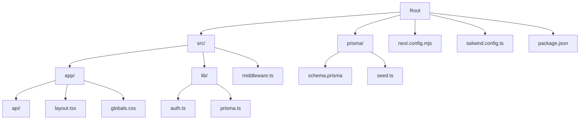
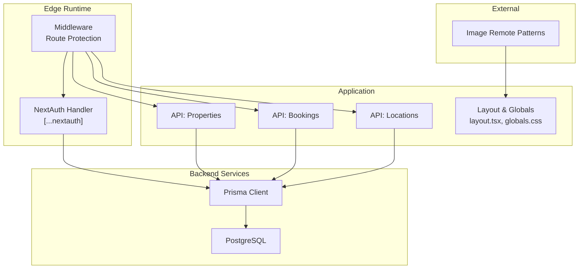
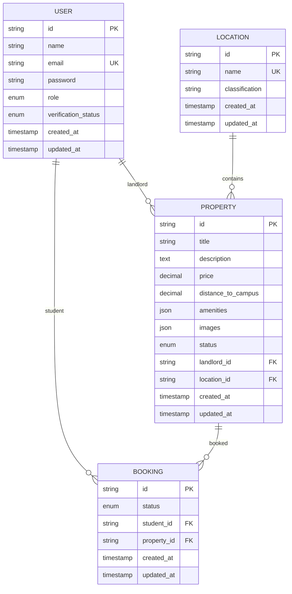
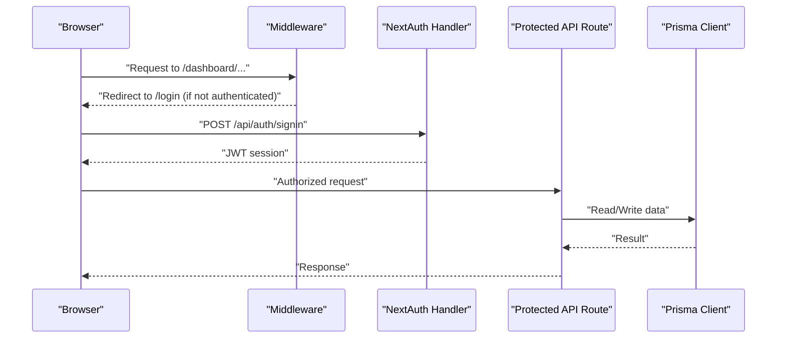
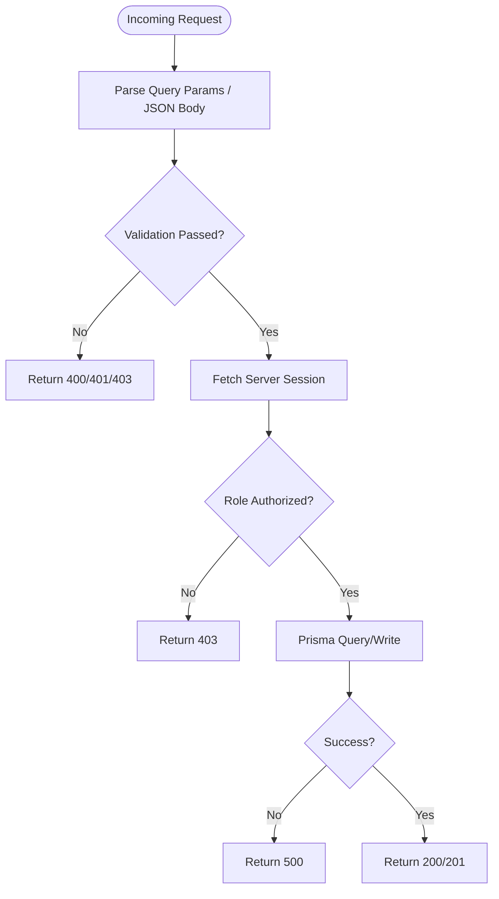
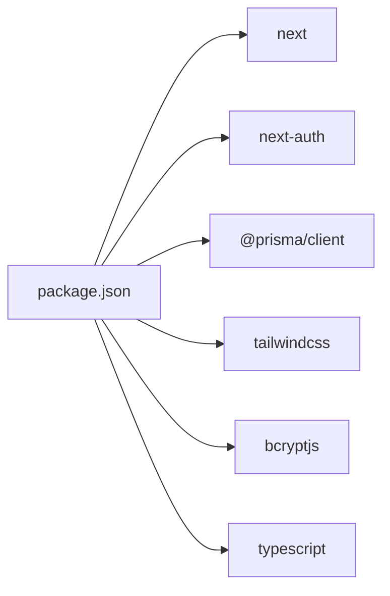

# Deployment & Production

<cite>
**Referenced Files in This Document**
- [package.json](file://package.json)
- [next.config.mjs](file://next.config.mjs)
- [tailwind.config.ts](file://tailwind.config.ts)
- [prisma/schema.prisma](file://prisma/schema.prisma)
- [prisma/seed.ts](file://prisma/seed.ts)
- [src/lib/prisma.ts](file://src/lib/prisma.ts)
- [src/lib/auth.ts](file://src/lib/auth.ts)
- [src/middleware.ts](file://src/middleware.ts)
- [src/app/api/auth/[...nextauth]/route.ts](file://src/app/api/auth/[...nextauth]/route.ts)
- [src/app/api/properties/route.ts](file://src/app/api/properties/route.ts)
- [src/app/api/bookings/route.ts](file://src/app/api/bookings/route.ts)
- [src/app/api/locations/route.ts](file://src/app/api/locations/route.ts)
- [src/app/layout.tsx](file://src/app/layout.tsx)
- [src/app/globals.css](file://src/app/globals.css)
</cite>

## Table of Contents
1. [Introduction](#introduction)
2. [Project Structure](#project-structure)
3. [Core Components](#core-components)
4. [Architecture Overview](#architecture-overview)
5. [Detailed Component Analysis](#detailed-component-analysis)
6. [Dependency Analysis](#dependency-analysis)
7. [Performance Considerations](#performance-considerations)
8. [Troubleshooting Guide](#troubleshooting-guide)
9. [Conclusion](#conclusion)
10. [Appendices](#appendices)

## Introduction
This document provides comprehensive deployment and production guidance for RentalHub-BOUESTI. It covers the build process, environment configuration, database deployment and migrations, security hardening, deployment strategies for Next.js (including static generation and server-side rendering), monitoring and performance optimization, scaling and load balancing, SSL/TLS configuration, production debugging, and CI/CD automation. The guidance is grounded in the repository’s configuration and source files.

## Project Structure
RentalHub-BOUESTI is a Next.js 15 application using TypeScript, Prisma ORM, and NextAuth.js for authentication. The repository is organized into:
- Application code under src/, including pages, API routes, middleware, and shared libraries
- Prisma schema and seed script under prisma/
- Build-time configuration for Next.js and Tailwind CSS
- Package scripts for local development and database operations

**Diagram sources**
- [package.json:1-41](file://package.json#L1-L41)
- [next.config.mjs:1-14](file://next.config.mjs#L1-L14)
- [tailwind.config.ts:1-51](file://tailwind.config.ts#L1-L51)
- [prisma/schema.prisma:1-130](file://prisma/schema.prisma#L1-L130)
- [prisma/seed.ts:1-143](file://prisma/seed.ts#L1-L143)
- [src/lib/prisma.ts:1-27](file://src/lib/prisma.ts#L1-L27)
- [src/lib/auth.ts:1-117](file://src/lib/auth.ts#L1-L117)
- [src/middleware.ts:1-48](file://src/middleware.ts#L1-L48)
- [src/app/layout.tsx:1-42](file://src/app/layout.tsx#L1-L42)
- [src/app/globals.css:1-246](file://src/app/globals.css#L1-L246)

**Section sources**
- [package.json:1-41](file://package.json#L1-L41)
- [next.config.mjs:1-14](file://next.config.mjs#L1-L14)
- [tailwind.config.ts:1-51](file://tailwind.config.ts#L1-L51)
- [prisma/schema.prisma:1-130](file://prisma/schema.prisma#L1-L130)
- [prisma/seed.ts:1-143](file://prisma/seed.ts#L1-L143)
- [src/lib/prisma.ts:1-27](file://src/lib/prisma.ts#L1-L27)
- [src/lib/auth.ts:1-117](file://src/lib/auth.ts#L1-L117)
- [src/middleware.ts:1-48](file://src/middleware.ts#L1-L48)
- [src/app/layout.tsx:1-42](file://src/app/layout.tsx#L1-L42)
- [src/app/globals.css:1-246](file://src/app/globals.css#L1-L246)

## Core Components
- Next.js runtime and build configuration
- Prisma ORM with PostgreSQL datasource
- Authentication via NextAuth.js with JWT sessions
- Edge middleware for route protection
- API routes for properties, bookings, and locations
- Shared Prisma client singleton and Tailwind CSS configuration

Key production-relevant aspects:
- Environment variables for DATABASE_URL and NEXTAUTH_SECRET
- Prisma client lifecycle and logging
- NextAuth.js configuration and session strategy
- Middleware route protection and unauthorized redirection
- API route authorization and role checks

**Section sources**
- [package.json:16-18](file://package.json#L16-L18)
- [prisma/schema.prisma:10-13](file://prisma/schema.prisma#L10-L13)
- [src/lib/prisma.ts:13-26](file://src/lib/prisma.ts#L13-L26)
- [src/lib/auth.ts:81-89](file://src/lib/auth.ts#L81-L89)
- [src/middleware.ts:11-38](file://src/middleware.ts#L11-L38)
- [src/app/api/properties/route.ts:68-118](file://src/app/api/properties/route.ts#L68-L118)
- [src/app/api/bookings/route.ts:47-108](file://src/app/api/bookings/route.ts#L47-L108)
- [src/app/api/locations/route.ts:11-28](file://src/app/api/locations/route.ts#L11-L28)

## Architecture Overview
The production architecture centers on a Next.js application serving both static and dynamic content, with API routes handling business logic and database interactions through Prisma. Authentication is enforced via middleware and protected endpoints.

**Diagram sources**
- [src/middleware.ts:11-38](file://src/middleware.ts#L11-L38)
- [src/app/api/auth/[...nextauth]/route.ts:1-7](file://src/app/api/auth/[...nextauth]/route.ts#L1-L7)
- [src/app/layout.tsx:1-42](file://src/app/layout.tsx#L1-L42)
- [src/app/globals.css:1-246](file://src/app/globals.css#L1-L246)
- [src/app/api/properties/route.ts:14-64](file://src/app/api/properties/route.ts#L14-L64)
- [src/app/api/bookings/route.ts:11-45](file://src/app/api/bookings/route.ts#L11-L45)
- [src/app/api/locations/route.ts:11-28](file://src/app/api/locations/route.ts#L11-L28)
- [src/lib/prisma.ts:13-26](file://src/lib/prisma.ts#L13-L26)
- [prisma/schema.prisma:10-13](file://prisma/schema.prisma#L10-L13)

## Detailed Component Analysis

### Database Layer
- Datasource: PostgreSQL via Prisma
- Environment variable: DATABASE_URL
- Client lifecycle: Singleton with global caching in non-production environments
- Indexes and relations defined in schema for performance and referential integrity

**Diagram sources**
- [prisma/schema.prisma:44-61](file://prisma/schema.prisma#L44-L61)
- [prisma/schema.prisma:64-77](file://prisma/schema.prisma#L64-L77)
- [prisma/schema.prisma:80-108](file://prisma/schema.prisma#L80-L108)
- [prisma/schema.prisma:111-129](file://prisma/schema.prisma#L111-L129)

**Section sources**
- [prisma/schema.prisma:10-13](file://prisma/schema.prisma#L10-L13)
- [prisma/schema.prisma:44-61](file://prisma/schema.prisma#L44-L61)
- [prisma/schema.prisma:64-77](file://prisma/schema.prisma#L64-L77)
- [prisma/schema.prisma:80-108](file://prisma/schema.prisma#L80-L108)
- [prisma/schema.prisma:111-129](file://prisma/schema.prisma#L111-L129)
- [src/lib/prisma.ts:13-26](file://src/lib/prisma.ts#L13-L26)

### Authentication and Authorization
- NextAuth.js with Credentials provider and JWT sessions
- Session strategy: JWT with max age and refresh window
- Secret sourced from environment variable
- Middleware enforces role-based access and redirects unauthenticated users
- Protected API routes validate roles and session state

**Diagram sources**
- [src/middleware.ts:11-38](file://src/middleware.ts#L11-L38)
- [src/app/api/auth/[...nextauth]/route.ts:1-7](file://src/app/api/auth/[...nextauth]/route.ts#L1-L7)
- [src/lib/auth.ts:14-90](file://src/lib/auth.ts#L14-L90)
- [src/app/api/properties/route.ts:68-118](file://src/app/api/properties/route.ts#L68-L118)
- [src/app/api/bookings/route.ts:47-108](file://src/app/api/bookings/route.ts#L47-L108)
- [src/lib/prisma.ts:13-26](file://src/lib/prisma.ts#L13-L26)

**Section sources**
- [src/lib/auth.ts:14-90](file://src/lib/auth.ts#L14-L90)
- [src/middleware.ts:11-38](file://src/middleware.ts#L11-L38)
- [src/app/api/auth/[...nextauth]/route.ts:1-7](file://src/app/api/auth/[...nextauth]/route.ts#L1-L7)
- [src/app/api/properties/route.ts:68-118](file://src/app/api/properties/route.ts#L68-L118)
- [src/app/api/bookings/route.ts:47-108](file://src/app/api/bookings/route.ts#L47-L108)

### API Routes and Business Logic
- Properties: GET supports filtering, sorting, pagination; POST requires landlord/admin role
- Bookings: GET lists per-role; POST validates property availability and uniqueness
- Locations: GET returns classifications and names for UI

**Diagram sources**
- [src/app/api/properties/route.ts:14-64](file://src/app/api/properties/route.ts#L14-L64)
- [src/app/api/properties/route.ts:68-118](file://src/app/api/properties/route.ts#L68-L118)
- [src/app/api/bookings/route.ts:11-45](file://src/app/api/bookings/route.ts#L11-L45)
- [src/app/api/bookings/route.ts:47-108](file://src/app/api/bookings/route.ts#L47-L108)
- [src/app/api/locations/route.ts:11-28](file://src/app/api/locations/route.ts#L11-L28)

**Section sources**
- [src/app/api/properties/route.ts:14-118](file://src/app/api/properties/route.ts#L14-L118)
- [src/app/api/bookings/route.ts:11-108](file://src/app/api/bookings/route.ts#L11-L108)
- [src/app/api/locations/route.ts:11-28](file://src/app/api/locations/route.ts#L11-L28)

### Frontend and Build Configuration
- Next.js configuration allows remote images from HTTPS hosts
- Tailwind CSS configured for content paths and custom brand colors
- Global styles and layout metadata defined centrally

**Section sources**
- [next.config.mjs:3-10](file://next.config.mjs#L3-L10)
- [tailwind.config.ts:3-48](file://tailwind.config.ts#L3-L48)
- [src/app/layout.tsx:4-25](file://src/app/layout.tsx#L4-L25)
- [src/app/globals.css:1-246](file://src/app/globals.css#L1-L246)

## Dependency Analysis
- Next.js runtime and framework dependencies
- Prisma client and database provider
- NextAuth.js for authentication
- Tailwind CSS for styling
- bcrypt for password hashing in auth flow

**Diagram sources**
- [package.json:19-39](file://package.json#L19-L39)

**Section sources**
- [package.json:19-39](file://package.json#L19-L39)

## Performance Considerations
- Prisma client logging reduced in production to minimize overhead
- Middleware runs at Edge runtime for fast route protection
- API routes use server-side session retrieval and Prisma queries
- Tailwind CSS purged via content globs to reduce bundle size
- Next.js image optimization enabled for HTTPS remote patterns

Recommendations:
- Enable Next.js static export where feasible for read-heavy pages
- Use database indexes defined in schema for frequent filters (e.g., status, price)
- Implement pagination and limit page sizes in API routes
- Cache non-sensitive data at CDN edge where appropriate
- Monitor Prisma query durations and slow logs

**Section sources**
- [src/lib/prisma.ts:16-20](file://src/lib/prisma.ts#L16-L20)
- [src/middleware.ts:8-38](file://src/middleware.ts#L8-L38)
- [tailwind.config.ts:3-7](file://tailwind.config.ts#L3-L7)
- [next.config.mjs:3-10](file://next.config.mjs#L3-L10)

## Troubleshooting Guide
Common production issues and remedies:
- Authentication failures
  - Verify NEXTAUTH_SECRET is set and consistent across instances
  - Confirm database connectivity via DATABASE_URL
  - Check session cookie domain/path and SameSite settings if using reverse proxies
- Database connectivity
  - Ensure Prisma client can connect to PostgreSQL
  - Review Prisma client logs and error messages
- Middleware redirect loops
  - Validate middleware matcher paths and session presence
  - Confirm unauthorized route handling returns correct status codes
- API errors
  - Inspect 401/403 responses for missing or invalid sessions
  - Verify role-based access logic in protected routes
- Image loading issues
  - Confirm remotePattern allows intended hostnames

**Section sources**
- [src/lib/auth.ts:87-90](file://src/lib/auth.ts#L87-L90)
- [prisma/schema.prisma:10-13](file://prisma/schema.prisma#L10-L13)
- [src/middleware.ts:40-47](file://src/middleware.ts#L40-L47)
- [src/app/api/properties/route.ts:68-118](file://src/app/api/properties/route.ts#L68-L118)
- [src/app/api/bookings/route.ts:47-108](file://src/app/api/bookings/route.ts#L47-L108)
- [next.config.mjs:3-10](file://next.config.mjs#L3-L10)

## Conclusion
RentalHub-BOUESTI is structured for secure, scalable production deployment using Next.js, Prisma, and NextAuth.js. By following the environment configuration, database migration and seeding procedures, security hardening steps, and operational practices outlined here, teams can reliably deploy and maintain the platform in production.

## Appendices

### A. Build and Environment Configuration
- Build commands
  - Development: next dev
  - Production build: next build
  - Production start: next start
- Environment variables
  - DATABASE_URL: PostgreSQL connection string
  - NEXTAUTH_SECRET: Secret for signing JWT tokens
- Scripts
  - Prisma generate, push, migrate, seed, and studio

**Section sources**
- [package.json:5-14](file://package.json#L5-L14)
- [package.json:16-18](file://package.json#L16-L18)
- [prisma/schema.prisma:10-13](file://prisma/schema.prisma#L10-L13)
- [src/lib/auth.ts:87-90](file://src/lib/auth.ts#L87-L90)

### B. Database Deployment and Migration
- Prisma schema defines PostgreSQL provider and models
- Migrations
  - Use Prisma migrations for schema changes in production
  - Apply migrations during deployment pipeline
- Seeding
  - Seed initial locations and admin user for new environments
- Backups
  - Schedule regular logical backups of PostgreSQL
  - Store encrypted offsite and test restore procedures

**Section sources**
- [prisma/schema.prisma:6-13](file://prisma/schema.prisma#L6-L13)
- [prisma/seed.ts:126-142](file://prisma/seed.ts#L126-L142)

### C. Security Hardening
- Secrets management
  - Store DATABASE_URL and NEXTAUTH_SECRET in environment vaults
  - Rotate secrets periodically
- Transport security
  - Enforce HTTPS at the load balancer or CDN
  - Configure HSTS and secure cookies
- Access control
  - Middleware and API route guards enforce roles
  - Limit exposed API surface and sanitize inputs
- Logging and monitoring
  - Reduce Prisma client verbosity in production
  - Centralize logs and alert on authentication and database errors

**Section sources**
- [prisma/schema.prisma:10-13](file://prisma/schema.prisma#L10-L13)
- [src/lib/auth.ts:81-89](file://src/lib/auth.ts#L81-L89)
- [src/middleware.ts:11-38](file://src/middleware.ts#L11-L38)
- [src/lib/prisma.ts:16-20](file://src/lib/prisma.ts#L16-L20)

### D. Deployment Strategies
- Next.js
  - Static export for read-heavy pages where applicable
  - Server-side rendering for dynamic content with authentication
- Load balancing
  - Stateless Next.js instances behind a load balancer
  - Sticky sessions optional if relying on JWT
- SSL/TLS
  - Terminate TLS at load balancer or CDN; forward proper headers
- Blue-green or rolling deployments
  - Zero-downtime updates by switching traffic after health checks

[No sources needed since this section provides general guidance]

### E. Monitoring and Observability
- Metrics
  - Track response times, error rates, and database query latency
- Logs
  - Centralized logging for application and database
- Alerts
  - Monitor authentication failures, database connectivity, and critical errors

[No sources needed since this section provides general guidance]

### F. Scaling Considerations
- Horizontal scaling
  - Stateless application servers scale horizontally
- Database scaling
  - Use managed PostgreSQL with read replicas for reporting
- Caching
  - Cache non-sensitive data at CDN and application level

[No sources needed since this section provides general guidance]

### G. Production Debugging Techniques
- Enable debug logs temporarily for NextAuth in controlled scenarios
- Use structured logs with correlation IDs
- Validate environment variables at startup
- Test authentication flows and middleware behavior in staging

**Section sources**
- [src/lib/auth.ts:89](file://src/lib/auth.ts#L89)

### H. CI/CD Pipeline Setup
- Build
  - Install dependencies, run linters, build Next.js
- Test
  - Run database migrations in CI and seed test data if needed
- Deploy
  - Deploy to production with blue-green or rolling strategy
  - Promote successful deployment automatically
- Release
  - Tag releases and publish artifacts

[No sources needed since this section provides general guidance]