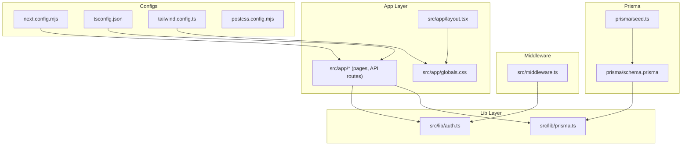
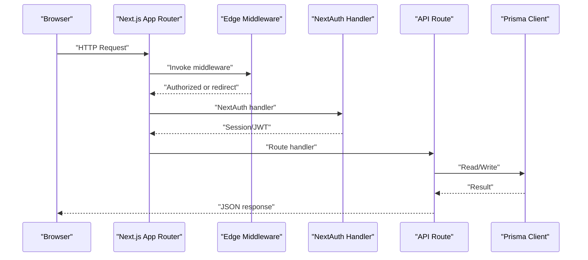
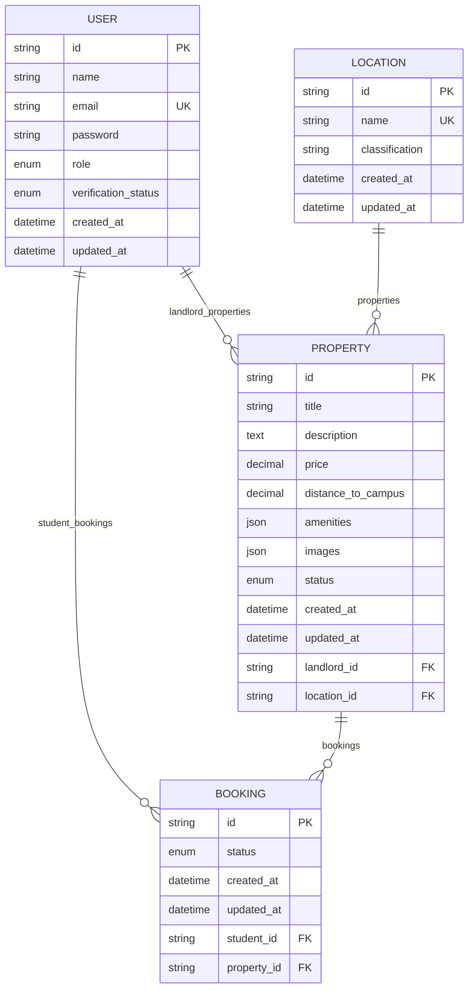
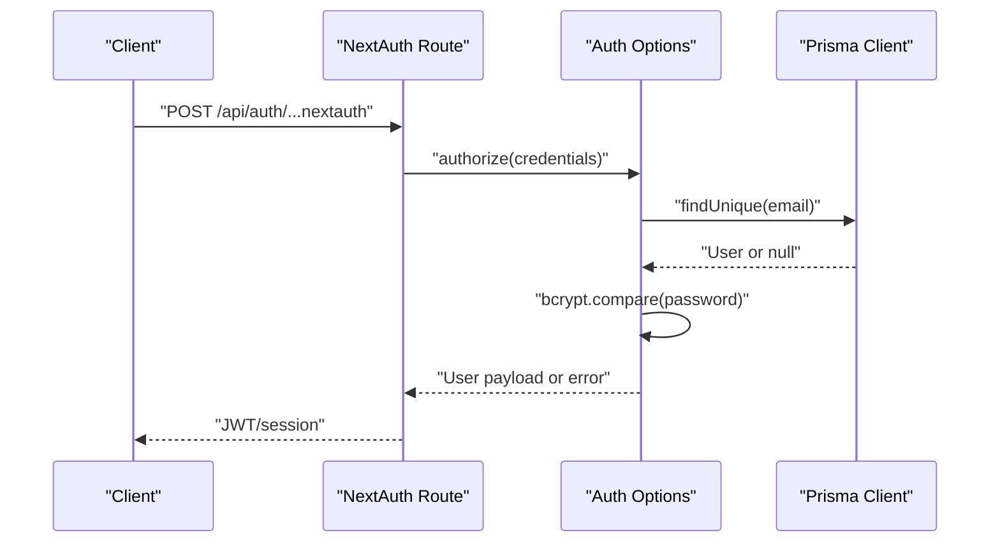
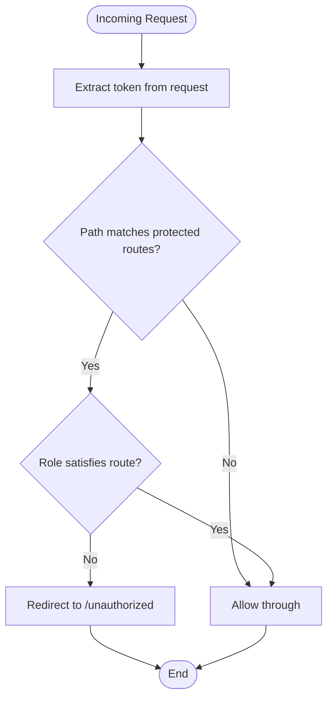
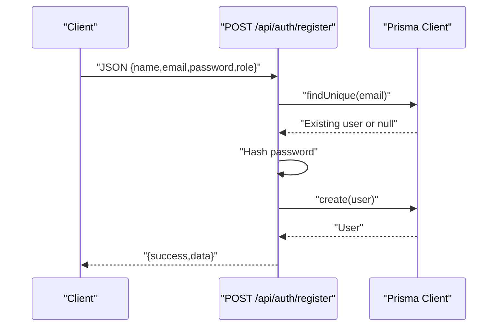
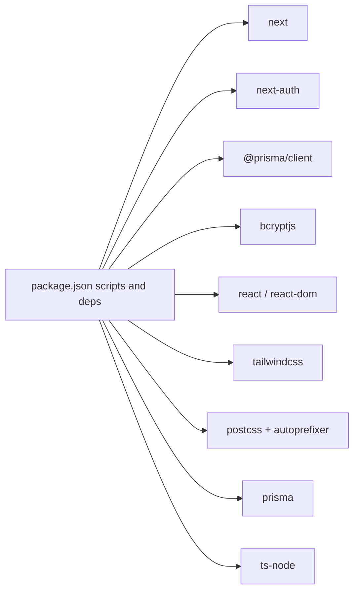

# Development Workflow & Configuration

<cite>
**Referenced Files in This Document**
- [package.json](file://package.json)
- [next.config.mjs](file://next.config.mjs)
- [tsconfig.json](file://tsconfig.json)
- [tailwind.config.ts](file://tailwind.config.ts)
- [postcss.config.mjs](file://postcss.config.mjs)
- [prisma/schema.prisma](file://prisma/schema.prisma)
- [prisma/seed.ts](file://prisma/seed.ts)
- [src/lib/prisma.ts](file://src/lib/prisma.ts)
- [src/lib/auth.ts](file://src/lib/auth.ts)
- [src/middleware.ts](file://src/middleware.ts)
- [src/app/layout.tsx](file://src/app/layout.tsx)
- [src/app/globals.css](file://src/app/globals.css)
- [src/app/api/auth/[...nextauth]/route.ts](file://src/app/api/auth/[...nextauth]/route.ts)
- [src/app/api/auth/register/route.ts](file://src/app/api/auth/register/route.ts)
- [src/app/api/properties/route.ts](file://src/app/api/properties/route.ts)
</cite>

## Table of Contents
1. [Introduction](#introduction)
2. [Project Structure](#project-structure)
3. [Core Components](#core-components)
4. [Architecture Overview](#architecture-overview)
5. [Detailed Component Analysis](#detailed-component-analysis)
6. [Dependency Analysis](#dependency-analysis)
7. [Performance Considerations](#performance-considerations)
8. [Troubleshooting Guide](#troubleshooting-guide)
9. [Conclusion](#conclusion)
10. [Appendices](#appendices)

## Introduction
This document describes the development workflow and configuration for RentalHub-BOUESTI. It covers environment setup, build and run commands, Next.js configuration, TypeScript compilation, Tailwind CSS customization, Prisma integration, development scripts, hot reloading, debugging, testing strategies, code organization, ESLint configuration, collaboration best practices, environment variable management, database migrations, and CI considerations.

## Project Structure
The project follows a Next.js App Router structure with a clear separation of concerns:
- Application pages and API routes under src/app
- Shared libraries under src/lib
- Middleware under src/middleware.ts
- Global styles under src/app/globals.css
- Tailwind and PostCSS configuration under tailwind.config.ts and postcss.config.mjs
- Prisma schema and seed under prisma/

**Diagram sources**
- [src/app/layout.tsx:1-42](file://src/app/layout.tsx#L1-L42)
- [src/app/globals.css:1-246](file://src/app/globals.css#L1-L246)
- [src/lib/auth.ts:1-117](file://src/lib/auth.ts#L1-L117)
- [src/lib/prisma.ts:1-27](file://src/lib/prisma.ts#L1-L27)
- [src/middleware.ts:1-48](file://src/middleware.ts#L1-L48)
- [next.config.mjs:1-14](file://next.config.mjs#L1-L14)
- [tsconfig.json:1-27](file://tsconfig.json#L1-L27)
- [tailwind.config.ts:1-51](file://tailwind.config.ts#L1-L51)
- [postcss.config.mjs:1-7](file://postcss.config.mjs#L1-L7)
- [prisma/schema.prisma:1-130](file://prisma/schema.prisma#L1-L130)
- [prisma/seed.ts:1-143](file://prisma/seed.ts#L1-L143)

**Section sources**
- [package.json:1-41](file://package.json#L1-L41)
- [next.config.mjs:1-14](file://next.config.mjs#L1-L14)
- [tsconfig.json:1-27](file://tsconfig.json#L1-L27)
- [tailwind.config.ts:1-51](file://tailwind.config.ts#L1-L51)
- [postcss.config.mjs:1-7](file://postcss.config.mjs#L1-L7)
- [prisma/schema.prisma:1-130](file://prisma/schema.prisma#L1-L130)

## Core Components
- Next.js configuration: Remote image pattern allows HTTPS assets globally.
- TypeScript configuration: Strict mode, esnext modules, bundler resolution, path aliases, and incremental builds.
- Tailwind CSS: Content scanning across app, components, and pages; custom brand and primary palette; Inter and Outfit fonts; gradient backgrounds; extensive utility classes.
- Prisma: PostgreSQL datasource via DATABASE_URL; enums for roles and statuses; model relations; singleton client with development logging and global caching.
- Authentication: NextAuth.js with Credentials provider, bcrypt hashing, JWT session strategy, and protected pages.
- Middleware: Edge middleware enforcing role-based access to dashboards and protected routes.

**Section sources**
- [next.config.mjs:1-14](file://next.config.mjs#L1-L14)
- [tsconfig.json:1-27](file://tsconfig.json#L1-L27)
- [tailwind.config.ts:1-51](file://tailwind.config.ts#L1-L51)
- [prisma/schema.prisma:1-130](file://prisma/schema.prisma#L1-L130)
- [src/lib/prisma.ts:1-27](file://src/lib/prisma.ts#L1-L27)
- [src/lib/auth.ts:1-117](file://src/lib/auth.ts#L1-L117)
- [src/middleware.ts:1-48](file://src/middleware.ts#L1-L48)

## Architecture Overview
The runtime architecture integrates Next.js App Router, middleware, API routes, authentication, and database access through Prisma.

**Diagram sources**
- [src/middleware.ts:1-48](file://src/middleware.ts#L1-L48)
- [src/app/api/auth/[...nextauth]/route.ts](file://src/app/api/auth/[...nextauth]/route.ts#L1-L7)
- [src/app/api/properties/route.ts:1-119](file://src/app/api/properties/route.ts#L1-L119)
- [src/lib/prisma.ts:1-27](file://src/lib/prisma.ts#L1-L27)

## Detailed Component Analysis

### Next.js Configuration
- Remote image patterns: Allows loading images from any HTTPS host.
- Impacts: Simplifies asset delivery for property images and user avatars.

**Section sources**
- [next.config.mjs:1-14](file://next.config.mjs#L1-L14)

### TypeScript Compilation Settings
- Strict mode enabled for safer code.
- No emit to leverage Next’s compile-time type checking.
- Bundler module resolution and esnext modules align with Next.js runtime.
- Path aliases (@/*) simplify imports.
- Incremental builds improve rebuild performance.

**Section sources**
- [tsconfig.json:1-27](file://tsconfig.json#L1-L27)

### Tailwind CSS Customization
- Content globs scan app, pages, and components for unused CSS.
- Theme extensions:
  - Brand and primary color palettes with 50–950 shades.
  - Inter and Outfit as sans and heading fonts.
  - Gradient utilities.
- Extensive utility classes for buttons, cards, inputs, badges, containers, gradients, and animations.
- Global CSS defines CSS variables and base resets; Tailwind layers apply utilities consistently.

**Section sources**
- [tailwind.config.ts:1-51](file://tailwind.config.ts#L1-L51)
- [src/app/globals.css:1-246](file://src/app/globals.css#L1-L246)

### Prisma Integration
- Datasource: PostgreSQL via DATABASE_URL environment variable.
- Models: User, Location, Property, Booking with relations and indexes.
- Enums: Role, VerificationStatus, PropertyStatus, BookingStatus.
- Client singleton:
  - Development logs queries, errors, warnings.
  - Global caching avoids reconnect exhaustion during hot reload.
- Seed script:
  - Upserts locations around BOUESTI.
  - Creates a default admin user with hashed password.
  - Provides console feedback and exits on failure.

**Diagram sources**
- [prisma/schema.prisma:1-130](file://prisma/schema.prisma#L1-L130)

**Section sources**
- [prisma/schema.prisma:1-130](file://prisma/schema.prisma#L1-L130)
- [src/lib/prisma.ts:1-27](file://src/lib/prisma.ts#L1-L27)
- [prisma/seed.ts:1-143](file://prisma/seed.ts#L1-L143)

### Authentication with NextAuth.js
- Provider: Credentials with email/password.
- Authorization flow:
  - Validates presence of credentials.
  - Fetches user by normalized email.
  - Compares bcrypt hash.
  - Rejects suspended accounts.
- Callbacks:
  - Attach role and verification status to JWT and session.
- Pages: Redirects to /login for sign-in/sign-out/error.
- Session: JWT strategy with max age and refresh window.
- Secret: NEXTAUTH_SECRET environment variable.
- Debug: Enabled in development.

**Diagram sources**
- [src/app/api/auth/[...nextauth]/route.ts](file://src/app/api/auth/[...nextauth]/route.ts#L1-L7)
- [src/lib/auth.ts:1-117](file://src/lib/auth.ts#L1-L117)
- [src/lib/prisma.ts:1-27](file://src/lib/prisma.ts#L1-L27)

**Section sources**
- [src/lib/auth.ts:1-117](file://src/lib/auth.ts#L1-L117)
- [src/app/api/auth/[...nextauth]/route.ts](file://src/app/api/auth/[...nextauth]/route.ts#L1-L7)

### Middleware and Role-Based Access Control
- Protects routes under /dashboard, /admin, /properties/new, and /bookings.
- Redirects unauthenticated users to /login.
- Enforces role checks:
  - Admin-only: /admin
  - Landlord-only: /dashboard/landlord
  - Student-only: /dashboard/student
- Unauthorized access redirects to /unauthorized.

**Diagram sources**
- [src/middleware.ts:1-48](file://src/middleware.ts#L1-L48)

**Section sources**
- [src/middleware.ts:1-48](file://src/middleware.ts#L1-L48)

### API Routes and Business Logic
- Registration endpoint:
  - Validates name, email, password, and role.
  - Checks uniqueness and hashes password.
  - Returns created user data.
- Properties endpoint:
  - GET: Lists approved properties with filters (location, price range), pagination, sorting.
  - POST: Creates a property submission for landlords/admins; validates location existence.

**Diagram sources**
- [src/app/api/auth/register/route.ts:1-90](file://src/app/api/auth/register/route.ts#L1-L90)
- [src/lib/prisma.ts:1-27](file://src/lib/prisma.ts#L1-L27)

**Section sources**
- [src/app/api/auth/register/route.ts:1-90](file://src/app/api/auth/register/route.ts#L1-L90)
- [src/app/api/properties/route.ts:1-119](file://src/app/api/properties/route.ts#L1-L119)

### Global Styles and Layout
- Global CSS imports Inter and Outfit fonts.
- Defines CSS custom properties for brand and typography.
- Tailwind layers apply base, components, and utilities.
- Root layout sets metadata, Open Graph, and language attributes.

**Section sources**
- [src/app/globals.css:1-246](file://src/app/globals.css#L1-L246)
- [src/app/layout.tsx:1-42](file://src/app/layout.tsx#L1-L42)

## Dependency Analysis
Key runtime dependencies and their roles:
- next: App runtime and routing.
- next-auth: Authentication and session management.
- @prisma/client: Database client.
- bcryptjs: Password hashing.
- react, react-dom: UI framework.
- tailwindcss, postcss, autoprefixer: Styling pipeline.
- prisma: Database schema and client generation.
- ts-node: Running TypeScript seed script.

**Diagram sources**
- [package.json:1-41](file://package.json#L1-L41)

**Section sources**
- [package.json:1-41](file://package.json#L1-L41)

## Performance Considerations
- Prisma singleton with global caching reduces connection churn during hot reload in development.
- Tailwind content scanning scoped to app, pages, and components keeps build size manageable.
- Next.js incremental builds and strict TypeScript configuration speed up type-checking.
- Middleware runs at edge for fast route protection.

[No sources needed since this section provides general guidance]

## Troubleshooting Guide
- Authentication failures:
  - Verify NEXTAUTH_SECRET is set in environment.
  - Confirm bcrypt hashing and user lookup logic.
- Database connectivity:
  - Ensure DATABASE_URL is configured.
  - Use Prisma CLI commands to generate, migrate, and seed.
- Middleware redirection loops:
  - Check protected route matchers and role checks.
- Build/lint issues:
  - Review TypeScript strictness and path aliases.
  - Run lint and fix reported issues.

**Section sources**
- [src/lib/auth.ts:1-117](file://src/lib/auth.ts#L1-L117)
- [src/lib/prisma.ts:1-27](file://src/lib/prisma.ts#L1-L27)
- [src/middleware.ts:1-48](file://src/middleware.ts#L1-L48)
- [package.json:1-41](file://package.json#L1-L41)

## Conclusion
RentalHub-BOUESTI leverages Next.js App Router with a clean separation of concerns, robust authentication via NextAuth.js, a strongly typed backend with Prisma, and a customizable Tailwind-based design system. The provided scripts and configurations streamline local development, testing, and deployment preparation.

[No sources needed since this section summarizes without analyzing specific files]

## Appendices

### Development Environment Setup
- Install dependencies: Use the package manager to install all dependencies declared in the project.
- Environment variables:
  - DATABASE_URL: PostgreSQL connection string.
  - NEXTAUTH_SECRET: Cryptographic secret for sessions.
- Initialize Prisma:
  - Generate Prisma client.
  - Apply migrations.
  - Seed initial data.

**Section sources**
- [package.json:1-41](file://package.json#L1-L41)
- [prisma/schema.prisma:1-130](file://prisma/schema.prisma#L1-L130)
- [prisma/seed.ts:1-143](file://prisma/seed.ts#L1-L143)

### Build and Run Commands
- Development: Starts Next.js dev server with hot reloading.
- Production build: Compiles the application for production.
- Production start: Runs the compiled application.
- Lint: Runs ESLint on the project.
- Prisma:
  - Generate client.
  - Push schema to database.
  - Create and apply migrations.
  - Seed database.
  - Open Prisma Studio.

**Section sources**
- [package.json:1-41](file://package.json#L1-L41)

### Hot Reloading and Debugging
- Hot reloading: Next.js dev server automatically reloads on file changes.
- Debugging:
  - Enable NextAuth debug in development.
  - Leverage Prisma client logs in development.
  - Use browser devtools and network tab for API diagnostics.

**Section sources**
- [src/lib/auth.ts:1-117](file://src/lib/auth.ts#L1-L117)
- [src/lib/prisma.ts:1-27](file://src/lib/prisma.ts#L1-L27)

### Testing Strategies
- Unit tests: Place unit tests alongside components or in a dedicated test directory.
- Integration tests: Test API routes with mocked Prisma client.
- E2E tests: Use Playwright/Cypress to validate user flows (login, property browsing, registration).
- Linting: Use ESLint with Next.js recommended config to enforce style and correctness.

**Section sources**
- [package.json:1-41](file://package.json#L1-L41)

### Code Organization Patterns
- Feature-based grouping under src/app for pages and API routes.
- Shared logic under src/lib (authentication, database client).
- Middleware for cross-cutting concerns (routing, permissions).
- Global styles and Tailwind utilities for consistent UI.

**Section sources**
- [src/app/layout.tsx:1-42](file://src/app/layout.tsx#L1-L42)
- [src/app/globals.css:1-246](file://src/app/globals.css#L1-L246)
- [src/lib/auth.ts:1-117](file://src/lib/auth.ts#L1-L117)
- [src/lib/prisma.ts:1-27](file://src/lib/prisma.ts#L1-L27)
- [src/middleware.ts:1-48](file://src/middleware.ts#L1-L48)

### ESLint Configuration
- Installed eslint and eslint-config-next.
- Run lint to detect and report issues.
- Configure overrides and rules as needed for the project.

**Section sources**
- [package.json:1-41](file://package.json#L1-L41)

### Best Practices for Team Collaboration
- Branching strategy: Feature branches merged via pull requests.
- Commit hygiene: Atomic commits with clear messages.
- Code reviews: Require reviews for authentication, middleware, and database changes.
- Secrets management: Store DATABASE_URL and NEXTAUTH_SECRET in environment variables, not in code.
- Dependency updates: Regularly update dependencies and run tests.

**Section sources**
- [package.json:1-41](file://package.json#L1-L41)
- [src/lib/auth.ts:1-117](file://src/lib/auth.ts#L1-L117)
- [src/middleware.ts:1-48](file://src/middleware.ts#L1-L48)
- [prisma/schema.prisma:1-130](file://prisma/schema.prisma#L1-L130)

### Environment Variable Management
- Required variables:
  - DATABASE_URL: PostgreSQL connection string.
  - NEXTAUTH_SECRET: Secret for signing sessions.
- Recommended practice: Use a secrets manager or platform-managed variables in production.

**Section sources**
- [prisma/schema.prisma:1-130](file://prisma/schema.prisma#L1-L130)
- [src/lib/auth.ts:1-117](file://src/lib/auth.ts#L1-L117)

### Database Migration Workflow
- Generate Prisma client after schema changes.
- Create and commit migrations.
- Apply migrations to staging/production environments.
- Seed data after schema initialization.

**Section sources**
- [package.json:1-41](file://package.json#L1-L41)
- [prisma/schema.prisma:1-130](file://prisma/schema.prisma#L1-L130)
- [prisma/seed.ts:1-143](file://prisma/seed.ts#L1-L143)

### Continuous Integration Considerations
- Lint and type-check on every push.
- Run tests in CI; fail on lint/type/test failures.
- Prepare Prisma migrations in CI; apply safely to target environments.
- Build and cache artifacts for faster deployments.

**Section sources**
- [package.json:1-41](file://package.json#L1-L41)