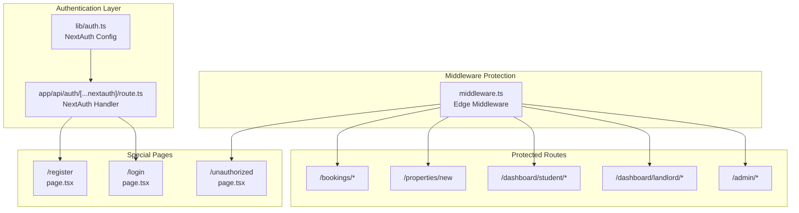
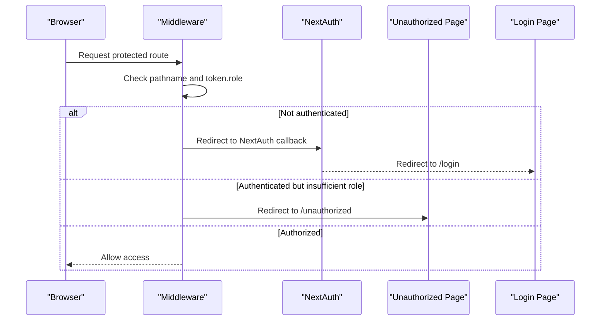
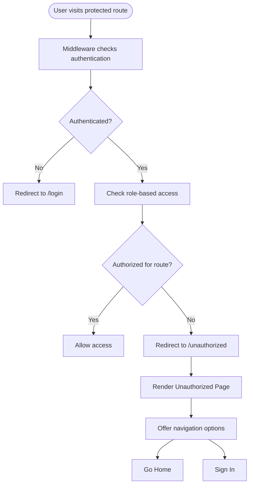
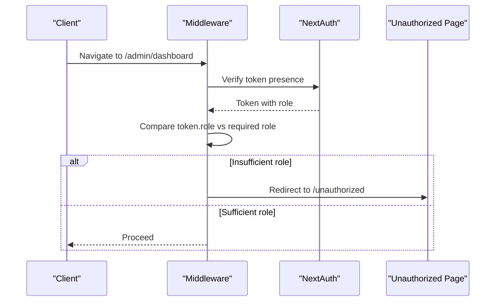
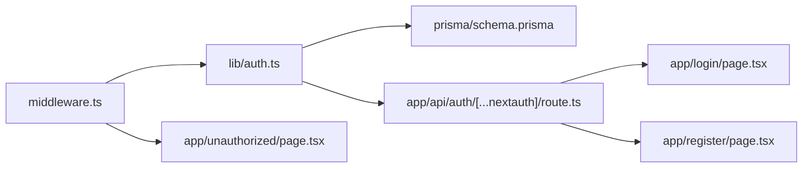

# Access Control & Special Pages

<cite>
**Referenced Files in This Document**
- [middleware.ts](file://src/middleware.ts)
- [page.tsx](file://src/app/unauthorized/page.tsx)
- [auth.ts](file://src/lib/auth.ts)
- [route.ts](file://src/app/api/auth/[...nextauth]/route.ts)
- [layout.tsx](file://src/app/layout.tsx)
- [page.tsx](file://src/app/login/page.tsx)
- [page.tsx](file://src/app/register/page.tsx)
- [route.ts](file://src/app/api/auth/register/route.ts)
- [schema.prisma](file://prisma/schema.prisma)
</cite>

## Table of Contents
1. [Introduction](#introduction)
2. [Project Structure](#project-structure)
3. [Core Components](#core-components)
4. [Architecture Overview](#architecture-overview)
5. [Detailed Component Analysis](#detailed-component-analysis)
6. [Dependency Analysis](#dependency-analysis)
7. [Performance Considerations](#performance-considerations)
8. [Troubleshooting Guide](#troubleshooting-guide)
9. [Conclusion](#conclusion)

## Introduction
This document explains the unauthorized access handling and special pages functionality in the RentalHub BOUESTI application. It covers how the system prevents unauthorized access to protected routes, how the unauthorized page is triggered and presented, and how users can recover from access-denied scenarios. The documentation focuses on the middleware protection mechanism, role-based visibility controls, session validation, and the user experience considerations for access-denied situations.

## Project Structure
The access control and special pages functionality spans several key areas:
- Middleware that enforces authentication and role-based access to protected routes
- An unauthorized page that informs users when they lack permission
- Authentication configuration that manages sessions and roles
- Login and registration pages that integrate with the authentication system
- Database schema that defines user roles and verification statuses

**Diagram sources**
- [middleware.ts:1-48](file://src/middleware.ts#L1-L48)
- [auth.ts:1-117](file://src/lib/auth.ts#L1-L117)
- [route.ts:1-7](file://src/app/api/auth/[...nextauth]/route.ts#L1-L7)
- [page.tsx:1-35](file://src/app/unauthorized/page.tsx#L1-L35)
- [page.tsx:1-116](file://src/app/login/page.tsx#L1-L116)
- [page.tsx:1-128](file://src/app/register/page.tsx#L1-L128)

**Section sources**
- [middleware.ts:1-48](file://src/middleware.ts#L1-L48)
- [auth.ts:1-117](file://src/lib/auth.ts#L1-L117)
- [page.tsx:1-35](file://src/app/unauthorized/page.tsx#L1-L35)
- [page.tsx:1-116](file://src/app/login/page.tsx#L1-L116)
- [page.tsx:1-128](file://src/app/register/page.tsx#L1-L128)
- [route.ts:1-7](file://src/app/api/auth/[...nextauth]/route.ts#L1-L7)
- [layout.tsx:1-42](file://src/app/layout.tsx#L1-L42)

## Core Components
- Middleware protection: Enforces authentication and role-based access to protected routes. Redirects unauthorized users to the unauthorized page.
- Unauthorized page: A dedicated page that explains why access was denied and offers navigation options back to public content.
- Authentication configuration: Manages session creation, role propagation, and redirects on authentication errors.
- Login and registration pages: Integrate with the authentication system to enable user onboarding and re-authentication.
- Database schema: Defines roles (STUDENT, LANDLORD, ADMIN) and verification statuses that influence access decisions.

**Section sources**
- [middleware.ts:11-38](file://src/middleware.ts#L11-L38)
- [page.tsx:9-34](file://src/app/unauthorized/page.tsx#L9-L34)
- [auth.ts:75-79](file://src/lib/auth.ts#L75-L79)
- [page.tsx:1-116](file://src/app/login/page.tsx#L1-L116)
- [page.tsx:1-128](file://src/app/register/page.tsx#L1-L128)
- [schema.prisma:17-27](file://prisma/schema.prisma#L17-L27)

## Architecture Overview
The access control architecture combines middleware-based route protection with NextAuth.js for session management and role propagation. When a user attempts to access a protected route:
1. Middleware checks the request path against configured matchers and validates the user's role.
2. If the user lacks permission, they are redirected to the unauthorized page.
3. If the user is not authenticated, NextAuth middleware handles redirection to the login page.
4. The unauthorized page provides clear messaging and navigation options to recover from the access-denied scenario.

**Diagram sources**
- [middleware.ts:11-38](file://src/middleware.ts#L11-L38)
- [auth.ts:75-79](file://src/lib/auth.ts#L75-L79)
- [page.tsx:1-35](file://src/app/unauthorized/page.tsx#L1-L35)
- [page.tsx:1-116](file://src/app/login/page.tsx#L1-L116)

## Detailed Component Analysis

### Unauthorized Page Component
The unauthorized page serves as the designated response when users attempt to access restricted content without proper authentication or permissions. It presents:
- A clear title indicating access denial
- A friendly message explaining the lack of permission
- Navigation options to return to public content or sign in

**Diagram sources**
- [middleware.ts:11-38](file://src/middleware.ts#L11-L38)
- [page.tsx:9-34](file://src/app/unauthorized/page.tsx#L9-L34)

**Section sources**
- [page.tsx:4-7](file://src/app/unauthorized/page.tsx#L4-L7)
- [page.tsx:10-34](file://src/app/unauthorized/page.tsx#L10-L34)

### Middleware Protection and Redirect Mechanisms
The middleware enforces access control by:
- Matching protected routes using a predefined matcher list
- Checking the user's role from the session token
- Redirecting to the unauthorized page when role requirements are not met
- Leveraging NextAuth middleware for authentication gating

Key behaviors:
- Admin-only routes require ADMIN role
- Landlord-only routes require LANDLORD or ADMIN role
- Student-only routes require STUDENT role
- Non-matching routes continue to NextResponse.next()

**Section sources**
- [middleware.ts:11-38](file://src/middleware.ts#L11-L38)
- [middleware.ts:40-47](file://src/middleware.ts#L40-L47)

### Access Control Patterns and Role-Based Visibility
Access control relies on:
- Pathname prefixes to identify protected areas
- Token-based role checks to enforce visibility
- Role enumeration from the database schema

Patterns:
- Prefix-based route matching for admin, landlord, and student dashboards
- Hierarchical role precedence (ADMIN supersedes LANDLORD)
- Explicit role enforcement for sensitive routes like property creation and bookings

**Section sources**
- [middleware.ts:16-29](file://src/middleware.ts#L16-L29)
- [schema.prisma:17-21](file://prisma/schema.prisma#L17-L21)

### Integration with Middleware Protection and Session Validation
The unauthorized page integrates with middleware protection through:
- Middleware redirect logic that sends unauthorized users to /unauthorized
- NextAuth middleware that ensures only authenticated users reach protected routes
- Session callbacks that propagate role and verification status to the client

**Diagram sources**
- [middleware.ts:11-38](file://src/middleware.ts#L11-L38)
- [auth.ts:55-72](file://src/lib/auth.ts#L55-L72)

**Section sources**
- [middleware.ts:13-18](file://src/middleware.ts#L13-L18)
- [auth.ts:55-72](file://src/lib/auth.ts#L55-L72)

### User Experience Considerations for Access-Denied Scenarios
The unauthorized page is designed to:
- Clearly communicate the access denial
- Provide actionable recovery options
- Maintain a consistent visual theme with the rest of the application
- Offer immediate navigation back to public content

Navigation options include:
- Go Home: Return to the main landing page
- Sign In: Access the login page for re-authentication

**Section sources**
- [page.tsx:17-19](file://src/app/unauthorized/page.tsx#L17-L19)
- [page.tsx:20-22](file://src/app/unauthorized/page.tsx#L20-L22)
- [page.tsx:23-30](file://src/app/unauthorized/page.tsx#L23-L30)

### Authentication Integration and Recovery Options
The authentication system supports recovery from access-denied scenarios by:
- Redirecting unauthenticated users to the login page
- Propagating role and verification status through JWT and session callbacks
- Providing registration options for new users

Recovery pathways:
- Unauthenticated users are redirected to the login page
- Authenticated users with insufficient roles are redirected to the unauthorized page
- Users can create accounts via the registration page

**Section sources**
- [auth.ts:75-79](file://src/lib/auth.ts#L75-L79)
- [page.tsx:1-116](file://src/app/login/page.tsx#L1-L116)
- [page.tsx:1-128](file://src/app/register/page.tsx#L1-L128)
- [route.ts:1-90](file://src/app/api/auth/register/route.ts#L1-L90)

## Dependency Analysis
The access control system exhibits the following dependencies:
- Middleware depends on NextAuth middleware for authentication gating
- Unauthorized page depends on middleware redirect logic
- Authentication configuration depends on database schema for role and verification status
- Login and registration pages depend on NextAuth handlers for authentication flows

**Diagram sources**
- [middleware.ts:11-38](file://src/middleware.ts#L11-L38)
- [auth.ts:14-90](file://src/lib/auth.ts#L14-L90)
- [schema.prisma:17-27](file://prisma/schema.prisma#L17-L27)
- [page.tsx:1-35](file://src/app/unauthorized/page.tsx#L1-L35)
- [route.ts:1-7](file://src/app/api/auth/[...nextauth]/route.ts#L1-L7)
- [page.tsx:1-116](file://src/app/login/page.tsx#L1-L116)
- [page.tsx:1-128](file://src/app/register/page.tsx#L1-L128)

**Section sources**
- [middleware.ts:11-38](file://src/middleware.ts#L11-L38)
- [auth.ts:14-90](file://src/lib/auth.ts#L14-L90)
- [schema.prisma:17-27](file://prisma/schema.prisma#L17-L27)

## Performance Considerations
- Middleware runs at edge runtime and performs lightweight checks (pathname matching and role comparison), minimizing overhead.
- Role checks rely on the token stored in the session, avoiding repeated database lookups for access decisions.
- The unauthorized page is static and does not require server-side computation, keeping load times low.

## Troubleshooting Guide
Common issues and resolutions:
- Users stuck on the unauthorized page: Verify the user's role in the database and ensure the middleware matcher includes the intended route.
- Authentication failures: Confirm NextAuth configuration and session callbacks are functioning correctly.
- Registration errors: Check the registration API endpoint for validation errors and database constraints.

**Section sources**
- [middleware.ts:40-47](file://src/middleware.ts#L40-L47)
- [auth.ts:75-79](file://src/lib/auth.ts#L75-L79)
- [route.ts:20-89](file://src/app/api/auth/register/route.ts#L20-L89)

## Conclusion
The unauthorized access handling and special pages functionality in RentalHub BOUESTI provides a robust, user-friendly system for protecting sensitive routes while offering clear recovery options. The middleware-based access control, combined with NextAuth session management and a dedicated unauthorized page, ensures that users receive appropriate feedback and guidance when encountering access-denied scenarios. The design balances security with usability, enabling seamless navigation back to public content and encouraging users to authenticate or adjust their actions as needed.