# Application Layout & Structure

<cite>
**Referenced Files in This Document**
- [layout.tsx](file://src/app/layout.tsx)
- [globals.css](file://src/app/globals.css)
- [page.tsx](file://src/app/page.tsx)
- [login/page.tsx](file://src/app/login/page.tsx)
- [register/page.tsx](file://src/app/register/page.tsx)
- [middleware.ts](file://src/middleware.ts)
- [auth.ts](file://src/lib/auth.ts)
- [next.config.mjs](file://next.config.mjs)
- [tailwind.config.ts](file://tailwind.config.ts)
- [postcss.config.mjs](file://postcss.config.mjs)
- [tsconfig.json](file://tsconfig.json)
- [package.json](file://package.json)
</cite>

## Table of Contents
1. [Introduction](#introduction)
2. [Project Structure](#project-structure)
3. [Core Components](#core-components)
4. [Architecture Overview](#architecture-overview)
5. [Detailed Component Analysis](#detailed-component-analysis)
6. [Dependency Analysis](#dependency-analysis)
7. [Performance Considerations](#performance-considerations)
8. [Troubleshooting Guide](#troubleshooting-guide)
9. [Conclusion](#conclusion)

## Introduction
This document explains the layout and structure of the RentalHub-BOUESTI application. It covers the root layout configuration, metadata setup, global styling approach, Next.js App Router integration, HTML structure with language attributes, font loading strategy, global CSS implementation, typography system, responsive design foundations, SEO metadata and OpenGraph integration, and the antialiased body class that forms the foundation for all other components.

## Project Structure
The application follows Next.js App Router conventions with a strict file-based routing and layout hierarchy. The root layout defines the HTML shell and global styles, while individual pages implement their own content and metadata.

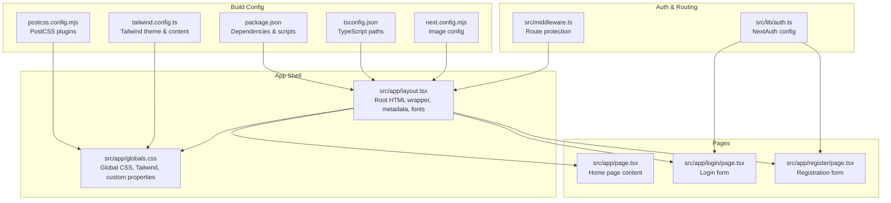

**Diagram sources**
- [layout.tsx:1-42](file://src/app/layout.tsx#L1-L42)
- [globals.css:1-246](file://src/app/globals.css#L1-L246)
- [page.tsx:1-142](file://src/app/page.tsx#L1-L142)
- [login/page.tsx:1-116](file://src/app/login/page.tsx#L1-L116)
- [register/page.tsx:1-128](file://src/app/register/page.tsx#L1-L128)
- [middleware.ts:1-48](file://src/middleware.ts#L1-L48)
- [auth.ts:1-117](file://src/lib/auth.ts#L1-L117)
- [next.config.mjs:1-14](file://next.config.mjs#L1-L14)
- [tailwind.config.ts:1-51](file://tailwind.config.ts#L1-L51)
- [postcss.config.mjs:1-7](file://postcss.config.mjs#L1-L7)
- [tsconfig.json:1-27](file://tsconfig.json#L1-L27)
- [package.json:1-41](file://package.json#L1-L41)

**Section sources**
- [layout.tsx:1-42](file://src/app/layout.tsx#L1-L42)
- [globals.css:1-246](file://src/app/globals.css#L1-L246)
- [page.tsx:1-142](file://src/app/page.tsx#L1-L142)
- [login/page.tsx:1-116](file://src/app/login/page.tsx#L1-L116)
- [register/page.tsx:1-128](file://src/app/register/page.tsx#L1-L128)
- [middleware.ts:1-48](file://src/middleware.ts#L1-L48)
- [auth.ts:1-117](file://src/lib/auth.ts#L1-L117)
- [next.config.mjs:1-14](file://next.config.mjs#L1-L14)
- [tailwind.config.ts:1-51](file://tailwind.config.ts#L1-L51)
- [postcss.config.mjs:1-7](file://postcss.config.mjs#L1-L7)
- [tsconfig.json:1-27](file://tsconfig.json#L1-L27)
- [package.json:1-41](file://package.json#L1-L41)

## Core Components
- Root layout: Defines the HTML document structure, language attribute, preconnected fonts, and applies the antialiased body class.
- Global CSS: Establishes Tailwind base/components/utilities, CSS custom properties, typography, utilities, animations, and responsive containers.
- Pages: Implement content and page-specific metadata; leverage shared utilities and styling.
- Authentication: NextAuth.js configuration with credentials provider and role-based callbacks.
- Middleware: Route protection enforcing role-based access to protected routes.
- Build configuration: Next.js, Tailwind CSS, PostCSS, TypeScript, and image optimization settings.

**Section sources**
- [layout.tsx:27-41](file://src/app/layout.tsx#L27-L41)
- [globals.css:1-246](file://src/app/globals.css#L1-L246)
- [page.tsx:1-142](file://src/app/page.tsx#L1-L142)
- [login/page.tsx:1-116](file://src/app/login/page.tsx#L1-L116)
- [register/page.tsx:1-128](file://src/app/register/page.tsx#L1-L128)
- [auth.ts:14-90](file://src/lib/auth.ts#L14-L90)
- [middleware.ts:11-38](file://src/middleware.ts#L11-L38)

## Architecture Overview
The application uses Next.js App Router with a root layout that wraps all pages. Global CSS integrates Tailwind utilities and custom design tokens. Authentication is handled via NextAuth.js with a credentials provider and role-based callbacks. Middleware enforces route protection for authenticated dashboards and admin areas.

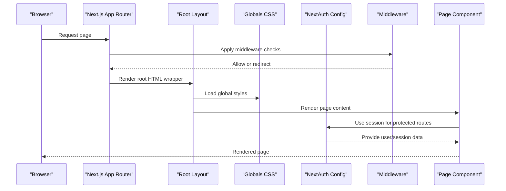

**Diagram sources**
- [layout.tsx:27-41](file://src/app/layout.tsx#L27-L41)
- [globals.css:1-246](file://src/app/globals.css#L1-L246)
- [auth.ts:14-90](file://src/lib/auth.ts#L14-L90)
- [middleware.ts:11-38](file://src/middleware.ts#L11-L38)
- [page.tsx:1-142](file://src/app/page.tsx#L1-L142)

## Detailed Component Analysis

### Root Layout Configuration
The root layout sets up the HTML document with:
- Language attribute for accessibility and SEO.
- Preconnected Google Fonts domains for improved font loading performance.
- Antialiased body class for smoother text rendering.
- Global CSS import to apply base styles, utilities, and custom properties.

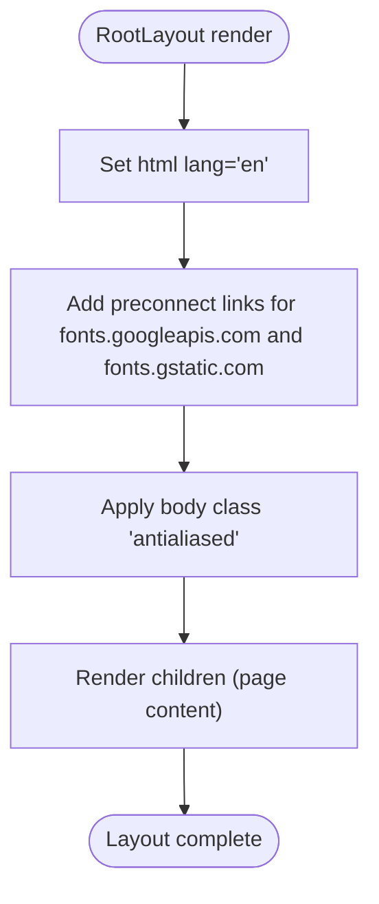

**Diagram sources**
- [layout.tsx:33-38](file://src/app/layout.tsx#L33-L38)

**Section sources**
- [layout.tsx:27-41](file://src/app/layout.tsx#L27-L41)

### Metadata Setup and SEO
The root layout defines site-wide metadata including:
- Default and template title for consistent branding across pages.
- Description for search engine indexing.
- Keywords for targeted discovery.
- Author attribution.
- OpenGraph configuration for social media sharing with website type and locale.

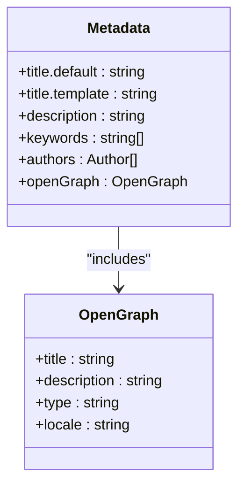

**Diagram sources**
- [layout.tsx:4-25](file://src/app/layout.tsx#L4-L25)

**Section sources**
- [layout.tsx:4-25](file://src/app/layout.tsx#L4-L25)

### Global Styling Approach
Global CSS establishes:
- Tailwind directives for base, components, and utilities.
- CSS custom properties for brand colors, backgrounds, typography, shadows, radii, and transitions.
- Base reset and smooth scrolling behavior.
- Typography system with Inter for body text and Outfit for headings.
- Utility classes for buttons, cards, inputs, badges, containers, gradient text, page headers, and skeleton loaders.
- Animation keyframes and staggered delay utilities.

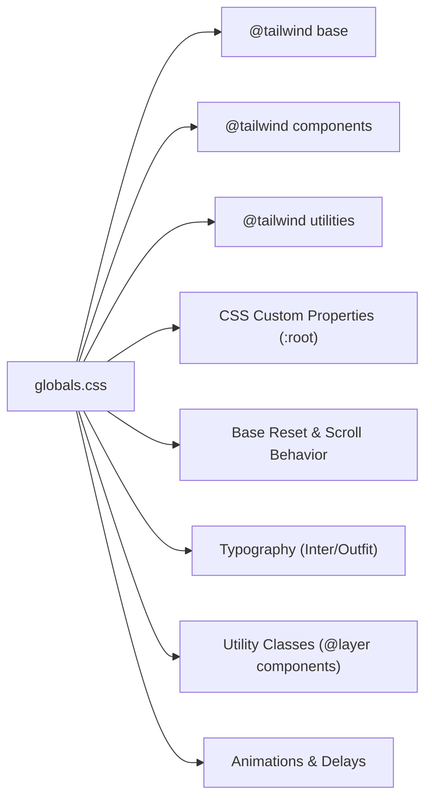

**Diagram sources**
- [globals.css:1-246](file://src/app/globals.css#L1-L246)

**Section sources**
- [globals.css:1-246](file://src/app/globals.css#L1-L246)

### Typography System
Typography is defined via:
- Tailwind theme extending font families for sans and heading.
- CSS custom properties for brand gold and navy tones.
- Global body and heading styles using Inter and Outfit respectively.
- Utility classes for gradient text effects and consistent spacing.

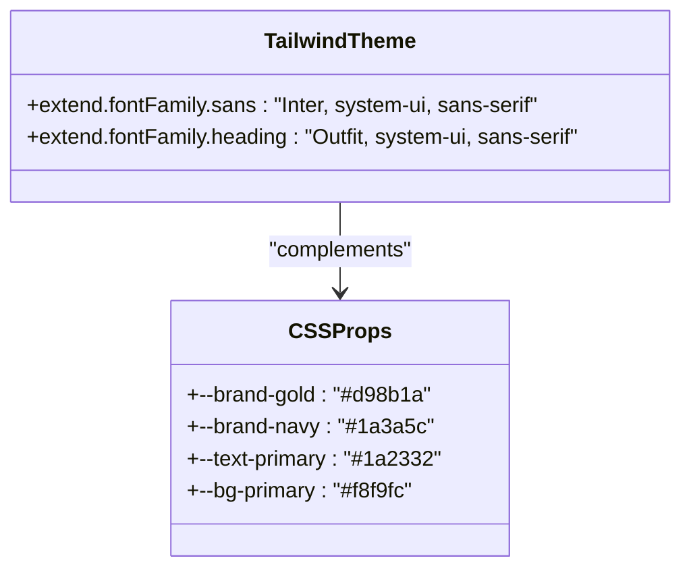

**Diagram sources**
- [tailwind.config.ts:39-42](file://tailwind.config.ts#L39-L42)
- [globals.css:8-27](file://src/app/globals.css#L8-L27)

**Section sources**
- [tailwind.config.ts:39-42](file://tailwind.config.ts#L39-L42)
- [globals.css:40-61](file://src/app/globals.css#L40-L61)

### Responsive Design Foundations
Responsive behavior is achieved through:
- Tailwind’s breakpoint utilities (sm, lg) applied to container widths and grid layouts.
- Container utility class for consistent max-width and horizontal padding.
- Grid layouts adapting from 2 to 4 columns based on viewport size.
- Utility classes for responsive text sizing and spacing.

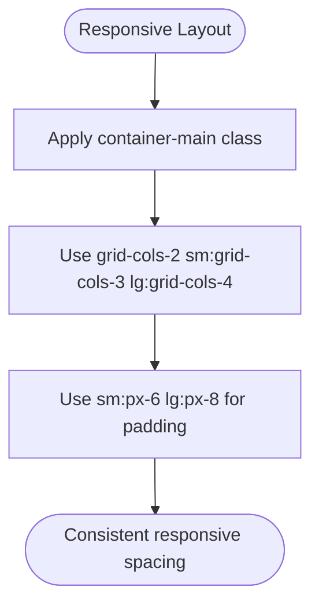

**Diagram sources**
- [globals.css:182-184](file://src/app/globals.css#L182-L184)
- [page.tsx:96-120](file://src/app/page.tsx#L96-L120)

**Section sources**
- [globals.css:182-184](file://src/app/globals.css#L182-L184)
- [page.tsx:96-120](file://src/app/page.tsx#L96-L120)

### Next.js App Router Integration
The App Router organizes:
- Root layout wrapping all pages.
- Page components under src/app for automatic routing.
- API routes under src/app/api for server-side handlers.
- Middleware for route protection.

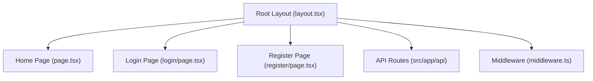

**Diagram sources**
- [layout.tsx:27-41](file://src/app/layout.tsx#L27-L41)
- [page.tsx:1-142](file://src/app/page.tsx#L1-L142)
- [login/page.tsx:1-116](file://src/app/login/page.tsx#L1-L116)
- [register/page.tsx:1-128](file://src/app/register/page.tsx#L1-L128)
- [middleware.ts:1-48](file://src/middleware.ts#L1-L48)

**Section sources**
- [layout.tsx:27-41](file://src/app/layout.tsx#L27-L41)
- [page.tsx:1-142](file://src/app/page.tsx#L1-L142)
- [login/page.tsx:1-116](file://src/app/login/page.tsx#L1-L116)
- [register/page.tsx:1-128](file://src/app/register/page.tsx#L1-L128)
- [middleware.ts:1-48](file://src/middleware.ts#L1-L48)

### Authentication and Role-Based Access
Authentication uses NextAuth.js with:
- Credentials provider validating email/password against Prisma-managed users.
- Role-based callbacks storing user role and verification status in JWT/session.
- Middleware enforcing role-based access to protected routes (/admin, /dashboard/landlord, /dashboard/student).
- Login and registration pages leveraging shared utilities and styling.

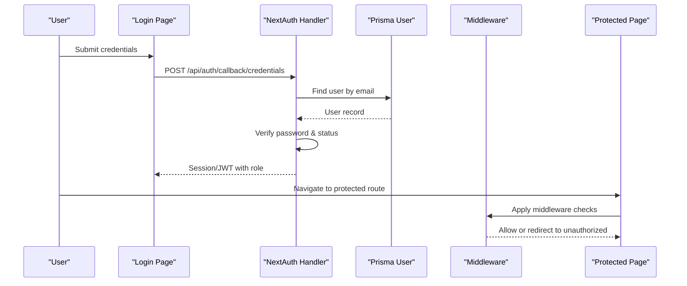

**Diagram sources**
- [login/page.tsx:51-103](file://src/app/login/page.tsx#L51-L103)
- [auth.ts:14-90](file://src/lib/auth.ts#L14-L90)
- [middleware.ts:11-38](file://src/middleware.ts#L11-L38)

**Section sources**
- [auth.ts:14-90](file://src/lib/auth.ts#L14-L90)
- [middleware.ts:11-38](file://src/middleware.ts#L11-L38)
- [login/page.tsx:51-103](file://src/app/login/page.tsx#L51-L103)
- [register/page.tsx:50-115](file://src/app/register/page.tsx#L50-L115)

### Font Loading Strategy
Font loading is optimized by:
- Adding preconnect links to Google Fonts in the root layout head.
- Importing Inter and Outfit via Google Fonts CDN in global CSS.
- Using Tailwind theme font families for consistent typography.

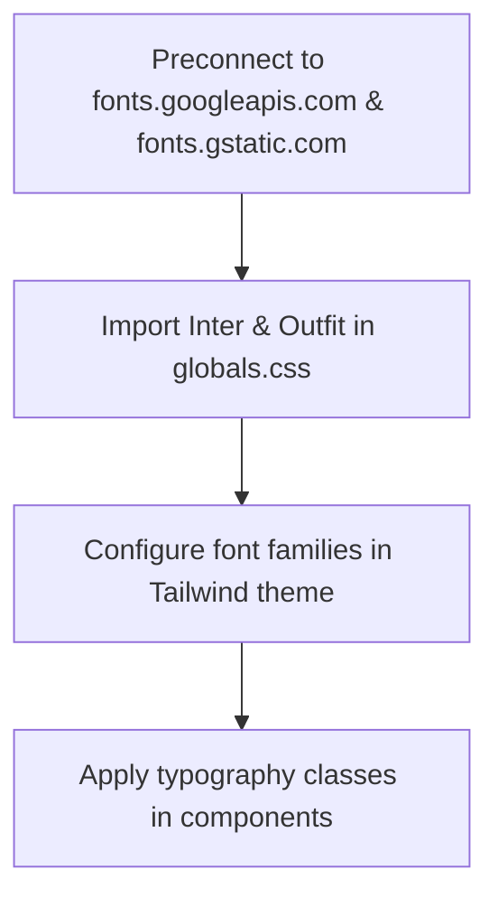

**Diagram sources**
- [layout.tsx:34-37](file://src/app/layout.tsx#L34-L37)
- [globals.css](file://src/app/globals.css#L1)
- [tailwind.config.ts:39-42](file://tailwind.config.ts#L39-L42)

**Section sources**
- [layout.tsx:34-37](file://src/app/layout.tsx#L34-L37)
- [globals.css](file://src/app/globals.css#L1)
- [tailwind.config.ts:39-42](file://tailwind.config.ts#L39-L42)

### HTML Structure and Language Attributes
The root layout ensures:
- Proper HTML structure with lang attribute set to English.
- Head section for preconnecting fonts.
- Body with antialiased class for improved text rendering.

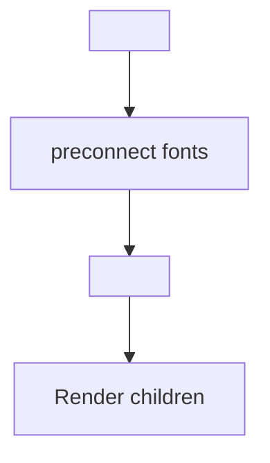

**Diagram sources**
- [layout.tsx:33-38](file://src/app/layout.tsx#L33-L38)

**Section sources**
- [layout.tsx:33-38](file://src/app/layout.tsx#L33-L38)

### Page Content and Utilities
Pages demonstrate:
- Consistent use of utility classes for gradients, cards, buttons, and containers.
- Responsive grid layouts and animation utilities.
- Integration with shared global styles and utilities.

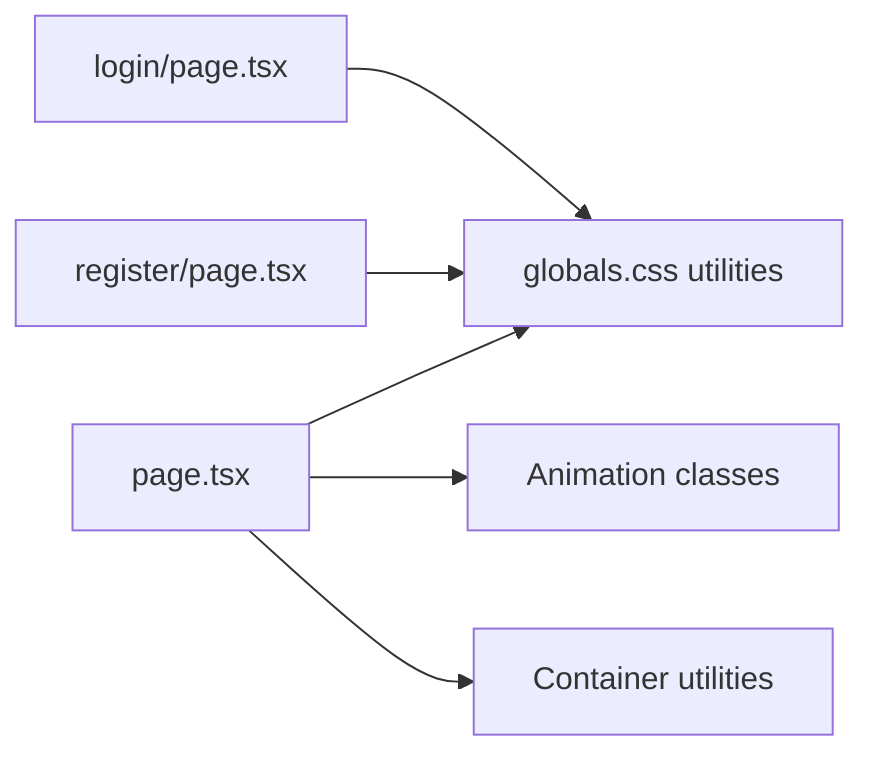

**Diagram sources**
- [page.tsx:1-142](file://src/app/page.tsx#L1-L142)
- [login/page.tsx:1-116](file://src/app/login/page.tsx#L1-L116)
- [register/page.tsx:1-128](file://src/app/register/page.tsx#L1-L128)
- [globals.css:83-213](file://src/app/globals.css#L83-L213)

**Section sources**
- [page.tsx:1-142](file://src/app/page.tsx#L1-L142)
- [login/page.tsx:1-116](file://src/app/login/page.tsx#L1-L116)
- [register/page.tsx:1-128](file://src/app/register/page.tsx#L1-L128)
- [globals.css:83-213](file://src/app/globals.css#L83-L213)

## Dependency Analysis
The application relies on:
- Next.js for routing and SSR/SSG capabilities.
- Tailwind CSS for utility-first styling and responsive design.
- PostCSS with autoprefixer for vendor prefixing and modern CSS features.
- TypeScript for type safety and IDE support.
- NextAuth.js for authentication with credentials provider.
- Prisma for database client integration.

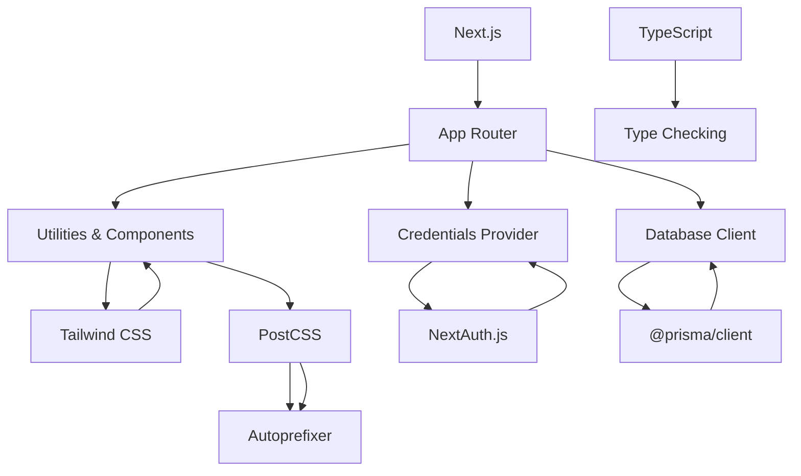

**Diagram sources**
- [package.json:19-39](file://package.json#L19-L39)
- [postcss.config.mjs:1-7](file://postcss.config.mjs#L1-L7)
- [tailwind.config.ts:1-51](file://tailwind.config.ts#L1-L51)
- [tsconfig.json:1-27](file://tsconfig.json#L1-L27)

**Section sources**
- [package.json:19-39](file://package.json#L19-L39)
- [postcss.config.mjs:1-7](file://postcss.config.mjs#L1-L7)
- [tailwind.config.ts:1-51](file://tailwind.config.ts#L1-L51)
- [tsconfig.json:1-27](file://tsconfig.json#L1-L27)

## Performance Considerations
- Font preloading via preconnect reduces render-blocking requests.
- Tailwind’s purgeable content configuration minimizes CSS bundle size.
- CSS custom properties enable efficient theming without repeated declarations.
- Middleware redirects prevent unnecessary page loads for unauthorized users.
- Image optimization configured for secure remote image loading.

[No sources needed since this section provides general guidance]

## Troubleshooting Guide
- Authentication errors: Verify NEXTAUTH_SECRET environment variable and ensure credentials match Prisma user records.
- Route protection: Confirm middleware matcher patterns align with intended protected routes.
- Styling inconsistencies: Check Tailwind content globs and ensure components use utility classes consistently.
- Font rendering: Ensure preconnect links are present and fonts load from the expected CDN.

**Section sources**
- [auth.ts:87-90](file://src/lib/auth.ts#L87-L90)
- [middleware.ts:40-47](file://src/middleware.ts#L40-L47)
- [tailwind.config.ts:3-7](file://tailwind.config.ts#L3-L7)
- [layout.tsx:34-37](file://src/app/layout.tsx#L34-L37)

## Conclusion
RentalHub-BOUESTI’s layout and structure provide a robust foundation for a responsive, accessible, and performant rental platform. The root layout, global CSS, and metadata configuration establish consistent branding and user experience. Next.js App Router, Tailwind CSS, and NextAuth.js integrate seamlessly to deliver a scalable architecture suitable for growth and maintenance.