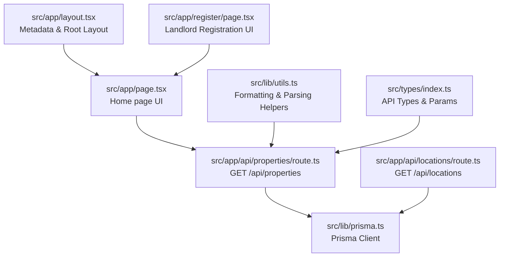
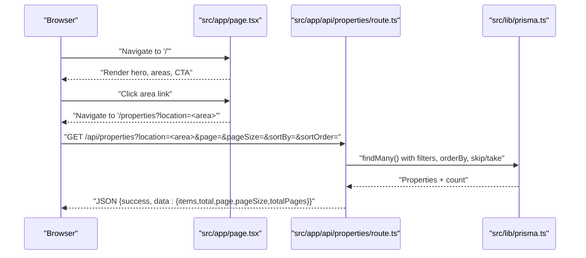
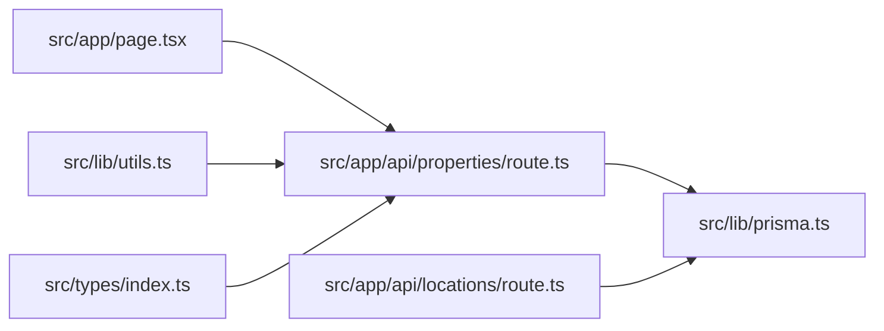

# Home Page & Property Browsing

<cite>
**Referenced Files in This Document**
- [src/app/page.tsx](file://src/app/page.tsx)
- [src/app/layout.tsx](file://src/app/layout.tsx)
- [src/app/api/properties/route.ts](file://src/app/api/properties/route.ts)
- [src/app/api/locations/route.ts](file://src/app/api/locations/route.ts)
- [src/lib/prisma.ts](file://src/lib/prisma.ts)
- [src/lib/utils.ts](file://src/lib/utils.ts)
- [src/types/index.ts](file://src/types/index.ts)
- [src/app/register/page.tsx](file://src/app/register/page.tsx)
</cite>

## Table of Contents
1. [Introduction](#introduction)
2. [Project Structure](#project-structure)
3. [Core Components](#core-components)
4. [Architecture Overview](#architecture-overview)
5. [Detailed Component Analysis](#detailed-component-analysis)
6. [Dependency Analysis](#dependency-analysis)
7. [Performance Considerations](#performance-considerations)
8. [Troubleshooting Guide](#troubleshooting-guide)
9. [Conclusion](#conclusion)

## Introduction
This document describes the home page and property browsing interface for the RentalHub BOUESTI platform. It explains the main landing page structure, property listing display, search and filtering mechanisms, property cards, image galleries, pricing and location indicators, the property search form, filters by area (Uro, Afao, Oke Kere), availability status indicators, responsive grid layouts, sorting options, pagination, and integration with property API endpoints. It also outlines how real-time property updates can be considered in future enhancements.

## Project Structure
The home page is implemented as a Next.js page component. Property browsing is handled via a dedicated API route that queries the database and returns paginated, filtered, and sorted results. Utility functions provide formatting and safe parsing helpers. Types define the API response shape and search parameters. The locations endpoint supports area-based filtering.

**Diagram sources**
- [src/app/page.tsx:1-142](file://src/app/page.tsx#L1-L142)
- [src/app/api/properties/route.ts:1-119](file://src/app/api/properties/route.ts#L1-L119)
- [src/app/api/locations/route.ts:1-29](file://src/app/api/locations/route.ts#L1-L29)
- [src/lib/prisma.ts:1-27](file://src/lib/prisma.ts#L1-L27)
- [src/lib/utils.ts:1-137](file://src/lib/utils.ts#L1-L137)
- [src/types/index.ts:1-109](file://src/types/index.ts#L1-L109)
- [src/app/layout.tsx:1-42](file://src/app/layout.tsx#L1-L42)
- [src/app/register/page.tsx:1-128](file://src/app/register/page.tsx#L1-L128)

**Section sources**
- [src/app/page.tsx:1-142](file://src/app/page.tsx#L1-L142)
- [src/app/layout.tsx:1-42](file://src/app/layout.tsx#L1-L42)

## Core Components
- Home page hero and stats, area browsing grid, and CTA sections.
- Property listing API supporting location filtering, price range, pagination, sorting, and status filtering.
- Utilities for formatting currency, dates, truncating text, parsing amenities/images, building URL search params, and status labels.
- Types for API responses, paginated data, and property search parameters.

Key capabilities:
- Responsive grid layout for areas and properties.
- Link-based navigation to property listings with pre-filled location filters.
- Server-side filtering and sorting with pagination.
- Status indicators for property availability and verification.

**Section sources**
- [src/app/page.tsx:1-142](file://src/app/page.tsx#L1-L142)
- [src/app/api/properties/route.ts:14-64](file://src/app/api/properties/route.ts#L14-L64)
- [src/lib/utils.ts:20-96](file://src/lib/utils.ts#L20-L96)
- [src/types/index.ts:44-71](file://src/types/index.ts#L44-L71)

## Architecture Overview
The home page links to the property listing page. The property listing page consumes the property API, which queries the database via Prisma. Results are returned as a paginated response with optional filters and sorting. Formatting utilities are used to present prices and labels consistently.

**Diagram sources**
- [src/app/page.tsx:108-109](file://src/app/page.tsx#L108-L109)
- [src/app/api/properties/route.ts:14-64](file://src/app/api/properties/route.ts#L14-L64)
- [src/lib/prisma.ts:13-24](file://src/lib/prisma.ts#L13-L24)

## Detailed Component Analysis

### Home Page Structure
- Hero section with gradient background, decorative blobs, headline, tagline, and primary CTAs.
- Stats bar at the bottom of the hero showing platform metrics.
- Areas section with a responsive grid of clickable area cards linking to property listings with a pre-filtered location query parameter.
- Prominent CTA encouraging landlords to list properties.

Responsive behavior:
- Grid layout adjusts from two to four columns based on screen size.
- Links navigate to the property listing page with encoded location parameters.

**Section sources**
- [src/app/page.tsx:6-82](file://src/app/page.tsx#L6-L82)
- [src/app/page.tsx:84-122](file://src/app/page.tsx#L84-L122)
- [src/app/page.tsx:124-138](file://src/app/page.tsx#L124-L138)

### Property Listing API
- Endpoint: GET /api/properties
- Query parameters:
  - location: text filter on area name (case-insensitive partial match)
  - status: property status filter (defaults to APPROVED)
  - minPrice/maxPrice: numeric range filter
  - page/pageSize: pagination (page >= 1; pageSize clamped between 1 and 50)
  - sortBy: price | createdAt | distanceToCampus
  - sortOrder: asc | desc
- Response shape:
  - success: boolean
  - data: { items, total, page, pageSize, totalPages }
- Includes related data:
  - landlord (id, name, email, verificationStatus)
  - location
  - booking count

Sorting and pagination:
- orderBy applied per sortBy and sortOrder.
- skip/take used for pagination.

Error handling:
- Returns structured error on failures with appropriate HTTP status.

**Section sources**
- [src/app/api/properties/route.ts:14-64](file://src/app/api/properties/route.ts#L14-L64)
- [src/types/index.ts:52-58](file://src/types/index.ts#L52-L58)
- [src/types/index.ts:61-71](file://src/types/index.ts#L61-L71)

### Property Search and Filtering
- Location filter: applied via a case-insensitive partial match on the location name.
- Price range filter: optional minPrice and/or maxPrice.
- Availability status: defaults to APPROVED; can be overridden via status parameter.
- Sorting: sortBy supports price, createdAt, distanceToCampus; sortOrder supports asc/desc.
- Pagination: page and pageSize parameters with sensible defaults and bounds.

Integration with UI:
- The home page’s area cards construct a location-filtered URL that the property listing page consumes.

**Section sources**
- [src/app/api/properties/route.ts:18-33](file://src/app/api/properties/route.ts#L18-L33)
- [src/app/page.tsx:108-109](file://src/app/page.tsx#L108-L109)

### Property Cards, Pricing, and Location Indicators
- Property cards are rendered server-side in the property listing page (not shown here) but rely on the API response containing property, landlord, and location data.
- Pricing display:
  - Currency formatting helper formats amounts as Nigerian Naira.
- Location indicators:
  - Location name is included in the API response for display.
- Landlord verification status:
  - Landlord object includes verificationStatus for trust signals.

Note: The property listing page component is not present in the current repository snapshot; however, the API contract and utilities define how these UI elements would be populated.

**Section sources**
- [src/app/api/properties/route.ts:35-48](file://src/app/api/properties/route.ts#L35-L48)
- [src/lib/utils.ts:20-32](file://src/lib/utils.ts#L20-L32)
- [src/types/index.ts:26-42](file://src/types/index.ts#L26-L42)

### Sorting Options and Pagination
- Sorting:
  - sortBy: price | createdAt | distanceToCampus
  - sortOrder: asc | desc
- Pagination:
  - page: integer >= 1
  - pageSize: clamped between 1 and 50
  - totalPages computed from total count

These controls are exposed via query parameters consumed by the property listing API.

**Section sources**
- [src/app/api/properties/route.ts:22-25](file://src/app/api/properties/route.ts#L22-L25)
- [src/types/index.ts:52-58](file://src/types/index.ts#L52-L58)

### Real-Time Updates
- Current implementation uses server-rendered pages and static API endpoints.
- To enable real-time updates (e.g., live availability changes):
  - Introduce client-side polling or WebSocket connections to the property API.
  - Use client-side state to refresh the property list when updates occur.
  - Consider optimistic updates for actions like marking a property as unavailable.

[No sources needed since this section provides general guidance]

### Landlord Registration and Property Submission
- The register page allows users to choose role LANDLORD and submit registration.
- The property creation endpoint accepts property submissions from authenticated landlords and sets initial status to PENDING.

**Section sources**
- [src/app/register/page.tsx:55-75](file://src/app/register/page.tsx#L55-L75)
- [src/app/api/properties/route.ts:68-118](file://src/app/api/properties/route.ts#L68-L118)

## Dependency Analysis
- The home page depends on:
  - Navigation to the property listing page with query parameters.
  - Consistent URL encoding for location names.
- The property listing API depends on:
  - Prisma client for database queries.
  - Utility functions for formatting and parsing.
  - Type definitions for API responses and search parameters.
- The locations endpoint provides area classifications used by the property API.

**Diagram sources**
- [src/app/page.tsx:108-109](file://src/app/page.tsx#L108-L109)
- [src/app/api/properties/route.ts:14-64](file://src/app/api/properties/route.ts#L14-L64)
- [src/lib/prisma.ts:13-24](file://src/lib/prisma.ts#L13-L24)
- [src/lib/utils.ts:1-137](file://src/lib/utils.ts#L1-L137)
- [src/types/index.ts:1-109](file://src/types/index.ts#L1-L109)
- [src/app/api/locations/route.ts:11-28](file://src/app/api/locations/route.ts#L11-L28)

**Section sources**
- [src/app/page.tsx:108-109](file://src/app/page.tsx#L108-L109)
- [src/app/api/properties/route.ts:14-64](file://src/app/api/properties/route.ts#L14-L64)
- [src/app/api/locations/route.ts:11-28](file://src/app/api/locations/route.ts#L11-L28)
- [src/lib/prisma.ts:13-24](file://src/lib/prisma.ts#L13-L24)
- [src/lib/utils.ts:1-137](file://src/lib/utils.ts#L1-L137)
- [src/types/index.ts:1-109](file://src/types/index.ts#L1-L109)

## Performance Considerations
- Pagination limits:
  - Maximum pageSize is enforced to prevent heavy queries.
- Sorting:
  - Ensure database indexes exist on frequently sorted columns (e.g., price, createdAt, location.name).
- Filtering:
  - Case-insensitive partial match on location name is supported; consider indexing location.name for performance.
- Image galleries:
  - Prefer lazy loading and optimized image formats in the property listing page component.
- Caching:
  - Consider caching read-mostly property lists with cache-busting on updates.

[No sources needed since this section provides general guidance]

## Troubleshooting Guide
Common issues and resolutions:
- Empty property list after filtering:
  - Verify location name casing and spelling; filtering is case-insensitive but still requires a valid substring.
  - Confirm that properties exist with status APPROVED (or adjust status parameter accordingly).
- Unexpected pagination results:
  - Ensure page and pageSize are integers within accepted bounds.
- Currency formatting errors:
  - Confirm price values are numeric before formatting.
- API errors:
  - Inspect server logs for database query errors or malformed requests.

**Section sources**
- [src/app/api/properties/route.ts:14-64](file://src/app/api/properties/route.ts#L14-L64)
- [src/lib/utils.ts:20-32](file://src/lib/utils.ts#L20-L32)

## Conclusion
The home page provides an engaging entry point with area-based navigation to property listings. The property listing API offers robust filtering, sorting, and pagination, returning rich property data suitable for rendering cards with pricing, location, and landlord verification indicators. By leveraging the existing types, utilities, and API contracts, teams can implement a responsive, accessible property browsing experience and extend it with real-time updates as needed.