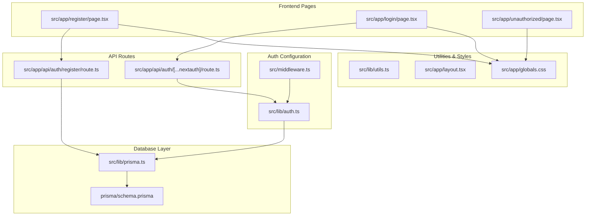
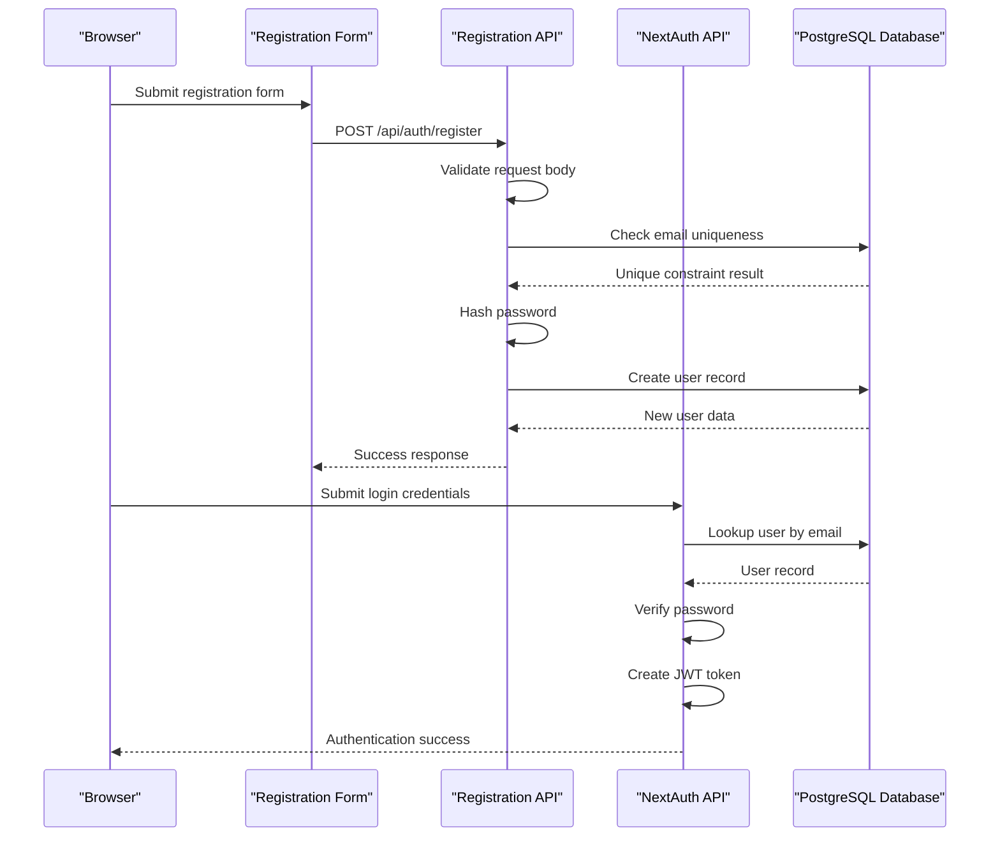
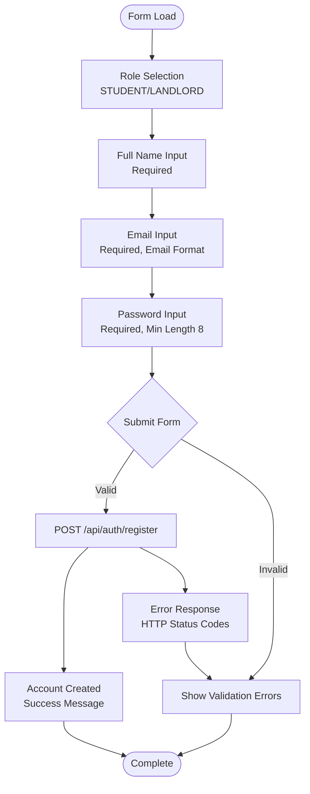
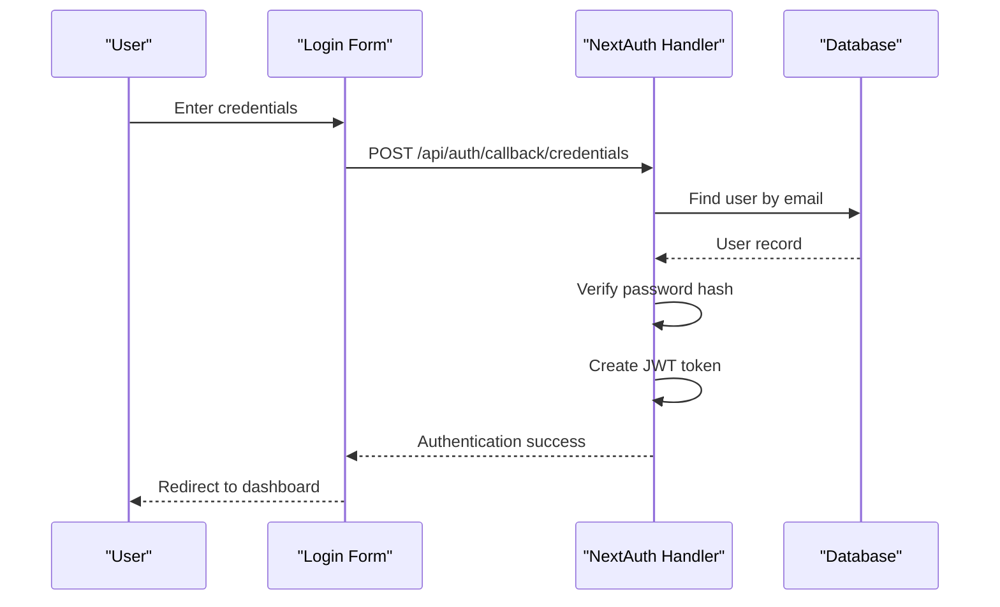
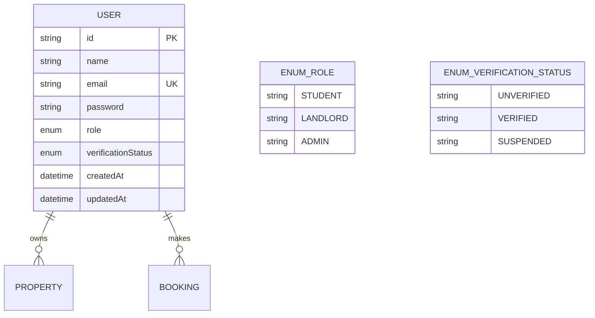
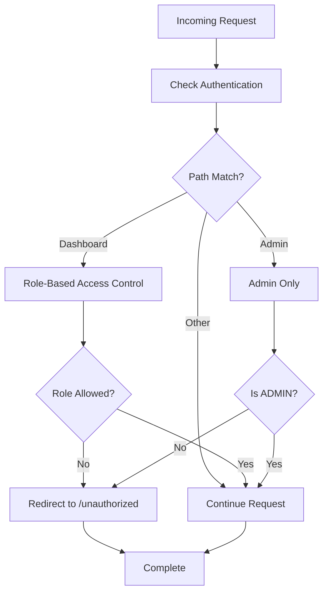
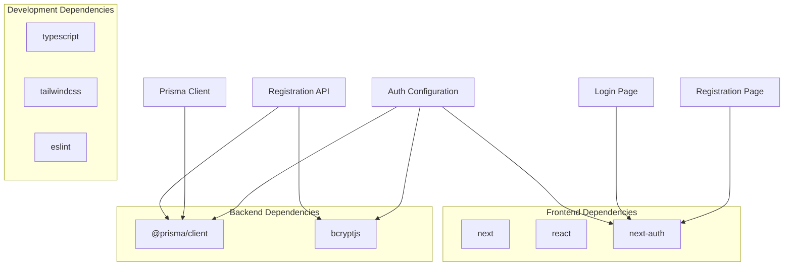

# Registration & Login Forms

<cite>
**Referenced Files in This Document**
- [src/app/register/page.tsx](file://src/app/register/page.tsx)
- [src/app/login/page.tsx](file://src/app/login/page.tsx)
- [src/app/api/auth/register/route.ts](file://src/app/api/auth/register/route.ts)
- [src/app/api/auth/[...nextauth]/route.ts](file://src/app/api/auth/[...nextauth]/route.ts)
- [src/lib/auth.ts](file://src/lib/auth.ts)
- [src/lib/prisma.ts](file://src/lib/prisma.ts)
- [prisma/schema.prisma](file://prisma/schema.prisma)
- [src/middleware.ts](file://src/middleware.ts)
- [src/app/unauthorized/page.tsx](file://src/app/unauthorized/page.tsx)
- [src/lib/utils.ts](file://src/lib/utils.ts)
- [src/app/layout.tsx](file://src/app/layout.tsx)
- [src/app/globals.css](file://src/app/globals.css)
- [package.json](file://package.json)
</cite>

## Table of Contents
1. [Introduction](#introduction)
2. [Project Structure](#project-structure)
3. [Core Components](#core-components)
4. [Architecture Overview](#architecture-overview)
5. [Detailed Component Analysis](#detailed-component-analysis)
6. [Dependency Analysis](#dependency-analysis)
7. [Performance Considerations](#performance-considerations)
8. [Troubleshooting Guide](#troubleshooting-guide)
9. [Conclusion](#conclusion)

## Introduction
This document provides comprehensive documentation for the user registration and authentication forms in the RentalHub BOUESTI application. It covers the registration form components including role selection (STUDENT/LANDLORD), form validation, password requirements, and submission handling. It also explains the login form interface, credential validation, session management, and error handling. The document details form state management, input validation patterns, and user feedback mechanisms. It addresses the integration with NextAuth.js authentication endpoints and JWT token handling, along with form accessibility, mobile responsiveness, and security considerations for credential entry.

## Project Structure
The authentication system is organized across several key files:
- Frontend pages for registration and login
- API routes for registration and NextAuth integration
- Authentication configuration and middleware
- Database schema and Prisma client
- Utility functions and global styles

**Diagram sources**
- [src/app/register/page.tsx:1-128](file://src/app/register/page.tsx#L1-L128)
- [src/app/login/page.tsx:1-116](file://src/app/login/page.tsx#L1-L116)
- [src/app/api/auth/register/route.ts:1-90](file://src/app/api/auth/register/route.ts#L1-L90)
- [src/app/api/auth/[...nextauth]/route.ts](file://src/app/api/auth/[...nextauth]/route.ts#L1-L7)
- [src/lib/auth.ts:1-117](file://src/lib/auth.ts#L1-L117)
- [src/lib/prisma.ts:1-27](file://src/lib/prisma.ts#L1-L27)
- [prisma/schema.prisma:1-130](file://prisma/schema.prisma#L1-L130)
- [src/middleware.ts:1-48](file://src/middleware.ts#L1-L48)
- [src/app/unauthorized/page.tsx:1-35](file://src/app/unauthorized/page.tsx#L1-L35)
- [src/lib/utils.ts:1-137](file://src/lib/utils.ts#L1-L137)
- [src/app/layout.tsx:1-42](file://src/app/layout.tsx#L1-L42)
- [src/app/globals.css:1-246](file://src/app/globals.css#L1-L246)

**Section sources**
- [src/app/register/page.tsx:1-128](file://src/app/register/page.tsx#L1-L128)
- [src/app/login/page.tsx:1-116](file://src/app/login/page.tsx#L1-L116)
- [src/app/api/auth/register/route.ts:1-90](file://src/app/api/auth/register/route.ts#L1-L90)
- [src/app/api/auth/[...nextauth]/route.ts](file://src/app/api/auth/[...nextauth]/route.ts#L1-L7)
- [src/lib/auth.ts:1-117](file://src/lib/auth.ts#L1-L117)
- [src/lib/prisma.ts:1-27](file://src/lib/prisma.ts#L1-L27)
- [prisma/schema.prisma:1-130](file://prisma/schema.prisma#L1-L130)
- [src/middleware.ts:1-48](file://src/middleware.ts#L1-L48)
- [src/app/unauthorized/page.tsx:1-35](file://src/app/unauthorized/page.tsx#L1-L35)
- [src/lib/utils.ts:1-137](file://src/lib/utils.ts#L1-L137)
- [src/app/layout.tsx:1-42](file://src/app/layout.tsx#L1-L42)
- [src/app/globals.css:1-246](file://src/app/globals.css#L1-L246)

## Core Components
This section documents the primary components involved in user registration and authentication.

### Registration Form
The registration form is implemented as a Next.js page component with the following key characteristics:
- Role selection: Radio button group allowing users to choose between STUDENT and LANDLORD roles
- Input fields: Full name, email address, and password with required attributes
- Validation: HTML5 required attributes and minlength validation for password
- Submission: Form posts to the registration API endpoint
- Styling: Modern glass-morphism design with gradient accents and responsive layout

Key validation rules enforced by the frontend:
- Role selection is mandatory with predefined options
- Full name, email, and password are required
- Password must meet minimum length requirements
- Email format is validated by the browser

**Section sources**
- [src/app/register/page.tsx:50-115](file://src/app/register/page.tsx#L50-L115)

### Login Form
The login form provides credential-based authentication:
- Input fields: Email and password with autocomplete attributes
- Validation: HTML5 required attributes for both fields
- Submission: Form posts to NextAuth's credentials provider callback endpoint
- Styling: Consistent design language with the registration form

**Section sources**
- [src/app/login/page.tsx:51-103](file://src/app/login/page.tsx#L51-L103)

### Registration API Endpoint
The backend registration endpoint handles user creation with comprehensive validation:
- Request body parsing: JSON payload with name, email, password, and optional role
- Validation: Presence checks, role enumeration validation, password length enforcement
- Uniqueness: Email uniqueness check against the database
- Security: Password hashing using bcrypt with configurable cost factor
- Response: Structured JSON with success/error indicators and appropriate HTTP status codes

**Section sources**
- [src/app/api/auth/register/route.ts:20-89](file://src/app/api/auth/register/route.ts#L20-L89)

### NextAuth Integration
NextAuth.js provides the authentication framework with the following configuration:
- Credentials provider: Custom implementation for email/password authentication
- Database integration: Prisma client for user lookup and validation
- Security: bcrypt comparison for password verification
- Session management: JWT-based sessions with configurable expiration
- Callbacks: Token and session callbacks for role and verification status propagation
- Error handling: Comprehensive error messages for invalid credentials or suspended accounts

**Section sources**
- [src/app/api/auth/[...nextauth]/route.ts](file://src/app/api/auth/[...nextauth]/route.ts#L1-L7)
- [src/lib/auth.ts:14-90](file://src/lib/auth.ts#L14-L90)

## Architecture Overview
The authentication architecture follows a layered approach with clear separation of concerns:

**Diagram sources**
- [src/app/register/page.tsx:50-115](file://src/app/register/page.tsx#L50-L115)
- [src/app/api/auth/register/route.ts:20-89](file://src/app/api/auth/register/route.ts#L20-L89)
- [src/app/api/auth/[...nextauth]/route.ts](file://src/app/api/auth/[...nextauth]/route.ts#L1-L7)
- [src/lib/auth.ts:22-52](file://src/lib/auth.ts#L22-L52)

The system integrates with NextAuth.js for:
- Session management using JWT tokens
- Role-based access control
- Middleware protection for authenticated routes
- Standardized authentication flows

**Section sources**
- [src/lib/auth.ts:14-90](file://src/lib/auth.ts#L14-L90)
- [src/middleware.ts:11-38](file://src/middleware.ts#L11-L38)

## Detailed Component Analysis

### Registration Form Component Analysis
The registration form implements a modern, accessible design with comprehensive validation:

**Diagram sources**
- [src/app/register/page.tsx:50-115](file://src/app/register/page.tsx#L50-L115)
- [src/app/api/auth/register/route.ts:25-45](file://src/app/api/auth/register/route.ts#L25-L45)

Key implementation patterns:
- Semantic HTML structure with proper labeling
- Progressive enhancement with client-side validation
- Responsive design using Tailwind CSS utilities
- Accessibility features: proper labels, focus management, and screen reader support

Validation patterns:
- HTML5 validation attributes (required, type, minlength)
- Custom validation for role enumeration
- Real-time feedback through form styling

**Section sources**
- [src/app/register/page.tsx:50-115](file://src/app/register/page.tsx#L50-L115)

### Login Form Component Analysis
The login form provides streamlined authentication:

**Diagram sources**
- [src/app/login/page.tsx:51-103](file://src/app/login/page.tsx#L51-L103)
- [src/app/api/auth/[...nextauth]/route.ts](file://src/app/api/auth/[...nextauth]/route.ts#L1-L7)
- [src/lib/auth.ts:22-52](file://src/lib/auth.ts#L22-L52)

Security considerations:
- Passwords are never stored in plaintext
- bcrypt provides secure password hashing
- JWT tokens contain minimal user data
- Session expiration prevents long-lived authentication

**Section sources**
- [src/app/login/page.tsx:51-103](file://src/app/login/page.tsx#L51-L103)
- [src/lib/auth.ts:35-42](file://src/lib/auth.ts#L35-L42)

### Database Schema and Data Model
The authentication system relies on a well-defined data model:

**Diagram sources**
- [prisma/schema.prisma:44-61](file://prisma/schema.prisma#L44-L61)

The schema supports:
- Role-based access control
- Verification status tracking
- Relationship modeling for properties and bookings
- Index optimization for email lookups

**Section sources**
- [prisma/schema.prisma:17-27](file://prisma/schema.prisma#L17-L27)
- [prisma/schema.prisma:44-61](file://prisma/schema.prisma#L44-L61)

### Session Management and Middleware
The middleware provides robust route protection:

**Diagram sources**
- [src/middleware.ts:11-38](file://src/middleware.ts#L11-L38)
- [src/app/unauthorized/page.tsx:9-35](file://src/app/unauthorized/page.tsx#L9-L35)

**Section sources**
- [src/middleware.ts:11-38](file://src/middleware.ts#L11-L38)
- [src/app/unauthorized/page.tsx:9-35](file://src/app/unauthorized/page.tsx#L9-L35)

## Dependency Analysis
The authentication system has well-defined dependencies and relationships:

**Diagram sources**
- [package.json:19-38](file://package.json#L19-L38)
- [src/app/register/page.tsx:1-128](file://src/app/register/page.tsx#L1-L128)
- [src/app/login/page.tsx:1-116](file://src/app/login/page.tsx#L1-L116)
- [src/lib/auth.ts:8-11](file://src/lib/auth.ts#L8-L11)
- [src/app/api/auth/register/route.ts:8-11](file://src/app/api/auth/register/route.ts#L8-L11)

Key dependency relationships:
- NextAuth.js provides the core authentication framework
- Prisma handles database operations and type safety
- bcrypt ensures secure password storage
- Tailwind CSS enables responsive, accessible UI components

**Section sources**
- [package.json:19-38](file://package.json#L19-L38)
- [src/lib/auth.ts:8-11](file://src/lib/auth.ts#L8-L11)
- [src/app/api/auth/register/route.ts:8-11](file://src/app/api/auth/register/route.ts#L8-L11)

## Performance Considerations
The authentication system incorporates several performance optimizations:

### Database Optimization
- Email indexing for fast user lookup
- Minimal field selection in queries
- Connection pooling through Prisma client
- Development-specific connection caching

### Session Management
- JWT-based sessions reduce database load
- Configurable session expiration (30 days max age)
- Automatic session refresh (24-hour update interval)
- Lightweight token payload containing only essential user data

### Frontend Performance
- CSS animations optimized for smooth transitions
- Minimal JavaScript bundle size
- Responsive design reduces layout thrashing
- Proper form validation prevents unnecessary API calls

## Troubleshooting Guide
Common issues and their solutions:

### Registration Issues
- **Email already exists**: Database constraint violation triggers conflict response
- **Invalid role**: Role validation fails for values outside STUDENT/LANDLORD
- **Weak password**: Minimum length requirement enforced
- **Server errors**: Internal server error responses with logging

### Authentication Issues
- **Invalid credentials**: NextAuth throws specific error messages
- **Account suspension**: Suspended accounts blocked with clear messaging
- **Session timeout**: Automatic redirect to login page
- **Permission denied**: Middleware redirects to unauthorized page

### Debugging Strategies
- Enable NextAuth debug mode in development
- Check browser network tab for API responses
- Review server logs for error details
- Verify environment variables (NEXTAUTH_SECRET)
- Test database connectivity and Prisma client initialization

**Section sources**
- [src/app/api/auth/register/route.ts:25-56](file://src/app/api/auth/register/route.ts#L25-L56)
- [src/lib/auth.ts:22-42](file://src/lib/auth.ts#L22-L42)
- [src/middleware.ts:17-29](file://src/middleware.ts#L17-L29)

## Conclusion
The RentalHub BOUESTI authentication system provides a robust, secure, and user-friendly solution for user registration and login. The implementation combines modern frontend design with secure backend practices, utilizing NextAuth.js for authentication management and Prisma for database operations. The system enforces comprehensive validation, implements proper security measures, and provides clear user feedback throughout the authentication process. The modular architecture ensures maintainability and scalability while the middleware provides strong route protection based on user roles.