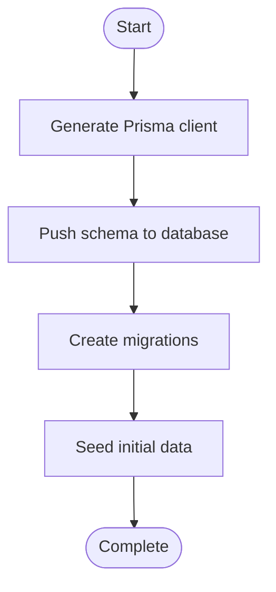
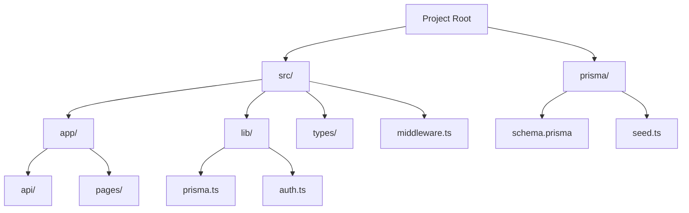
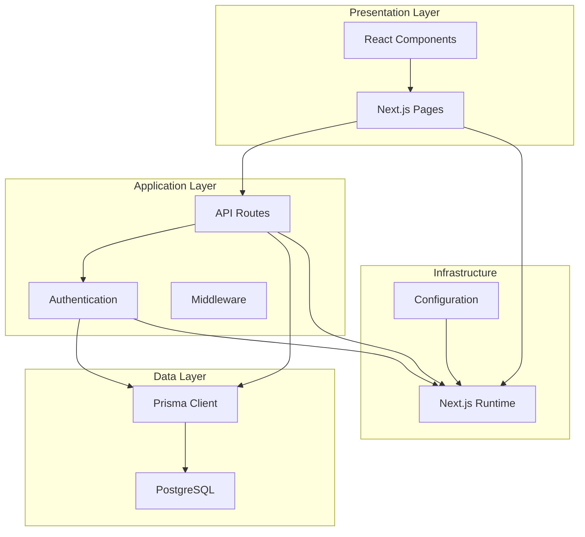
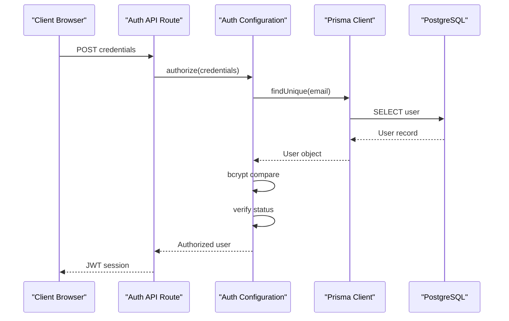
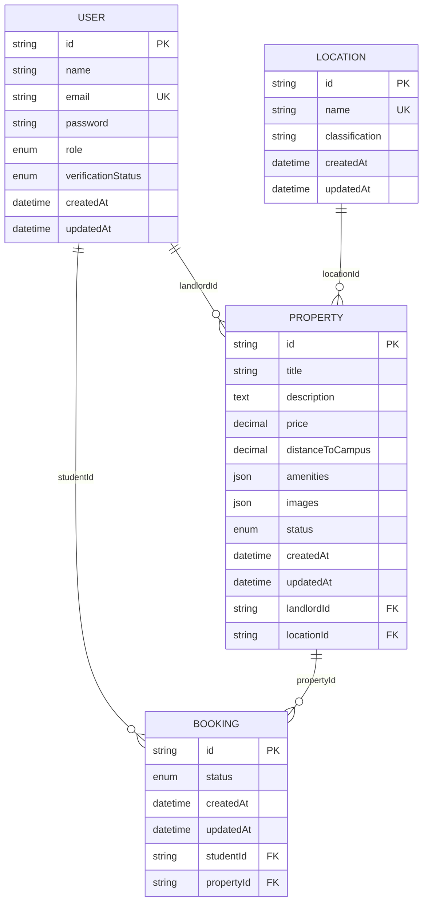
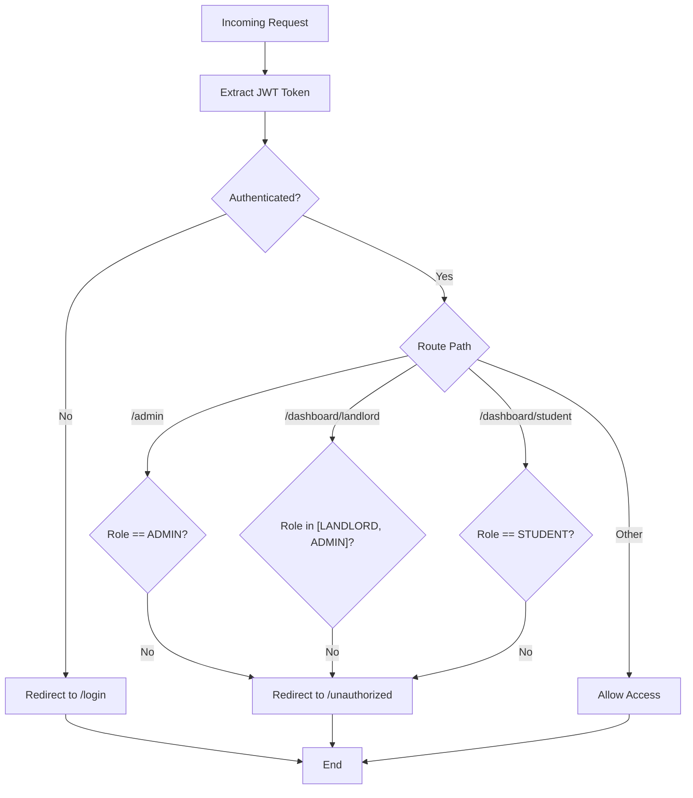
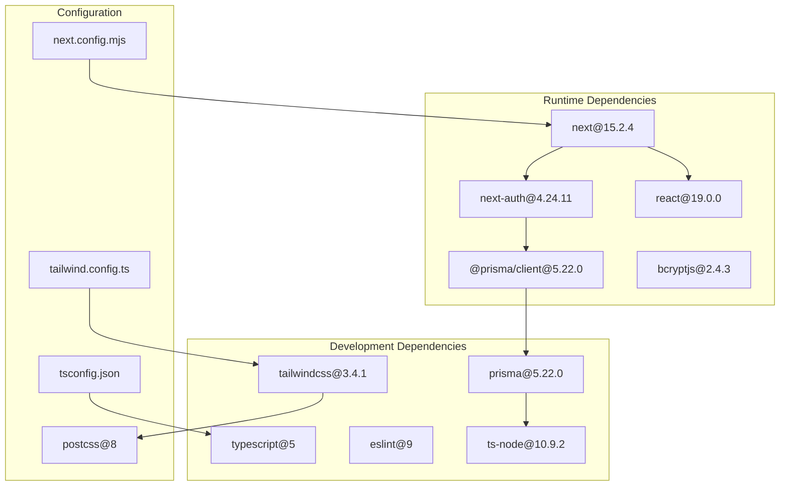

# Getting Started

<cite>
**Referenced Files in This Document**
- [package.json](file://package.json)
- [schema.prisma](file://prisma/schema.prisma)
- [seed.ts](file://prisma/seed.ts)
- [prisma.ts](file://src/lib/prisma.ts)
- [auth.ts](file://src/lib/auth.ts)
- [route.ts](file://src/app/api/auth/[...nextauth]/route.ts)
- [middleware.ts](file://src/middleware.ts)
- [route.ts](file://src/app/api/bookings/route.ts)
- [route.ts](file://src/app/api/properties/route.ts)
- [next.config.mjs](file://next.config.mjs)
- [tailwind.config.ts](file://tailwind.config.ts)
- [tsconfig.json](file://tsconfig.json)
- [layout.tsx](file://src/app/layout.tsx)
- [page.tsx](file://src/app/page.tsx)
</cite>

## Table of Contents
1. [Introduction](#introduction)
2. [Prerequisites](#prerequisites)
3. [Installation](#installation)
4. [Environment Setup](#environment-setup)
5. [Database Configuration and Seeding](#database-configuration-and-seeding)
6. [Running the Development Server](#running-the-development-server)
7. [Project Structure](#project-structure)
8. [Key Configuration Files](#key-configuration-files)
9. [Essential Commands](#essential-commands)
10. [Architecture Overview](#architecture-overview)
11. [Detailed Component Analysis](#detailed-component-analysis)
12. [Dependency Analysis](#dependency-analysis)
13. [Performance Considerations](#performance-considerations)
14. [Troubleshooting Guide](#troubleshooting-guide)
15. [Verification Steps](#verification-steps)
16. [Conclusion](#conclusion)

## Introduction
RentalHub-BOUESTI is a Next.js application that connects students and landlords for off-campus accommodation near Bamidele Olumilua University of Education, Science and Technology (BOUESTI) in Ikere-Ekiti. The platform enables property browsing, user registration and authentication, property listings, and booking management with role-based access control.

## Prerequisites
- Node.js (version compatible with project dependencies)
- PostgreSQL database
- Git (for cloning the repository)

**Section sources**
- [package.json:19-26](file://package.json#L19-L26)
- [schema.prisma:10-13](file://prisma/schema.prisma#L10-L13)

## Installation
Follow these steps to set up the project locally:

1. Clone the repository
2. Install dependencies using your preferred package manager
3. Set up environment variables as described in Environment Setup
4. Configure and seed the database as described in Database Configuration and Seeding
5. Start the development server

**Section sources**
- [package.json:5-14](file://package.json#L5-L14)

## Environment Setup
Create a `.env.local` file in the project root with the following variables:

- DATABASE_URL: PostgreSQL connection string
- NEXTAUTH_SECRET: Cryptographic secret for NextAuth.js sessions
- NEXT_PUBLIC_APP_URL: Frontend base URL (for redirects and links)

Notes:
- DATABASE_URL must point to a PostgreSQL database
- NEXTAUTH_SECRET should be a cryptographically secure random string
- NEXT_PUBLIC_APP_URL should match your deployment URL

**Section sources**
- [schema.prisma:12](file://prisma/schema.prisma#L12)
- [auth.ts:87](file://src/lib/auth.ts#L87)

## Database Configuration and Seeding
Configure the database using Prisma:

1. Generate Prisma client
2. Push schema to database
3. Create database migrations
4. Seed initial data



**Diagram sources**
- [package.json:10-13](file://package.json#L10-L13)
- [seed.ts:126-133](file://prisma/seed.ts#L126-L133)

**Section sources**
- [package.json:10-13](file://package.json#L10-L13)
- [schema.prisma:10-13](file://prisma/schema.prisma#L10-L13)
- [seed.ts:1-10](file://prisma/seed.ts#L1-L10)

## Running the Development Server
Start the development server with hot reloading:

```bash
npm run dev
```

The application will be available at http://localhost:3000 by default.

**Section sources**
- [package.json:6](file://package.json#L6)

## Project Structure
The project follows Next.js App Router conventions with the following key directories:

- `/prisma` — Database schema and seed scripts
- `/src/app` — Next.js app router pages and API routes
- `/src/lib` — Shared libraries (Prisma client, authentication)
- `/src/middleware.ts` — Route protection middleware
- `/src/types` — TypeScript type definitions
- `/public` — Static assets (not shown in current structure)



**Diagram sources**
- [package.json](file://package.json)
- [prisma/schema.prisma](file://prisma/schema.prisma)
- [prisma/seed.ts](file://prisma/seed.ts)
- [src/lib/prisma.ts](file://src/lib/prisma.ts)
- [src/lib/auth.ts](file://src/lib/auth.ts)
- [src/middleware.ts](file://src/middleware.ts)

**Section sources**
- [package.json](file://package.json)

## Key Configuration Files
Important configuration files and their purposes:

- `next.config.mjs` — Next.js configuration with image optimization settings
- `tailwind.config.ts` — Tailwind CSS customization for branding and themes
- `tsconfig.json` — TypeScript compiler options and path aliases
- `prisma/schema.prisma` — Database schema definition
- `prisma/seed.ts` — Initial data seeding script

**Section sources**
- [next.config.mjs:1-14](file://next.config.mjs#L1-L14)
- [tailwind.config.ts:1-51](file://tailwind.config.ts#L1-L51)
- [tsconfig.json:1-27](file://tsconfig.json#L1-L27)
- [prisma/schema.prisma:1-130](file://prisma/schema.prisma#L1-L130)
- [prisma/seed.ts:1-143](file://prisma/seed.ts#L1-L143)

## Essential Commands
Commonly used commands for development and maintenance:

- `npm run dev` — Start development server
- `npm run build` — Create production build
- `npm run start` — Start production server
- `npm run lint` — Run ESLint
- `npm run db:generate` — Generate Prisma client
- `npm run db:push` — Push schema to database
- `npm run db:migrate` — Create database migrations
- `npm run db:seed` — Seed database with initial data
- `npm run db:studio` — Launch Prisma Studio

**Section sources**
- [package.json:5-14](file://package.json#L5-L14)

## Architecture Overview
The application uses a layered architecture with clear separation of concerns:



**Diagram sources**
- [src/lib/prisma.ts:13-24](file://src/lib/prisma.ts#L13-L24)
- [src/lib/auth.ts:14-90](file://src/lib/auth.ts#L14-L90)
- [src/middleware.ts:11-38](file://src/middleware.ts#L11-L38)
- [prisma/schema.prisma:44-129](file://prisma/schema.prisma#L44-L129)

## Detailed Component Analysis

### Authentication System
The authentication system uses NextAuth.js with credentials provider and JWT sessions:



**Diagram sources**
- [src/app/api/auth/[...nextauth]/route.ts:1-7](file://src/app/api/auth/[...nextauth]/route.ts#L1-L7)
- [src/lib/auth.ts:22-52](file://src/lib/auth.ts#L22-L52)
- [src/lib/prisma.ts:13-24](file://src/lib/prisma.ts#L13-L24)

**Section sources**
- [src/lib/auth.ts:14-90](file://src/lib/auth.ts#L14-L90)
- [src/app/api/auth/[...nextauth]/route.ts:1-7](file://src/app/api/auth/[...nextauth]/route.ts#L1-L7)

### Database Schema
The database schema defines four core models with relationships:



**Diagram sources**
- [prisma/schema.prisma:44-129](file://prisma/schema.prisma#L44-L129)

**Section sources**
- [prisma/schema.prisma:15-129](file://prisma/schema.prisma#L15-L129)

### Role-Based Access Control
The middleware enforces role-based access to protected routes:



**Diagram sources**
- [src/middleware.ts:11-38](file://src/middleware.ts#L11-L38)

**Section sources**
- [src/middleware.ts:16-29](file://src/middleware.ts#L16-L29)

## Dependency Analysis
The project has the following key dependencies:



**Diagram sources**
- [package.json:19-39](file://package.json#L19-L39)

**Section sources**
- [package.json:19-39](file://package.json#L19-L39)

## Performance Considerations
- Prisma client singleton pattern prevents connection pool exhaustion during hot reload
- Development logging includes query, error, and warning logs for debugging
- Production uses minimal logging to reduce overhead
- Image optimization configured for performance

**Section sources**
- [src/lib/prisma.ts:13-24](file://src/lib/prisma.ts#L13-L24)
- [next.config.mjs:3-10](file://next.config.mjs#L3-L10)

## Troubleshooting Guide
Common setup issues and solutions:

### Database Connection Issues
- Verify DATABASE_URL format and connectivity
- Ensure PostgreSQL server is running
- Check database credentials and permissions

### Authentication Problems
- Confirm NEXTAUTH_SECRET is set and secure
- Verify email/password combinations in seed data
- Check JWT token expiration settings

### Prisma Migration Failures
- Run `npm run db:generate` to regenerate client
- Use `npm run db:push` for development schema updates
- Create migrations with `npm run db:migrate`

### Build Errors
- Clear node_modules and reinstall dependencies
- Check TypeScript configuration compatibility
- Verify Next.js version requirements

**Section sources**
- [schema.prisma:12](file://prisma/schema.prisma#L12)
- [auth.ts:87](file://src/lib/auth.ts#L87)
- [package.json:10-13](file://package.json#L10-L13)

## Verification Steps
After installation, verify the setup:

1. Database connectivity test
   - Connect to PostgreSQL using DATABASE_URL
   - Confirm schema matches prisma/schema.prisma

2. Application startup verification
   - Access http://localhost:3000
   - Check for proper rendering of homepage

3. Authentication validation
   - Login with seeded admin credentials
   - Verify role-based access control

4. API endpoint testing
   - Test property listing endpoint
   - Verify booking creation flow

5. Database seeding confirmation
   - Check for seeded locations
   - Verify admin user existence

**Section sources**
- [seed.ts:71-122](file://prisma/seed.ts#L71-L122)
- [src/app/page.tsx:1-142](file://src/app/page.tsx#L1-L142)

## Conclusion
RentalHub-BOUESTI provides a robust foundation for managing off-campus accommodation with clear role-based access control, comprehensive database modeling, and modern Next.js architecture. The setup process establishes a secure development environment with proper authentication, database configuration, and development tooling.