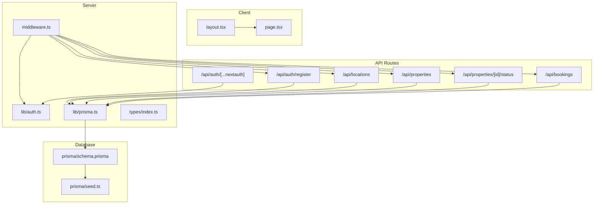
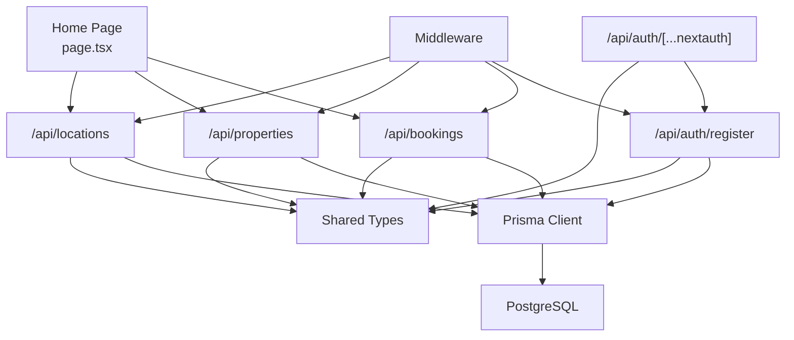
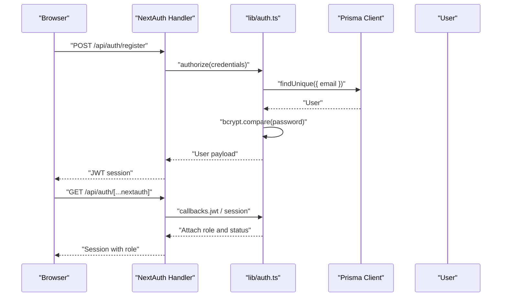
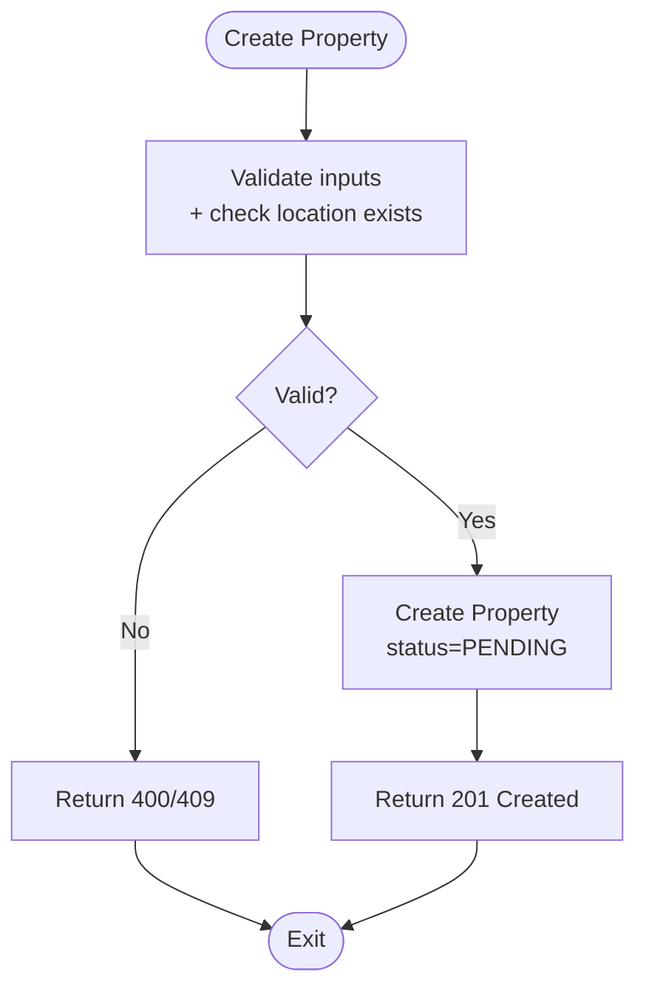
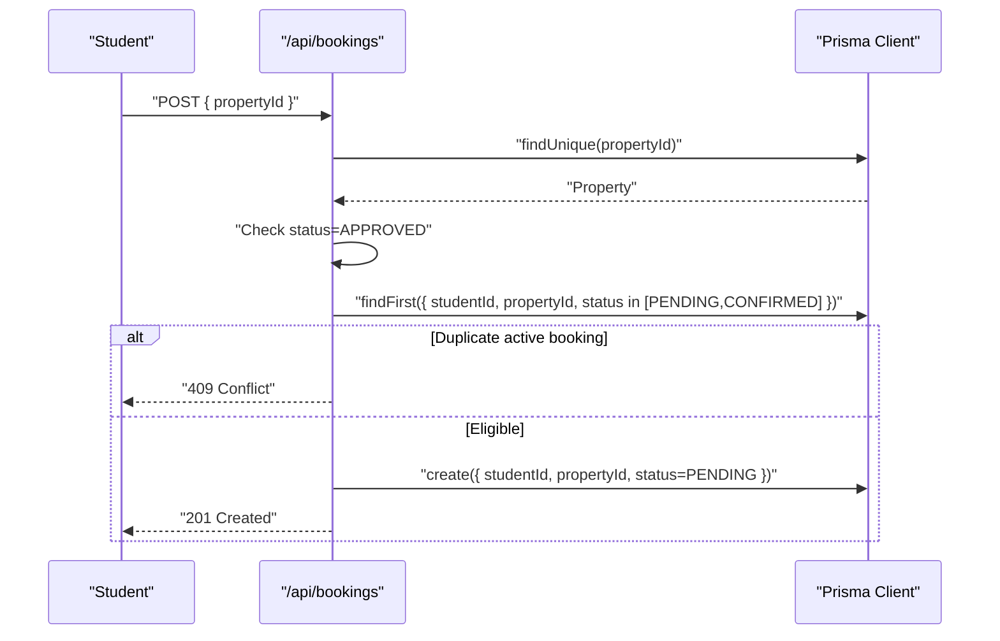
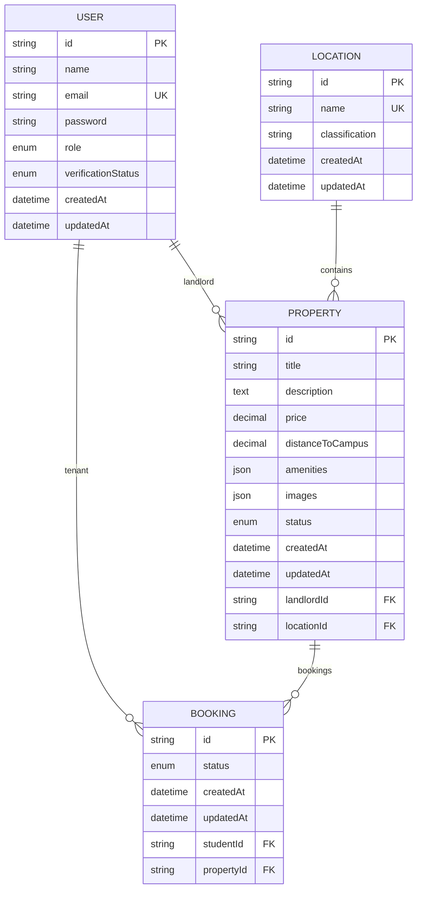
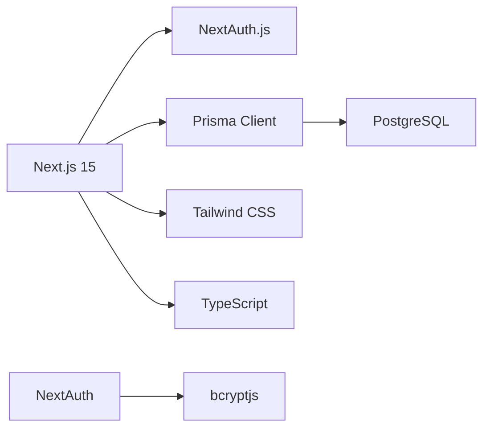
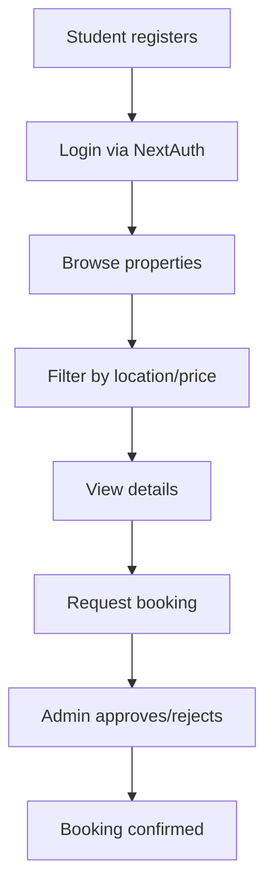

# Project Overview

<cite>
**Referenced Files in This Document**
- [package.json](file://package.json)
- [next.config.mjs](file://next.config.mjs)
- [prisma/schema.prisma](file://prisma/schema.prisma)
- [prisma/seed.ts](file://prisma/seed.ts)
- [src/app/layout.tsx](file://src/app/layout.tsx)
- [src/app/page.tsx](file://src/app/page.tsx)
- [src/lib/prisma.ts](file://src/lib/prisma.ts)
- [src/lib/auth.ts](file://src/lib/auth.ts)
- [src/middleware.ts](file://src/middleware.ts)
- [src/types/index.ts](file://src/types/index.ts)
- [src/app/api/auth/[...nextauth]/route.ts](file://src/app/api/auth/[...nextauth]/route.ts)
- [src/app/api/auth/register/route.ts](file://src/app/api/auth/register/route.ts)
- [src/app/api/bookings/route.ts](file://src/app/api/bookings/route.ts)
- [src/app/api/locations/route.ts](file://src/app/api/locations/route.ts)
- [src/app/api/properties/route.ts](file://src/app/api/properties/route.ts)
- [src/app/api/properties/[id]/status/route.ts](file://src/app/api/properties/[id]/status/route.ts)
</cite>

## Table of Contents
1. [Introduction](#introduction)
2. [Project Structure](#project-structure)
3. [Core Components](#core-components)
4. [Architecture Overview](#architecture-overview)
5. [Detailed Component Analysis](#detailed-component-analysis)
6. [Dependency Analysis](#dependency-analysis)
7. [Performance Considerations](#performance-considerations)
8. [Troubleshooting Guide](#troubleshooting-guide)
9. [Conclusion](#conclusion)
10. [Appendices](#appendices)

## Introduction
RentalHub-BOUESTI is a student-focused housing marketplace designed to connect Bamidele Olumilua University of Education, Science and Technology (BOUESTI) students with verified off-campus accommodations in Ikere-Ekiti. The platform streamlines the search for verified self-contained units, hostels, and rooms near the university, while offering landlords a way to list and manage properties and students a straightforward booking workflow. It operates within a defined geographic scope centered on Ikere-Ekiti and serves the BOUESTI community with a focus on trust, transparency, and convenience.

Key value propositions:
- Verified listings and landlords to reduce risk for students
- Centralized discovery of student-friendly properties with filters and sorting
- Streamlined booking process for students and administrative oversight for admins
- Role-based dashboards enabling landlords and administrators to manage listings and bookings efficiently

Target audience:
- Students of BOUESTI seeking safe, verified off-campus housing
- Landlords with properties near BOUESTI who want to reach verified tenants
- Administrators responsible for moderation, verification, and platform governance

Business model:
- Marketplace with a verification and approval workflow for listings
- No direct transaction fees at this stage; landlords list properties for free and manage availability
- Future monetization could include premium features or transaction facilitation (conceptual)

Educational and geographic context:
- Educational institution: BOUESTI, located in Ikere-Ekiti, Nigeria
- Geographic scope: Ikere-Ekiti with a curated set of neighborhoods and areas around the campus, including Uro, Afao, Olumilua Area, Ajebandele, and others

**Section sources**
- [src/app/layout.tsx:4-25](file://src/app/layout.tsx#L4-L25)
- [src/app/page.tsx:44-47](file://src/app/page.tsx#L44-L47)
- [prisma/seed.ts:24-57](file://prisma/seed.ts#L24-L57)

## Project Structure
The project follows a Next.js 15 app directory structure with a clear separation of server-side APIs, client-side pages, shared libraries, and database modeling via Prisma.

High-level structure highlights:
- Application shell and metadata in the root layout
- Public landing page with property browsing and area navigation
- API routes under src/app/api for authentication, registration, properties, bookings, and locations
- Authentication and session management via NextAuth.js
- Database modeling and migrations via Prisma ORM with PostgreSQL
- Shared TypeScript types and utilities
- Middleware for route protection and role-based access
- Tailwind CSS and Next.js configuration

**Diagram sources**
- [src/app/layout.tsx:27-41](file://src/app/layout.tsx#L27-L41)
- [src/app/page.tsx:1-142](file://src/app/page.tsx#L1-L142)
- [src/middleware.ts:11-38](file://src/middleware.ts#L11-L38)
- [src/lib/auth.ts:14-90](file://src/lib/auth.ts#L14-L90)
- [src/lib/prisma.ts:13-26](file://src/lib/prisma.ts#L13-L26)
- [src/types/index.ts:1-109](file://src/types/index.ts#L1-L109)
- [src/app/api/auth/register/route.ts:20-89](file://src/app/api/auth/register/route.ts#L20-L89)
- [src/app/api/auth/[...nextauth]/route.ts:1-7](file://src/app/api/auth/[...nextauth]/route.ts#L1-L7)
- [src/app/api/locations/route.ts:11-28](file://src/app/api/locations/route.ts#L11-L28)
- [src/app/api/properties/route.ts:14-118](file://src/app/api/properties/route.ts#L14-L118)
- [src/app/api/properties/[id]/status/route.ts:17-51](file://src/app/api/properties/[id]/status/route.ts#L17-L51)
- [src/app/api/bookings/route.ts:11-108](file://src/app/api/bookings/route.ts#L11-L108)
- [prisma/schema.prisma:1-130](file://prisma/schema.prisma#L1-L130)
- [prisma/seed.ts:126-142](file://prisma/seed.ts#L126-L142)

**Section sources**
- [src/app/layout.tsx:1-42](file://src/app/layout.tsx#L1-L42)
- [src/app/page.tsx:1-142](file://src/app/page.tsx#L1-L142)
- [src/middleware.ts:1-48](file://src/middleware.ts#L1-L48)
- [src/lib/auth.ts:1-117](file://src/lib/auth.ts#L1-L117)
- [src/lib/prisma.ts:1-27](file://src/lib/prisma.ts#L1-L27)
- [src/types/index.ts:1-109](file://src/types/index.ts#L1-L109)
- [src/app/api/auth/register/route.ts:1-90](file://src/app/api/auth/register/route.ts#L1-L90)
- [src/app/api/auth/[...nextauth]/route.ts:1-7](file://src/app/api/auth/[...nextauth]/route.ts#L1-L7)
- [src/app/api/locations/route.ts:1-29](file://src/app/api/locations/route.ts#L1-L29)
- [src/app/api/properties/route.ts:1-119](file://src/app/api/properties/route.ts#L1-L119)
- [src/app/api/properties/[id]/status/route.ts:1-52](file://src/app/api/properties/[id]/status/route.ts#L1-L52)
- [src/app/api/bookings/route.ts:1-109](file://src/app/api/bookings/route.ts#L1-L109)
- [prisma/schema.prisma:1-130](file://prisma/schema.prisma#L1-L130)
- [prisma/seed.ts:1-143](file://prisma/seed.ts#L1-L143)

## Core Components
- Authentication and Authorization
  - NextAuth.js with Credentials provider and JWT session strategy
  - Role-based access control enforced via middleware and protected API routes
  - Registration endpoint supports STUDENT and LANDLORD roles
- Database Layer
  - Prisma ORM with PostgreSQL provider
  - Strongly typed models for User, Location, Property, and Booking
  - Seeding script initializes Ikere-Ekiti locations and a default admin user
- API Surface
  - Auth: registration, NextAuth handlers
  - Locations: list areas for property forms
  - Properties: browse/search, create listing, admin approve/reject
  - Bookings: list, create booking requests
- Frontend
  - Root layout with metadata and Open Graph settings
  - Home page with hero, area cards, and CTAs
  - Middleware-driven route protection for authenticated and role-specific paths

Key capabilities:
- User management: register, login, role assignment, verification status
- Property listings: CRUD-like submission, search, filtering, pagination, status management
- Booking system: student-initiated requests, duplicate prevention, admin visibility
- Admin dashboard: property status updates and analytics-ready queries

**Section sources**
- [src/lib/auth.ts:14-90](file://src/lib/auth.ts#L14-L90)
- [src/middleware.ts:11-38](file://src/middleware.ts#L11-L38)
- [src/app/api/auth/register/route.ts:20-89](file://src/app/api/auth/register/route.ts#L20-L89)
- [prisma/schema.prisma:44-129](file://prisma/schema.prisma#L44-L129)
- [prisma/seed.ts:71-122](file://prisma/seed.ts#L71-L122)
- [src/app/api/locations/route.ts:11-28](file://src/app/api/locations/route.ts#L11-L28)
- [src/app/api/properties/route.ts:14-118](file://src/app/api/properties/route.ts#L14-L118)
- [src/app/api/properties/[id]/status/route.ts:17-51](file://src/app/api/properties/[id]/status/route.ts#L17-L51)
- [src/app/api/bookings/route.ts:11-108](file://src/app/api/bookings/route.ts#L11-L108)
- [src/app/layout.tsx:4-25](file://src/app/layout.tsx#L4-L25)
- [src/app/page.tsx:44-47](file://src/app/page.tsx#L44-L47)

## Architecture Overview
The system is a full-stack web application built with Next.js 15, TypeScript, Prisma ORM, PostgreSQL, and NextAuth.js. The architecture emphasizes:
- Separation of concerns: API routes encapsulate business logic, while the frontend renders UI
- Strong typing: Prisma-generated types and custom type definitions unify server and client contracts
- Security-first design: authentication via NextAuth.js, middleware-based route protection, and role checks
- Scalable data model: normalized entities with enums for statuses and roles

**Diagram sources**
- [src/app/page.tsx:1-142](file://src/app/page.tsx#L1-L142)
- [src/app/api/bookings/route.ts:11-108](file://src/app/api/bookings/route.ts#L11-L108)
- [src/app/api/properties/route.ts:14-118](file://src/app/api/properties/route.ts#L14-L118)
- [src/app/api/locations/route.ts:11-28](file://src/app/api/locations/route.ts#L11-L28)
- [src/app/api/auth/register/route.ts:20-89](file://src/app/api/auth/register/route.ts#L20-L89)
- [src/app/api/auth/[...nextauth]/route.ts:1-7](file://src/app/api/auth/[...nextauth]/route.ts#L1-L7)
- [src/lib/prisma.ts:13-26](file://src/lib/prisma.ts#L13-L26)
- [src/lib/auth.ts:14-90](file://src/lib/auth.ts#L14-L90)
- [src/types/index.ts:1-109](file://src/types/index.ts#L1-L109)
- [src/middleware.ts:11-38](file://src/middleware.ts#L11-L38)

## Detailed Component Analysis

### Authentication and Authorization
- NextAuth.js configuration:
  - Credentials provider with bcrypt verification against Prisma-managed users
  - JWT-based sessions with 30-day max age and refresh window
  - Pages redirection for sign-in, sign-out, and errors
  - Token/session callbacks to attach role and verification status
- Protected routes:
  - Middleware enforces role-based access for admin, landlord, and student dashboards
  - Redirects unauthorized users to an unauthorized page

**Diagram sources**
- [src/app/api/auth/register/route.ts:20-89](file://src/app/api/auth/register/route.ts#L20-L89)
- [src/lib/auth.ts:22-51](file://src/lib/auth.ts#L22-L51)
- [src/app/api/auth/[...nextauth]/route.ts:1-7](file://src/app/api/auth/[...nextauth]/route.ts#L1-L7)

**Section sources**
- [src/lib/auth.ts:14-90](file://src/lib/auth.ts#L14-L90)
- [src/app/api/auth/register/route.ts:20-89](file://src/app/api/auth/register/route.ts#L20-L89)
- [src/app/api/auth/[...nextauth]/route.ts:1-7](file://src/app/api/auth/[...nextauth]/route.ts#L1-L7)
- [src/middleware.ts:11-38](file://src/middleware.ts#L11-L38)

### Property Management
- Listing creation:
  - Landlords and admins can submit new properties with title, description, price, location, optional distance to campus, and media/ammenities arrays
  - Validation ensures required fields and location existence
  - Default status is PENDING awaiting admin review
- Listing discovery:
  - Filtering by location, price range, and status
  - Pagination and sorting by price, creation date, or distance
  - Includes related landlord and location data for display
- Admin approval:
  - Admins can update property status to APPROVED, REJECTED, or revert to PENDING

**Diagram sources**
- [src/app/api/properties/route.ts:68-118](file://src/app/api/properties/route.ts#L68-L118)

**Section sources**
- [src/app/api/properties/route.ts:14-118](file://src/app/api/properties/route.ts#L14-L118)
- [src/app/api/properties/[id]/status/route.ts:17-51](file://src/app/api/properties/[id]/status/route.ts#L17-L51)

### Booking System
- Student booking:
  - Students can request to book a property with duplicate prevention for pending/confirmed bookings
  - Property must be APPROVED for booking to succeed
- Admin visibility:
  - Admins can view all bookings with related student and property details
- Landlord visibility:
  - Landlords can see bookings for their listed properties

**Diagram sources**
- [src/app/api/bookings/route.ts:47-108](file://src/app/api/bookings/route.ts#L47-L108)

**Section sources**
- [src/app/api/bookings/route.ts:11-108](file://src/app/api/bookings/route.ts#L11-L108)

### Locations and Areas
- Provides a categorized list of Ikere-Ekiti areas for property listings
- Ordered by classification and name to aid filtering and UX

**Section sources**
- [src/app/api/locations/route.ts:11-28](file://src/app/api/locations/route.ts#L11-L28)
- [prisma/seed.ts:71-90](file://prisma/seed.ts#L71-L90)

### Database Model and Seeding
- Entities:
  - User: role and verification status, with relations to properties and bookings
  - Location: area classification and relation to properties
  - Property: listing with status, pricing, amenities, images, and relations
  - Booking: relationship between student and property with status
- Seeding:
  - Seeds predefined Ikere-Ekiti locations
  - Creates a default admin user with verified status

**Diagram sources**
- [prisma/schema.prisma:44-129](file://prisma/schema.prisma#L44-L129)

**Section sources**
- [prisma/schema.prisma:15-129](file://prisma/schema.prisma#L15-L129)
- [prisma/seed.ts:71-122](file://prisma/seed.ts#L71-L122)

## Dependency Analysis
Technology stack and runtime dependencies:
- Next.js 15 for the full-stack framework and app directory routing
- TypeScript for type safety across server and client
- NextAuth.js for authentication and session management
- Prisma ORM for database modeling and client generation
- PostgreSQL as the production database provider
- Tailwind CSS for styling and responsive UI
- bcryptjs for password hashing

**Diagram sources**
- [package.json:19-39](file://package.json#L19-L39)
- [src/lib/auth.ts:10-11](file://src/lib/auth.ts#L10-L11)
- [src/lib/prisma.ts:9-26](file://src/lib/prisma.ts#L9-L26)

**Section sources**
- [package.json:19-39](file://package.json#L19-L39)
- [src/lib/auth.ts:10-11](file://src/lib/auth.ts#L10-L11)
- [src/lib/prisma.ts:9-26](file://src/lib/prisma.ts#L9-L26)

## Performance Considerations
- Database pooling and logging:
  - Prisma client configured with development logging and global caching to prevent hot reload connection exhaustion
- Pagination and indexing:
  - Property listing endpoints support pagination and sort/filter parameters
  - Database indices on foreign keys and status fields improve query performance
- Image optimization:
  - Next.js image optimization enabled for HTTPS remote patterns

Recommendations:
- Monitor Prisma query logs during development and adjust indices as usage grows
- Consider adding database connection pooling limits and health checks in production
- Optimize property listing queries with composite indexes for frequent filters (location, status, price)

**Section sources**
- [src/lib/prisma.ts:13-26](file://src/lib/prisma.ts#L13-L26)
- [src/app/api/properties/route.ts:27-48](file://src/app/api/properties/route.ts#L27-L48)
- [prisma/schema.prisma:103-107](file://prisma/schema.prisma#L103-L107)
- [next.config.mjs:3-11](file://next.config.mjs#L3-L11)

## Troubleshooting Guide
Common issues and resolutions:
- Authentication failures:
  - Ensure NEXTAUTH_SECRET is set and consistent across deployments
  - Verify bcrypt hashing and email normalization in registration
- Authorization errors:
  - Confirm middleware role checks for admin/landlord/student routes
  - Check session token presence and role propagation in callbacks
- Property submission errors:
  - Validate required fields and location existence before creation
  - Ensure property status transitions are handled by admins only
- Booking conflicts:
  - Enforce duplicate prevention for pending/confirmed bookings
  - Verify property status is APPROVED before allowing bookings

Operational tips:
- Use Prisma Studio for local inspection of Users, Properties, and Bookings
- Review Prisma logs in development to identify slow queries
- Confirm database connectivity via DATABASE_URL environment variable

**Section sources**
- [src/lib/auth.ts:75-90](file://src/lib/auth.ts#L75-L90)
- [src/app/api/auth/register/route.ts:20-89](file://src/app/api/auth/register/route.ts#L20-L89)
- [src/middleware.ts:16-29](file://src/middleware.ts#L16-L29)
- [src/app/api/properties/[id]/status/route.ts:25-34](file://src/app/api/properties/[id]/status/route.ts#L25-L34)
- [src/app/api/bookings/route.ts:74-87](file://src/app/api/bookings/route.ts#L74-L87)

## Conclusion
RentalHub-BOUESTI delivers a focused, role-aware marketplace tailored to BOUESTI students and landlords in Ikere-Ekiti. Its architecture leverages Next.js 15, TypeScript, Prisma ORM, PostgreSQL, and NextAuth.js to provide secure, scalable functionality for property discovery, listing, booking, and administration. With seeded locations, robust authentication, and middleware-driven access control, the platform establishes a solid foundation for growth and future enhancements.

## Appendices

### User Workflows
- Student registration and login
- Property browsing and filtering
- Submitting a booking request
- Admin review and approval of listings
- Landlord listing management

[No sources needed since this diagram shows conceptual workflow, not actual code structure]

### Business Model Notes
- Current model: marketplace with verification and approval workflow
- No direct transaction fees at this stage
- Future possibilities: premium listings, transaction facilitation, analytics dashboards

[No sources needed since this section provides general guidance]